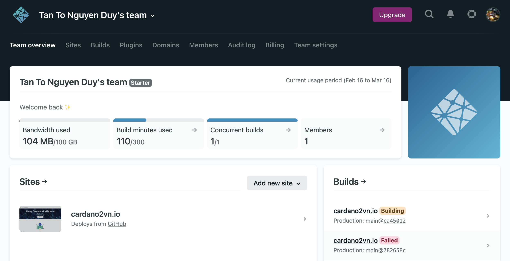
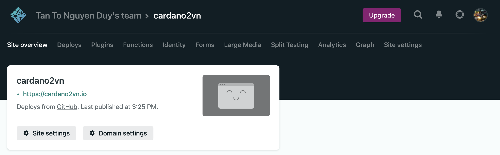

## Website

Website này được xây dựng dựa trên [Docusaurus 2](https://docusaurus.io/)

### Cài đặt và yêu cầu

Cần có NodeJS version >= 14 để Docusaurus 2 chạy được

Cài đặt [NodeJS tại đây](https://nodejs.org/)

Cài đặt [Package NPX](https://www.npmjs.com/package/npx) để khởi tạo và quản lý các thành phần 

```
# Install npx package
$ npm i npx
```

Khởi tạo Docusaurus project

```
# npx create-docusaurus@latest [name] [template]
$ npx create-docusaurus@latest my-website classic
```

### Cấu trúc cây thư mục

Cho rằng tên website của bạn là my-website. Thì cây thư mục dự án sẽ có cấu trúc như sau:

```
my-website
├── blog
│   ├── 2019-05-28-hola.md
│   ├── 2019-05-29-hello-world.md
│   └── 2020-05-30-welcome.md
├── docs
│   ├── doc1.md
│   ├── doc2.md
│   ├── doc3.md
│   └── mdx.md
├── src
│   ├── css
│   │   └── custom.css
│   └── pages
│       ├── styles.module.css
│       └── index.js
├── static
│   └── img
├── docusaurus.config.js
├── package.json
├── README.md
├── sidebars.js
```

Diễn giải:

- / blog / - Chứa các tệp Markdown blog. Bạn có thể xóa thư mục nếu bạn không muốn / cần blog. Có thể tìm thấy thêm chi tiết trong hướng dẫn blog
- / docs / - Chứa các tệp Markdown cho tài liệu. Tùy chỉnh thứ tự của thanh bên tài liệu trong sidebars.js. Bạn có thể tìm thêm thông tin chi tiết trong hướng dẫn tài liệu
- / src / - Các tệp không phải tài liệu như các trang hoặc các thành phần React tùy chỉnh. Bạn không nhất thiết phải đặt các tệp không phải tài liệu của mình vào đây nhưng đặt chúng trong một thư mục tập trung giúp bạn chỉ định dễ dàng hơn trong trường hợp bạn cần thực hiện một số loại linting / xử lý
- / src / pages - Bất kỳ tệp nào trong thư mục này sẽ được chuyển đổi thành một trang web. Có thể tìm thấy thêm chi tiết trong hướng dẫn trang
- / static / - Thư mục tĩnh. Mọi nội dung bên trong đây sẽ được sao chép vào thư mục gốc của thư mục bản dựng cuối cùng
- /docusaurus.config.js - Một tệp cấu hình chứa cấu hình trang web. Đây là tương đương với siteConfig.js trong Docusaurus v1
- /package.json - Trang web Docusaurus là một ứng dụng React. Bạn có thể cài đặt và sử dụng bất kỳ gói npm nào mà bạn thích trong đó
- /sidebar.js - Được tài liệu sử dụng để chỉ định thứ tự của các tài liệu trong thanh bên


### Khởi chạy ở chế độ development

Để xem trước các thay đổi của bạn khi bạn chỉnh sửa tệp, bạn có thể chạy một máy chủ phát triển cục bộ sẽ phục vụ trang web của bạn và phản ánh những thay đổi mới nhất.

```
$ cd my-website
$ npm run start
```

Theo mặc định, một cửa sổ trình duyệt sẽ mở ra tại địa chỉ http://localhost:3000

### Build

Docusaurus là một trình tạo trang web tĩnh hiện đại, vì vậy chúng ta cần xây dựng trang web thành một thư mục chứa nội dung tĩnh và đặt nó trên một máy chủ web để có thể xem được. Để xây dựng trang web:

```
$ npm run build
```

### Cấu hình

Mọi cấu hình của Docusaurus được thiết lập trong file `docusaurus.config.js` 

#### Site metadata {#site-metadata}

Site metadata chứa siêu dữ liệu toàn cầu cần thiết như `title`,` url`, `baseUrl` và` favicon`.

Chúng được sử dụng ở một số nơi như tiêu đề và tiêu đề trang web của bạn, biểu tượng tab trình duyệt, thông tin chia sẻ xã hội (Facebook, Twitter) hoặc thậm chí để tạo đường dẫn chính xác để phân phát tệp tĩnh của bạn.

#### Cấu hình triển khai

Các cấu hình triển khai như `projectName`, `organizationName` và tùy chọn `deploymentBranch` được sử dụng khi bạn triển khai trang web của mình bằng lệnh` triển khai`.

#### Theme, plugin, and preset configurations


```
module.exports = {
  // ...
  plugins: [
    '@docusaurus/plugin-content-blog',
    '@docusaurus/plugin-content-pages',
  ],
  themes: ['@docusaurus/theme-classic'],
};
```

Docusaurus hỗ trợ [**module shorthands**](./using-plugins.md#module-shorthands), cho phép bạn đơn giản hóa cấu hình trên như:

```
module.exports = {
  // ...
  plugins: ['content-blog', 'content-pages'],
  themes: ['classic'],
};
```

:::

Chúng cũng có thể được tải từ các thư mục cục bộ:

```
const path = require('path');

module.exports = {
  // ...
  themes: [path.resolve(__dirname, '/path/to/docusaurus-local-theme')],
};
```

Để chỉ định các tùy chọn cho plugin hoặc chủ đề, hãy thay thế tên của plugin hoặc chủ đề trong tệp cấu hình bằng một mảng chứa tên và đối tượng tùy chọn:

```
module.exports = {
  // ...
  plugins: [
    [
      'content-blog',
      {
        path: 'blog',
        routeBasePath: 'blog',
        include: ['*.md', '*.mdx'],
        // ...
      },
    ],
    'content-pages',
  ],
};
```

Để chỉ định các tùy chọn cho một plugin hoặc chủ đề được đóng gói trong một cài đặt trước, hãy chuyển các tùy chọn qua trường `presets`. Trong ví dụ này, `docs` đề cập đến` @ docusaurus / plugin-content-docs` và `theme` đề cập đến` @ docusaurus / theme-classic`.

```
module.exports = {
  // ...
  presets: [
    [
      '@docusaurus/preset-classic',
      {
        docs: {
          sidebarPath: require.resolve('./sidebars.js'),
        },
        theme: {
          customCss: [require.resolve('./src/css/custom.css')],
        },
      },
    ],
  ],
};
```

#### Cấu hình tùy chỉnh

Docusaurus bảo vệ `docusaurus.config.js` khỏi các trường không xác định. Để thêm các trường tùy chỉnh, hãy xác định chúng trong `customFields`.

Ví dụ:

```
module.exports = {
  // ...
  // highlight-start
  customFields: {
    image: '',
    keywords: [],
  },
  // highlight-end
  // ...
};
```

#### Truy cập cấu hình từ các thành phần

Đối tượng cấu hình của bạn sẽ được cung cấp cho tất cả các thành phần của trang web của bạn. Và bạn có thể truy cập chúng thông qua ngữ cảnh React là `siteConfig`.

Ví dụ:

```
import React from 'react';
// highlight-next-line
import useDocusaurusContext from '@docusaurus/useDocusaurusContext';

const Hello = () => {
  // highlight-start
  const {siteConfig} = useDocusaurusContext();
  // highlight-end
  const {title, tagline} = siteConfig;

  return <div>{`${title} · ${tagline}`}</div>;
};
```


#### Tùy chỉnh cấu hình Babel

Đối với các dự án Docusaurus mới, chúng tôi đã tự động tạo một `babel.config.js` trong thư mục gốc của dự án.

```
module.exports = {
  presets: [require.resolve('@docusaurus/core/lib/babel/preset')],
};
```

Hầu hết thời gian, cấu hình này sẽ hoạt động tốt. Nếu bạn muốn tùy chỉnh cấu hình babel của mình (ví dụ: để thêm hỗ trợ cho Flow), bạn có thể trực tiếp chỉnh sửa tệp này. Để các thay đổi của bạn có hiệu lực, bạn cần khởi động lại máy chủ nhà phát triển Docusaurus.

### For more information

https://docusaurus.io/docs/

## Cài đặt CI/CD Netlify

Netlify là một nền tảng tất cả trong một để tự động hóa các dự án web hiện đại. Thay thế cơ sở hạ tầng lưu trữ, tích hợp liên tục và quy trình triển khai của bạn bằng một quy trình làm việc duy nhất. Tích hợp chức năng động như chức năng không máy chủ, xác thực người dùng và xử lý biểu mẫu khi các dự án của bạn phát triển.

**Đọc thêm về [Netlify tại đây](https://docs.netlify.com/)**

Tạo tài khoản Netlify và sau đó liên kết với Github. Netlify sẽ hướng dẫn các bạn tất cả sau đó.

Netlify sẽ tự động build và deploy website của bạn dựa vào file `package.json` và các file cài đặt của dự án của bạn.





Happy using Netlify
