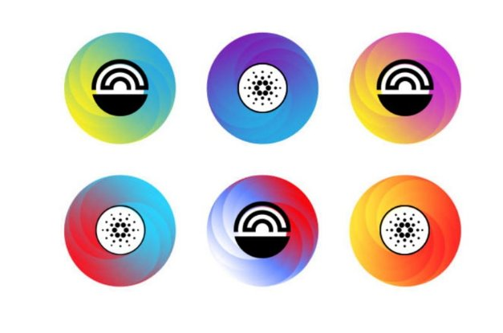
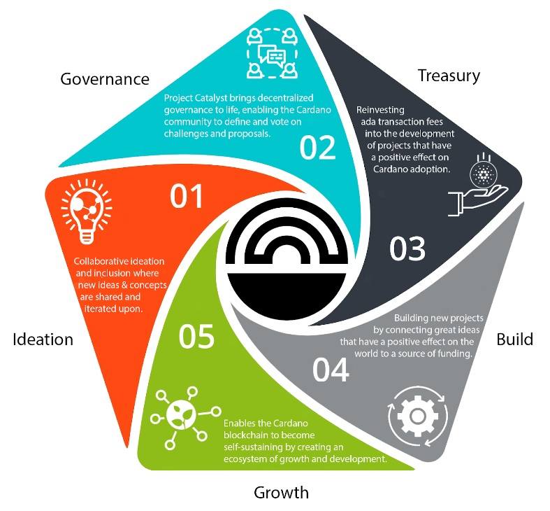

# [**Project Catalyst - A virtuous cycle of Cardano ecosystem development**](tmp//en/blog/posts/2022/05/10/project-catalyst-a-virtuous-cycle-of-cardano-ecosystem-development-investing-in-great-ideas-to-make-positive-real-world-changes/)
### **Project Catalyst is Cardano’s turbo-charged innovation engine and one of the largest decentralized innovation funds in the world. It is a focal point for ecosystem development and innovation, driven by the Cardano community**
 10 May 2022[ Tim Richmond](tmp//en/blog/authors/tim-richmond/page-1/) 4 mins read

### [**Tim Richmond**](tmp//en/blog/authors/tim-richmond/page-1/)
Marketing and Communications Manager

Marketing & Communications

- 
- 

Project Catalyst aims to build systems that enable the Cardano blockchain to become self-sustaining by creating an ecosystem of growth and development. At the heart of this is the concept of decentralized governance, whereby the Cardano community selects shared ideas and priorities for funding, forming a cycle of sustainable and virtuous growth.

Every three months, Project Catalyst produces a fresh pipeline of technical, business, creative, and community-focused projects - funded to deliver their proposed ideas that have been voted for by the Cardano/Catalyst community.

With each funding round, the community presents challenges across a range of Cardano-related projects. These challenges are then answered by the community who present plans defining clear solutions. The community votes on the proposals and selects projects to receive funding.

Catalyst enables people to realize and implement great ideas, but funding is only part of the journey towards success. Other factors, including education, mentorship, collaborations, and product roadmap development are also needed to nurture projects and help them formalize a business plan and an effective go-to-market strategy.

Reinvesting the fees raised from ada transactions into the development of projects that have a positive effect on both Cardano adoption and out in the wider world, while rewarding those that create, build, and maintain the ecosystem, accordingly boosting momentum, and feeding back into the blockchain's overall sustainability.
## **Progress**
Research is a process of learning and exploring what is possible and pushing the boundaries of progression. Project Catalyst encourages people to experiment and take full advantage of the collaborative and iterative nature of the project, presenting their ideas for feedback and review. 

To date, Catalyst has grown from a fund size of $250k in fund 1 to over $16m in fund 8, smashing all previous participation records combined. Across all funds hitherto, Catalyst has received and processed more than 3.5k proposals and cast over 1 million votes. The active Catalyst community currently stands at over 52k members across 91 countries!

At the time of writing, a total of 60 Catalyst-funded projects are operational within the Cardano ecosystem. This number increases every week.

You can follow the progress of each fund and the projects that have realized their proposals [here](https://bit.ly/FundedProjectsReporting).

Pushing the boundaries and learning what does and doesn’t work is key to the foundation of both knowledge and success.

A culture of inclusion and acceptance of new ideas and concepts that may contravene one's own opinions is critical to the success of the project, where innovation, respect, and collaboration are at the forefront of the community spirit.

‘Many of life's failures are people who did not realize how close they were to success when they gave up. I have not failed. I've just found ten thousand ways that won't work.’ - Thomas Edison
## **Decentralized Democracy and Transparency**
Project Catalyst aims to democratize decision-making by enabling the Cardano community to vote on both challenges they wish to see being solved and the proposals that solve them. 

The Cardano community remains at the heart of the project, enabling them to collectively navigate and decide upon the future direction of both blockchain development and ecosystem growth- enabling anyone from anywhere to present their ideas while potentially providing the means to realize them.

Governance is a key issue, not just in the context of blockchain, but in the world. There is a fantastic opportunity to learn what has worked well and not so well and offer a decentralized decision-making process that sidesteps many of the pitfalls of traditional centralized governmental systems.

An important aspect to foster Project Catalyst's trust and integrity is transparency. Encouraging openness among the community to further accelerate collaboration on their ideas. 

All results and data relating to each and every funding round are published [here](https://docs.google.com/spreadsheets/d/1bfnWFa94Y7Zj0G7dtpo9W1nAYGovJbswipxiHT4UE3g/edit#gid=938310766), along with a detailed breakdown of votes and financials. There are weekly sessions for the entire community, where plans are communicated to enable ada holders to voice their opinions and offer solutions to any perceived obstacles. Every voice is heard and counted.
## **How to get involved?**
There are many ways to get involved with Project Catalyst. As an innovator, voter, commenter, proposer, proposal reviewer, community advisor, or even a mentor. The first step is [creating an account](https://cardano.ideascale.com/) on the Catalyst collaboration platform, Ideascale. Another way is to join the Project Catalyst community every Wednesday at TownHall, which is live-streamed on the Project Catalyst [YouTube Channel](https://www.youtube.com/playlist?list=PLnPTB0CuBOByRhpTUdALq4J89m_h7QqLk). If you have an idea or are just curious to explore what’s going on at the heart of Cardano, join the TownHall and become part of the Project Catalyst community.

To learn more about [Project Catalyst](https://iohk.io/en/blog/posts/2021/02/12/our-million-dollar-baby-project-catalyst), or to take part and answer challenges posted by others through Project Catalyst, please subscribe to the Catalyst [mailing list](https://bit.ly/3dSZJvx) and join the [Discord](https://discord.gg/2RnUtK8) and [Telegram](https://t.me/cardanocatalyst) communities.
