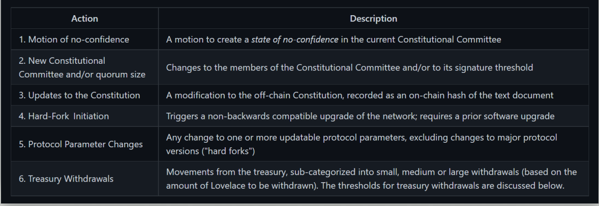
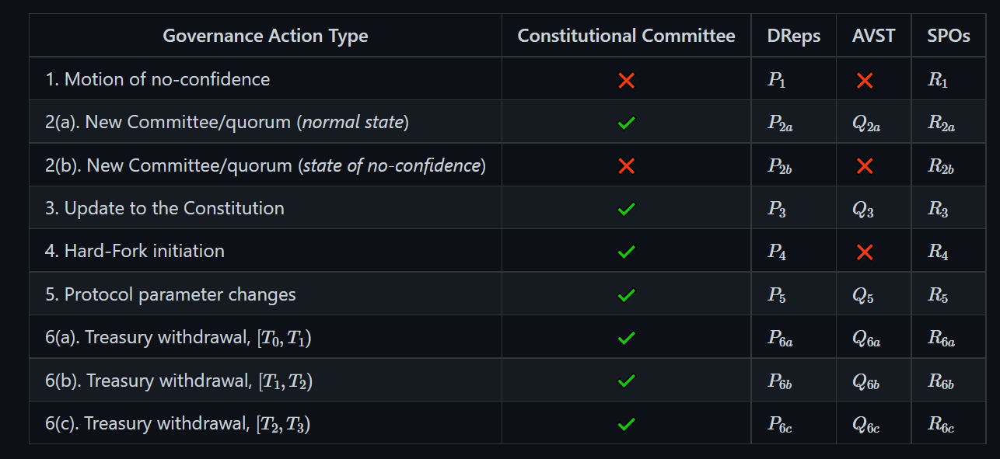

CIP cho Cơ chế quản trị phi tập trung cho kỷ nguyên Voltaire
=============================================================

Cardano chia quá trình phát triển của nó thành các Kỷ nguyên không có thời gian thực hiện cụ thể và quá trình phát triển của chúng cũng có thể chồng chéo lên nhau. BYRON Foundation, SHELLEY the Decentralization, GOGUEN the Smart Contracts, BASHO the Scaling, và VOLTAIRE the Governance Era. Byron là Kỷ nguyên duy nhất mà chúng ta có thể coi là đã kết thúc.

Sau Hard Fork cuối cùng mang tên Vasil, tương ứng với Kỷ nguyên Basho, đã đến lúc Voltaire, quản trị phi tập trung. Tôi để lại một bài viết ở cuối về Vasil (1) .

Bài viết này mô tả ngắn gọn về CIP-1694 (Đề xuất cải tiến Cardano), nhằm cung cấp bước đầu tiên có thể đạt được về mặt kỹ thuật trong thời gian ngắn, trong đó nhóm IOHK đề xuất sửa đổi hệ thống quản trị trên chuỗi của Cardano.

Phát triển được dẫn dắt bởi [Jared Corduan](https://iohk.io/en/team/jared-corduan) . Ông là một nhà toán học quan tâm đến logic và khoa học máy tính. Anh ấy có bằng tiến sĩ về logic toán học từ Đại học Dartmouth, nơi anh ấy đã nghiên cứu toán học đảo ngược, lý thuyết tính toán, tổ hợp vô hạn và cưỡng bức. Anh ta bị mê hoặc bởi hiện tượng không hoàn thiện. Jared đã làm việc với tư cách là một lập trình viên công nghiệp từ năm 2011, cả về tài chính và công nghệ chăm sóc sức khỏe, trước khi gia nhập IOHK vào năm 2018. Anh ấy hào hứng nhất khi được làm việc trong các dự án kết hợp tình yêu toán học và lập trình của mình.

## Thiết kế hiện tại và mới

Thiết kế hiện tại được tạo ra với mục đích cung cấp một cách tiếp cận đơn giản và chuyển tiếp để quản trị. Đề xuất này nhằm mục đích phân cấp chính phủ và giải quyết một số thiếu sót của thiết kế đó.

Cơ chế quản trị hiện có, được giới thiệu trong sổ cái Kỷ nguyên Shelley, có khả năng sửa đổi các giá trị tham số giao thức, bao gồm khởi tạo Hard Fork và chuyển ADA từ kho dự trữ và ngân quỹ.

Trong sơ đồ hiện tại, các hành động quản trị được bắt đầu bởi các giao dịch đặc biệt yêu cầu ủy quyền khóa quản trị. Đối với ủy quyền nói trên, chữ ký của 5 trong số 7 khóa hiện có của mạng Cardano chính là cần thiết, được phân phối dưới quyền sở hữu của IOHK, Cardano Foundation và Emurgo. 

Hệ thống hiện tại không cho phép không gian cho sự tham gia tích cực vào chuỗi của những người nắm giữ ADA. Mặc dù các thay đổi đối với giao thức thường là kết quả của các cuộc thảo luận với các bên liên quan được chọn trong cộng đồng, nhưng quá trình này chủ yếu do các thực thể sáng lập thúc đẩy. 

Các chuyển động của kho bạc có thể khó theo dõi và là một chủ đề nhạy cảm. Điều quan trọng là phải minh bạch hơn và có nhiều lớp kiểm toán hơn đối với các chuyển động này.

Sự phát triển này sẽ thay thế hỗ trợ chuyên biệt của chính phủ để cập nhật các tham số giao thức và chứng chỉ MIR hiện đang được sử dụng. Hai trường mới sẽ được thêm vào các tham số giao dịch thông thường, hành động quản trị và phiếu bầu. Sau này tôi sẽ mở rộng các khái niệm mới này.

Project Catalyst hiện là một trong những động lực chính của việc rút tiền từ kho bạc Cardano. Mỗi vòng Catalyst thường được theo sau bởi hàng nghìn yêu cầu MIR để cấp vốn cho các dự án được chọn. Tuy nhiên, theo khuôn khổ quản trị mới này, mỗi kỷ nguyên sẽ chỉ được phép rút tiền một lần và do đó, điều này hạn chế số lượng dự án có thể được tài trợ trong một kỷ nguyên. Điều này có thể được khắc phục bằng cách chia tiền cho nhiều kỷ nguyên, chuyển tiền vào một quỹ giữ tạm thời hoặc hạn chế số lượng dự án được tài trợ trong mỗi vòng. Cuối cùng, tôi để lại một bài báo về Chất xúc tác (2) .

Bất kỳ người dùng Cardano nào cũng có thể gửi hành động quản trị. Sẽ có ba nhóm riêng biệt, sẽ chịu trách nhiệm phê chuẩn các hành động quản trị này bằng cách sử dụng phiếu bầu trên chuỗi của họ, tuân theo một bộ quy tắc được xác định rõ ràng, sẽ dựa trên các nhiệm kỳ của ADA:

- Một Ủy ban Hiến pháp,
- Một nhóm đại diện ủy nhiệm (DReps)
- Người điều hành Stakepool (SPO)

Bất kỳ chủ sở hữu ADA nào cũng có thể đăng ký trở thành DRep để bỏ phiếu cho chính mình và những người được ủy quyền của mình, hoặc thay vào đó ủy quyền quyền biểu quyết cho bất kỳ DRep nào khác. 

Thiết kế của DReps vẫn có thể thay đổi và không được kết hợp với DReps Project Catalyst.

## Hiến pháp Cardano

Hiến pháp là một tài liệu văn bản xác định các giá trị được chia sẻ và các nguyên tắc hướng dẫn của Cardano. 

Ở giai đoạn này, một tài liệu thông tin sẽ được tạo ra, ngoài chuỗi có giá trị thông báo băm sẽ được ghi lại trên chuỗi, tài liệu này nắm bắt rõ ràng các giá trị cốt lõi của Cardano. Ở giai đoạn sau, Hiến pháp sẽ cố gắng phát triển theo hướng một bộ quy tắc dựa trên hợp đồng thông minh thúc đẩy toàn bộ khuôn khổ quản trị. 

Sẽ có một Ủy ban Hiến pháp đại diện cho một tập hợp các cá nhân hoặc tổ chức chịu trách nhiệm giám sát các hoạt động quản trị và đảm bảo rằng Hiến pháp được tôn trọng.

Ủy ban Hiến pháp được coi là luôn ở một trong hai trạng thái sau:

- một trạng thái bình thường (tức là một trong những sự tự tin), hoặc
- một trạng thái không tự tin 

Trong tình trạng mất lòng tin, Ủy ban hiện tại không còn có thể tham gia vào các hành động quản trị và phải được thay thế trước khi các hành động quản trị có thể được ban hành. Ở trạng thái này, mọi hành động quản trị đang chờ xử lý sẽ bị hủy bỏ ngay lập tức.

Ủy ban Hiến pháp sẽ sử dụng thiết lập phím nóng và lạnh. Các phím nóng sẽ sử dụng lại cơ chế “chứng chỉ ủy quyền ban đầu” hiện có đã được áp dụng kể từ khi bắt đầu Kỷ nguyên Shelley.

Ủy ban Hiến pháp ban đầu sẽ bao gồm các thành viên cốt lõi của một tổ chức dựa trên thành viên vẫn chưa được xác định, tuy nhiên, rất có thể nó sẽ bao gồm một số thành viên của các tổ chức sáng lập, chẳng hạn như Input Output Global và Cardano Foundation, cũng như cộng đồng chủ chốt người chơi quan tâm tham gia.

Ủy ban Hiến pháp có thể được thay thế theo hai cách khác nhau:

- Ở trạng thái bình thường, Ủy ban có thể được thay thế thông qua một hành động quản trị cụ thể, hành động này cần có sự chấp thuận chung của Ủy ban Hiến pháp hiện tại và DReps.

- Trong tình trạng mất lòng tin, Ủy ban cũng có thể được thay thế thông qua một hành động quản trị cụ thể, với sự chấp thuận của các thành viên SPO và DRep.
Quy mô của Ủy ban Hiến pháp không cố định. Nó có thể được thay đổi mỗi khi một Ủy ban mới được thành lập. Tương tự, số đại biểu cần thiết (số lượng cử tri cần thiết để ban hành các hành động quản trị) không cố định và có thể thay đổi mỗi khi một Ủy ban mới được thành lập. 

Kiến nghị bất tín nhiệm là một biện pháp cực đoan cho phép những người nắm giữ ADA thu hồi quyền lực đã được trao cho Ủy ban Hiến pháp hiện tại. Tất cả các hành động quản trị đang chờ xử lý, bao gồm cả những hành động được Ủy ban phê chuẩn, sẽ bị rút lại nếu kiến ​​nghị được chấp thuận.

## Hành động quản trị và bỏ phiếu

Hành động quản trị là một sự kiện trên chuỗi được thực hiện bởi một giao dịch và có thời hạn để thực hiện. Sáu loại hành động quản trị khác nhau được xác định, như chi tiết dưới đây:

Một hành động được cho là được phê chuẩn khi nó thu thập đủ số phiếu ủng hộ. Một hành động không thu thập đủ phiếu bầu tích cực trước khi hết thời hạn. 

Vì vậy, một hành động đã được phê chuẩn sẽ được ban hành sau khi nó được kích hoạt trên mạng. 

Bất kể chúng đã được phê chuẩn hay chưa, cổ phiếu có thể bị rút lại, ví dụ, nếu một chuyển động bất tín nhiệm được ban hành.

Bất kỳ chủ sở hữu ADA nào cũng có thể nộp đơn kiện chính phủ trên chuỗi. Để làm điều này, họ phải cung cấp một khoản tiền gửi Lovelaces, khoản tiền này sẽ được trả lại khi hành động hoàn tất (được phê chuẩn, hủy bỏ hoặc hết hạn).

Các hành động của chính phủ được phê chuẩn thông qua các hành động bỏ phiếu trên chuỗi. Các loại hành động quản trị khác nhau có các yêu cầu chứng thực khác nhau, như thể hiện trong bảng này:

- Governance Action Type: Loại hành động quản trị. Lưu ý rằng ba hành động ngân quỹ có thể liên quan đến số tiền Lovelace , , và .

- Ủy ban Hiến pháp: Giá trị ✔️ cho biết rằng cần phải có phiếu 'đồng ý' của Ủy ban Hiến pháp Nhiều đại biểu. Giá trị ❌ có nghĩa là phiếu bầu của Ủy ban Hiến pháp không áp dụng.

- DReps: Ngưỡng bình chọn DRep phải được đáp ứng dưới dạng phần trăm cổ phần biểu quyết đang hoạt động, nằm trong khoảng từ 0 đến 100 (bao gồm).

- AVST: Ngưỡng cổ phần biểu quyết đang hoạt động. Tỷ lệ phần trăm được sử dụng để xác định xem có đủ cổ phần biểu quyết đang hoạt động hay không. Không cần xác nhận phiếu bầu SPO cho hành động quản trị cụ thể nếu có đủ cổ phần biểu quyết đang hoạt động. Mặt khác, cần có xác nhận bỏ phiếu SPO. Biểu tượng ❌ biểu thị rằng AVST sẽ bị bỏ qua và chỉ các phiếu bầu DRep và SPO mới được xem xét bất kể AVST.

- SPO: Ngưỡng bỏ phiếu SPO phải được đáp ứng theo tỷ lệ phần trăm cổ phần được nắm giữ bởi tất cả các nhóm cổ phần. Phiếu bầu SPO chỉ được xem xét nếu ngưỡng AVST là ❌ hoặc AVST thấp hơn ngưỡng AVST.

Các hành động quản trị chỉ được kiểm tra để phê chuẩn trong một thời hạn nhất định, do đó cho phép mọi người bỏ phiếu cho từng đề xuất và cho thấy rằng họ đang hoạt động.

Sau khi được phê chuẩn, các hành động sẽ được tổ chức để ban hành. Các hành động đã được sắp xếp sẽ được thực hiện ở giới hạn kỷ nguyên tiếp theo, trừ khi chúng bị loại bỏ. 

Do đó, tất cả các hành động quản trị đã đệ trình có thể được phê chuẩn hoặc hủy bỏ do một số hành động có mức độ ưu tiên cao hơn hoặc hết hạn sau một vài kỷ nguyên.

Tiền gửi được trả lại ngay lập tức khi một hành động được phê chuẩn được ban hành hoặc hành động đó hết hạn hoặc một hành động đã được phê chuẩn bị hủy bỏ.

Trong quá trình ban hành, các hành động được ưu tiên như sau:

- Chuyển động không tự tin
- Ủy ban Hiến pháp mới hoặc thay đổi quy mô đại biểu
- Cập nhật Hiến pháp
- Bắt đầu Hard Fork
- Thay đổi tham số giao thức
- Rút tiền kho bạc
- Tối đa có thể được ban hành một hành động của mỗi loại bất cứ lúc nào. 

Một hành động “Kiến nghị Bất tín nhiệm” thành công, hoặc việc bầu chọn một Ủy ban Hiến pháp mới, hoặc thay đổi hiến pháp sẽ vô hiệu hóa tất cả các hành động quản trị chưa được ban hành khác, khiến chúng bị hủy bỏ ngay lập tức mà không cần ban hành. 

Tiền đặt cọc mua cổ phần bị rút sẽ được trả lại ngay.

Mỗi hành động quản trị sẽ bao gồm số tiền gửi, địa chỉ chuỗi khối để nhận khoản tiền gửi được hoàn lại, URL cho bất kỳ siêu dữ liệu nào cần thiết để biện minh cho hành động và hàm băm nội dung của URL siêu dữ liệu này.

Mỗi hành động quản trị được chấp nhận sẽ được chỉ định một mã định danh duy nhất, ID hành động quản trị, bao gồm ID giao dịch đã tạo ra hành động đó và chỉ mục trong nội dung giao dịch trỏ đến hành động đó.

Có thể bỏ phiếu nhiều lần cho mỗi hành động của chính phủ bằng cách sử dụng một hàm băm khóa duy nhất, nhưng các phiếu bầu được gửi chính xác sẽ ghi đè các phiếu bầu trước đó cho cùng một hàm băm và vai trò chính. Ngay sau khi một hành động quản trị được phê chuẩn, bỏ phiếu kết thúc.

Phiếu bầu từ DReps và SPO có thể trở nên vô nghĩa sau khi vượt qua ranh giới kỷ nguyên, vì chúng có thể không được ghi lại. Do đó, tất cả các phiếu bầu chưa đăng ký đều bị hủy bỏ trước khi các phiếu bầu mới được xem xét.

## Trạng thái quản trị

Khi một hành động quản trị được gửi thành công tới chuỗi, trạng thái sổ cái sẽ theo dõi tiến trình của nó. Cụ thể, những điều sau đây sẽ được theo dõi: 

- Xác định hành động của chính phủ
- Thời gian hành động hết hạn
- Số tiền đặt cọc
- Địa chỉ sẽ nhận tiền đặt cọc khi nó được trả lại
- Tổng số phiếu đồng ý / không / phiếu trắng của Ủy ban Hiến pháp cho hành động này
- Tổng số phiếu đồng ý / không / phiếu trắng của DReps cho hành động này
- Tổng số phiếu đồng ý / không / phiếu trắng
 
## Các giai đoạn ban đầu

Quá trình thực hiện sẽ được thực hiện trong hai giai đoạn. 

Điều này cũng sẽ cho phép có thời gian để đánh giá toàn diện hơn về các biện pháp khuyến khích và các vấn đề quan trọng khác, đồng thời đặt nền móng cho việc quản trị ở Voltaire. 

### Giai đoạn đầu tiên:

- Thêm một tập hợp con các hành động quản trị vào nội dung giao dịch, đồng thời thay thế các bản cập nhật tham số giao thức và chứng chỉ MIR. Các hành động quản trị sau đây sẽ là những hành động ban đầu:

1. tham số giao thức
2. hard forks
3. rút tiền từ kho bạc
4. Ủy ban Hiến pháp thay đổi

- Thêm phiếu bầu vào nội dung giao dịch, nhưng không cho phép phiếu bầu DReps
- Phiên bản đầu tiên sẽ chỉ có phiếu bầu của Ủy ban Hiến pháp và nhiều phiếu bầu SPO hơn cho các trường hợp Hard Forks 

### Giai đoạn thứ hai:

Phần còn lại của CIP này sẽ được thực hiện trong giai đoạn thứ hai.

Một số vấn đề vẫn còn phải được thảo luận, bao gồm:

1. kỳ vọng DRep ngoài chuỗi
2. thành lập Ủy ban Hiến pháp
3. hiến pháp ban đầu
4. ưu đãi DRep

những giá trị nào trong bảng yêu cầu phê chuẩn sẽ được mã hóa và những tham số giao thức sẽ là gì
Một số vấn đề này có thể được giải quyết thông qua các thay đổi đối với tài liệu này và những vấn đề khác sẽ cần được giải quyết trong các CIP hoặc tài liệu thảo luận mới.

Nguồn: [Cơ chế quản trị phi tập trung trên chuỗi cho Voltaire của Jared Corduan](https://github.com/JaredCorduan/CIPs/blob/voltaire-v1/CIP-1694/README.md).

