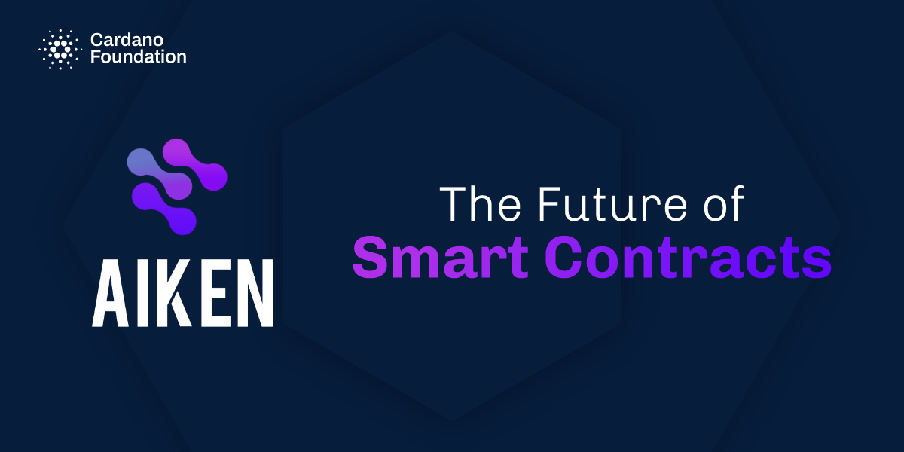
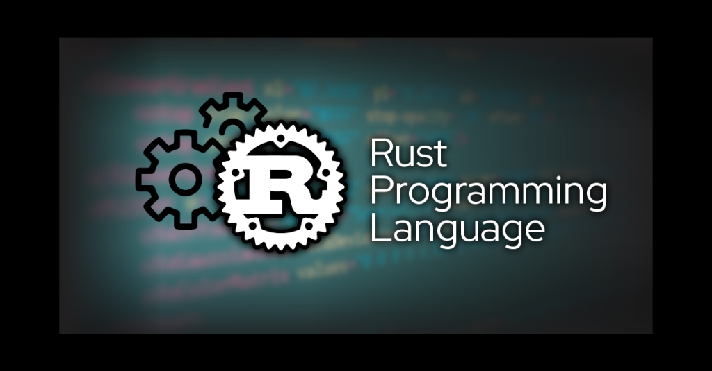

# Overview

## 1. Giới thiệu

Ngôn ngữ lập trình Aiken được tạo ra dành riêng cho Cardano, là một ngôn ngữ
dành cho lĩnh vực nhất định và chỉ có tính ứng dụng khi hoạt động trong chuỗi.
Aiken là một ngôn ngữ lập trình dễ tiếp cận dành cho các lập trình viên mới vào
lập trình smart contract, nó có thể giúp các bạn nhanh chóng thích nghi và có
thể code được hợp đồng thông minh dễ dàng hơn rất nhiều so với ngôn ngữ tiền
nhiệm của Plutus, không phải ai cũng có thể tiếp cận được nó, đặc biệt là các
bạn mới muốn tiếp cận smart contract. Ngôn ngữ này được khởi xướng bởi nhóm
TxPipe và nhận được sự hỗ trợ từ _**Cardano Foundation**_.

## 2. Ưu điểm

Aiken là cũng là một ngôn ngữ biên dịch ra mã _**Untyped Plutus Core**_ (UPLC)
nên về độ bảo mật nó an toàn giống như Plutus vậy, nhưng nó có những ưu điểm
hoàn toàn vượt trội so với Plutus và một số ngôn ngữ lập trình hợp đồng thông
minh khác, ví dụ có thể thấy rõ nhất là file mã máy plutusv2 biên dịch từ Aiken
có thông lượng gấp 400% so với plutus, cùng với đó là hiệu năng vượt trội hoàn
toàn so với những ngôn ngữ tiền nhiệm đi trước, ngôn ngữ này cũng giúp tối ưu
hóa số lượng byte có trên tập lệnh, khiến mọi thứ sẽ trở nên nhẹ nhàng hơn rất
nhiều.

## 3. Điều kiện tham gia khóa học

Khóa học này dành cho những bạn đã hiểu biết và có kiến thức nhất định về
Blockchain và cách hoạt động của nó. Trong khóa học này thì mình sẽ hướng dẫn
các bạn học ngôn ngữ lập trình aiken và viết hợp đồng thông minh trên nền tảng
Blockchain Cardano.

## 4. Trang bị kiến thức

Để tham gia khóa học này một cách hiệu quả thì các bạn nên học qua ngôn ngữ lập
trình rust để đỡ bị ngợp, vì ngôn ngữ này được lấy cảm hứng từ các ngôn ngữ lập
trình hiện đại như rust, gleam, elm. Và tốt hơn hết, để học tốt khóa học này,
các bạn nên trang bị cho mình một chút kiến thức về ví và các utxo cũng như
luồng hoạt động của nó, tất nhiên trong khóa học này mình sẽ hướng dẫn cho các
bạn những điều đó trong khóa học này, nhưng đây là khóa học về aiken và lập
trình smartcontract nên mình sẽ nói không kỹ phần này. Nếu muốn tìm hiểu kiến
thức liên quan đến Cardano, các bạn có thể vào trang web Cardano2vn để có thể
học hỏi và trao dồi kiến thức về hệ sinh thái Cardano.

## 5. Nội dung khóa học

Tiếp theo về nội dung khóa học, chúng tôi có một số đề mục sẽ giảng dạy trong
các video sắp tới như sau:

**Chương 1:** Các khái niệm về giao dịch, ví và địa chỉ trong Cardano

- B1. Overview
- B2. Setup môi trường Windows
- B3. Setup môi trường Ubuntu
- B4. Khởi tạo dự án & chạy thử nghiệm
- B5. Giới thiệu các khái niệm cơ bản
- B6. Giới thiệu các khái niệm cơ bản (Tiếp)
- B7. Một số khái niệm nâng cao trong Cardano

**Chương 2:** Ngôn ngữ lập trình aiken

- B8. Primitive Types
- B9. Variables & Constants
- B10. Functions
- B11. Custom types
- B12. Control flow
- B13. Modules
- B14. Tests
- B15. Troubleshooting

**Chương 3:** Lập trình smart contract

- B16. Helloworld Smartcontract
- B17. Tương tác với hợp đồng Helloworld bằng CLI
- B18. Tương tác hợp đồng Helloworld với giao diện front-end
- B19. Viết hợp đồng Vesting
- B20. Tương tác với hợp đồng Vesting bằng CLI
- B21 Tương tác hợp đồng Vesting với giao diện front-end
- B22. Viết hợp đồng Giftcard
- B23. Tương tác hợp đồng Giftcard với giao diện front-end (p1)
- B24. Tương tác hợp đồng Giftcard với giao diện front-end (p2)

**Chương 4:** Một số hàm có trong thư viện Aiken

- B25. Thư viện Transaction.ak (p1)
- B26. Thư viện Transaction.ak (p2)
- B27. Thư viện Credential.ak
- B28. Thư viện Value.ak (p1)
- B29. Thư viện Value.ak (p2)

**Chương cuối:** Đồ án tốt nghiệp khóa học

- B30. Viết hợp đồng sàn giao dịch NFT
- B31. Tương tác giữa hợp đồng sàn giao dịch và mã offchain (CLI)
- B32. Triển khai sàn giao dịch lên front-end, làm một sàn giao dịch thực tế

Xin chào và hẹn gặp lại các bạn trong những video tiếp theo!
