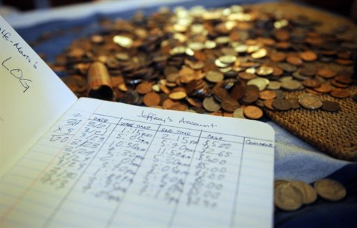
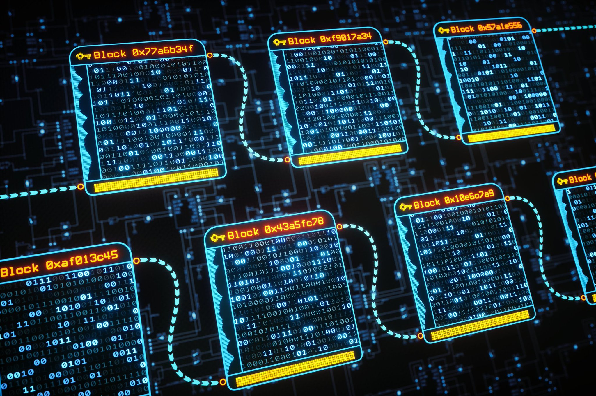
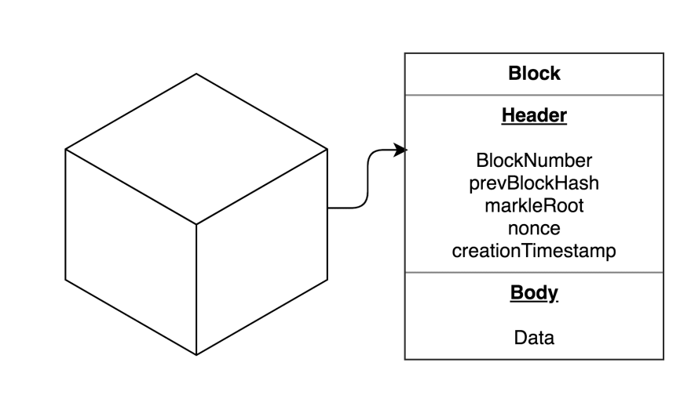
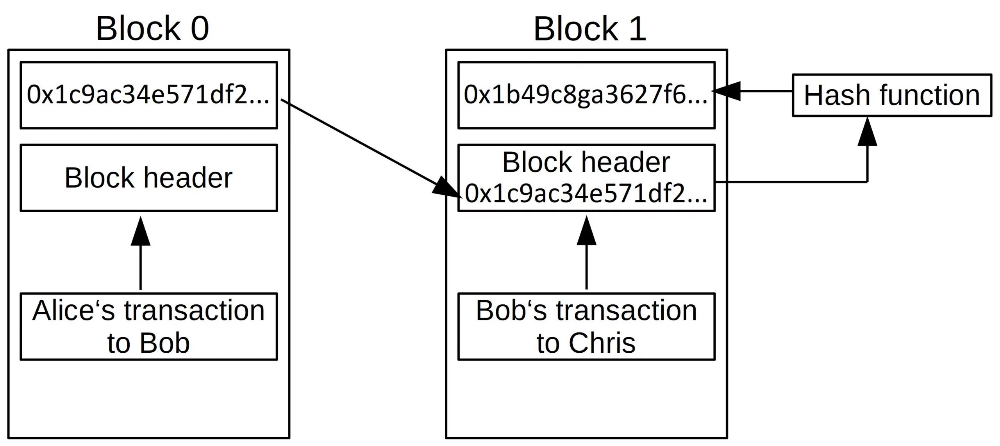
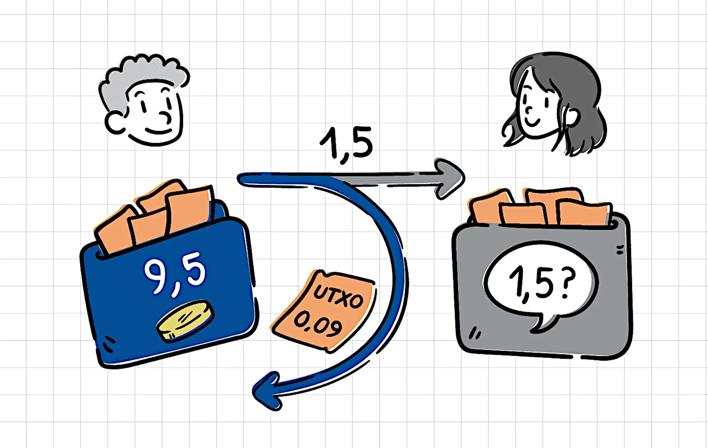

# Bài 5. Các khái niệm cơ bản trong Cardano cần biết trước khi viết hợp đồng thông minh

## 1. Khối & giao dịch

Các bạn hãy thử tưởng tượng rằng các bạn đang nhìn thấy một cuốn sách kế toán
khổng lồ, nơi ghi nhận lại tất cả các giao dịch tài chính đã được thực hiện, có
vẻ nó như nó rất lớn và khá phức tạp, nhưng qua quyển sách này, nó có thể cung
cấp cho các bạn một cái nhìn toàn cảnh về cách mà các đồng tiền di chuyển trên
thế giới này.

Tương tự như vậy, Blockchain có thể được ví như một _hệ thống kế toán phân tán_,
nhưng được lưu trữ và công nhận bởi toàn bộ những người tham gia vào mạng lưới
Blockchain và không thể thay đổi lịch sử giao dịch, nó giống như việc giao dịch
của bạn đã được mọi người tham gia chuỗi xác nhận, việc sửa đổi lịch sử giao
dịch chuỗi là vô cùng khó khăn, trừ khi các bạn phải “Tẩy não 51%” mọi người
tham gia chuỗi trong khoảng thời gian 10 phút vậy, các bạn có thấy quen thuộc
không, đó là ví dụ của cuộc tấn công 49 51, và những khái niệm về Blockchain
mình sẽ không nhắc nhiều ở đây, mình sẽ chỉ nói tổng quan về Blockchain như vậy
để các bạn có thể dễ hình dung tổng quan về nó.

## 2. Khối Blockchain được tạo thành từ

Các khối với khối trước nối với các khối sau, và các khối được tạo thành từ các
giao dịch. Tôi sẽ không đi sâu hơn, nhưng các bạn có thể tưởng tượng đơn giản
rằng trong một khối gồm 2 thành phần, gồm phần tiêu đề và nội dung. Tiêu đề chứa
thông tin về các khối, chẳng hạn như ai đã tạo ra chúng và thời gian chúng được
tạo ra. Nội dung các bạn có thể hiểu đơn giản là một chuỗi các giao dịch được
sắp xếp theo thứ tự.

Chuỗi Blockchain xuất phát từ việc các khối tham chiếu đến nhau, tức là khối sau
có thể tham chiếu đến khối trước.

Trong tiêu đề mỗi khối sẽ bao gồm: Hash digest của nội dung và hash digest của
tiêu đề khối trước.

Hash digest là một cơ chế chống giả mạo ánh xạ một giá trị đầu vào có kích thước
cố định. Các bạn có thể suy nghĩ đơn giản rằng giống như việc gán một định danh
cho một phần nội dung sao cho định danh phụ thuộc vào chính nội dung đó, tức là
thay đổi nội dung thì định danh cũng sẽ bị thay đổi. Điều này có nghĩa là nếu
bạn cố tình thay đổi nội dung của khối, toàn bộ chuỗi khối phía sau sẽ sụp đổ,
và với cơ chế đồng thuận của Blockchain, sau 10 phút toàn bộ chuỗi khối sẽ được
phục hồi, qua đó ta thấy rằng cơ chế bảo mật của Blockchain là rất mạnh mẽ.

Vì thế, giao dịch là yếu tố cơ bản nhất trên Blockchain. Chúng chính là cơ chế
mà người dùng có thể thực hiện các hành động để thay đổi trạng thái của
Blockchain. Một chuỗi bắt đầu từ trạng thái bạn đầu, hay còn gọi là chuỗi khối
đầu tiên được gọi là khối cấu hình genesis. Và từ đó, các giao dịch ánh xạ trạng
thái trước thành trạng thái mới. Cuối cùng, các khối đơn giản là một vỏ bọc để
nhóm các giao dịch lại với nhau.

## 3. Đầu ra giao dịch chưa chi tiêu (UTxO)

Trong cơ sở dữ liệu truyền thống, mộtgiao dịch là phương tiện để kết hợp một
loạt các lệnh nguyên tử để tất cả đềuthành công hoặc không thành công. Còn trong
thế giới tài chính, giao dịch là một cách để di chuyển tài sản từ vị trí này
sang vị trí khác.

Nhưng trong Blockchain, nó là sự kết hợp hoàn hảo giữa cả hai, một giao dịch
trong Blockchain trước hết là một đối tượng có đầu vào từ nơi nó lấy tài sản và
đầu ra đến nơi nó gửi chúng. Và trong Cardano, các giao dịch có rất nhiều đầu
vào và đầu ra, đó là ưu điểm hoàn toàn vượt trội so với những Blockchain khác.
Ngoài đầu vào và đầu ra, các giao thức Blockchain thường bao gồm những thành
phần có thể thay đỏi các phần khác nhau của trạng thái Blockchain như chứng chỉ
ủy quyền, tài sản do người dùng tự định nghĩa, … Và một đầu ra hoàn toàn có thể
bị từ chối do nhiều lý do, có thể không đủ tiền hoặc không đủ điều kiện chi
tiêu, … Và bây giờ, mình sẽ giới thiệu cho các bạn các khái niệm đầu vào, đầu
ra.

### a. Đầu ra (Output)

Trong Cardano, một đầu ra là một đối tượng mô tả ít nhất hai thành phần trong
đó:

- Một lượng tài sản nhất định, cũng được gọi là một giá trị. 
- Một điều kiện chi tiêu, cũng có thể gọi là một địa chỉ 

Và có thể còn một lượng dữ liệu cũng có thể
được đưa vào đầu ra nhưng chưa cần quan tâm đến nó ngay bây giờ. Vai trò của giá
trị ở đây rất rõ ràng, nó chỉ ra số lượng tài sản mà đầu ra nắm giữ.

Trong hệ sinh thái Cardano có hỗ trợ 2 loại tài sản: Tiền tệ chính của giao thức
(ADA) và các loại tài sản do người dùng tự định nghĩa. Cả hai đều tồn tại song
song trong các giá trị mặc dù các quy tắc có hơi khác nhau khi áp dụng cho mỗi
loại.

Địa chỉ nắm bắt logic và cho biết giao thức dưới những điều kiện nào người dùng
mới có thể sử dụng tài sản cho một đầu ra cụ thể, nó là thứ xác định quyền sở
hữu tài sản, và mình sẽ nói về phần này sau.

### b. Đầu vào (Input)

Một đầu vào là một tham chiếu đến đầu ra trước đó, các bạn có thể hình dung mỗi
đầu vào giống như các tờ giấy ghi chú có số seri duy nhất và đầu vào là số seri
duy nhất và đầu ra chính là nội dung của giao dịch đó.

Một giao dịch chính là một tài liệu chỉ định các ghi chú nào sẽ bị gạch đi và tờ
ghi chú mới nào sẽ được dán lên tường, và các bạn nên lưu ý rằng có các quy tắc
liên quan đến việc xây dựng giao dịch, chẳng hặn như tổng giá trị đầu vào phải
bằng tổng giá trị đầu ra nhưng có thể được sắp xếp lại khác nhau.

Hãy cùng nhau học và phát triển kỹ năng lập trình của bạn!

Chúc các bạn thành công và không ngừng nâng cao trình độ của mình!
