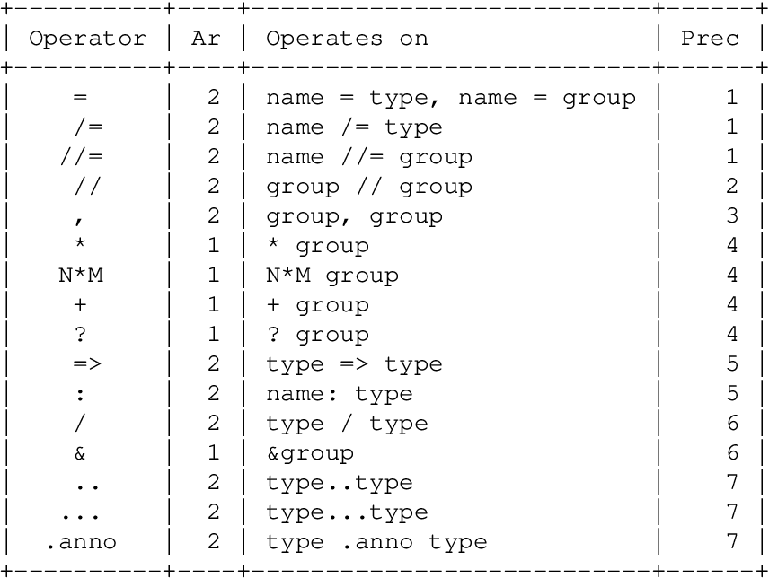
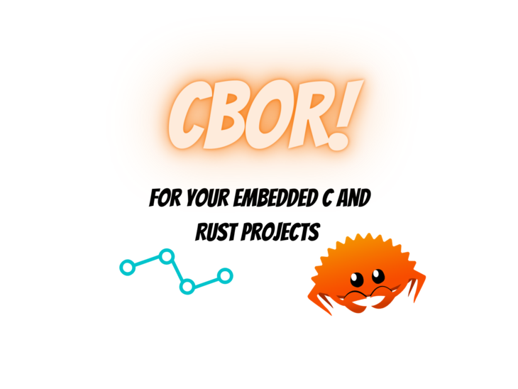
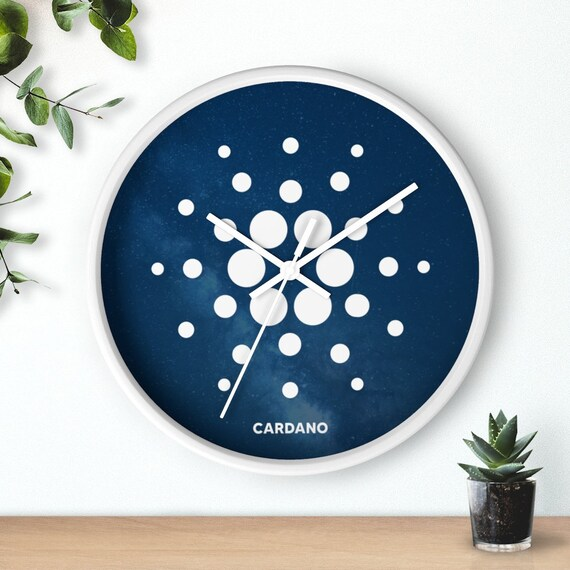
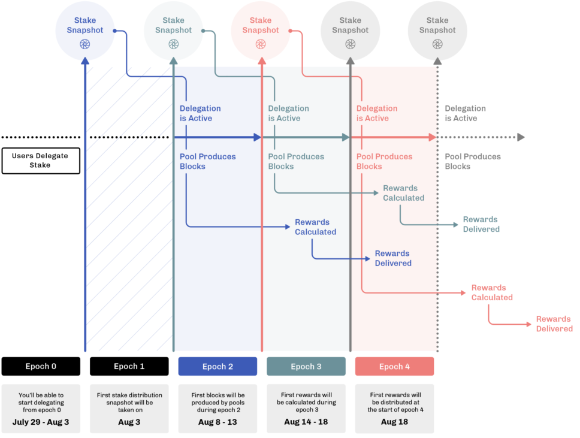
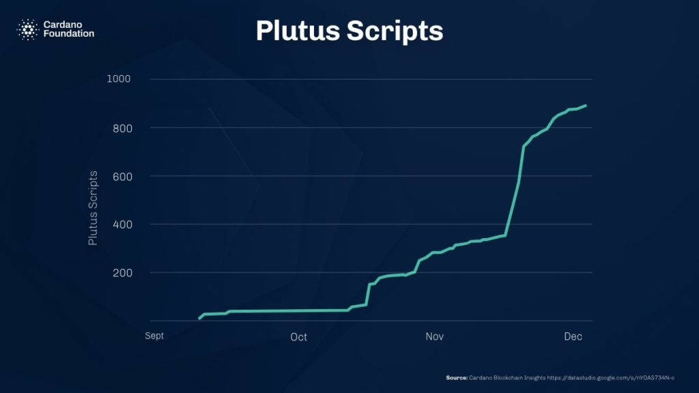

# Bìa 7. Một số khái niệm nâng cao trong hệ sinh thái Cardano

## 1. CBOR và CDDL

### a. CBOR

CBOR là một định dạng dữ liệu nhị phân có cấu trúc, tương tự như cấu trúc của
JSON nhưng dành cho dữ liệu nhị phân. CBOR được sử dụng trên Cardano để lưu trữ
dữ liệu của các giao dịch, hợp đồng thông minh, và một số đối tượng khác.

### b. CDDL

CDDL là một ngôn ngữ mô tả cách dữ liệu được mã hóa thành byte trong CBOR. CDDL
được sử dụng để tạo ra các mô hình dữ liệu CBOR, giúp cho việc phát triển và gỡ
lỗi trên các đoạn mã trong các ứng dụng sử dụng nền tảng Cardano trở nên dễ dàng
hơn, đặc biệt là khi các bạn đang không biết mình sai logic ở đâu vậy, chuẩn
đoán CBOR là rất quan trọng khi ngôn ngữ lập trình Aiken là một ngôn ngữ không
thể in giá trị, do đó bạn sẽ không thể biết bạn sai ở đâu và rất khó để Debug.

### c. Một số lợi ích của việc sử dụng CBOR và CDDL

**Tăng hiệu quả:** CBOR là một định dạng dữ liệu nhỏ gọn, giúp việc truyền tải và
lưu trữ dữ liệu trên Cardano trở nên hiệu quả, giảm chi phí đi rất nhiều khi tập
lệnh được làm nhẹ đi.

**Tăng cường bảo mật:** CDDL giúp việc mô tả dữ liệu CBOR trở nên rõ ràng và chính
xác hơn, từ đó giúp giảm thiểu các lỗi và lỗ hổng bảo mật.

**Tăng tính tương thích:** CBOR thuộc định dạng dữ liệu phổ biến, được sử dụng bởi
nhiều nền tảng Blockchain khác nhau. Điều này giúp việc phát triển các ứng dụng
dApp trên hệ sinh thái Cardano tương thích với các hệ sinh thái Blockchain khác
trở nên dễ dàng và sẽ còn phổ biến trong tương lai.

### 2. Khoảng thời gian hiệu lực

Hợp đồng thông minh trên Cardano có thời gian chạy hoàn toàn xác định, tức là
kết quả thực thi sẽ luôn giống nhau cho cùng một đầu vào, vậy làm sao để xử lý
thời gian trong các hợp đồng này?

Cardano sẽ giải quyết vấn đề trên bằng cách chia quá trình xác nhận giao dịch
thành hai giai đoạn:

- **Giai đoạn 1:** Kiểm tra cấu trúc giao dịch và xác định xem giao dịch có hợp lệ
  hay không, chẳng hạn như có đủ tiền để chi tiêu cho một UTxO đó không chẳng
  hạn. Giai đoạn này sẽ được thực thi bởi các noded trên mạng lưới Cardano.
- **Giai đoạn 2:** Thực thi mã Plutus trong giao dịch. Giai đoạn này được thực
  hiện bởi các nút ủy quyền, hay còn gọi là thợ đào để xác nhận giao dịch.

Khoảng thời gian hiệu lực được xác định bởi 2 giá trị:

- **Lower bound:** Chính là cận dưới của khoảng thời gian này. Lower bound xác định
  thời điểm sớm nhất mà giao dịch có thể được thực thi.
- **Upper bound:** Chính là cận trên của khoảng thời gian này. Upper bound xác định
  thời điểm muộn nhất mà giao dịch có thể được thực thi.

#### Ví dụ

Nếu một giao dịch có khoảng thời gian hiệu lực từ ngày 01/01/2024 đến ngày
31/12/2024 thì giao dịch chỉ có thể được thực thi trong khoảng thời gian đó. Nếu
các bạn cố gắng thực thi giao dịch đó trước ngày 01/01/2024 hoặc sau ngày
31/12/2024 thì giao dịch sẽ ngay lập tức bị từ chối.

### Ứng dụng

Khoảng thời gian có hiệu lực có thể được sử dụng để thực thi một số chức năng
sau:

- Giới hạn thời gian thực thi hợp đồng.
- Xác định thời gian bắt đầu hoặc thời gian kết thúc của hợp đồng.
- Tạo ra các sự kiện chỉ xẩy ra trong một khoảng thời gian nhất định.

# 3. Chiến lược tuần tự hóa

Theo như các bạn đã biết, Cardano không có một phương pháp tuần tự hóa chuẩn
dành cho các đối tượng. Mặc dù vẫn tồn tại đặc tả CDDL cho các đối tượng cốt
lõi, nhưng vẫn có nhiều cách hiểu khác nhau về nó. Điều đó có thể dẫn đến những
bất ngờ khi tính toán lại hàm băm của đối tượng.

Để đảm bảo tính nhất quán, chiến lược được khuyến nghị là luôn lưu giữ các byte
nguyên bản của đối tượng đã được tuần tự hóa và không cố gắng tuần tự hóa lại
bất cứ thứ gì. Đồng thời, các trình phân tích cú pháp cũng phải linh hoạt để có
thể phân tích cú pháp bất kỳ biểu diễn nào tuân thủ đặc tả CDDL.

# 4. Hàm băm

Trong Cardano, nền tảng này chủ yếu sử dụng hàm băm **Blake2b** trong toàn bộ
chuỗi. Hầu hết các đối tượng được gọi là “id” thì đều là hàm băm của một số đối
tượng được tuần tự hóa, chẳng hạn như id nhóm cổ phần, id giao dịch, …

(Hàm băm Blake2b) Hàm băm trên Cardano thường có độ dài 32 byte, ngoại trừ các
thông tin xác thực (vd: Khóa hoặc script) có độ dài 28 byte, điều đó có nghĩa là
các bạn sẽ luôn thường xuyên bắt gặp hàm băm **Blake2b224** trong hợp đồng thông
minh. Nó cũng lý giải vì sao policyId chỉ dài 28 byte, vì nó là hàm băm của một
script được gắn thẻ.

# 5. PolicyId

PolicyId là hàm băm của một script được gắn thẻ. Điều quan trọng cần lưu ý là
trước khi băm, script sẽ được thêm tiền tố bằng một byte nhằm mục đích phân biệt
tùy thuộc vào ngôn ngữ kịch bản nào.

#### Ví dụ

Các kịch bản gốc được thêm tiền tố 0x00, Script PlutusV1 được thêm tiền tố 0x01,
tương tự như vậy cho plutus v2 và v3.

# 6. Phần thưởng và rút tiền

Ouroboros là một thuật toán đồng thuận của Cardano, xác định cơ chế khuyến khích
người tham gia đóng góp vào sự đồng thuận thông qua phần thưởng. Phần thưởng
thường được trả sau mỗi chu kỳ cho những người ủy quyền đã ủy thác cổ phần cho
một nhóm cổ phần trên mạng lưới để tạo ra các khối thay mặt họ.

Các phần thưởng này không được trả trực tiếp cho những người ủy quyền, mà được
lưu trữ trong một tài quản đặc biệt được liên kết với các thông tin xác thực cổ
phần, đó chính là tài khoản Stake. Người dùng có thể rút tiền từ tài khoản này
bằng cách thực hiện một giao dịch rút tiền như chuyển tiền từ địa chỉ stake sang
địa chỉ payment chẳng hạn.

# 7. Kịch bản gốc: (Native Scripts)

Trước khi có kịch bản Plutus hoàn chỉnh, hay còn gọi là hợp đồng thông minh mà
các bạn thường biết đến, Cardano đã có một kịch bản tối giản gọi là Native
Script hay Kịch bản giai đoạn 1. Nó vẫn tồn tại và cung cấp một số ràng buộc cơ
bản nhưng cực kỳ hữu ích cho hệ sinh thái Cardano, ví dụ như việc xác định ví đa
chữ ký chẳng hạn.

Qua bài học trên, các bạn có thể phần nào đó hiểu được sâu sắc hơn về các công
nghệ mà hệ sinh thái Cardano đang sử dụng.

Xin chào và hẹn gặp lại các bạn trong những video tiếp theo!
