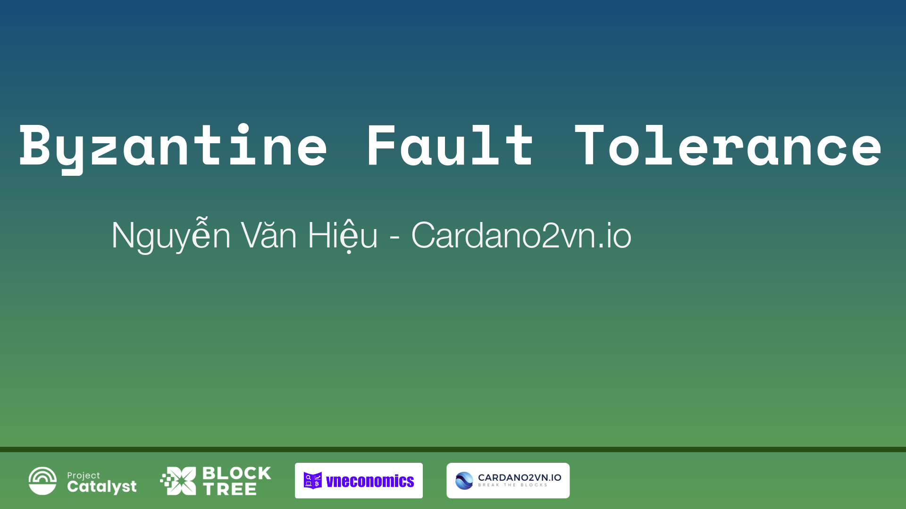
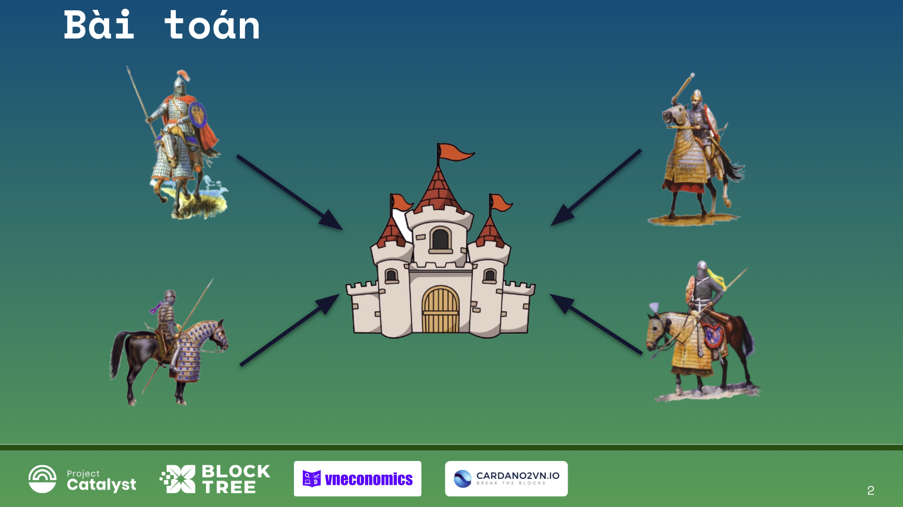
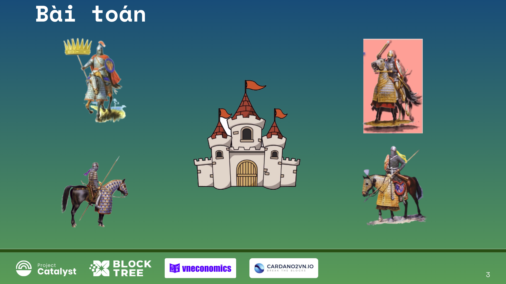
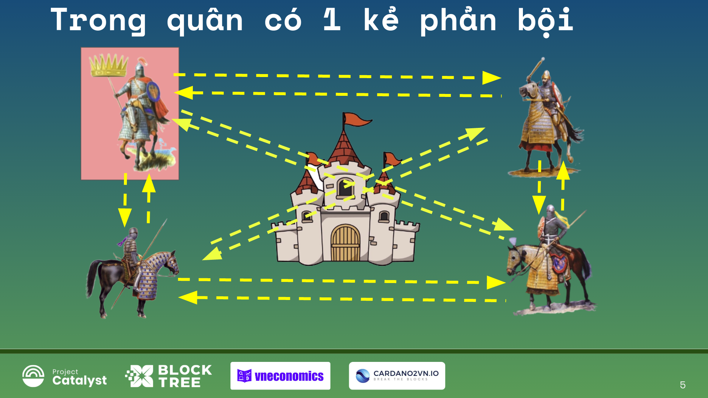
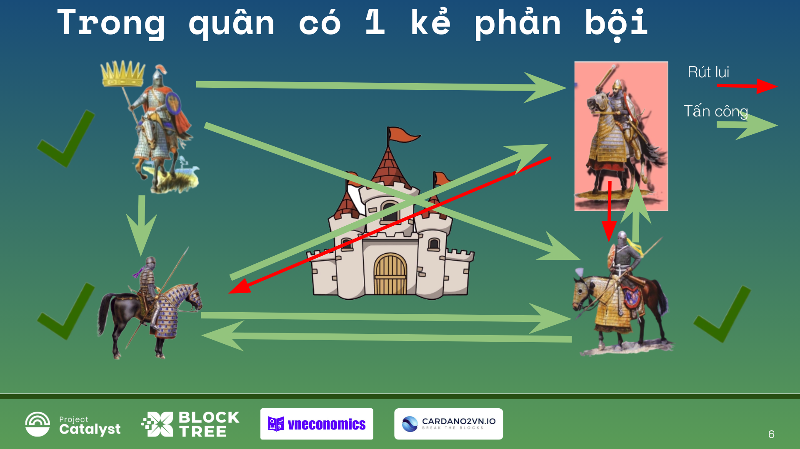
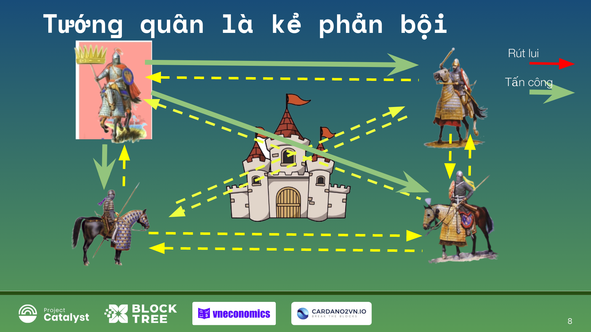
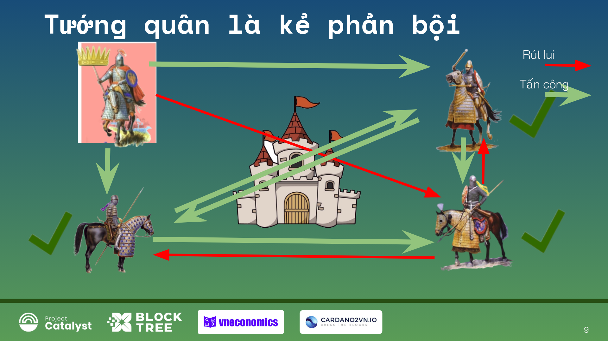

Byzantine Fault Tolerance
================================

Xin chào và chào mừng các bạn đã trở lại bài giảng ngày hôm nay trong khóa học về blockchain cơ bản này.
Hôm nay chúng ta đang nói về một khái niệm rất thú vị được gọi là khả năng chịu lỗi Byzantine (BFT).
Đó là một đặc điểm rất quan trọng không chỉ cho blockchain, mà còn cho bất kỳ loại hệ thống phi tập trung nào.
Vì vậy, chúng ta hãy có một cái nhìn tổng quan trong một ví dụ về điều này.

Đã lâu lắm rồi chuyện kể rằng có một lâu đài mà Đế chế Byzantine muốn tấn công và chiếm lấy. Tôi nghĩ đó là một câu chuyện không có thật. Nhưng tôi  thực sự nhìn vào nó làm ví dụ điển hình.
Nếu các bạn đã biết câu chuyện này hãy cho tôi biết.
Rồi giờ đến nội dung  câu chuyện này.
Bằng cách này hay cách khác, có bốn vị tướng vây quanh một lâu đài và họ muốn tấn công nó.
Nó có thể nhiều hơn bốn, nó có thể là bất kỳ số tướng nào.
Chúng ta sẽ xem xét một ví dụ về bốn tướng thôi.
Họ muốn tấn công nó, nhưng vấn đề là họ chỉ có thể giành chiến thắng nếu phần lớn trong số họ đi đến một sự đồng thuận về những việc cần làm, như Tấn công hoặc Rút lui.
Trên thực tế, cho dù họ tấn công hay rút lui, đa số các tướng này phải đi đến một thỏa thuận, một sự đồng thuận về những gì họ đang làm.
Nếu trong trường hợp này, ba trong số bốn người nói, “Chúng tôi đang tấn công,” và họ tấn công, họ sẽ thắng.
Nếu ba người nói, "Chúng tôi đang rút lui," và họ rút lui, họ sẽ an toàn và ổn thỏa.

Tuy nhiên, nếu họ có sự hỗn loạn và họ không đến nhất trí thì sẽ bị địch tiêu diệt.
Và đó là bài toán đặt ra.

Và như vậy trong số những vị tướng này, có một  người là tướng chỉ huy đội quân này. Và đồng thời cũng có một kẻ phản bội. Lúc đó họ không biết ai trong số những vị tướng này là kẻ phản bội. Chính họ cũng có thể là một kẻ phản bội hoặc họ có thể không phải là một kẻ phản bội. Và  họ cũng không biết ai là kẻ phản bội. Khi đó vấn đề này là rào cản để họ thực sự không đi đến thống nhất.

Vì vậy, câu hỏi là làm thế nào để họ đưa ra một sự thống nhất và thành công?
Làm thế nào để họ đưa ra một giao thức, một giao thức đồng thuận?

Chung ta hãy nhìn vào slide này. và làm thế nào để có một thuật toán sẽ giúp họ đi đến cùng một quyết định mặc dù có một kẻ phản bội?

Đầu tiên, họ có thể giao tiếp với nhau, nhưng họ chỉ có thể gửi thông điệp bằng miệng.
Vì vậy, họ không thể viết một thông báo và chuyển nó đi khắp nơi, tới tất cả vị tướng. OK, về cơ bản đó là cách họ có thể giao tiếp.
thứ hai như trên đã nói nguyên tắc là:
- Nếu ba trong số bốn người nói, “Chúng tôi đang tấn công,” và họ tấn công, họ sẽ thắng.
- Nếu ba người nói, "Chúng tôi đang rút lui," và họ rút lui, họ sẽ an toàn và ổn thỏa.
- Ngược lại với quy định trên họ sẽ thua và thất bại.

Trong trường hợp 1. Người chỉ huy và các vị tướng đều là người trung thành thì mệnh lệnh người chỉ huy đưa ra và các tướng khác đáp lại và làm theo thì chắc chắn thắng (có thể tấn công hoặc rút lui).

Trong trường hợp 2.  Người chỉ huy và hai tướng khác trung thành, một kẻ phản bội. Và ví dụ rằng vị tướng này là kẻ phản bội.

Do đó, chung ta phải tuân theo một thuật toán mà mọi người đã đồng ý trước để làm việc này.
Và câu hỏi đặt ra là thuật toán là gì? Và thuật toán được đề xuất là gì trong nghiên cứu để giải quyết vấn đề này? Nghe có vẻ rất tầm thường, nhưng nó thực sự là một vấn đề rất phức tạp. Nhưng tôi sẽ không nói vấn đề rất, rất phức tạp này ở đây. Đó là một vấn đề phức tạp và có chiều sâu, khá lớn bằng chứng minh toán học.

Trong ví dụ này để đơn giản thuật toán sẽ sử dụng là họ sẽ chỉ nhìn vào đa số
những thông điệp mà họ nhận được ở đây là 2/3 thông điệp đến là họ quyết định tuân theo.

Chúng ta hãy nhìn lên slide: Quy ước ở đây là mũi tên xanh là Tấn công, Mũi tên đỏ là rút lui.
Bắt đầu vị tướng chỉ huy ra lệnh - chuyển thông điệp tấn công đến các vị tướng khác.

Tấn công hay rút ​​lui không quan trọng, hãy nhớ rằng miễn là phần lớn trong số họ đồng ý về những việc cần làm hơn là tấn công hoặc rút lui.

Nhưng trong trường hợp này, anh ta phát lệnh tấn công. Chúng ta có thể loại bỏ những mũi tên khác đang chuyển lại cho vị tướng chỉ huy vì họ không quan trọng. Anh ta ra lệnh và trong trường hợp này, anh ta không phải là kẻ phản bội.
Chúng ta sẽ xem khi anh ta là kẻ phản bội trường hợp 2 ở trên  rồi.Nhưng anh ấy đã quyết định. Anh ấy không thực sự cần biết họ đang nói gì.
Bây giờ là giữa các tướng để quyết định họ sẽ làm gì với lệnh này. Họ không biết, liệu anh ta có phải là kẻ phản bội? Anh ta không phải là kẻ phản bội chứ?
Vì vậy, những gì họ cần làm là chuyền thông điệp tấn công đó đi cho các vị tướng còn lại và đồng thời cũng nhận được các thông điệp của các vị tướng khác và sau đó họ nhận được đa số phiếu bầu ở đây 2/3 phiếu bầu là họ quyết định.
Nhưng trong trường hợp này có một kẻ phản bội và họ truyền đi thông điệp rút lui (mũi tên đỏ). Hai vị tướng còn lại truyền thông điệp tấn công (mũi tên màu xanh).

Sau khi mọi vị tướng đã chuyền thông điệp xong và bây giờ chúng ta hãy nhìn vào slide này.
- Thứ nhất Vị tướng chỉ huy ra lệnh tấn công và không phải là kẻ phải bộ thì anh ta Sẽ tấn công.
- Thứ hai vị tướng có hai thông điệp tấn công một thông điệp rút lui vậy là 2/3 tấn công nên quyết định tấn công.
- Thư ba vị tướng này cũng như vị tướng thứ hai là có 2/3 thông điệp tấn công nên quyết định tấn công.
- Vị tướng thứ tư có 3/3 tấn công nhưng là kẻ phản bội nên anh ta rút lui. 

Từ phân tích trên cho thấy 3/4 vị tướng quyết định tấn công, nên chiến thắng. Bởi vì chúng tôi đã có sự đồng thuận của đa số.Vì vậy, dựa trên thuật toán đó, họ đã đi đến thống nhất. Hơn một nửa trong số họ sẽ tấn công, và vì vậy họ sẽ chiếm được lâu đài này, họ sẽ chiến thắng.

Điều tương tự nếu họ nói, "Tất cả chúng ta đang rút lui," điều tương tự sẽ xảy ra.
Tất cả họ sẽ chỉ rút lui. Vì vậy, dù sao thì họ cũng sẽ đi đến thống nhất.

Trong trường hợp 3. Người chỉ huy là kẻ phản bội và 3 tướng khác trung thành có thể tấn công hoặc rút lui). Chúng ta xem xét trường hợp này như thế nào? thuật toán này có hoạt động không?

Chỉ huy là kẻ phản bội, khi đó anh ta có thể làm gì?
Anh ấy có thể bảo mọi người làm điều tương tự Tấn công hoặc Rút lui  phải không?
Nếu anh ta bảo mọi người tấn công, tốt đó sẽ là khá ngớ ngẩn của anh ta bởi vì sau đó họ sẽ bảo nhau tấn công và họ sẽ tấn công và họ sẽ chiếm lâu đài, phải không? Sẽ có sự đồng thuận.

Điều tương tự, rút ​​lui. Anh ấy sẽ bảo mọi người rút lui. Họ sẽ chỉ rút lui, và một lần nữa, họ giành chiến thắng. Vì vậy, họ giải quyết vấn đề.

Do đó, cách duy nhất anh ta có thể làm mọi thứ rối tung lên là anh ta thực sự có thể ra lệnh cho hai người trong số họ tấn công, và một người trong số họ phải rút lui. Và hãy xem liệu điều đó có gây rắc rối cho đồng thuận  không?

Cũng như vậy, những gì họ làm một lần nữa là họ chỉ chuyển tiếp những gì họ nghe được từ Tướng chỉ huy.

Tướng thứ nhất này nói, "Tướng quân bảo tôi tấn công."
Tướng thứ hai này nói, "Tướng quân bảo ta rút lui."
Tướng thứ ba này nói, "Tướng quân bảo tôi tấn công."

Và bây giờ hãy xem liệu họ có nhận được sự đồng thuận hay không. 

- Tướng thứ nhất: Anh ta có hai mũi tên màu xanh  và một mũi tên màu đỏ vậy là tấn công.
-Tướng thứ hai: Anh ta có hai mũi tên màu xanh  và một mũi tên màu đỏ vậy là tấn công.
- Tướng thứ ba: cũng như hai tướng trên vậy là tấn công.
Do đó là 3/4 tướng đồng thuận và Tấn công và dành chiến thắng.

nếu đại tướng ban hành hai mệnh lệnh đỏ,
một đơn hàng màu xanh lá cây, sau đó ba người trong số họ
sẽ rút lui và quân đội sẽ được an toàn.
Vì vậy, như bạn có thể thấy, điều này đang hiển thị đó là vấn đề của vị tướng Byzantine này và sau đó là thuật toán chiếm phần lớn của thông tin được chuyển tải hoặc thông tin được chuyển tiếp và hành động dựa trên đó, dựa trên quyết định của bạn về điều đó. Và thuật toán đó có khả năng chịu lỗi Byzantine. 

Câu hỏi đặt ra là làm thế nào, ở mức độ nào để chịu đựng...
Chịu được ở mức độ nào?
Vì vậy, câu hỏi là, điều gì sẽ xảy ra nếu chúng ta có hai kẻ phản bội trong đội quân này?
Trong trường hợp của hai kẻ phản bội, bạn có thể thử nó cho chính mình, và không có cách nào để  họ sẽ thành công cả. Không có giải pháp nào cho vấn đề này nếu có hai kẻ phản bội trong trường hợp này.
Và sau đó những gì họ đã làm trong bài là họ đã chứng minh điều đó, họ đã chứng minh một cách có phương pháp chẳng hạn để thuật toán này hoạt động, bạn phải có không quá 33% kẻ phản bội.

Vì vậy, giả sử bạn có 10 tướng thì nếu bốn người trong số họ là những kẻ phản bội, hệ thống của bạn sẽ không đồng thuận và sẽ không dành chiến thắng..Nếu ba trong số họ là kẻ phản bội, thì thuật toán này vẫn hoạt động tốt. Và đó chính là mức độ chịu đựng
của hệ thống này.

Bây giờ làm thế nào để điều này ứng dụng trên Blockchain hoặc các hệ thống phi tập trung khác, hay nhiều hệ thống công nghệ khác?
Vấn đề là, ví dụ, trong chuỗi khối, điều gì sẽ xảy ra? Chúng ta có thể có ai đó đang cố gắng tấn công hệ thống và chúng ta cần đưa ra một giao thức đồng thuận, giống như một thuật toán như những vị tướng này đã nghĩ ra. Chúng ta cần đưa ra một giao thức đồng thuận mà chúng ta sẽ nói về trong phần tiếp theo. Điều này sẽ cho phép chúng ta bảo vệ hệ thống từ những kẻ phản bội hoặc từ những người cố gắng tấn công nó, v.v.
và chúng ta muốn làm cho nó an toàn nhất có thể. Vì vậy, chúng ta  muốn đảm bảo rằng nó có thể chịu đựng được không chỉ với một hoặc hai hoặc ba hoặc năm kẻ tấn công.
mà nó phải an toàn nhất có thể. Và đó là toàn bộ khái niệm về khả năng chịu lỗi của Byzantine.
Và khái niệm này thực sự không chỉ được sử dụng trong blockchain như chúng ta đã đề cập khi bắt đầu bài này. Nó thực sự được sử dụng ở nhiều nơi khác nhau. Ví dụ, nó được sử dụng trong máy bay vì bạn có tất cả các hệ thống này giao tiếp với nhau, tất cả những thứ này, chúng được gọi là gì, các phép đo đi qua từ các đồng hồ đo khác nhau v.v.
Và nếu một hoặc hai trong số đó thất bại thì sao? Bạn không thể có toàn bộ vụ tai nạn máy bay chỉ vì một màn hình nhiệt động cơ bị hỏng và đang nói với chúng ta điều sai trái. Vì vậy, trong trường hợp đó, bạn có chiếc máy bay đang bay, và các tướng thực sự đại diện cho các thành phần khác nhau của các mạch điện của máy bay. Và mọi thứ đang hoạt động tốt, và rồi đột nhiên, một trong số chúng bị lỗi, một phần của máy tính chính bị lỗi, hoặc cảm biến nhiệt trên động cơ hoặc đồng hồ đo tốc độ gió hoặc một cái gì đó bị lỗ gửi thông tin bị sai. Nếu một cái gì đó hỏng, thì toàn bộ máy bay vẫn phải tiếp tục bay. Và đó được gọi là khả năng chịu lỗi của Byzantine.

Nó phải có đặc điểm đó khả năng chịu lỗi của Byzantine. Nó cũng được sử dụng trong các nhà máy điện hạt nhân, được sử dụng trong tên lửa.

Trạm vũ trụ ISS có những yêu cầu cụ thể cho các tên lửa muốn gắn với nó, chúng có khả năng chịu lỗi Byzantine ở mức độ nào đó bởi vì có rất nhiều yếu tố có thể làm hỏng máy tính của tàu con thoi cập bến hay bất cứ thứ gì và sau đó nó sẽ phá hủy toàn bộ nhà ga.
Ví dụ, bức xạ có thể phá hủy bộ nhớ hoặc làm kẹt mạch điện của tên lửa lắp ghép và nó sẽ phá vỡ toàn bộ trạm ISS và mọi người có thể chết và đó là hàng tỷ đô la ngay cả khi không có người tham gia. Và như vậy,  đó là nơi khả năng chịu lỗi Byzantine xuất hiện. Vì vậy, đó là một khái niệm lớn mặc dù có vẻ như rất đơn giản và rất thoáng cổ tích về một số tướng lĩnh trong Đế quốc Byzantine.

Nó thực sự là một điều rất lớn, rất lớn về mặt hệ thống phi tập trung và hệ thống
với rất nhiều thành phần và blockchain chỉ là một trong số đó. Và chúng ta sẽ nói nhiều hơn về điều này, ứng dụng trong hướng dẫn tiếp theo về blockchain. Nhưng bây giờ, nếu bạn muốn tìm hiểu thêm về. "Vấn đề tướng quân Byzantine" năm 1982 bởi Lamport, Shostak, và Pease.

Được rồi, hy vọng bạn thích bài ngày hôm nay về khả năng chịu lỗi của Byzantine.
Và Tôi sẽ gặp bạn trong phần hướng dẫn tiếp theo.Xin chào và hẹn gặp lại các bạn!
