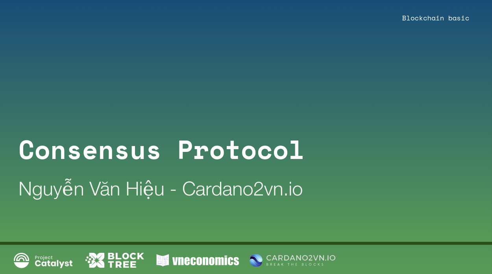
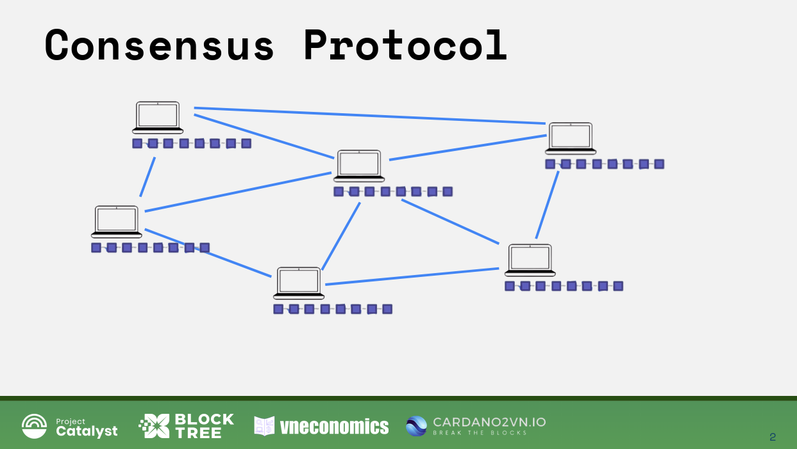
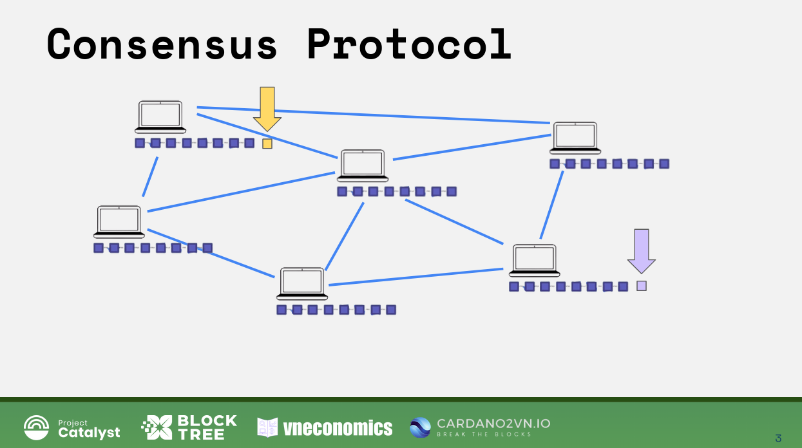
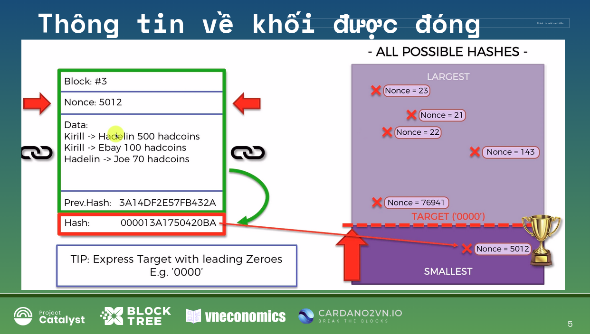
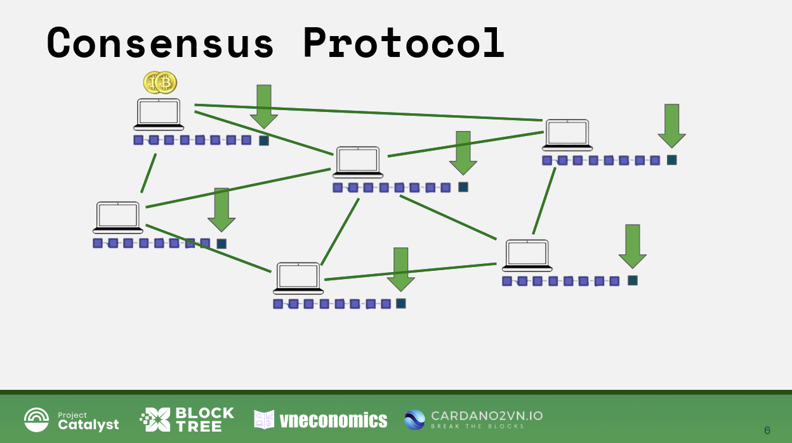
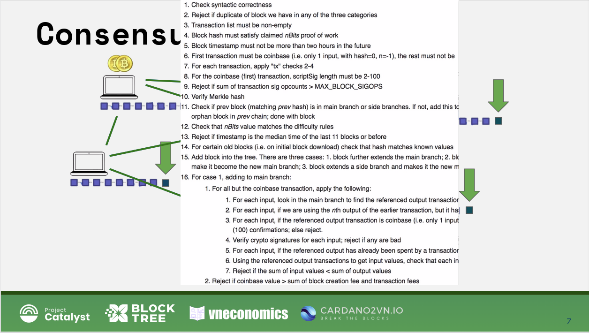
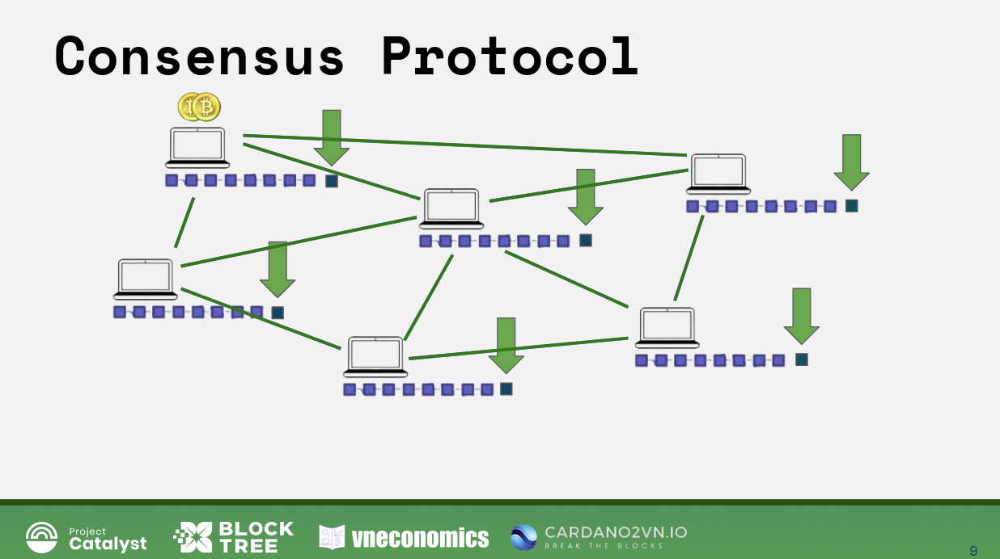
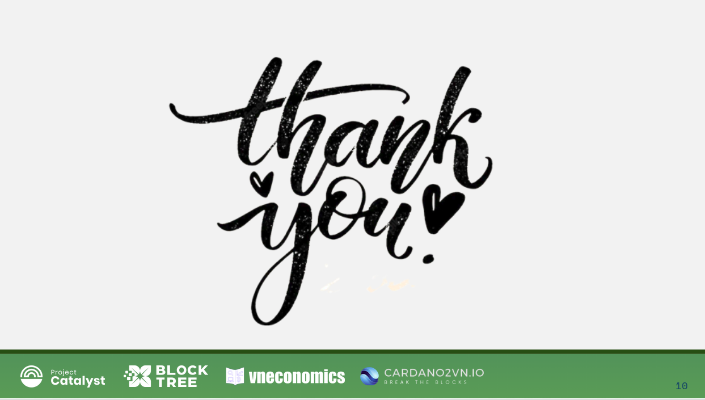

Consensus Protocol
===================

Xin chào và chào mừng các bạn đã trở lại bài giảng ngày hôm nay trong khóa học về blockchain cơ bản này.
Hôm nay chúng ta nói về Giao thức đồng thuận trên nền tảng Blockchain. Ở đó các máy tính nói chuyện với nhau và cùng đưa đến một thống nhất về nội ghi lên Blockchain.

Được rồi, đây là mạng máy tính được kết nối với nhau gọi là mạng Blockchain của chúng ta. Chúng ta vừa mới bắt đầu khai thác, và cuối cùng chúng ta đang ở các giao thức đồng thuận, bước cuối cùng trong câu chuyện của chúng ta.

Được rồi, vậy chúng ta hãy xem chúng ta đang nói về cái gì. Chúng ta sẽ thảo luận về các giao thức đồng thuận. Đầu tiên chúng ta sẽ xem xét những thách thức mà chúng được thiết kế để giải quyết. Bởi vì chúng ta đã quá quen thuộc với khái niệm giao thức đồng thuận khi chúng ta đang nói về khả năng chịu lỗi của Byzantine.
Và chúng tôi hiểu toàn bộ khái niệm là gì? đó là cách mạng phân tán đồng ý về mọi thứ.
Và trong trường hợp của chúng ta, đó là cách nó đồng ý về cách tiếp tục phát triển, cách tiếp tục thêm khối mới theo hướng nào, làm thế nào để biết khi nào nên thêm một khối, và khối nào cần thêm trên toàn bộ mạng Blockchain.Và thách thức là một giao thức đồng thuận,như bạn nhớ lại trong ví dụ về khả năng chịu lỗi của Byzantine, thử thách cho các tướng là hiểu lệnh nào cần nghe, như tấn công hay rút lui. Vì vậy, họ đã phải đưa ra một giao thức đồng thuận để giải quyết thách thức đó.

Trong trường hợp của chúng tôi, giao thức đồng thuận cho một chuỗi khối phải giải quyết hai thách thức chính.

Số một là bảo vệ mạng khỏi những kẻ tấn công.Và chúng ta đã nói về tình hình nơi kẻ tấn công cố gắng tấn công đâu đó ở giữa chuỗi khối. Vì vậy, nếu kẻ tấn công cố gắng thay đổi khối này, thì điều đó gần như là không thể đối với họ bởi vì họ sẽ phải thay đổi tất cả những khối này và sau đó tất cả các khối này được lưu trên mỗi nút. Vì vậy, đó không phải là vấn đề chúng ta đang nói ở đây.

Vậy vấn đề chúng ta đang nói đến ở đây là những gì sẽ xảy ra nếu một kẻ tấn công
cố gắng đặt một khối ở cuối chuỗi blockchain họ cố gắng thêm một khối mới độc hại.

-Thử thách thứ hai là một giao thức đồng thuận sẽ giải quyết là các chuỗi cạnh tranh, có nghĩa là cùng lúc trên mạng Blockchain có hai khối được thực hiện đồng thời ở hai nút khác nhau.
Như các bạn đã biết trong một chuỗi khối lớn các nút được phân tán khắp thế giới. Nó có thể có độ trễ giữa các nút, đặc biệt là các nút cách xa nhau. Và có thể xảy ra ở hai nút  cách xa nhau có thể khai thác thành công một khối cùng một lúc. Như vậy nó không có gì độc hại như những kẻ tấn công nhưng chúng ta vẫn cần giải quyết.

Nó chỉ xảy ra như vậy bởi vì một lần giả sử cái này khai thác khối trước khi thông tin về cái đó đến cái này, có lẽ phải mất hai giây để đến đây.
Nhưng trong giây đầu tiên, nút này cũng đã khai thác một khối. Và từ quan điểm của mỗi nút này, nó đã không làm gì sai. Chúng hoàn toàn đồng ý với cách khai thác hoạt động. Tuy nhiên, đối với blockchain, đây là một vấn đề bởi vì nó cần phải được đồng thuận về cách tiếp tục phát triển các khối tiếp theo.
Nó cần biết, chúng ta có tiếp tục phát triển với khối màu cam không hay chúng ta tiếp tục phát triển với khối màu tím?
Bởi vì như chúng ta sẽ thảo luận sâu hơn trong khóa học, những khối này thực sự có thể có các giao dịch khác nhau bên trong chúng. Nó không thể giống như chấp nhận cả hai khối và chia phí cho cả hai.... Không, nó phải chọn một trong hai khối đó.
Và đó là thử thách cần giải quyết.

Làm thế nào để mạng đạt được sự đồng thuận, làm thế nào để tiếp tục phát triển? Vì nếu không đi đến thống nhất, giống như nếu giao thức đồng thuận không được áp dụng, điều sẽ xảy ra là tôi sẽ có chuỗi này (màu cam), và bạn sẽ có chuỗi kia (màu tím), khi đó nó sẽ xung đột, và sau đó chúng sẽ chia thành hai chuối, và sau đó, chuỗi khối sẽ chia thành bốn chuỗi,và thành tám và cứ thế,  rồi cuối cùng, bạn có rất nhiều chuỗi khối
mà là hoàn toàn riêng biệt.

Vì vậy, chúng ta không muốn điều đó. Chúng ta muốn có một chuỗi khối tích hợp nhất và phát triển nó tiếp tục. Vì vậy, đó là thử thách thứ hai về các giao thức đồng thuận.

Điều quan trọng cần lưu ý vào thời điểm này là chúng có nhiều loại khác nhau và các giao thức đồng thuận. Và ở phần cuối của bài giảng này, tôi sẽ giới thiệu một bài viết
trong đó làm nổi bật một vài trong số chúng, nó có thể hữu ích với bạn.

Nhưng hai cơ chế đồng thuận nổi tiếng nhất là Proof-of-Work (PoW), và Proof-of-Stake  (PoS). Và một trong những cơ chế đó chúng ta sẽ nói về Proof-of-Work, bởi vì đó là bản gốc được mô tả bởi Satoshi Nakamoto trong bài báo của mình. Ngoài ra, đó là thứ mà Bitcoin hiện đang sử dụng. Đồng thời nó cũng là thứ mà Ethereum 1.0 sử dụng. Và hiện tại Ethereum 2.0 chuyển sang cơ chế đồng thuận Proof-of-State.

Vì vậy, đó là một trong những thứ chúng ta sẽ được nói đến. Vậy thuật ngữ Proof-of-Work này bắt nguồn từ đâu?

Vâng, tin tuyệt vời là bằng cách nói về thông tin hoặc những điều mà chúng ta đã nói về
trong các bài giảng trước đây, chẳng hạn như khai thác, chẳng hạn như băm, mạng P2P và sổ cái bất biến, chúng tôi đã đặt một nền tảng rất tốt để xem mọi thứ kết hợp với nhau như thế nào, để tạo ra sự đồng thuận này của Proof-of-Work.

Vì vậy chúng ta sẽ bắt đầu với cơ chế đồng thuận POW. ở đây bạn có thể thấy
nơi chúng ta đóng một khối đã được khai thác, đó là bài học chính từ đây
là những người khai thác (mint) cần phải tìm ra điều này, đó là số Nonce 5012 này, nó sẽ tạo ra một hàm băm với mục tiêu là có bốn số 0 ở đầu. Khi đó họ sẽ được phép tạo một khối. Vì vậy, đó là thách thức mật mã mà họ đang giải quyết. Và họ phải trải qua rất nhiều lần thử lặp đi, lặp lại để có được Nonce phù hợp đó. Số phép thử này lên đến hàng trăm nghìn, hàng triệu, thậm chí hàng tỷ lần lặp lại. Họ cần phải thử qua các số cho đến khi họ tìm thấy Nonce phù hợp đó. 

Và điều đó có nghĩa là gì? Điều đó có nghĩa là rất nhiều thời gian, điều đó có nghĩa là rất nhiều đầu tư phần cứng như giàn châu khai thác hoặc máy tính khai thác của họ,và cũng tốn rất nhiều điện.

Một số thợ mỏ, Họ phải trả những hóa đơn tiền điện khổng lồ. như bạn biết đấy có những trang trại "Trâu cày" phải trả đến 8.000 đô la mỗi ngày, và  đó mới chỉ mỗi ngày chỉ cho tiền điện chỉ để khai thác những thứ này.

Và vâng, như chúng ta có thể kết luận, đó là rất nhiều công việc về phía người khai thác. để có hàm băm mà họ có cuối cùng, đó là giải pháp cho câu đố mật mã là bằng chứng của công việc POW, là bằng chứng rằng họ đã đưa vào tất cả công việc này
để giải quyết thách thức mật mã. Vì vậy, đó là nơi thuật ngữ POW này bắt nguồn. Đó là điều số số một.
Và điều thứ hai là điều quan trọng là phải thấy rằng họ phải làm rất nhiều việc, bởi vì điều này sẽ rất quan trọng trong slide tiếp theo.

Bây giờ, quay trở lại mạng lưới phân tán của chúng ta, điều gì xảy ra khi một người khai thác thêm một khối mới? Nó đây rồi, có khối mới. Mạng hoặc chuỗi khối sẽ thưởng cho người khai thác này để khai thác khối đó. Với mạng Blockchain Bitcoin tính bằng Bitcoin là 12,5 Bitcoin/khối. Trong Ethereum 1.0, đó là một lượng Ether nhất định để thêm khối đó.
Ngoài ra, người khai thác sẽ nhận được phí liên quan đến các giao dịch được bao gồm trong khối đó. Vì vậy, có khuyến khích tiền tệ để có động lực tài chính cho các thợ mỏ khai thác.

Ngoài ra, còn có động cơ tài chính để những người khai thác chơi công bằng. Tại sao vậy? Bởi vì họ đã bỏ ra rất nhiều công sức. Vì vậy, nếu họ đã nỗ lực rất nhiều và sau đó họ thêm một khối nhưng bị từ chối, hoặc giống như họ thêm một khối.Nhưng  bạn biết đấy, họ đã giải được câu đố mật mã và họ đã tìm thấy hàm băm chính xác rồi  họ thêm khối đó nhưng chúng đã bao gồm các giao dịch độc hại hoặc họ đã làm điều gì đó độc hại, họ sẽ không nhận được phần thưởng đó và họ sẽ không nhận được phí. do đó, họ sẽ không thể để thanh toán hóa đơn tiền điện của họ. Về cơ bản, họ sẽ bị phạt, và họ không muốn mạo hiểm vì vậy họ phải chơi sòng phẳng.

Khi đó làm thế nào để mạng lưới  biết được điều đó. Điều mà họ đang thêm một khối độc hại?

Vâng, nó thực sự rất đơn giản. Mỗi nút đơn lẻ, trước khi khối đó được thêm vào như thế này trước khi khối đó được lan truyền qua mạng, mỗi nút đơn lẻ sẽ tiến hành một loạt các  kiểm tra. Và loạt kiểm tra này rất nghiêm ngặt.

Vì vậy, đây chỉ là một ảnh chụp màn hình của một số kiểm tra. Danh sách chỉ tiếp tục đi.
Tôi nghĩ nó dài vài trang. Và họ kiểm tra mã băm Merkle,
họ kiểm tra xem khối trước đó khớp với trường băm trước đó trong khối chính, họ kiểm tra dấu thời gian, họ kiểm tra danh sách giao dịch không được trống. Họ kiểm tra rất nhiều thứ.

Vì vậy, như bạn có thể thấy ở đây, nó rất, rất chi tiết. Và nếu một khối không được thông qua, sau đó họ từ chối khối. Về cơ bản, vào cuối khối, mạng sẽ không cho phép, chuỗi khối sẽ không cho phép các khối độc hại sẽ được thêm vào chuỗi. Và đó là lý do tại sao có động cơ tài chính để chơi theo các quy tắc. Vì vậy, đó là cách chúng ta giải quyết thử thách số một.

Vì vậy, đó là một phần của giao thức đồng thuận khối đó. Khi một khối đến với bạn, bạn cần thực hiện tất cả các bước kiểm tra, và sau đó bạn chỉ có thể chấp nhận hoặc từ chối nó. Và nếu mạng bắt đầu từ chối khối, giống như nếu tất cả các nút này bắt đầu từ chối khối, thì về cơ bản, blockchain sẽ từ chối nó và khối đó sẽ không hợp lệ, thợ mỏ đó sẽ bị phạt. Vì vậy, đó là phần đầu tiên.

Bây giờ, hãy nói về phần thứ hai. Cái này sẽ thú vị hơn. Trước khi chúng ta tiếp tục, Tôi muốn nói một điều. Điều này là câu đố mật mã: khó giải, dễ xác minh. Vì vậy, điều quan trọng là phải hiểu rằng có một sự khác biệt giữa khai thác và sau đó xác minh mọi thứ. Có nghĩa là "Khai thác" thì khó, nhưng "Xác mình" thì đơn giản.

Bởi vì trong quá trình khai thác, bạn phải thực hiện rất nhiều lần lặp lại. Bạn phải giải câu đố mật mã đó. bạn phải thử qua tất cả những biến thể khác nhau của số  Nonce, và kiểm tra hàm băm, và bạn biết đấy, giống như là về việc ép buộc bạn vượt qua nonce
để có được hàm băm phù hợp. Trong khi với xác minh, bạn chỉ cần kiểm tra xem nó có khớp không.

Vì vậy, chúng ta hãy quay lại đây một chút. Ở đây bạn sẽ thấy rằng để có được  số Nonce này, bạn chỉ cần thử qua tất cả những số khác nhau với nhiều lần lặp lại này, lặp đi lặp lại, lặp đi lặp lại hàng tỷ lần lặp lại. Nhưng để kiểm tra, để xác minh thì cực kỳ tầm thường.

Bạn chỉ cần lấy tất cả thông tin này, bạn đặt nó vào thuật toán băm và bạn nhận được hàm băm, và bạn chỉ cần kiểm tra xem nó có đúng mục tiêu hay không.

Đó là nó ở đây là bắt đầu bằng bốn số 0. Hoặc đó thực sự là những gì người khai thác đang nói. Vì vậy, đó là loại nghịch lý hoặc trớ trêu, tôi sẽ nói là các câu đố mật mã, rằng bạn đang làm tất cả công việc này chỉ để tìm số Nonce này, và sau đó để ai đó xác minh. họ không phải làm bất kỳ công việc nào cả. Họ chỉ lấy số Nonce này và gộp vào nội dùng sau đó họ đưa nó vào thuật toán băm và một giây sau, họ nhận được hàm băm, mà bạn đang tìm kiếm trong vài phút, trong một thời gian dài. Bạn biết đấy, trong hàng tỷ lần lặp lại, và họ chỉ cần thực hiện một lần lặp lại để xác minh điều đó. 

Và vì vậy tất cả những xác minh này, mặc dù có một danh sách khổng lồ về chúng, phải mất tối đa vài giây để tiến hành các xác minh này cho từng nút. Vì vậy nó không phải là một bài toán
 nặng tính toán đối với họ. Họ không tiêu tốn nhiều điện hoặc bất cứ thứ gì tương tự. Đó chỉ là một quá trình thông thường mà họ làm. Được chứ. Vì vậy, chúng ta đã rõ ràng với điều đó. Tôi đã nói về việc ngăn chặn các cuộc tấn công.

Cuối cùng, Cảm ơn bạn rất nhiều vì đã ở đây và đã theo dõi hết bài giảng Consensus Protocol này .
Tôi mong được gặp lại bạn ở đây lần sau.
Và cho đến lúc đó, hãy tận hưởng Blockchain.
