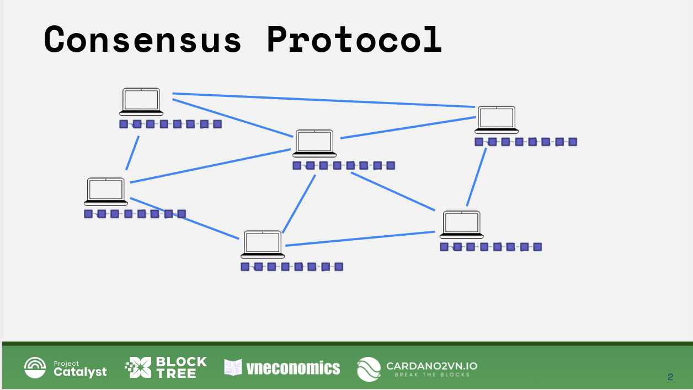
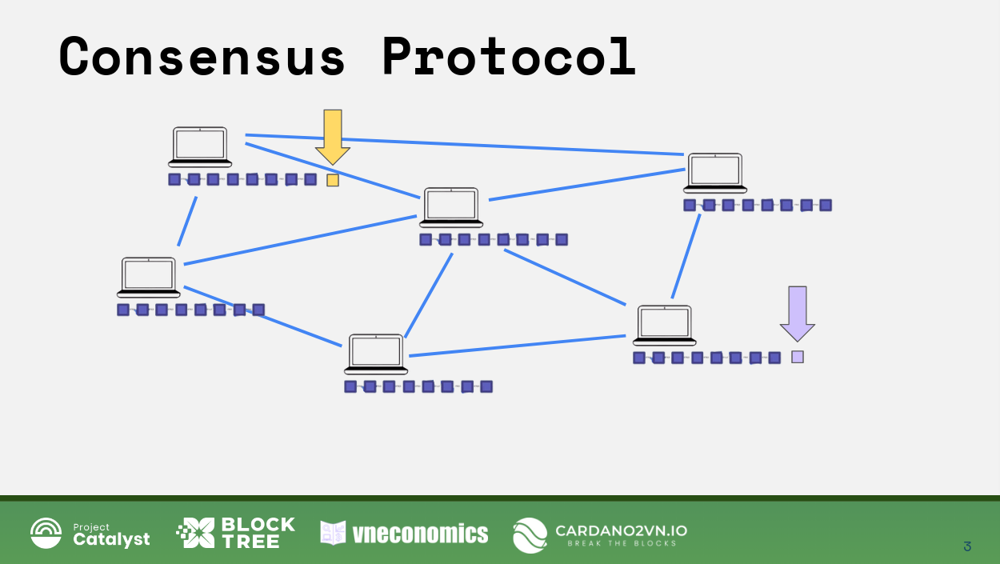
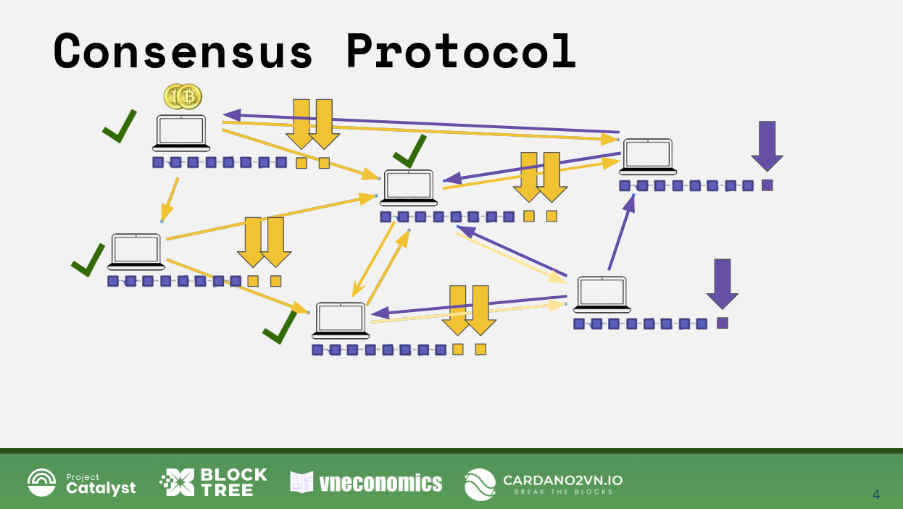
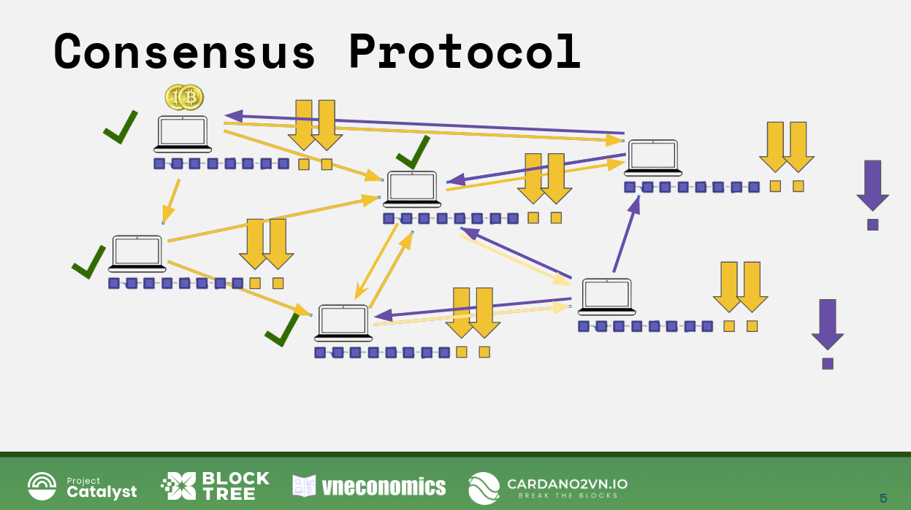
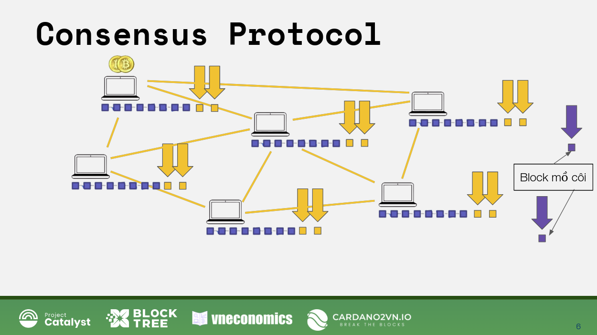
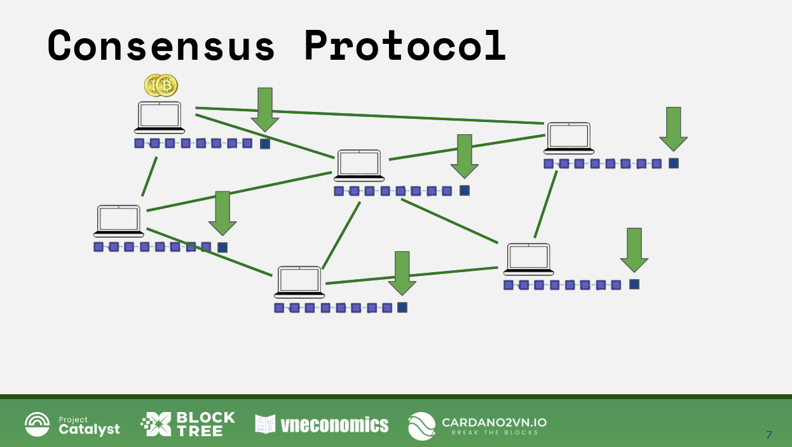
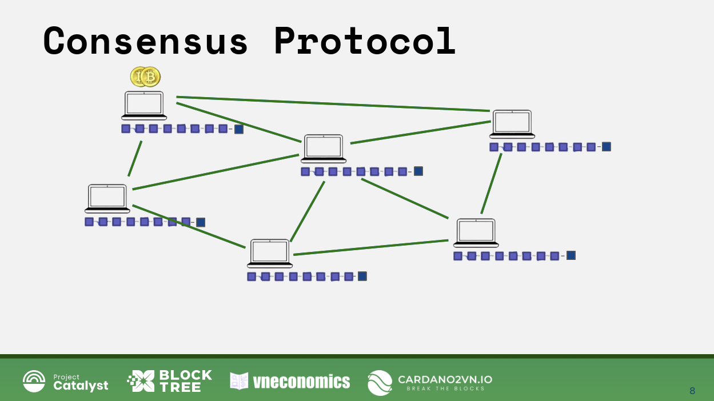
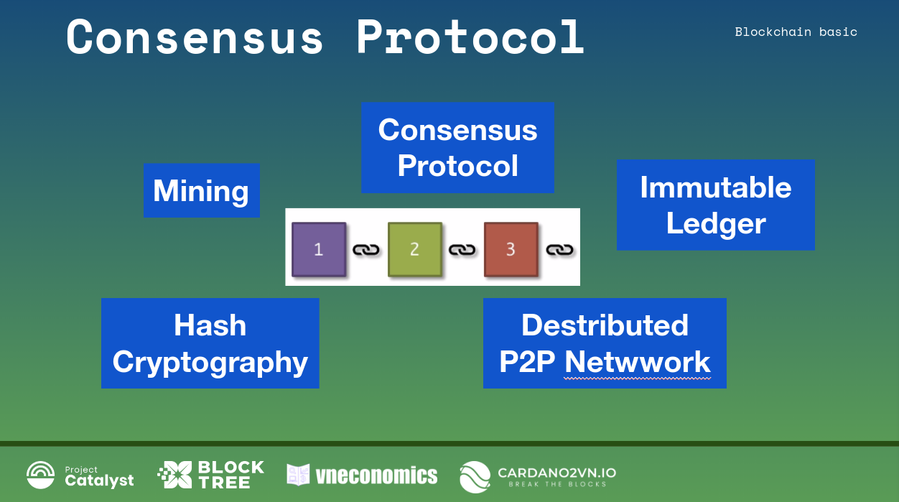
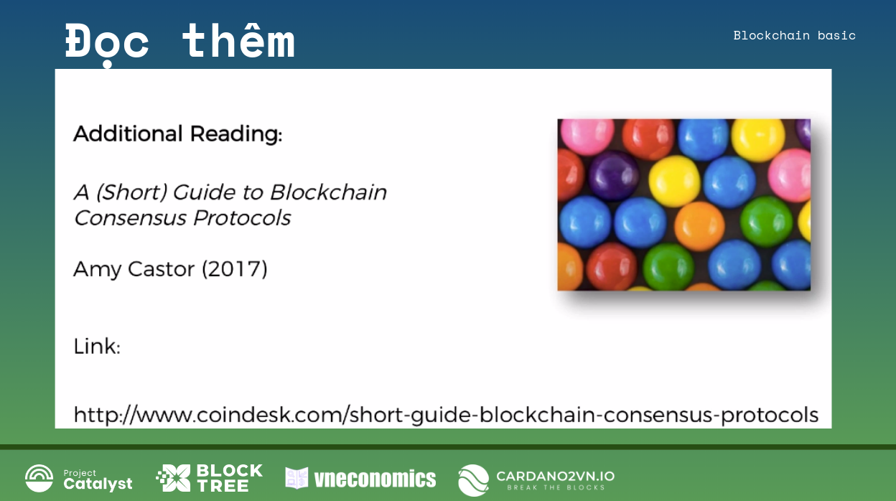

Consensus Protocol: POW-POS-DPOS
===================

Xin chào và chào mừng các bạn đã trở lại bài giảng ngày hôm nay trong khóa học về blockchain cơ bản này.
Hôm nay chúng ta nói về vấn đề thứ hai của Giao thức đồng thuận trên nền tảng Blockchain như chúng ta đã nói ở bài giảng trước.

Như bải giảng trước chúng ta đã thấy một mạng Blockchain bao gồm các máy tính hay nút đước nối với nhau như thế này. Chúng chuyền các thông điệp cho nhau như các giao dịch, dữ liệu hay các khối đã được xác thực.

Điều gì xảy ra khi chúng ta thêm một khối mới khi hai thợ mỏ khai thác một khối gần như cùng một lúc? Đúng rồi, hãy nói cùng một lúc, phải không nào?

Như vậy, bây giờ đột nhiên chúng ta có xung đột trong chuỗi khối. Làm thế nào là cuộc xung đột này sẽ được giải quyết? và giải quyết như thế nào. Chúng ta hãy có một cái nhìn tổng quát. Đây thực sự là nơi cần có giao thức đồng thuận để giải quyết vấn đề này để tìm ra đâu là khối được chọn và đi tiếp.

Điều này rất giống với bài toán của các vị tướng Byzantine mà chúng ta đã nói trước đây. Vì vậy, theo bài toán của vị tướng Byzantine, đây là khả năng chịu lỗi của Byzantine, nhưng điều này cũng rất giống với vấn đề của các vị tướng Byzantine.

Được rồi, vậy chuyện gì sẽ xảy ra? Ở đây, Nút này, khối này, vì nó đúng nên chúng ta sẽ cho rằng nó đúng, không có mục đích xấu hoặc bất cứ điều gì. Tất cả hai khối này đều đúng. Và khi đó nó sẽ được lan truyền qua một mạng lưới Blockchain. Vì vậy chúng được lan truyền hoặc chuyển tiếp qua các nút khác nhau của mạng.

Vì vậy, chúng ta hãy bắt đầu phân tích sự lan truyền khối này, Đầu tiên nó đã được chuyển tiếp đến các nút này. Nút này kiểm tra khối đó và chấp nhận khối đó. Cái này đã được chuyển tiếp ở đó. Và giống như chúng ta sẽ nghĩ ra trước đây, giống như kịch bản của chúng ta.
Vì vậy, trong kịch bản ví dụ của chúng ta có thể kết nối ở đây nhanh hơn.Những thứ này được lan truyền đầu tiên và cái này có lẽ là kết nối lâu hơn hoặc một cái gì đó. Vào thời điểm cái này đến đó đã có một số thứ xảy ra ở đây,và rồi cái này đến đây.
Về cơ bản, kết nối ở đây nhanh hơn, và giống như thông tin lan truyền ở đây nhanh hơn
hơn bên này. Vì vậy, đó chỉ là mục đích, vì lợi ích của mạng lưới. Tất nhiên, trong các chuỗi khối thực, con số này lớn hơn nhiều không phải là một mạng có bốn hoặc sáu nút như thế này. Như bạn biết đấy, Mạng Blockchain có hàng chục hoặc hàng trăm thậm chí hàng nghìn nút cùng hoạt động Và sau đó, bạn biết đấy, giống như khi họ rơi vào thời điểm xung đột nó không giống như ở đây một bên là hai nút một bên là bốn nút. Đó là một con số lớn hơn nhiều nhưng điều này vẫn truyền tải đúng mục đích của mạng lưới. Ví dụ này nó sẽ giúp chúng ta hiểu rõ ràng hơn.

Và bây giờ điều xảy ra là nút này và các nút này đang cố nói với nút này thêm khối mới màu cam này, nhưng nút này đang nói với những nút này. Không, bạn thêm khối màu tím. và bây giờ ở đây bạn thấy khối màu cam, hãy thêm khối màu cam, và nút này nói không, hãy thêm khối màu tím.

Cuối cùng, các kết nối đã đi qua.
Vì vậy, bạn có thể thấy chúng ta có một vấn đề thứ hai đã nói. Bạn thấy đấy nó rất giống với vấn đề của vị tướng Byzantine đó khi bạn đã nhận được các thông báo xung đột trên mạng lưới.

Vì vậy, đó là lý do tại sao chúng ta cần khả năng chịu lỗi của Byzantine. Được rồi, và chuyện gì sẽ xảy ra? giao thức đồng thuận trong chuỗi khối là gì?
Chúng ta nhớ lại với các tướng giao thức đồng thuận của họ là xem xét mức trung bình
của những gì bạn đang nhận được và trung bình của các thông tin mà bạn nhận được và sau đó quyết định làm, phải không?

Vì vậy, bạn biết đấy, giống như ai đó nói tấn công đồng thời người khác nói rút lui, và sau đó quyết định là tần công.

Bạn biết đấy, không lấy số trung bình mà lấy số đông, Nhìn vào phần lớn các tin nhắn mà bạn đang nhận được và sau đó quyết định.

Vâng, trong blockchain giao thức đồng thuận là khác nhau. trong blockchain các nút làm gì? có giống như các vị tướng Byzantine không?

Được rồi. Vậy là nút này đã có một khối màu tím, nút kia có một khối màu cam. Như vậy hiện tại trên mạng lưới tồn tại hai phiên bản, hai chuỗi khối. Vì vậy, chúng tôi đã có các chuỗi cạnh tranh. Những gì chúng ta sẽ làm là chúng ta sẽ chờ đợi và sẽ đợi cho đến khi một khối khác được thêm vào. 

Và lúc một khi khối khác được thêm vào là lúc chúng ta sẽ xem chuỗi nào dài hơn. Hãy hiểu theo nghĩa là chuỗi nào sẽ thêm một khối mới trước. Dẫy bên phải hay bên trái. Và sau đó ai thêm khối trước chuỗi đó sẽ thắng. Vì vậy, trong blockchain, thuật ngữ
hay câu nói "chuỗi dài nhất là Vua". Bất kỳ chuỗi nào có nhiều khối nhất cuối cùng sẽ giành chiến thắng và là chuỗi được đi tiếp.

Mấu chốt hay chìa khóa ở đây là một phần của mạng có sức mạnh băm cao nhất
cuối cùng sẽ tạo ra chuỗi dài nhất. Và rất dễ thấy trong ví dụ này, chúng ta có thể thấy rằng ở đây chúng ta có bốn máy tính hay 4 nút và bên phải chúng ta chỉ có hai nút.

Và giả sử chúng có sức mạnh băm như nhau cho mỗi máy tính, vậy sức mạnh băm về cơ bản là như thế nào. Bạn có thể kiểm tra bao nhiêu giá trị băm mỗi giây? Bạn biết đấy, nó có thể kiểm tra bao nhiêu giá trị băm và làm cách nào để nó có thể kiểm tra. 

Giả sử chúng có sức mạnh băm như nhau,  bên trái có sức mạnh băm gấp đôi so với bên phải này. Vì vậy, chuỗi màu cam có sức mạnh gấp đôi so với chuỗi màu tím. Có nghĩa là những nút này có cơ hội cao gấp đôi để tìm thấy block tiếp theo,  nghĩa là giải được câu đố mật mã nhanh nhất. Vì giải câu đố mật mã của của chuỗi khối là đều bình đẳng. Bạn chỉ cần tìm hàm băm chính xác cho khối.

Tóm lại, về mặt thống kê nhóm nút này có cơ hội cao hơn nhiều hoặc gấp đôi nhóm kia khi tìm khối tiếp theo trong chuỗi của chính, bất kể nó là gì. Giống như sắp có một khối để thêm vào chuỗi của họ vì có nhiều sức mạnh băm hơn.

Những bên này có ít cơ hội hơn.Và điều gì sẽ xảy ra theo thống kê hoặc xác suất thì một trong những máy tính ở chuỗi màu cam sẽ tìm được số Noned sớm nhất và sẽ đóng khối và sau đó khối này sẽ được lan truyền trên mạng Blockchain. Vì vậy các khối sẽ được chuyển đến từng nút trên toàn bộ mạng lưới của chúng, và bây giờ là lúc xung đột  sẽ được giải quyết. 

Bây giờ chúng ta có thể thấy rằng khối màu cam này, các  nút này, mạng này có chuỗi dài hơn, nó có thêm hai khối. Và bên này chỉ có một khối. Và điều sẽ xảy ra là những khối này sẽ bỏ sang một bên và các nút có khối màu tím bây giờ sẽ sử dụng khối màu cam. Như vậy toàn bộ mạng lúc này là có khối màu cam.

Vì vậy, "chuỗi dài nhất là vua". Và ngay lập tức kết luận quan trọng nhất ở đây là trong một chuỗi khối, thì giao thức đồng thuận có nghĩa là  51% sức mạnh băm
hoặc chỉ hơn 50% sức mạnh băm chuỗi khối đó là chuỗi đó sẽ thắng. Vì vậy, trong blockchain nó không giống như vấn đề của vị tướng Byzantine mà chúng ta đã nói về nó ở bài giảng trước đây. chúng phải có khoảng trên 70% đồng ý khi đó các tướng mới đi đến thống nhất và dành chiến thắng. 
Còn trong một chuỗi khối.... như bạn biết đấy nó tốt hơn nhiều, bạn chỉ cần 51% hay thậm trí trên 50% đồng ý hay có sức mạnh hàm băm là đi đến thống nhất. Và đó là những gì chúng ta vừa thảo luận ở trên, về cơ bản là vấn đề nói đến là xác suất và sức mạnh băm.

Do đó,  miễn là bạn có hơn 50% sức mạnh băm ở một bên đồng ý là bạn đạt được sự đồng thuận trong chuỗi khối. 

Như bạn có thể thấy, giao thức đồng thuận trong một chuỗi khối mạnh hơn giao thức đồng thuận trong bài toán tướng Byzantine.

Điều quan trọng cần lưu ý là đối với bài toán tướng Byzantine bạn cần hơn 70% trong khi đó trong chuỗi khối bạn cần trên 50% để đi đến thống nhất. Điều đó là  tính năng rất, rất  rất quan trọng. Là điều mạnh mẽ nhất , quan trọng nhất của chuỗi khối.

Vậy chúng ta dừng lại ở đâu? ...

yeah, đến đây xung đột này đã được giải quyết. Những khối này đi sang một bên, bạn biết đấy,  những khối này, bây giờ thực sự được gọi là các khối mồ côi.

Có, đây là những khối mồ côi mà người khai thác khai thác khối này ở thời gian trước. Điều gì xảy ra với họ, và thật không may,  phần thưởng của họ thực sự không được tính cho họ. Chỉ phần thưởng cho khối màu cam này mới có giá trị, rằng người khai thác đó đã nhận được thưởng. 
Và tất cả các giao dịch trong khối này khối màu tím chúng không còn giá trị nữa. Vì vậy, đó là lý do tại sao nó quan trọng trong blockchain để thực sự đợi cho đến khi một vài khối được thêm vào, để đảm bảo rằng các giao dịch của bạn đã được chấp nhận.

Vì vậy, một lần nữa, chúng ta sẽ nói nhiều hơn về những điều đó trong phần tiếp theo của khóa học. Nhưng đây là những gì nó xảy ra. Đây là cách thức hoạt động của giao thức đồng thuận và chỉ có thế. Tất nhiên sau đó chuỗi khối sẽ hoạt động bình thường.

Vâng, đúng rồi, nó đã là một điều bình thường và bạn biết đấy, các khối mới sẽ được khai thác và nó sẽ tiếp tục phát triển. Vì vậy, chúng tôi đã đi đến một sự đồng thuận về cơ bản. 

Vì vậy chúng ta sẽ tổng kết lại. Câu chuyện của chúng ta về các lĩnh vực khác nhau của blockchain. Chúng ta đã thảo luận về sổ cái bất biến, mạng P2P phân tán,
mật mã băm, khai thác và cuối cùng là giao thức đồng thuận.

Tôi thực sự hy vọng rằng bây giờ bạn có một nền tảng tốt. Bạn có thể thấy, bạn có thể cảm thấy rằng bạn có một nền tảng tốt của các chuỗi khối và bạn cảm thấy tự tin khi đi sâu vào nghiên cứu mạng Blockchain.

Tôi không biết, nếu có một cuộc tranh luận, một cuộc tranh luận sôi nổi với mọi người đang nói về chuỗi khối và giờ đây bạn có thể mang lại sự rõ ràng và giải thích mọi thứ thực sự hoạt động như thế nào, và bạn cũng tự tin vào việc Blockchain đi vào các cuộc sống thực tế sẽ xuất hiện rất, rất sớm.

Và để kết thúc bài giảng ngày hôm nay, Bạn nên đọc thêm điều này thực sự thú vị. Bạn thực sự có thể đọc email của Satoshi Nakamoto với những người như Hal Finney, Charles Jackson, Ray Dillinger và James Donald và một vài người khác.
Vì vậy, nếu bạn vào trang web này, một lần nữa, đây sẽ là liên kết sẽ có trong ghi chú cho khóa học. Nếu bạn vào đó, bạn sẽ có thể tìm thấy các email và nhấp vào chúng và xem những gì họ nói. Và sau đó là email cụ thể này. 

Nếu bạn vào  liên kết này, bạn sẽ đi thẳng đến email này. Bạn sẽ thấy anh ấy nói về vấn đề của vị tướng Byzantine. Anh ấy đặt một cách hài hước như hack wifi nhưng về cơ bản trong thuật ngữ của blockchain, đọc rất thú vị như đã nói ở  bài viết về các giao thức đồng thuận blockchain.
Đó là một bài ngắn và chỉ cung cấp một cái nhìn tổng quan về những giao thức đồng thuận khác tồn tại ở đó cho các chuỗi khối, điều này cũng có thể rất hữu ích.

Cảm ơn bạn rất nhiều vì đã ở đây và nghiên cứu bài giảng này của chuỗi khối.
Tôi mong được gặp lại bạn ở đây lần sau. Xin chào  anh chị em và các bạn, hẹn gặp lại các bạn ở bài giảng tiếp theo.
