Hà nội - Cardano Summit 2023
=======================================

Được sự nhất trí của Cardano Foundation và của Trường Đại học Giao thông vận tải. Ngày 4/11/2023 Khoa Công nghệ thông tin - Trường Đại học Giao thông vận tải và Cardano Foundation Việt Nam long trọng tổ chức “Cardano Summit 2023, Hà Nội”. 
Hội nghị là nơi quy tụ những cá nhân và chuyên gia hàng đầu trong lĩnh vực Blockchain.  Hội nghị trao đổi, thảo luận về những đổi mới, các thành tựu, cơ hội nghề nghiệp trong lĩnh vực blockchain nói chung, và đặc biệt là nền tảng Blockchain Cardano nói riêng. Hội nghĩ đã thành công tốt đẹp. 

Tham dự “Cardano Summit 2023 Hà nội” gồm có:

**Về phía lãnh đạo Trường ĐH Giao Thông vận tải, chúng tôi xin trân trọng giới thiệu :**

1. PGS. TS. Nguyễn Văn Long - Chủ tịch Hội đồng trường
2. TS. Hoàng Văn Thông - Trưởng Khoa Công nghệ thông tin
3. TS. Nguyễn Đức Dư	Giám đốc Trung tâm Thư viện - trường Đại Học Giao Thông Vận Tải    
    
**Về phía Quý đại biểu các Trường đại học**

1. TS. Phùng Văn Đông	Giám đốc Viện Công nghệ Châu Á - AIT tại Việt Nam
2. TS. Đỗ Ngọc Minh	          Chủ tịch liên minh Blockchain trong các Trường Đại Học
3. Th.S Trinh Văn Chung	Giám đốc Viện Công Nghệ Devmaster, Phó Trưởng khoa, Phụ trách khoa CNTT - Đại học Nguyễn Trãi
4. Thầy Nguyễn Hoàng Chiến-	  Bí thư chi bộ khoa CNTT -Trường Đại học Kinh tế - Kỹ thuật Công nghiệp
5. Cô Lê Thị Thu Hiền	Bí- thư liên chi đoàn khoa CNTT- Trường Đại học Kinh tế - Kỹ thuật Công nghiệp
6. PGS. TS. Ngô Hồng Sơn	Trưởng khoa Công Nghệ Thông Tin, Trường Đại Học Phenikaa, Chủ tịch hội phần mềm nguồn mở Việt Nam VFOSSA
7. TS Phạm Văn Khánh	NCV viện CNTT - Viện Hàn lâm KHTN

**vĐặc biệt Về phía Qúy đơn vị là nhà tài trợ đồng hành cùng chương trình:** 

1. Phòng họp  Eastern Townhall, Cardano
2. Khoa CNTT- Trường ĐHGTVT, 
3. Nền tảng công nghệ kết nối người trồng rừng và nhà tài trợ tại châu á Blocktree.asia
4. Nền tảng kết nối người làm việc với doanh nghiệp  -Proskills39
6. Nền tảng game trên chuỗi khối  - ADAbet
7. Nền tảng cung cấp video đơn giản hóa kiến thức kỹ thuật bằng hình ảnh– Whiteboard Cardano.

**Cùng sự tham gia của các công ty,  nhóm cộng đồng:**

Công ty Sotatek
Công ty SmartOSC
Công ty Kreate
Cộng đồng FIMI
Cộng đồng Cardano2vn
Cộng đồng vcoincheck

**Cùng nhiều giảng viên, sinh viên từ các trường đại học lớn trong Liên minh Blockchain trong trường đại học UBA:**

Trường ĐH GTVT, Trường ĐH Kinh tế kỹ thuật và công nghiệp, Trường ĐH Công nghiệp Hà Nội, Trường ĐH Tài nguyên và mội trường Hà Nội, Trường ĐH Công nghệ Đông Á, Trường ĐH Nguyễn Trãi, Trường Đại học Công nghệ  - ĐH Quốc gia Hà Nội, Trường ĐH Kinh tế quốc dân, Trường ĐH Thủy Lợi, Trường ĐH Sư phạm Hà Nội đã đến tham dự hội nghị 

Tham dự chương trình còn có sự góp mặt của các thành viên cộng đồng Cardano Việt Nam

Sau hơn 4h làm việc khẩn trương nghiêm túc, hội nghị đã thành công tốt đẹp.
Thay mặt Ban tổ chức, chúng tôi xin chân thành cảm ơn các diễn giả, các nhà khoa học, các giảng viên, sinh viên của các trường đại học, học viện, các thành viên của các dự án, cộng đồng Cardano Việt Nam, các em sinh viên tình nguyện, các bộ phận hỗ trợ đã giúp chúng tôi tổ chức Hội nghị thành công.

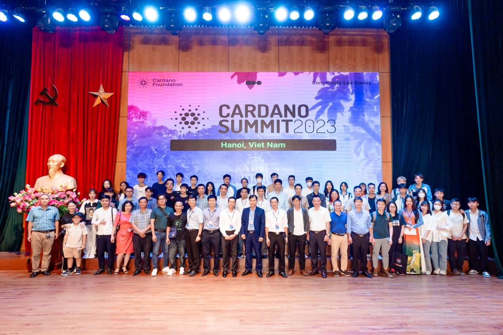

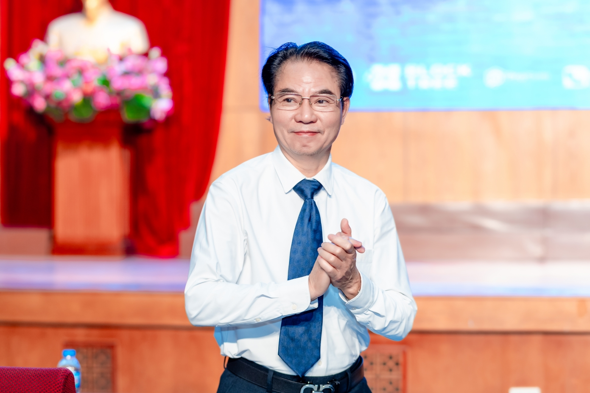

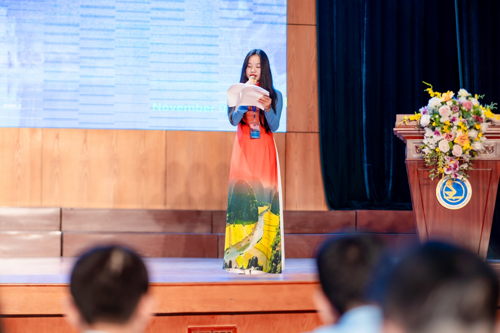

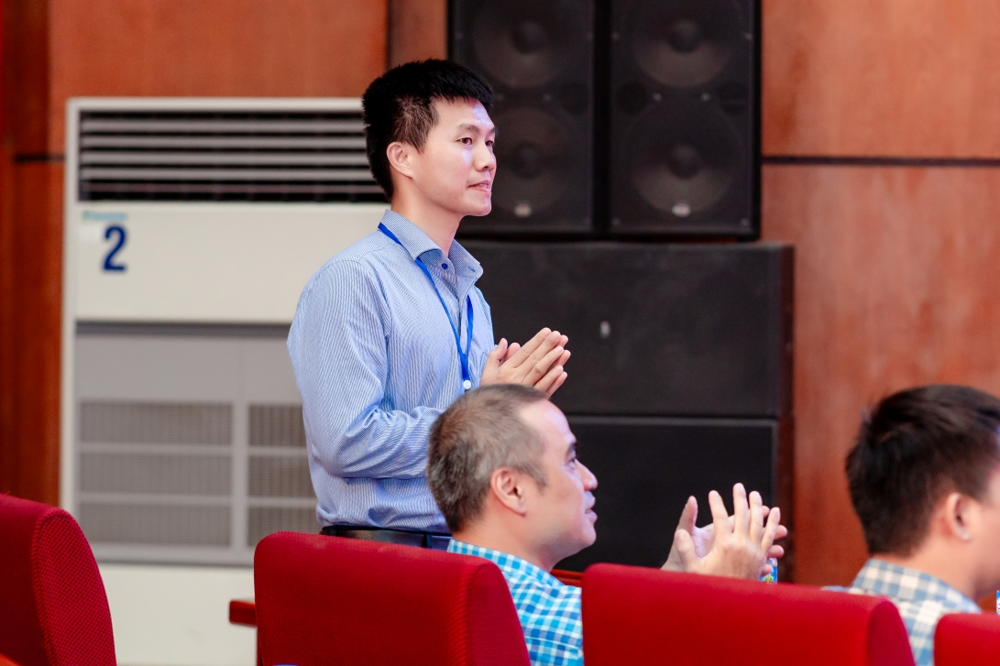

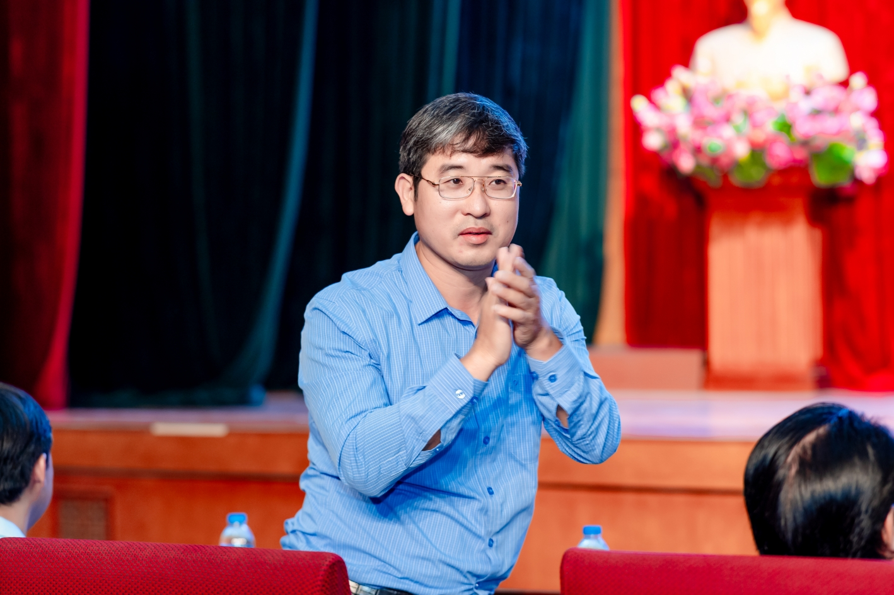

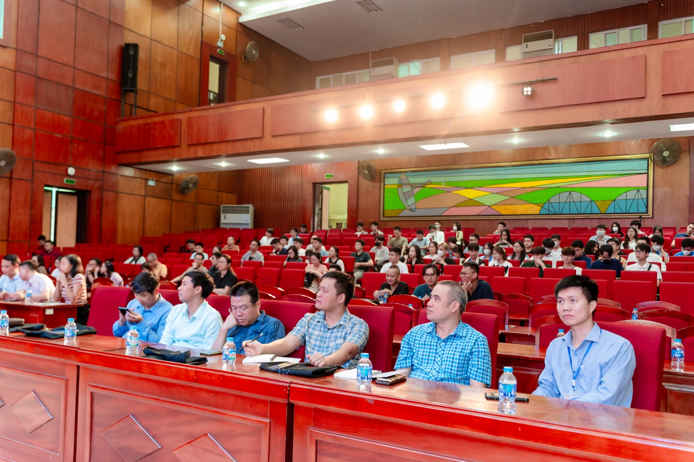

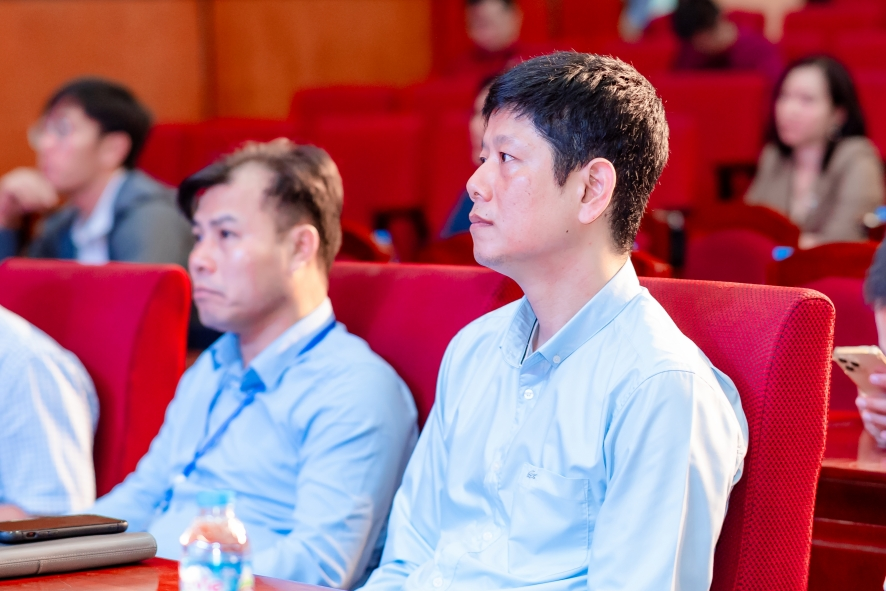

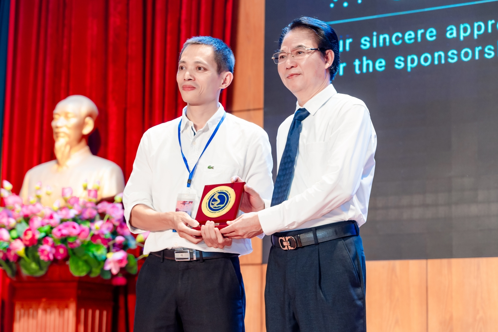

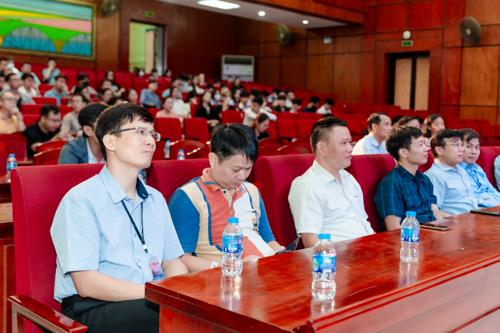

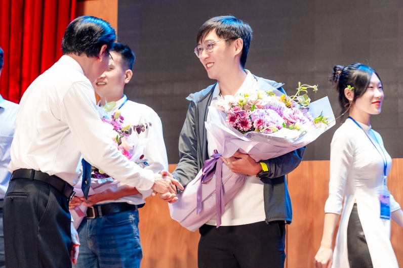

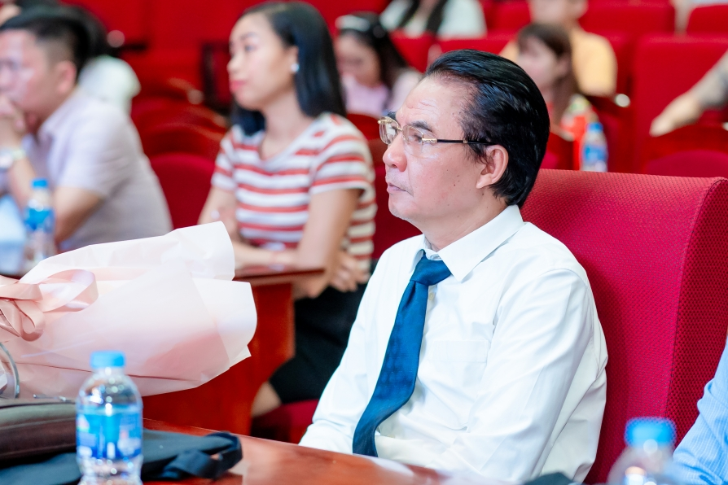

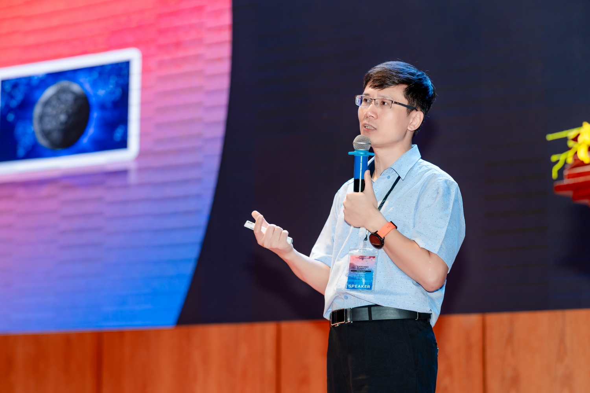

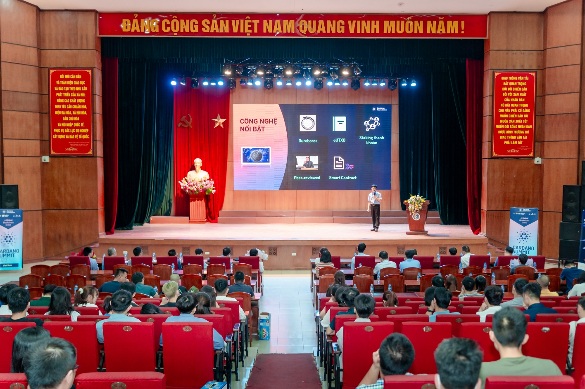

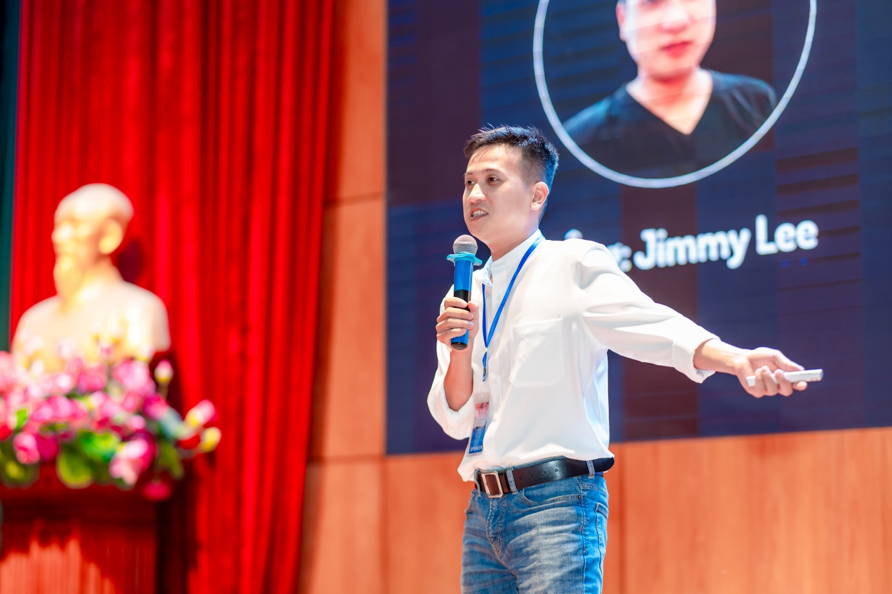

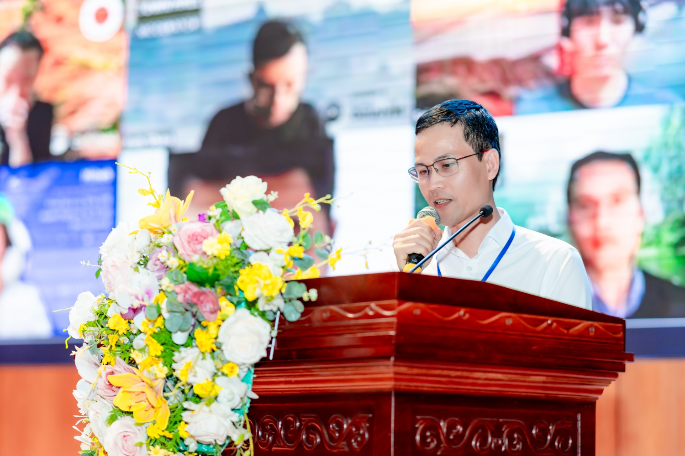

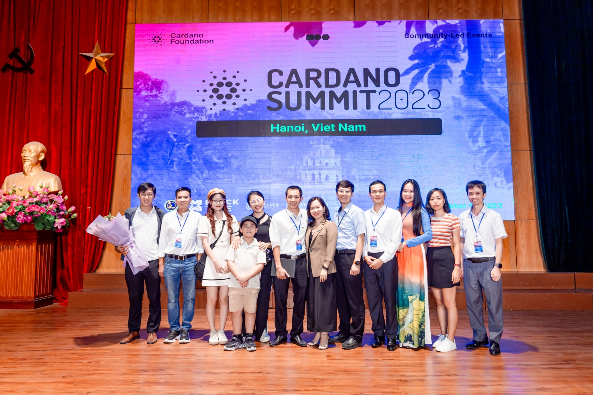

------------------

👉Cardano2vn - Mang Cardano về Việt 
Nam Website: https://cardano2vn.io/ 

👉Trao đổi về ngôn ngữ lập trình Smartcontract - Plutus, Marlove trên Cardano
Telegram: https://t.me/cardano2vn 

👉Video bài giảng về lập trình trên Cardano
Youtube: https://www.youtube.com/channel/UCJTdAQPGJntJet5v-nk9ebA 
