HỘI THẢO KHOA HỌC BLOCKCHAIN, TIỀM NĂNG VÀ ỨNG DỤNG TRONG NỀN KINH TẾ SỐ DO ITCI-ĐẠI HỌC ĐÔNG Á VÀ UBA TỔ CHỨC
==========

Vào ngày 11/5, Viện Đào tạo & Hợp tác Quốc tế đã tổ chức sự kiện Hội thảo khoa học với chủ đề "BLOCKCHAIN, TIỀM NĂNG VÀ ỨNG DỤNG TRONG NỀN KINH TẾ SỐ", với sự tham gia và trình bày báo cáo của nhiều giáo viên đang công tác tại Trường Đại học Công nghệ Đông Á và Liên minh Blockchain trong các trường đại học - UBA (University Blockchain Alliance).

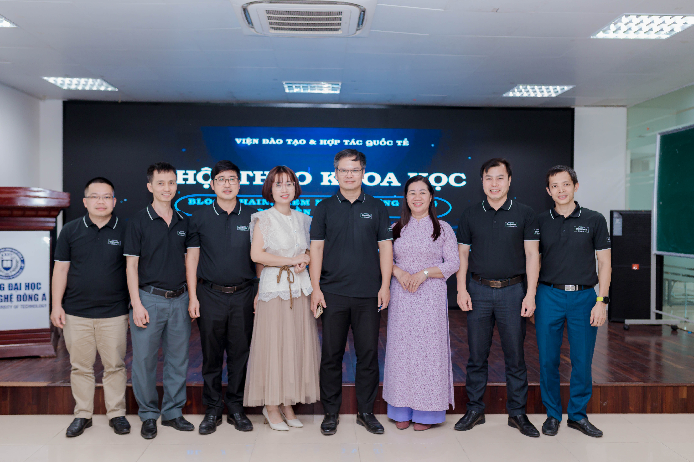

✨ Blockchain là một công nghệ hiện đại và có tiềm năng lớn cho nền kinh tế số, là một công cụ mạnh mẽ có thể tạo ra những thay đổi tích cực trong cách chúng ta thực hiện giao dịch, quản lý dữ liệu và xây dựng hệ thống kinh tế bền vững và minh bạch hơn.

✨ Tại Hội thảo, chúng ta rất vinh dự được lắng nghe các bài thuyết trình từ nhiều diễn giả với các đề tài đang rất nổi bật hiện nay, trong đó UBA đã trình bày 2 báo cáo:

Báo cáo 1: ["Blockchain, tiềm năng và ứng dụng trong nền kinh tế số"](https://youtu.be/OuidDleJqj8) - TS. Đỗ Ngọc Minh - Chủ tịch Liên minh Blockchain trong các trường Đại học (UBA – University Blockchain Alliance)

Báo cáo 2: [“Các tiêu chí quan trọng của một nền tảng Blockchain”](https://youtu.be/8CHBLYS1SUg) - ThS. Nguyễn Anh Tiến, đại diện đến từ Liên minh UBA.

Báo cáo 3: "Ứng dụng Blockchain trong nhật ký sản xuất nông nghiệp" - ThS. Ngô Thị Hoa; và ThS. Nguyễn Đức Thiện (Khoa Công nghệ Thông tin, Trường Đại học Công nghệ Đông Á)

Báo cáo 4: “Ứng dụng Blockchain trong kế toán và kiểm toán” - TS. Nguyễn Thị Hà - Giám đốc Trung tâm Hướng nghiệp và Hợp tác doanh nghiệp, Trường Đại học Công nghệ Đông Á

Báo cáo 5: "Blockchain in SMC. Recommendations to Vietnam" - ThS. Lê Thị Minh Hồng - Giảng viên tại Viện Đào tạo & Hợp tác quốc tế.

❤ Buổi hội thảo đã diễn ra sôi nổi và nhận được sự đóng góp ý kiến, trao đổi từ các chuyên gia trong lĩnh vực này, nhằm làm cho các nghiên cứu trở nên hoàn thiện hơn.

Dưới đây là một số hình ảnh tại buổi hội thảo:

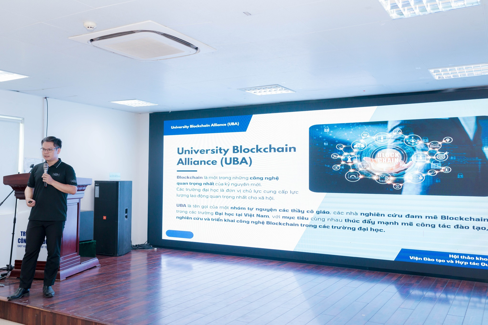

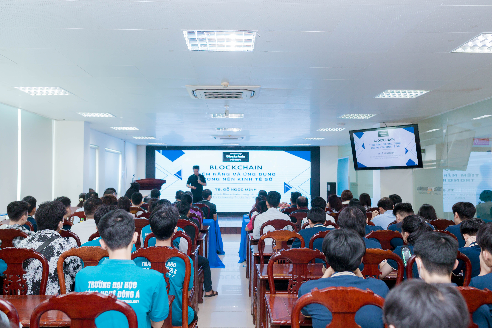

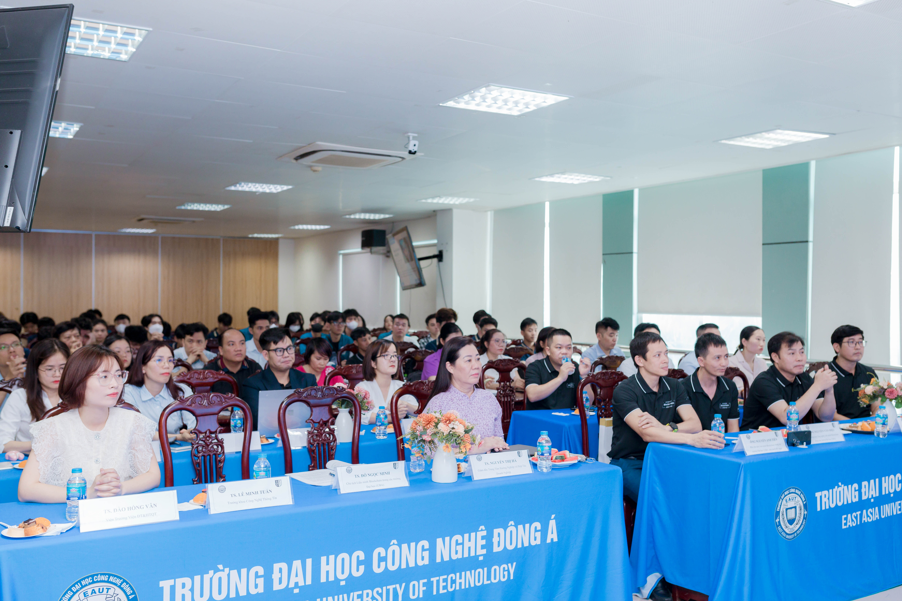

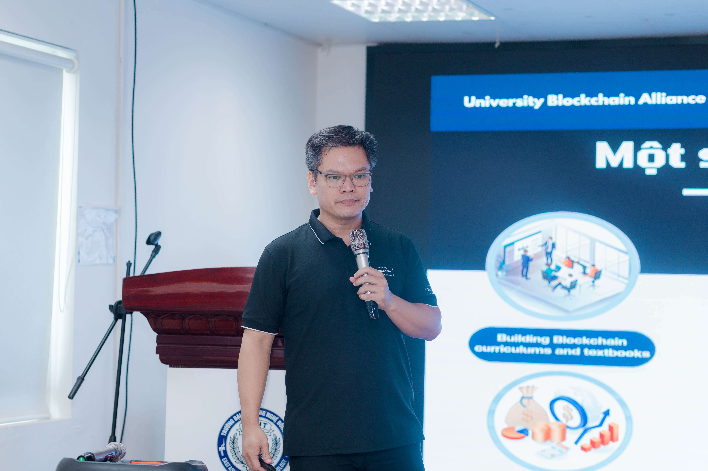

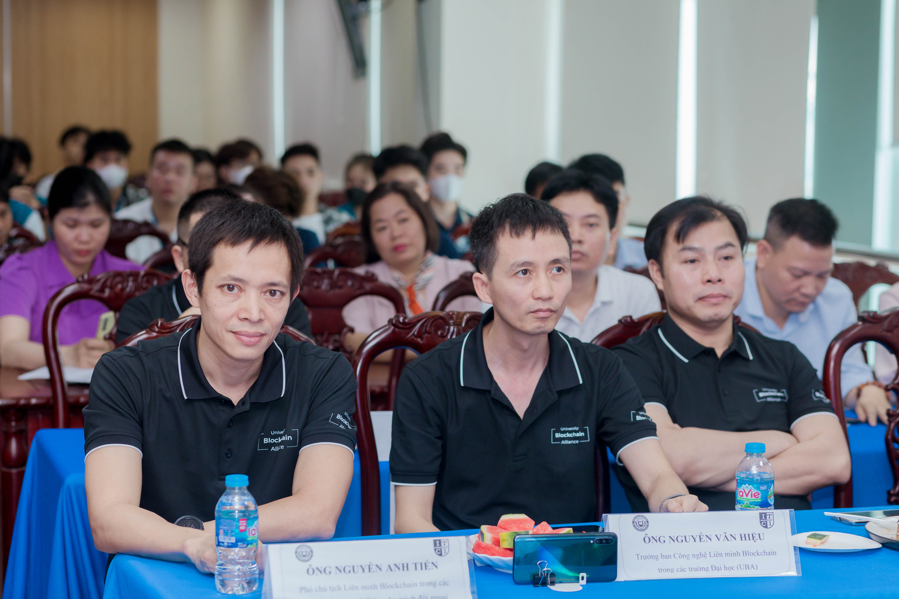

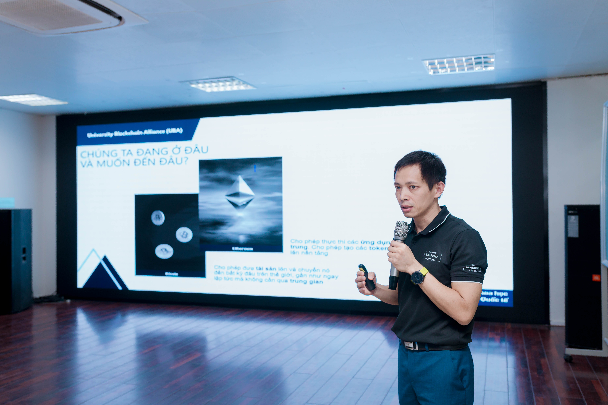

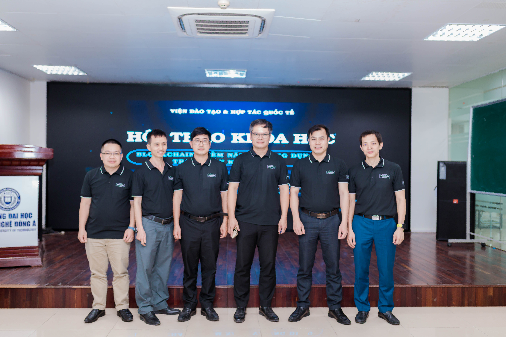

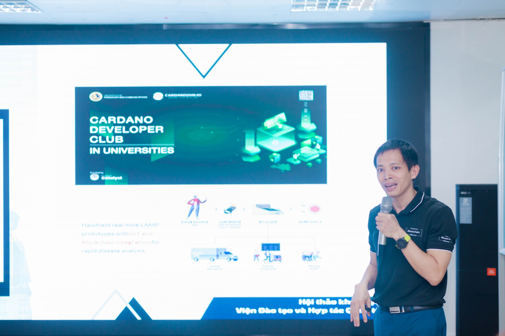

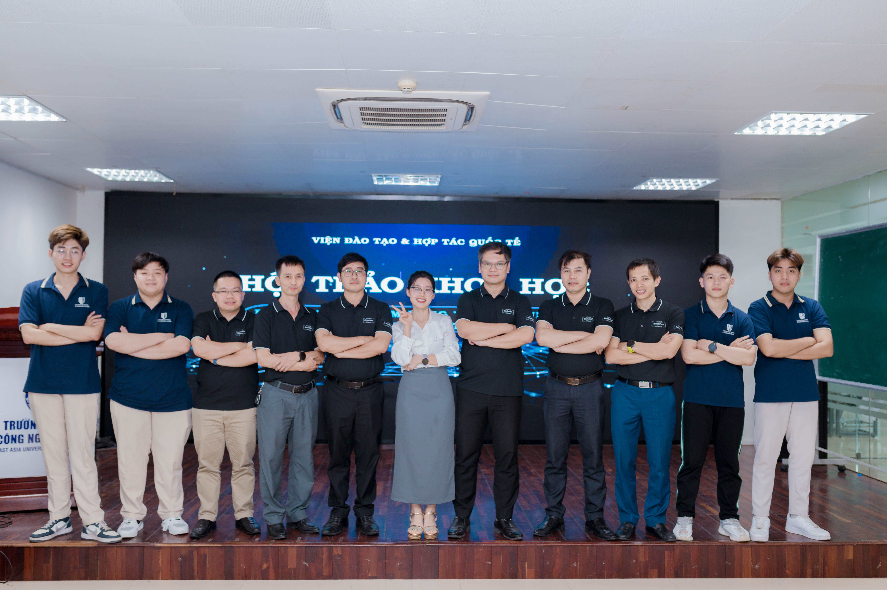

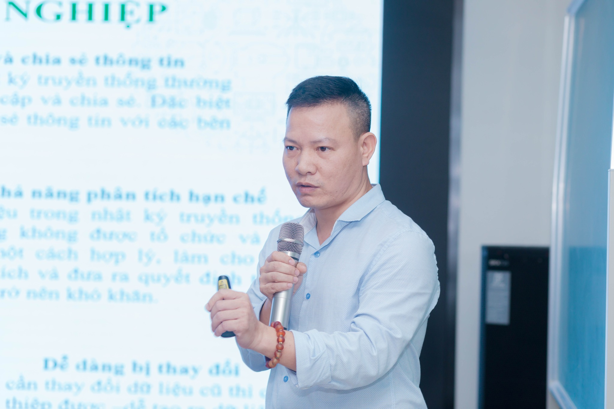

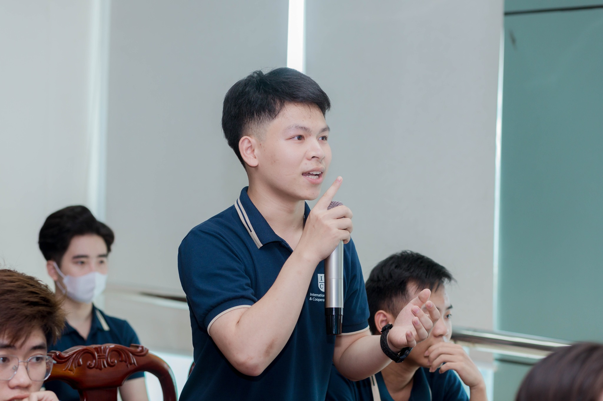

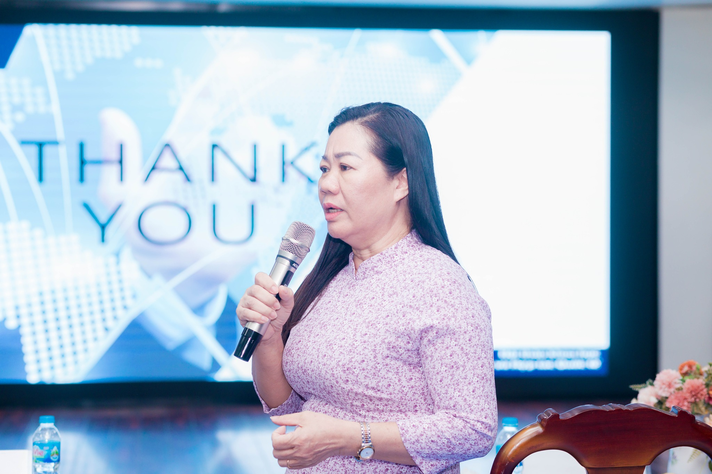

