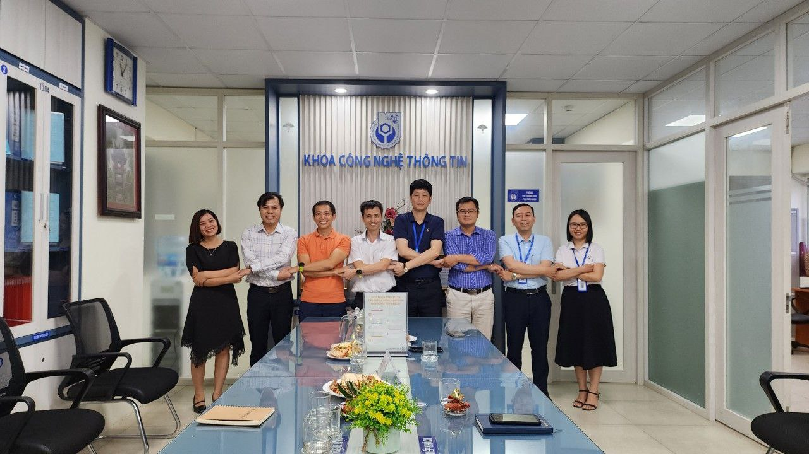
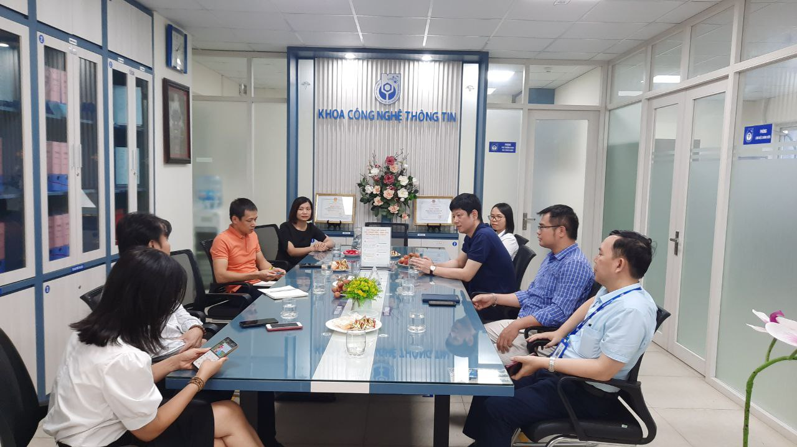
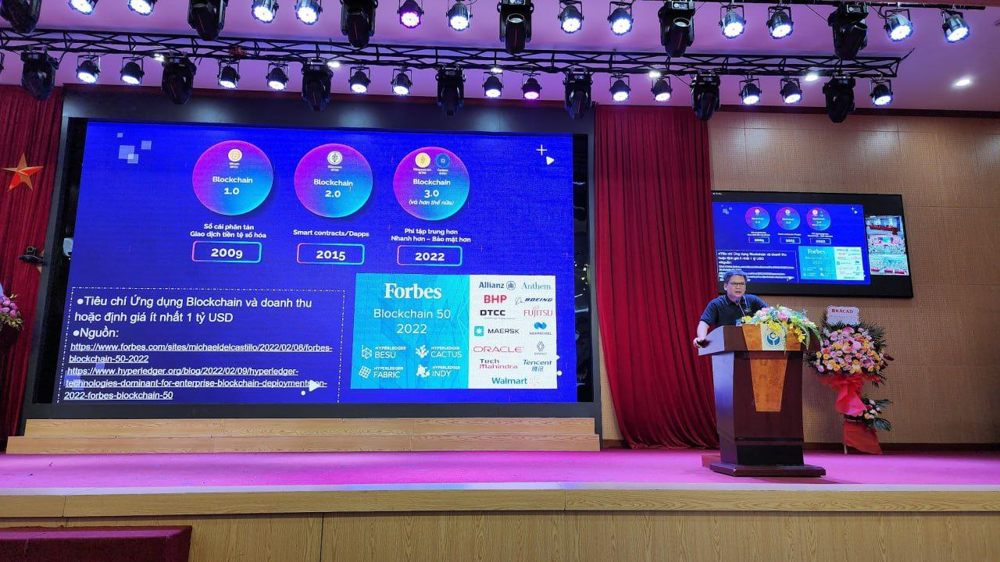
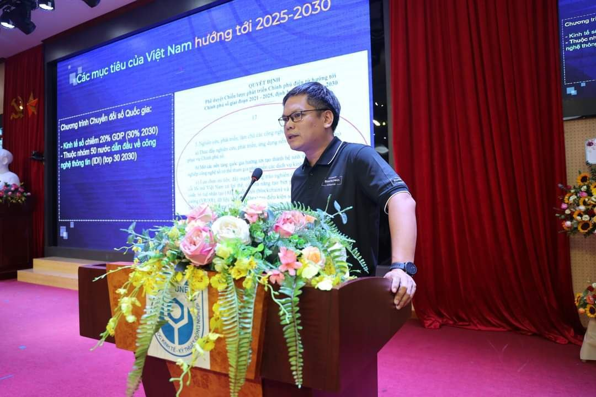
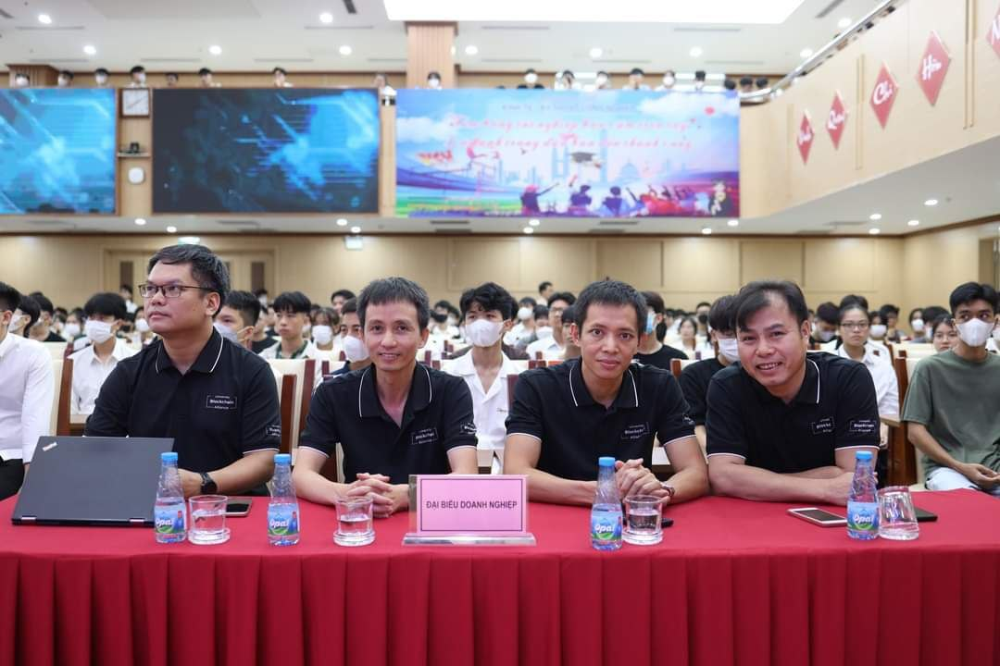
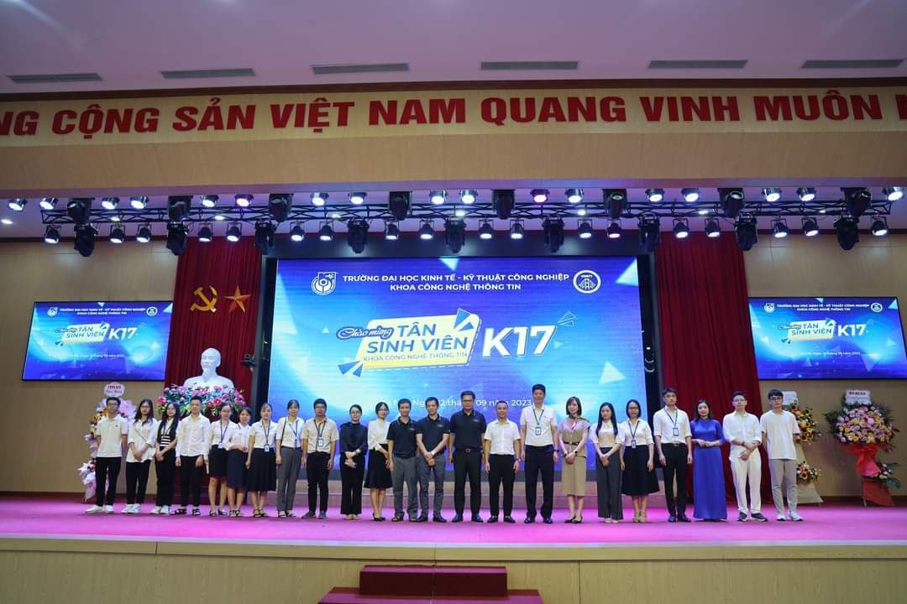
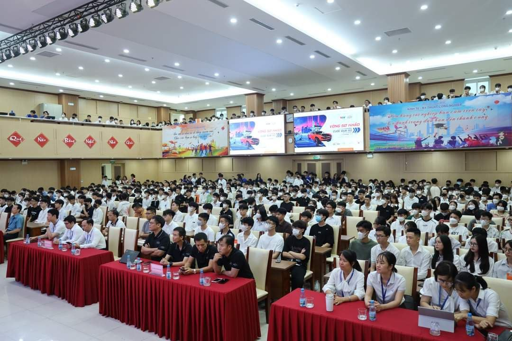
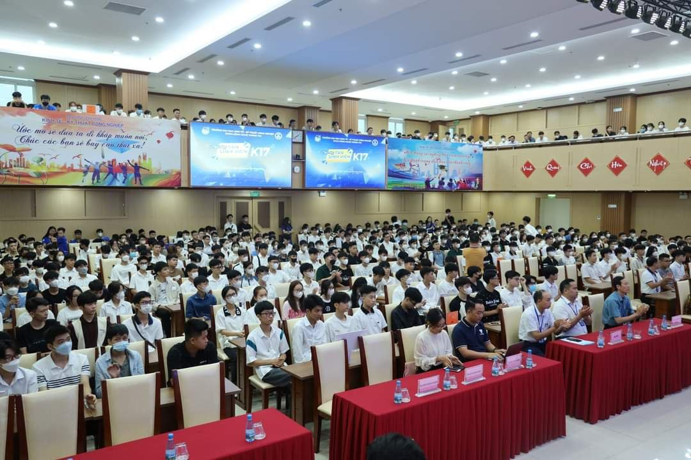
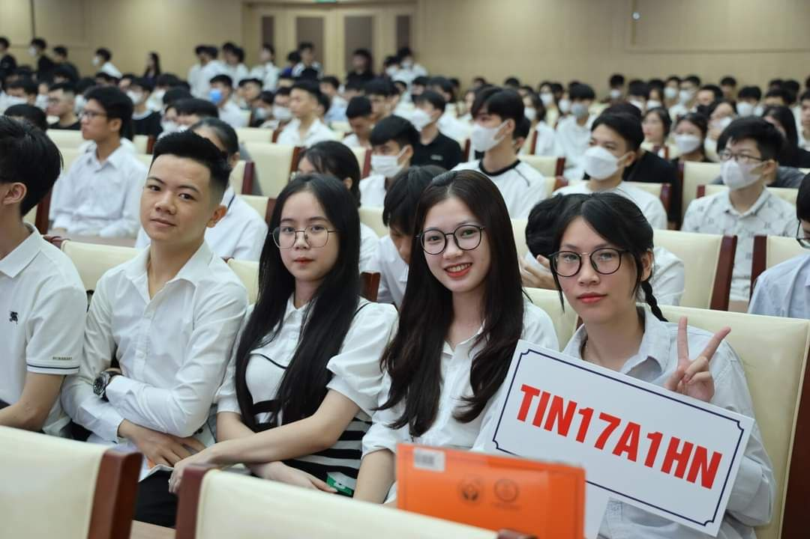

Cardano2vn đông hành cùng Đại học NUETI
==========

## 1. Kickoff
Ngày 15 tháng 6 năm 2023, Cardano2vn và UBA làm việc với các thầy cô giảng viên khoa công nghệ thông tin Trường Đại học Kinh tế Kỹ thuật Công nghiệp về việc đưa Blockchain và Quỹ Catalyst vào trường đại học và giảng dậy cho sinh viên.

**Tại buổi trao đổi Thầy Nguyễn Hoàng Chiến chủ nhiệm khoa cho biết khoa đang đào tạo trên 4000 sinh viên các ngành, hiện tại khoa có cơ sở vật chất rất đầy đủ gôm nhiều phòng máy tính, phòng hệ thống mạng đủ để đào tạo và kết luận trước mắt Cardano2vn chia sẻ cho các giảng viên về Blockchain đặc biệc là Blockchain Cardano, quỹ Catalyst và tường bước giảng dậy cho sinh viên ngành Công nghệ thông tin và các ngành liên quan**

## 2. Chào đón tân sinh viên khoa CNTT 2023-2024

🎊 "UBA và C2VN ĐỒNG HÀNH CÙNG UNETI - CHÀO TÂN SINH VIÊN K17 - KHOA CÔNG NGHỆ THÔNG TIN" 🎊

💐 Vào ngày 12/09, C2VN rất tự hào được tham gia và đồng hành cùng tân sinh viên khóa K17 - Khoa Công nghệ thông tin tại Trường Đại học Kinh tế - Kỹ thuật Công nghiệp. Đây là một ngày vô cùng trọng đại cho cả UBA và C2VN khi chúng ta được đồng hành và hỗ trợ các bạn trẻ trong hành trình học tập và phát triển tương lai của họ.

🌷 Buổi lễ chào tân sinh viên K17 - Khoa Công nghệ thông tin UNETI đã diễn ra với sự tham gia đầy ấn tượng của các lãnh đạo nhà trường và khoa, cùng với sự hiện diện đáng quý của nhiều doanh nghiệp đối tác của khoa. Những bài phát biểu đầy ý nghĩa và những lời chúc tốt đẹp từ phía lãnh đạo và doanh nghiệp đã lan tỏa niềm tin và động viên tới tất cả các bạn tân sinh viên trên con đường chinh phục những hoài bão và khát vọng mới.

🌺 Trong khuôn khổ chương trình, ông Đỗ Ngọc Minh, đại diện từ UBA, đã có bài phát biểu chia sẻ về xu hướng phát triển nền kinh tế số, đặc biệt là về Blockchain và trí tuệ nhân tạo (AI), hai lĩnh vực quan trọng và hứa hẹn của tương lai.

🤝 Chúng tôi xin trân trọng chúc mừng Trường Đại học Kinh tế - Kỹ thuật Công nghiệp và gửi lời chúc tốt đẹp nhất tới tất cả các tân sinh viên. Chúng tôi hy vọng rằng các bạn sẽ trải qua những tháng năm đầy sáng tạo và thành công tại mái trường UNETI. Chúc cho sự hợp tác giữa UBA, C2VN và Trường Đại học Kinh tế - Kỹ thuật Công nghiệp ngày càng mạnh mẽ và thân thiết hơn trong tương lai.

Dưới đây là một số hình ảnh tại buổi lễ.

