Chia sẻ về việc khới nghiệp trong trường đại học với Blockchain
==========
Theo kế hoạch đã được thống nhất giữa UBA(Cardano2vn) và Khoa CNTT trường Đại học Kinh tế Kỹ thuật Công nghiệp, cũng như lịch trình được đăng tải trên Meetup , ngày 29/06/2023, hai bên đã phối hợp tổ chức buổi seminar với chủ đề “Blockchain, Trí tuệ nhân tạo và tinh thần khởi nghiệp trong trường đại học.”

Hơn 30 giảng viên từ một số khóa trong trường Đại học và các thành viên từ UBA đã tham gia sự kiện này.

## 1. Nội Dung:

- Giới thiệu về UBA.
- Thực trạng khởi nghiệp trong trường đại học hiện nay.
- Project Catalyst - Tiềm năng và cơ hội cho startup.
- Singularity.NET - Nuôi dưỡng ý tưởng về AI và ML.
- Làm thế nào chúng tôi có thể hỗ trợ bạn.
- Chia sẻ của một số đề tài nghiên cứu khoa học của Nhà trường.

  <iframe width="940" height="515" src="https://www.youtube.com/embed/hUL7_cHkSY4" title="Bring smart contract to Vietnam - Func6 - Catalyst" frameborder="0" allow="accelerometer; autoplay; clipboard-write; encrypted-media; gyroscope; picture-in-picture" allowfullscreen></iframe>

## 2.Dưới đây là một số hình ảnh của buổi chia sẻ.

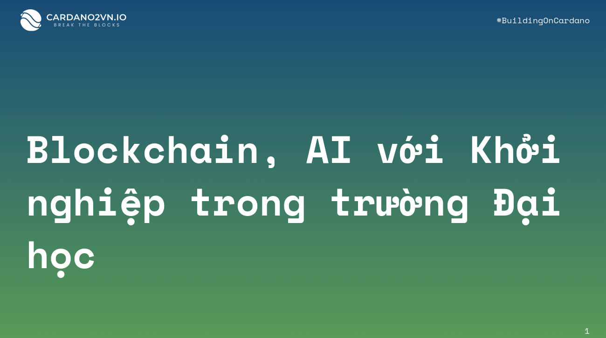

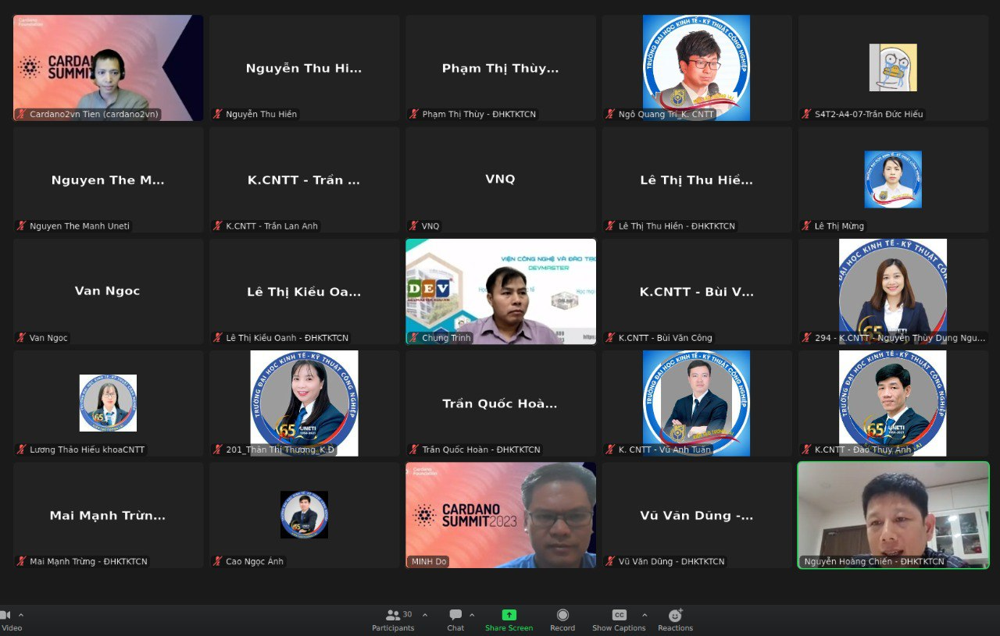

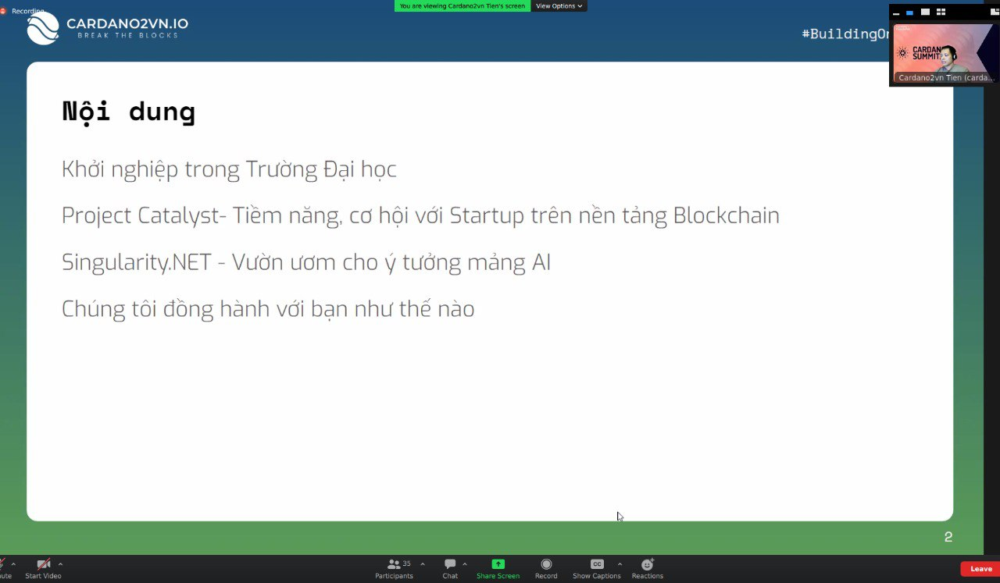

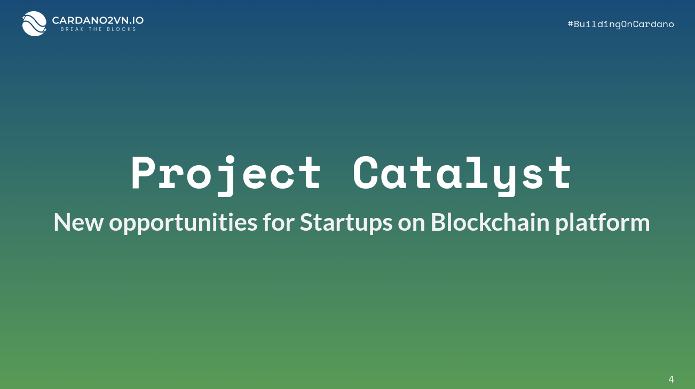

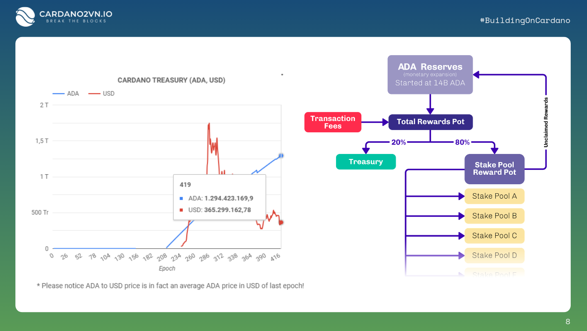

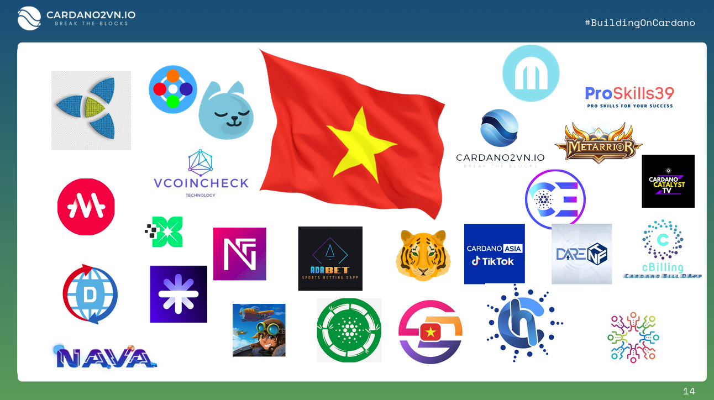

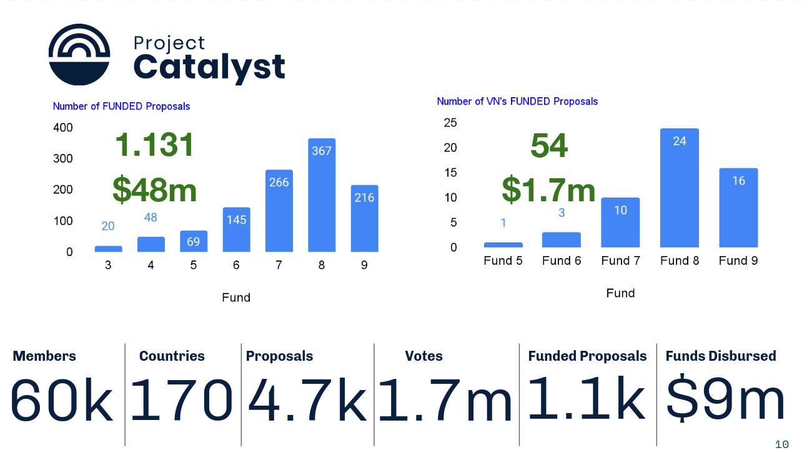

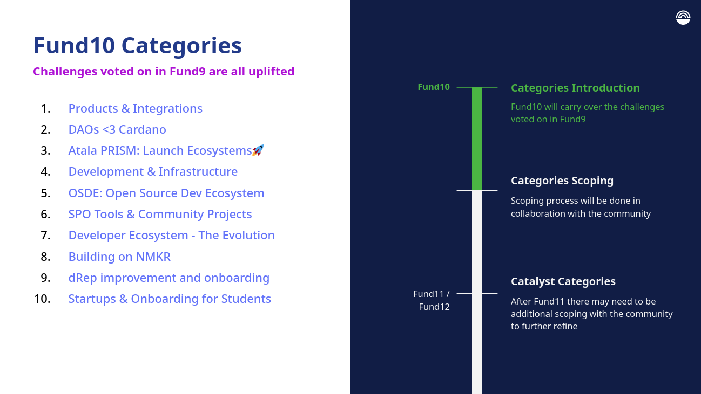

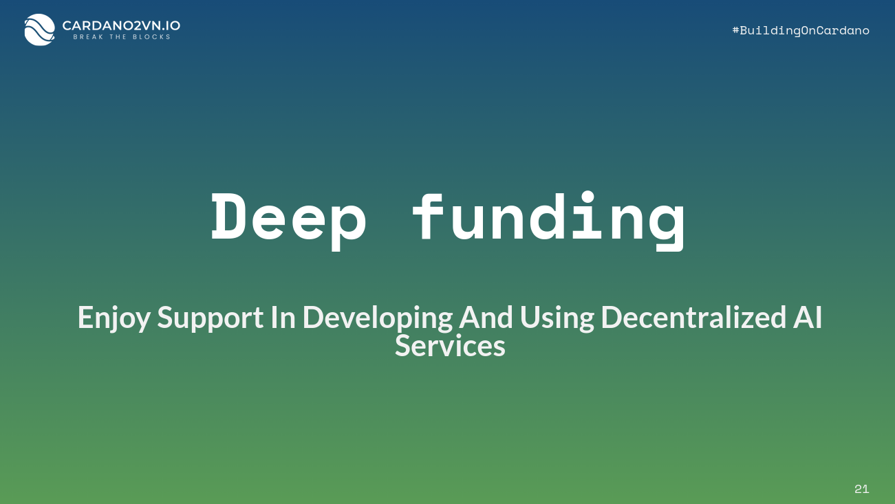

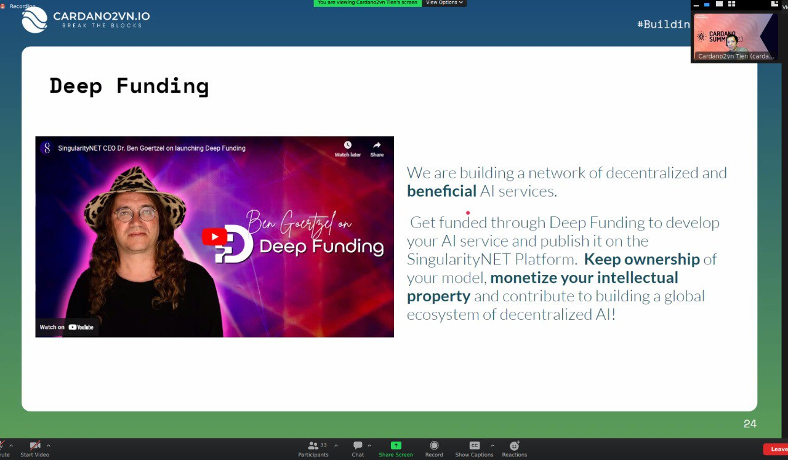

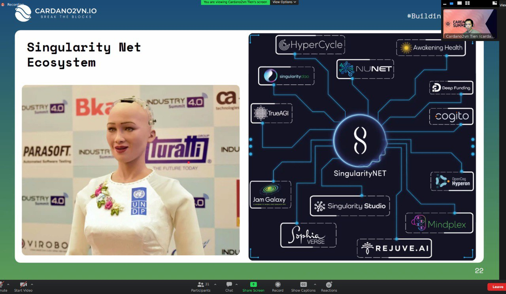

------------------

👉Cardano2vn - Mang Cardano về Việt 
Nam Website: https://cardano2vn.io/ 

👉Trao đổi về ngôn ngữ lập trình Smartcontract - Plutus, Marlove trên Cardano
Telegram: https://t.me/cardano2vn 

👉Video bài giảng về lập trình trên Cardano
Youtube: https://www.youtube.com/channel/UCJTdAQPGJntJet5v-nk9ebA 
