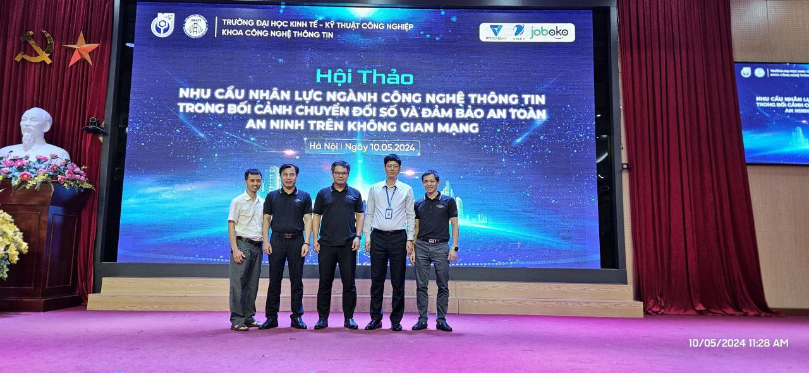
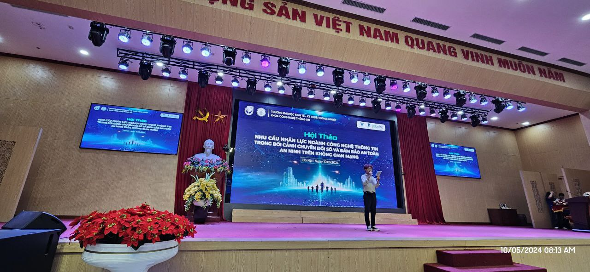
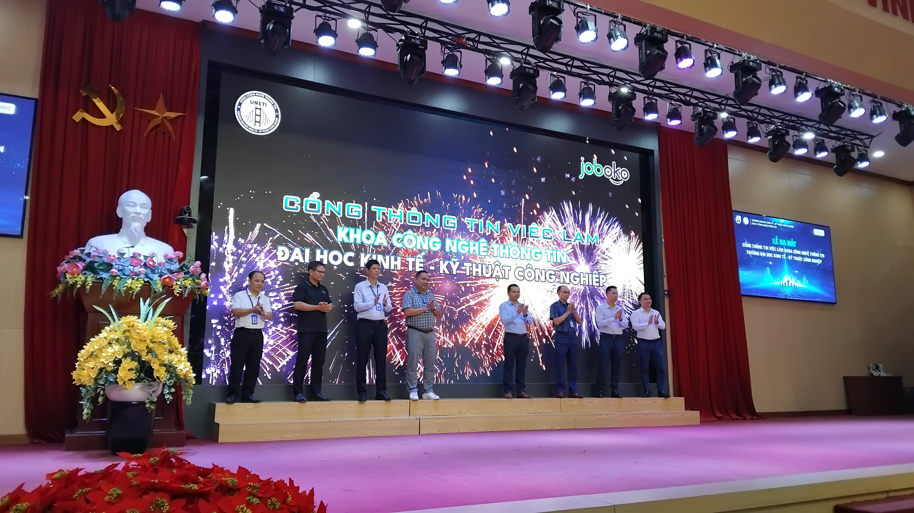
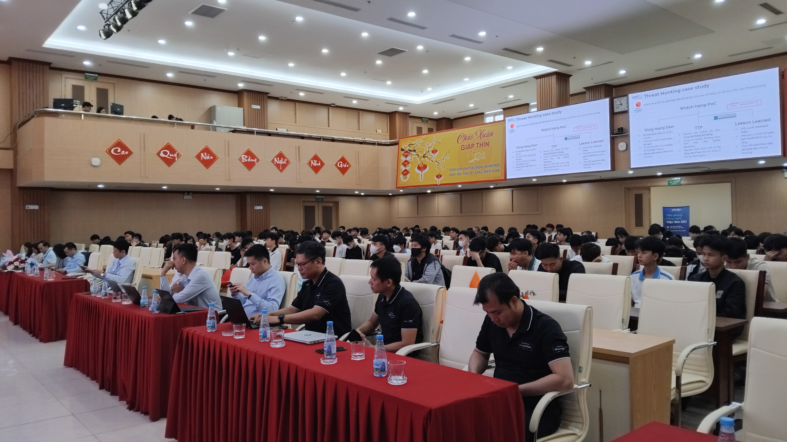
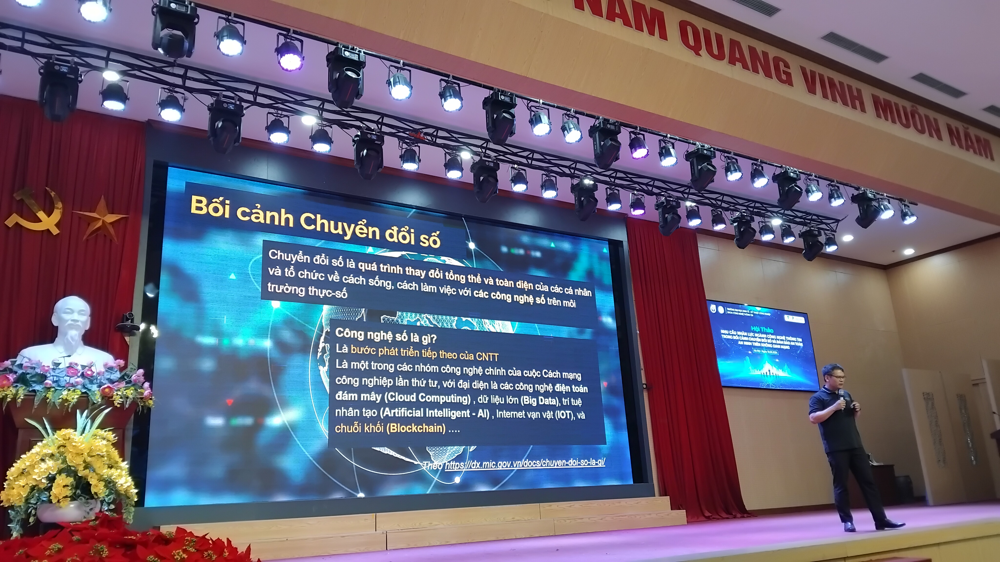
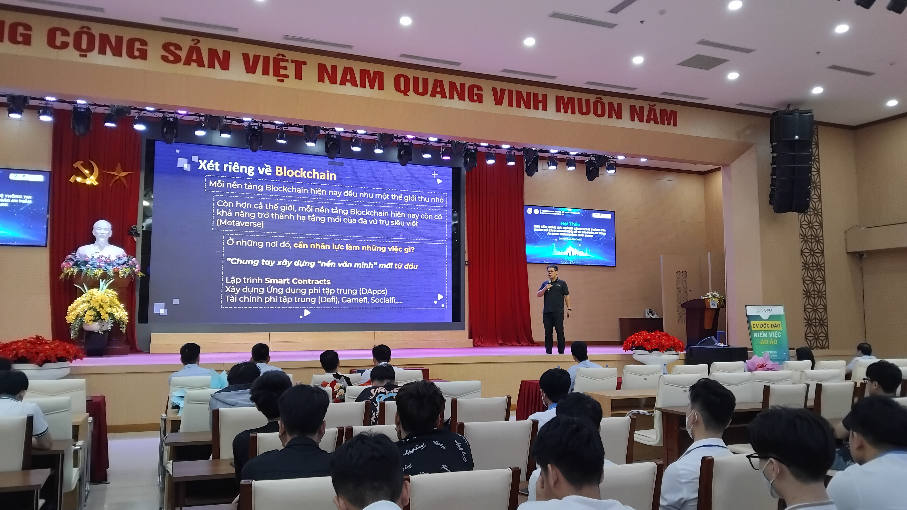
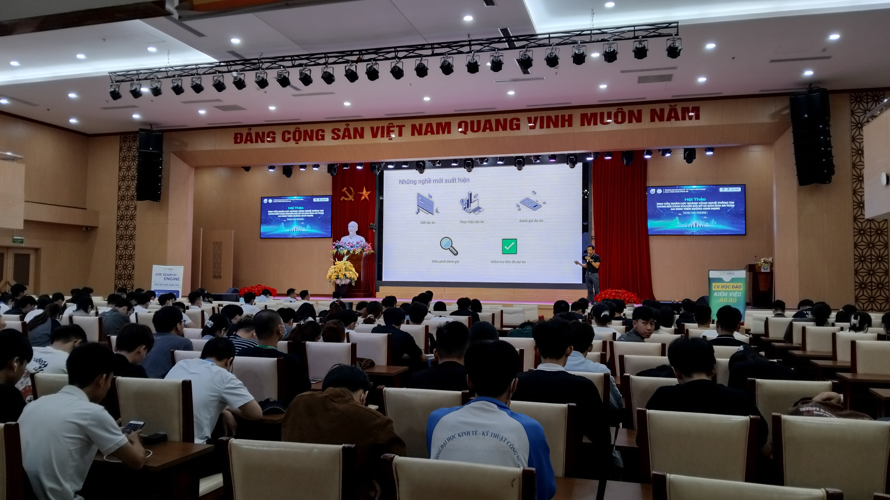
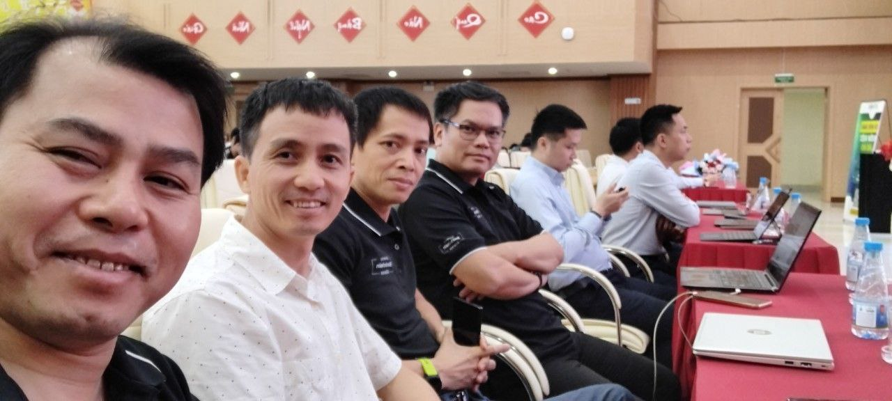

NGUỒN NHÂN LỰC MỚI TRONG NỀN KINH TẾ SỐ
==========

Vào ngày 10/5,Tại Trường Kinh tế, Kỹ thuật Công nghiệp trong buổi ra mắt Cổng thông tin việc làm TS. Đỗ Ngọc Minh và Ths. Nguyễn Anh Tiến từ Liên minh Blockchain trong các trường Đại học (UBA) đã chia sẻ về nguồn nhân lực mới trong nền kinh tế số đã mang lại những thông tin hữu ích và sâu sắc về xu hướng phát triển và tiềm năng của lĩnh vực này. Dưới đây là một số nội dung quan trọng được đề cập trong bài chia sẻ:

1. Xác định vai trò quan trọng của nguồn nhân lực trong kinh tế số: Cả TS. Đỗ Ngọc Minh và Ths. Nguyễn Anh Tiến đã nhấn mạnh về tầm quan trọng của nguồn nhân lực trong việc thúc đẩy sự phát triển của nền kinh tế số. Họ nhấn mạnh rằng nguồn nhân lực là yếu tố chủ chốt quyết định sự thành công của mọi dự án công nghệ thông tin, đặc biệt là trong lĩnh vực Blockchain.

2. Khả năng thích ứng và học hỏi: Trong một môi trường công nghệ đang thay đổi nhanh chóng, khả năng thích ứng và học hỏi của nguồn nhân lực mới rất quan trọng. Họ cần có khả năng tiếp thu kiến thức mới, làm việc độc lập và giải quyết vấn đề một cách sáng tạo.

3. Quan trọng của việc đào tạo và phát triển: Bài chia sẻ cũng nhấn mạnh về sự cần thiết của việc đào tạo và phát triển nguồn nhân lực trong lĩnh vực kinh tế số. TS. Đỗ Ngọc Minh và Ths. Nguyễn Anh Tiến đề xuất việc xây dựng các khóa học, chương trình đào tạo chuyên sâu về Blockchain và các công nghệ liên quan, nhằm nâng cao trình độ chuyên môn cho nguồn nhân lực.

4. Cơ hội và thách thức: Bài chia sẻ cũng đề cập đến các cơ hội và thách thức mà nguồn nhân lực mới sẽ phải đối mặt trong nền kinh tế số. Trong khi cơ hội để phát triển và thành công là rất lớn, nhưng cũng có những thách thức về cạnh tranh và thay đổi nhanh chóng trong công nghệ.

5. Tầm quan trọng của cộng đồng: Cuối cùng, bài chia sẻ nhấn mạnh về tầm quan trọng của việc xây dựng và phát triển cộng đồng nguồn nhân lực trong lĩnh vực kinh tế số. Họ khuyến khích sự hợp tác và chia sẻ kiến thức giữa các thành viên trong cộng đồng để cùng nhau tạo ra một môi trường học tập và làm việc tích cực và phát triển.

