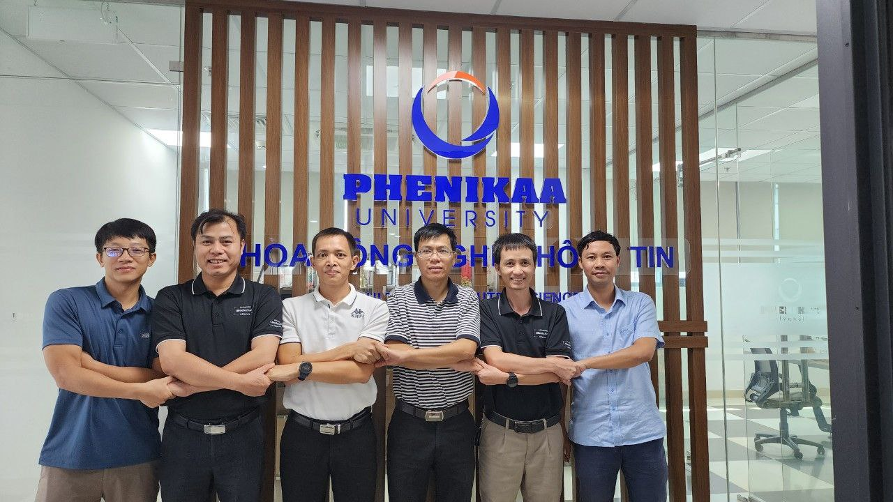
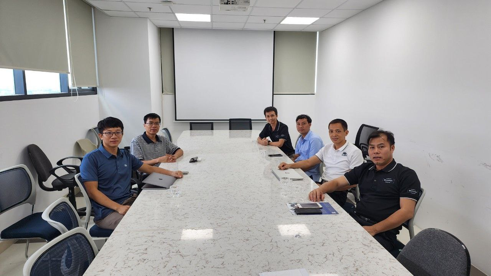

Cardano2vn đông hành cùng Đại học Phenikaa
==========

## 1. Kickoff
Ngày 19 tháng 9 năm 2023, Cardano2vn cùng với UBA làm việc với các thầy cô giảng viên khoa công nghệ thông tin Trường Đại học Phenikaa về việc đưa Blockchain và Quỹ Catalyst vào trường đại học và giảng dậy cho sinh viên.

Trong buổi trao đổi, Thầy Sơn, chủ nhiệm khoa, đã chia sẻ rằng khoa hiện đang đào tạo hơn 2000 sinh viên thuộc các ngành khác nhau. Đặc biệt, khoa đã đầu tư mạnh vào cơ sở vật chất, bao gồm nhiều phòng máy tính và phòng hệ thống mạng, nhằm đảm bảo rằng họ có đủ điều kiện để đào tạo và hỗ trợ sinh viên trong quá trình học tập.

**Ngoài ra, hai bên cũng đã thống nhấn về việc hợp tác với UBA, Cardano2vn trong việc giảng dạy về Blockchain, đặc biệt là về Blockchain Cardano và quỹ Catalyst. Đồng thời thực hiện các bước  chuẩn bị cơ bản cho việc giảng dạy này, nhằm hỗ trợ sinh viên trong ngành Công nghệ thông tin và các ngành liên quan.**

