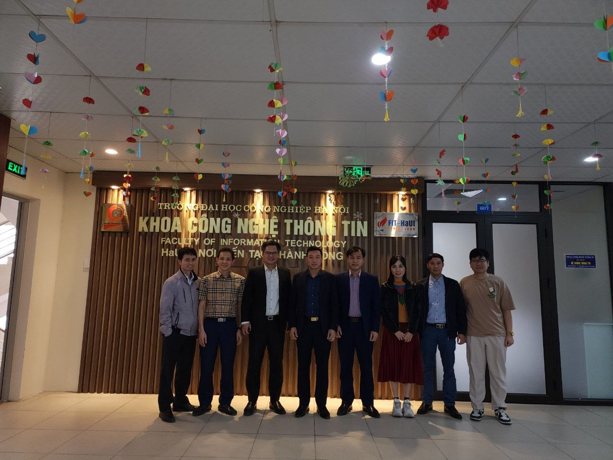
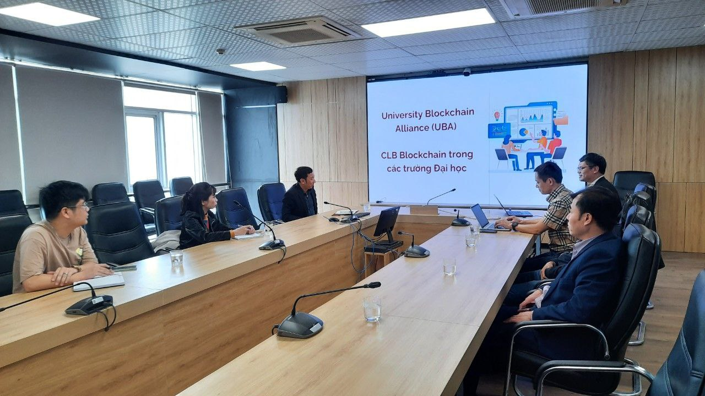
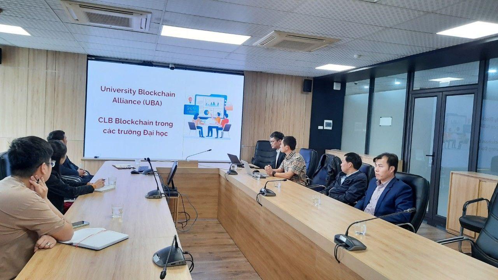

UBA và Cardano2vn làm việc với Đại học HAUI
==========
Tháng 3 năm 2023, Cardano2vn và UBA làm việc với các thầy cô giảng viên khoa công nghệ thông tin trường đại học Công nghiệp Hà nội về việc đưa Blockchain và Quỹ Catalyst vào trường đại học và giảng dậy cho sinh viên.

**Tại buổi trao đổi các bên đi đến thông nhất quan điểm là cần phải có một giáo trình về Blockchain và tường bước giảng dậy cho sinh viên ngành Công nghệ thông tin và các ngành liên quan**

