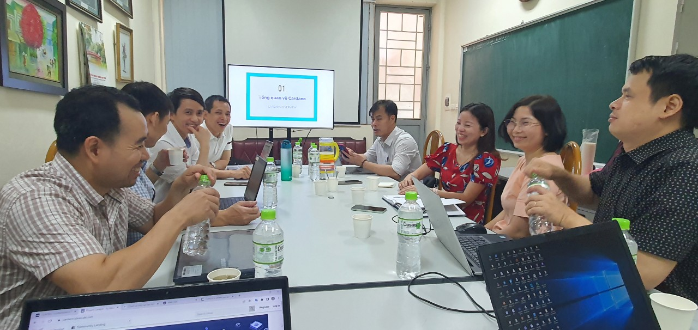

Hội thảo Blockchain Cardano và Catalyst tại trường đại học Giao thông vận tải
==========
Tháng 3 năm 2022, Cardano2vn chia sẻ với các thầy cô giảng viên khoa công nghệ thông tin trường đại học Giao thông vận tải về Blockchain Cardano và Quỹ Catalist.

Với sự tham gia của thầy Trưởng khoa TS. Hoàng Văn Thông cùng các giảng viên giầu kinh nghiệm trong khoa.

## Hội thảo về Blockchain Cardano và Catalyst tại trường đại học Giao thông vận tải.

**Chia sẻ về cách viết một đề xuất tốt trên catalyst để được cấp vốn**

Mr Nguyễn Anh Tiến chia sẻ về Blockchain là gì và quỹ catalyst vận hành như thế nào.

Mr Nguyễn Anh Tiến chia sẻ về cách viết một đề xuất tốt.

Mr Nguyễn Anh Tiến chia sẻ về cách viết một đề xuất tốt.

Mr Nguyễn Anh Tiến chia sẻ về cách viết một đề xuất tốt.

