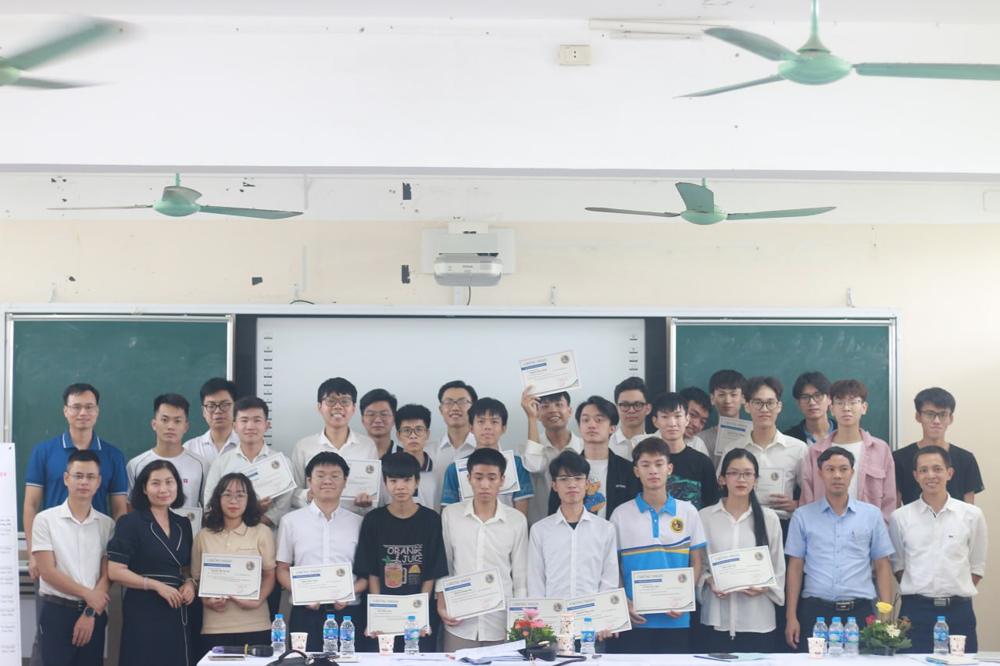
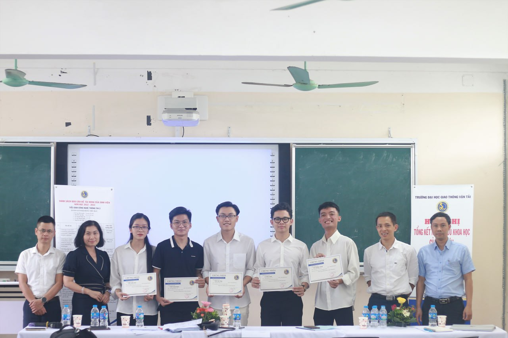
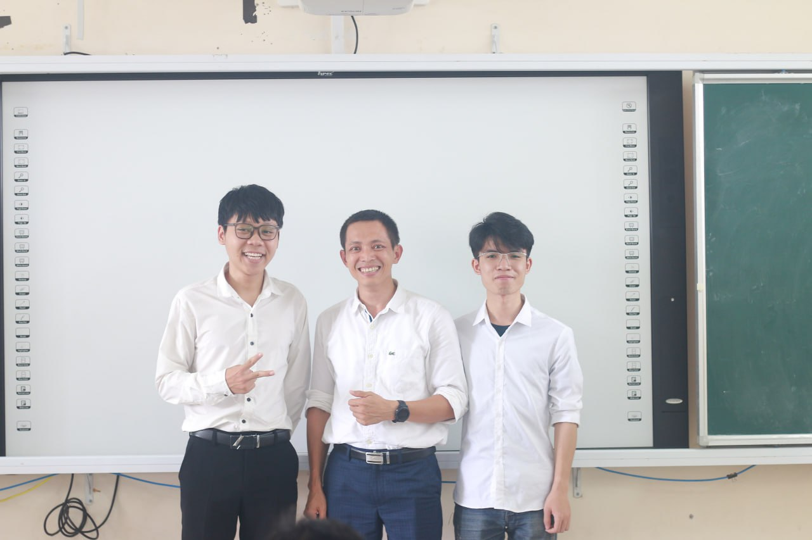
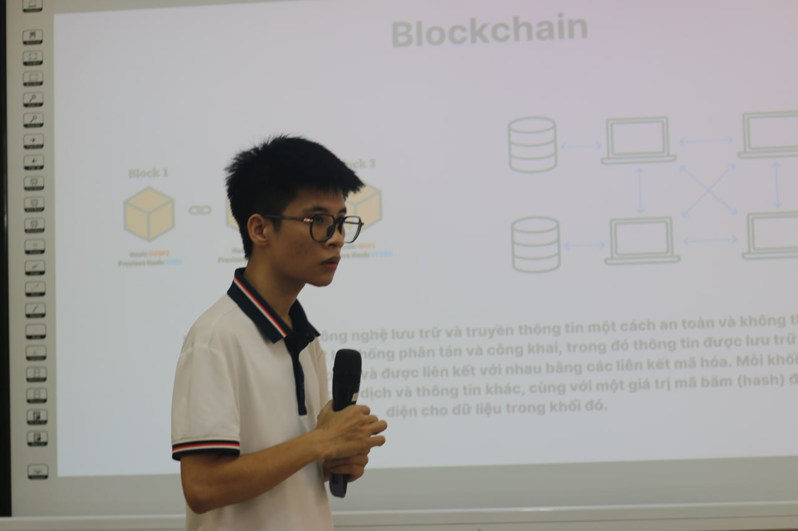
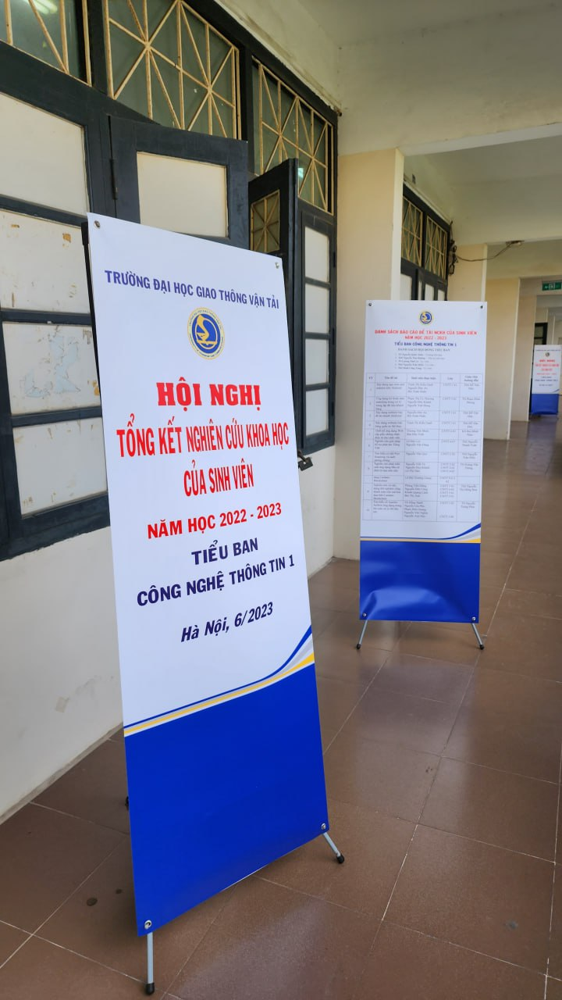

Sinh viên Nghiên cứu khoa học với Blockchain Cardano
==========

Tháng 6 năm 2023, Khoa Công nghệ thông tin Đạt Học Giao thông Vận tải tổ chức công tác đánh giá nghiên cứu khoa học của sinh viên năm 2022-2023. Cardano2vn hướng dẫn 5 đề tài hướng Blockchain Cardano đều đạt giải cao.

Tóm tắt nhanh tại Hội nghị tổng kết công tác nghiên cứu khoa học của sinh viên năm 2022-2023 tại ĐH GTVT

## 1. Năm dự án được triển khai trên blockchain Cardano (Preprod Network).

 Cả 5 dự án đều đoạt giải cấp trường.
- Ứng dụng cấp Chứng chỉ chống giả mạo dựa trên Cardano Blockchain
- Theo dõi quyền sở hữu các tác phẩm nghệ thuật số trên nền tảng blockchain
- Công cụ tạo NFT dành cho người dùng không chuyên về công nghệ
- Ứng dụng bỏ phiếu trên Blockchain
- Cổng thanh toán cho các loại tiền điện tử trên Cardano Blockchain

## 2. Sản phẩm của 02 dự án dưới đây sẵn sàng để cộng đồng sử dụng
- [mint NFT](http://nft.Easterntownhall.com:8088/)  công cụ cho phép người dùng không chuyên về công nghệ tạo NFT sau vài cú nhấp chuột, cho phép người dùng kiểm soát NFT policy-id NFT họ tạo ra
- [Cấp Chứng chỉ](https://utcert.vercel.app/)   "Chứng chỉ dựa trên chuỗi khối Cardano", cho phép các trung tâm Đào tạo/Trường Đại học cấp chứng chỉ của họ dưới dạng NFT và sau đó gửi cho sinh viên đã tốt nghiệp. Ứng dụng cho phép Nhà tuyển dụng theo dõi/xác minh chứng nhận từ mã QR trong ứng dụng, rất chính xác, không thể giả mạo và tiết kiệm thời gian

Sự trưởng thành vượt bậc của Sinh viên dưới dẫn dắt của các thành viên Cardano2vn.io và các Thầy/Cô giáo tại trường 🙏🙏🙏

Lễ trao giảo thưởng cho sinh viên nghiên cứu khoa học tại trường Giao thông Vận tải

