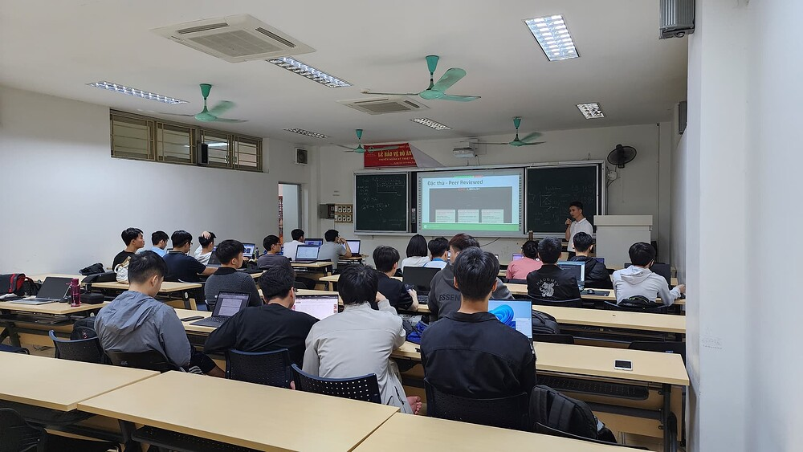
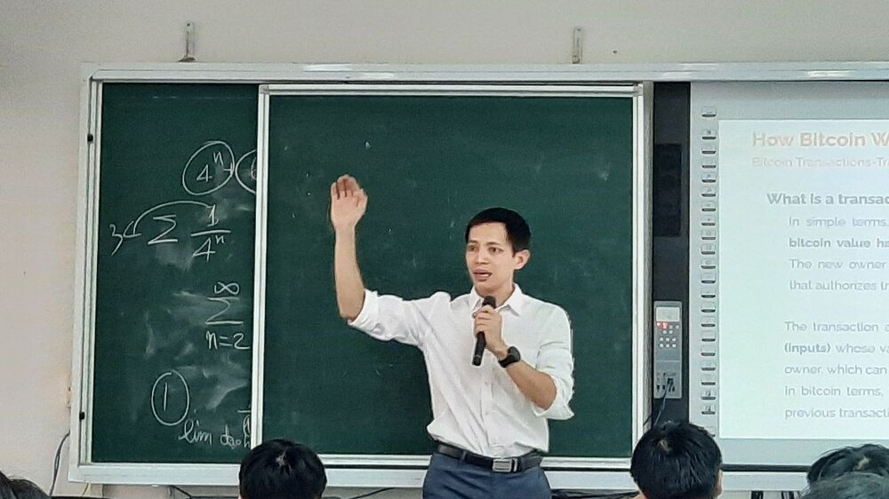
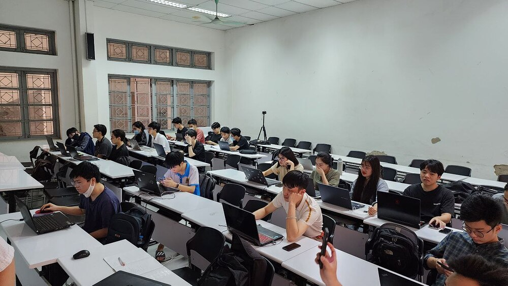
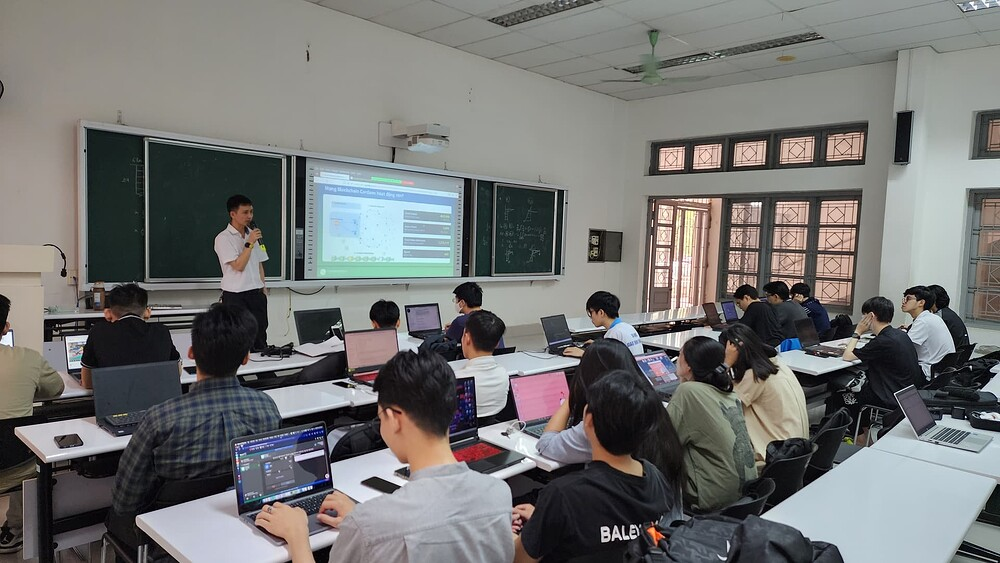
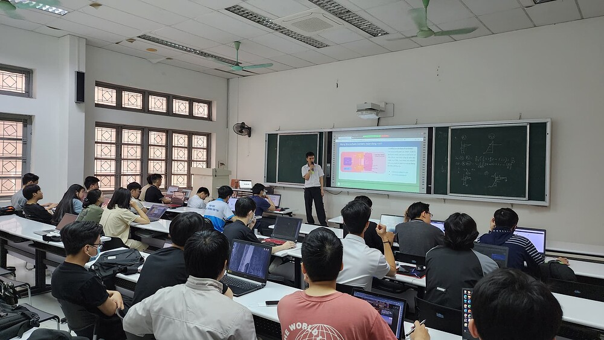
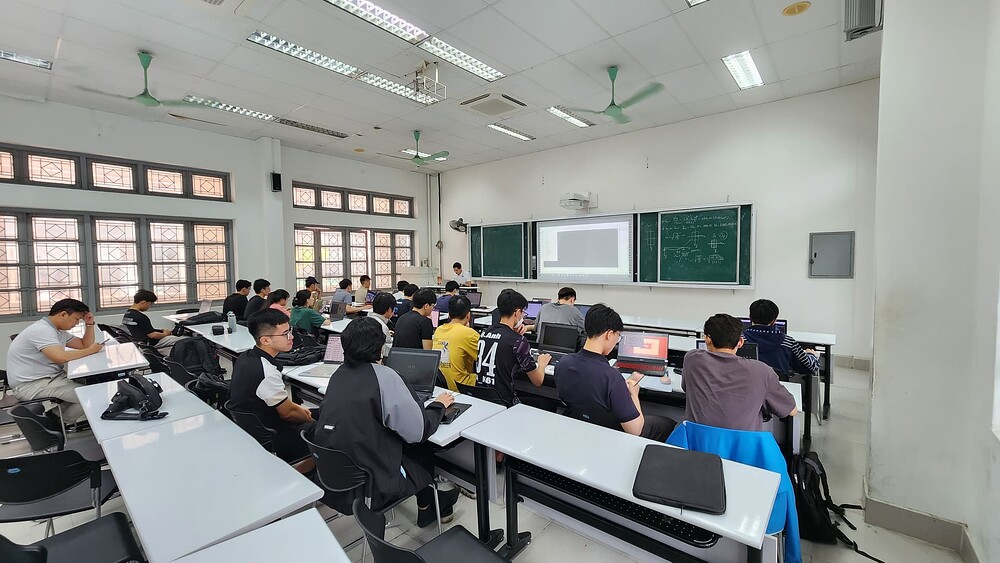
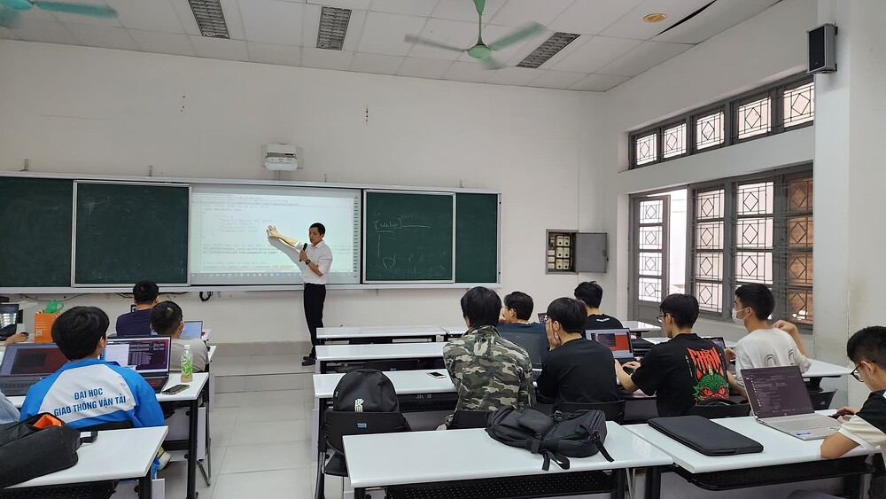
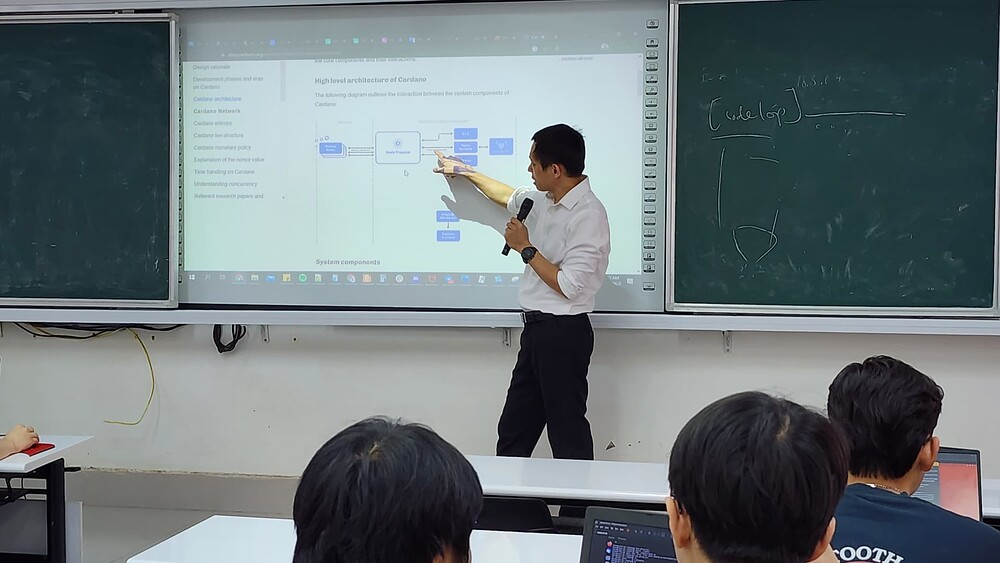
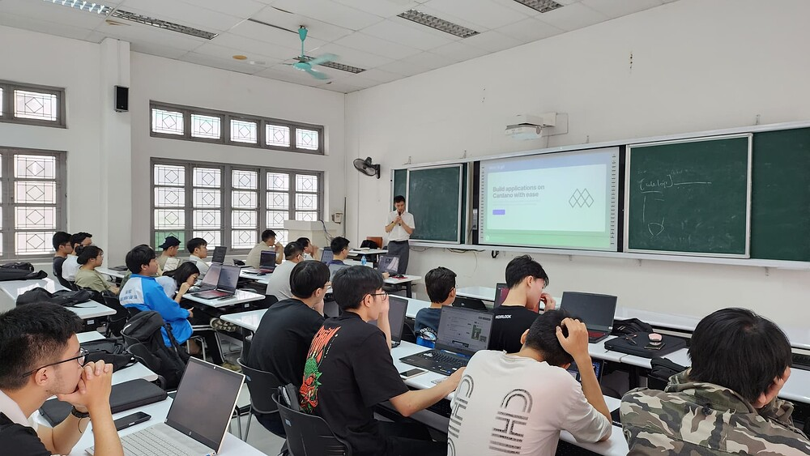

Lớp đào tạo Web3-Bootcamp 2023 với Blockchain Cardano
==========

Tháng 4 năm 2023, Cardano2vn cùng với Khoa Công nghệ thông tin Đại Học Giao thông Vận tải tổ chức lớp học Web3-bootcamp cho sinh viên khóa 61 ngành Công Nghệ Thông tin.

## 1. Nội dung khóa khọc:

### Day1:

 

 

**Introduction to the course:**

 

- Web3 - Codecamp

- The Guide to Web3:

- The Evolution of the Web

- Web2vs Web3

- Web3 components

- Web3 Features

 

 

 

**Overview about Blockchain:**

 

- What is a blockchain?

- Understanding SHA 256 - Hash

- Immutable Ledger

- Distributed P2P Network

 

 

 

**Consensus**

 

- Byzantine Fault Tolerance

- onsensus protocol

- POW, POS, DPOS

 

### Day2:

 

 

**Crypto currencies**

 

- Overview about Crypto market
- Blockchain generations
- Bitcoin (e-gold)
- Ethereum (smart contract pioneer)

 

 

 

**Cardano Blockchain:**

 

- History
- Roadmap
- Pro & Cons
- Native token 
- Ecosystem

 

### Day3:

 

 

**Blockchain Components and Structure**

 

- Transaction Models
- Block Rewards and Transaction Fees
- Wallets
- UTXO
- Addresses
- Mnemonic seed phrase (BIP39)
- Key Derivation

### Day4:

 

 

**Building Cardano node**

 

- Building a node on testnet
- Building a node on mainnet
- Assigment: Student self-build node on test-net
- Introduction and Practicing with Demeter.run

 

### Day5:

 

 

**Working with Cardano-cli**

 

- Create wallet (Key types: private key, public key, stake key...) by using Cardano-cli
- Create your first transaction by using Cardano-cli
- Mint/burn a token by using Cardano-cli
- Mint/burn a NFT by using Cardano-cli
- Create multi signature tx by using Cardano-cli

 

### Day6:

 

 

**Working with Msh**

 

- Create a wallet by using web extention application
- Instroduction about Mesh and  API Providers
- Overview abou Mesh and blockfrost

 

 

**Mesh functions interact with Blockchain**

 

- Setup MeshProvider
- UI-components
- Wallet Hooks

 

### Day7:

 

 

**App Wallet**

 

- Generate wallet
- Load wallet
- Get payment address
- Get reward address
- Sign transactions
- Sign data

 

### Day8:

 

 

**Browser Wallet**

 

- Get installed wallets
- Connect wallet
- Get balance
- Get change address
- Get collateral
- Get network ID
- Get reward addresses
- Get unused addresses
- Get used addresses
- Get UTXOs
- Sign data
- Sign transaction
- Submit transaction
- Get assets
- Get lovelace
- Get policy IDs
- Get collection of assets

 

### Day9:

 

 

**Develop your first Web3 App**

 

- Create the fist transaction
- Moving asset between wallets
- Build a web3 to mint/burn a token
- Build a web3  to mint/burn NFT
- Creat a multi signature tx on web3

 

### Day10:

 

 

**Khởi nghiệp với Blockchain**

 

- Introduction Project Catalyst and Deep Funding and what nexts?
- Open discussion

 

[Chi tiết có tại đây](https://forum.cardano.org/t/web3-bootcamp-s-ki-n-cho-sinh-vien-va-c-ng-d-ng/117201)

**Một số hình anh tại lớp học Web3-bootcamp 2023**

