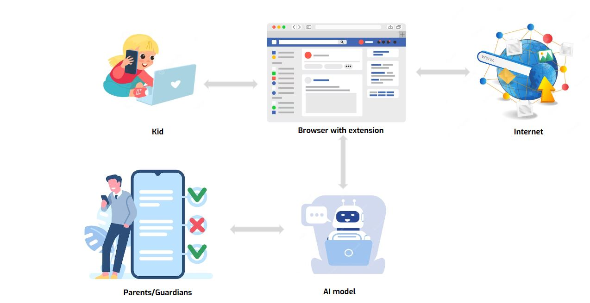

Xin chào,
Chúng tôi rất vui mừng được chia sẻ với các bạn rằng, tại Deep Funding 3 C2VN có đề xuất các dự án về AI sau:

## 1 Kids online protection 

**Tóm tắt AI**

Để các bậc cha mẹ không rành về kỹ thuật có thể bảo vệ con mình trong môi trường Internet, điều quan trọng là phải phát triển một ứng dụng có thể tự động phân tích nội dung của một trang web. Việc này đơn giản hơn và ít tốn kém hơn đối với cha mẹ và người giám hộ ở các quốc gia đang phát triển. Công cụ này sử dụng công nghệ xử lý ngôn ngữ tự nhiên (NLP) để xác định nội dung Internet nhạy cảm với trẻ em. Thông tin nhạy cảm có thể bao gồm nội dung tình dục, suy nghĩ tiêu cực, hận thù, nội dung bạo lực khuyến khích tự làm hại bản thân hoặc thậm chí tự tử, v.v. Bằng cách sử dụng thuật toán Trí tuệ nhân tạo (AI) tiên tiến nhất, công cụ này có thể xác định thông tin nhạy cảm mà không yêu cầu xây dựng hệ thống tên miền danh sách đen, như nhiều giải pháp cảnh báo khác thực hiện.

[Đọc thêm](https://proposals.deepfunding.ai/graduated/under-review/9df4634e-abd6-4513-9859-bbfde171ab8b)

## 2.FLOOD FORCASTING1

**Tóm tắt AI**
Dự án này trình bày một mô hình chuỗi thời gian kết hợp các chức năng chuẩn hóa lớp và kích hoạt ReLU bị rò rỉ trong các kiến ​​trúc Bộ nhớ ngắn hạn dài (LSTM) đa biến, Bộ nhớ ngắn hạn dài hai chiều (BILSTM) và Mạng thần kinh tái phát sâu (DRNN). Các mô hình đề xuất này đã được đào tạo và đánh giá bằng cách sử dụng dữ liệu cảm quan lịch sử liên quan đến mực nước sông và lượng mưa ở các con sông khác nhau ở Việt Nam. Sau đó, một ứng dụng đã được phát triển để phục vụ mục tiêu dự báo lũ lụt cụ thể ở Việt Nam

[Đọc thêm](https://proposals.deepfunding.ai/graduated/under-review/d458c21a-2f88-4c5d-875d-5d2f8a0d4152)

## 3. MeAI tool for healthcare system

**Tóm tắt AI**
Công cụ này rất có giá trị đối với những người có thu nhập thấp và những người sống xa thành phố, không có điều kiện đi khám hoặc tái khám định kỳ tại các trung tâm y tế uy tín. Số tiền tài trợ 0.000 USD Vấn đề cần giải quyết Theo WHO, ung thư là nguyên nhân gây tử vong hàng đầu trên thế giới và số ca mắc bệnh được dự đoán sẽ tăng trong thập kỷ tới. Đào tạo mô hình AI Với các mô hình AI đã chọn, chúng tôi thực hiện đào tạo bằng dữ liệu sạch của mình. Chúng ta cũng cần thuê nguồn lực để đào tạo các mô hình AI với số lượng lớn dữ liệu hình ảnh.

[Đọc thêm](https://proposals.deepfunding.ai/graduated/under-review/f1d8eb48-62a0-4da7-b700-51323626b228)
