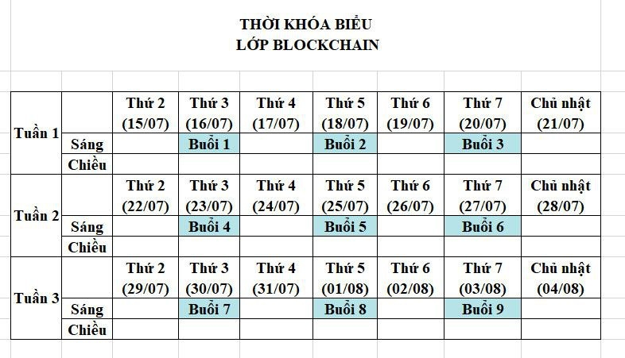
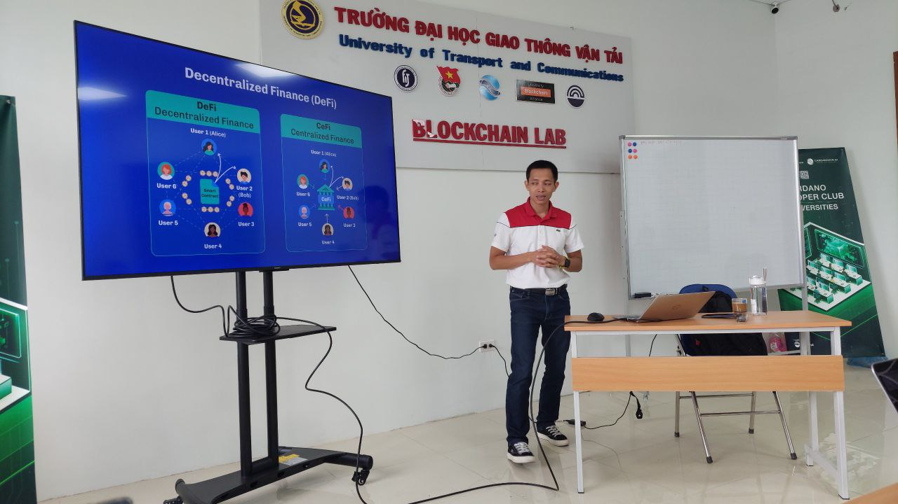
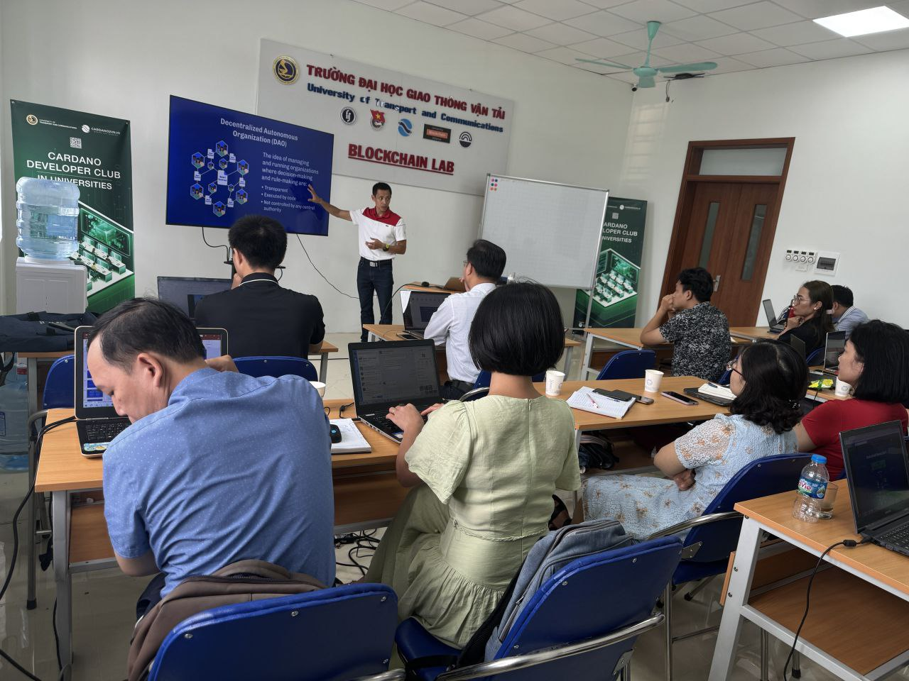
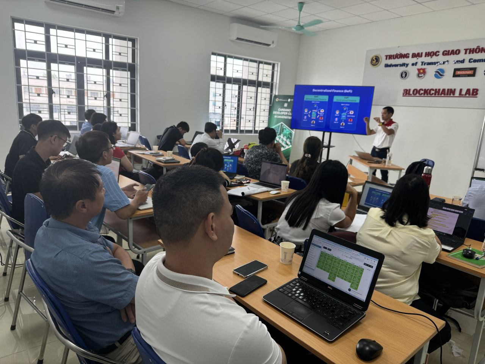
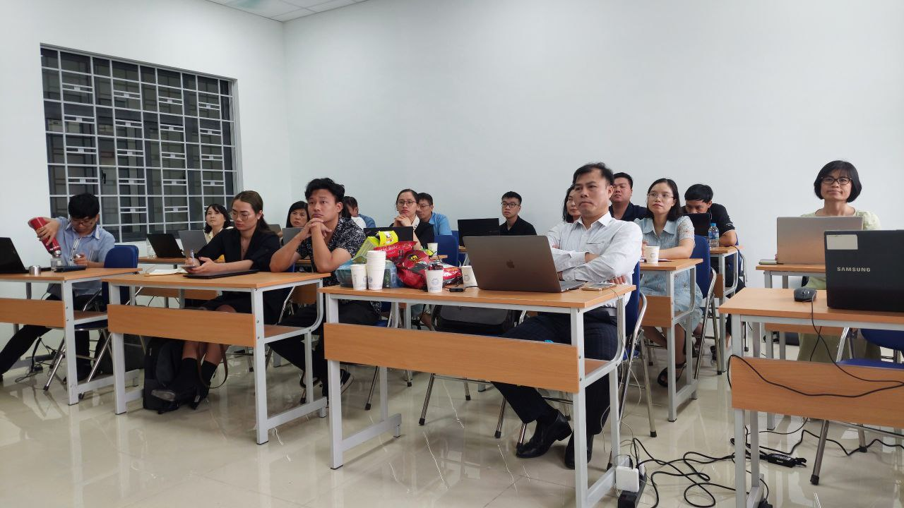

Khai Mạc Khóa Học Blockchain Cơ Bản Cho Giảng Viên Đại Học
===================================================

Hôm nay, ngày 16/7/2024, UBA (Liên minh Blockchain trong các trường Đại học) cùng với Cardano2vn đã chính thức khai mạc lớp học về Blockchain cơ bản dành cho các giảng viên của các trường trong liên minh Blockchain UBA. Buổi khai mạc diễn ra tại Đại học Giao thông Vận tải, thu hút sự tham gia của các giảng viên đến từ nhiều trường đại học khác nhau:

- Đại học Giao thông Vận tải

- Đại học Dân lập Phương Đông

- Đại học công nghệ Đông Á (EAUT)

- Đại học Nguyễn Trãi

- Đại học Kinh tế Kỹ thuật Công nghiệp (UNETI)

- Đại học Công nghiệp Hà Nội

- Học viện Phụ nữ Việt Nam

## Chi tiết khóa học
Thời gian: 3 tuần liên tục từ ngày 15/7/2024 đến ngày 3/8/2024

## Ý nghĩa của khóa học
Khóa học này được tổ chức với mục tiêu cung cấp kiến thức cơ bản về Blockchain cho các giảng viên, những người sẽ đóng vai trò là nguồn lực chủ chốt trong việc lan tỏa kiến thức và đào tạo các thế hệ sinh viên có trình độ cao trong ngành Blockchain. Đây là một ngành đang rất thiếu nhân lực, và việc đào tạo giảng viên sẽ giúp tạo ra lực lượng lao động chất lượng cao để đáp ứng nhu cầu của thị trường.

## Hình ảnh từ buổi khai mạc

Dưới đây là một số hình ảnh từ buổi khai mạc lớp học, với sự chia sẻ của Nguyên Anh Tiến từ Cardano2vn:

Nguyên Anh Tiến chia sẻ kiến thức về Blockchain với các giảng viên.

Cảnh các giảng viên tham gia buổi học với tinh thần hào hứng và nhiệt tình.

Chúng tôi, UBA và Cardano2vn, xin trân trọng cảm ơn sự tham gia và hỗ trợ của tất cả các giảng viên và các trường đại học. Hy vọng rằng với khóa học này, chúng ta sẽ cùng nhau phát triển và nâng cao kiến thức về Blockchain, góp phần vào sự phát triển của ngành công nghệ này tại Việt Nam.

Trân trọng cảm ơn!

