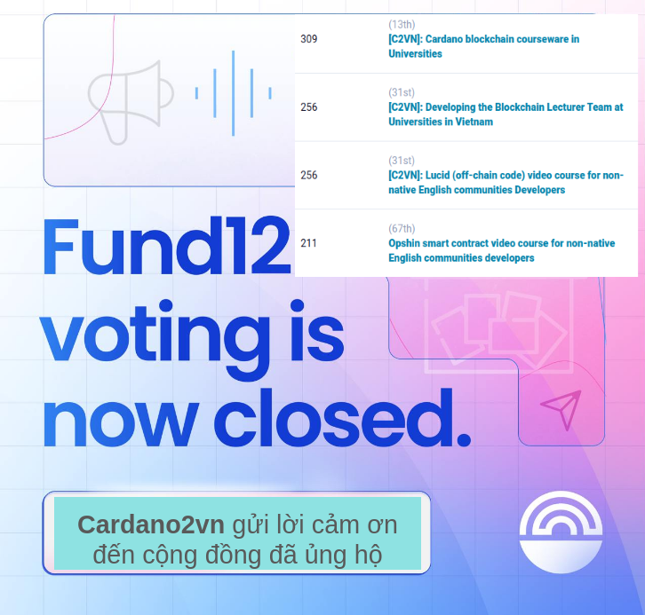

Kết Thúc Catalyst F12: C2VN Cảm Ơn Cộng Đồng Vì Sự Ủng Hộ
========================================================

Sau 14 ngày đầy kịch tính và sôi nổi, quá trình bỏ phiếu cho Catalyst F12 đã chính thức khép lại. Chúng tôi, C2VN, cùng với các đề xuất khác từ cộng đồng Việt Nam, đã nhận được sự ủng hộ mạnh mẽ từ các bạn. Kết quả cuối cùng rất khả quan và đầy hứa hẹn.

##Thành quả đáng tự hào
Nhờ vào sự ủng hộ nhiệt tình và tin tưởng của cộng đồng, chúng tôi C2VN đã đạt được kết quả vô cùng tích cực. Các đề xuất từ Việt Nam không chỉ được đón nhận mà còn nhận được nhiều phiếu bầu từ các thành viên trong cộng đồng, chứng tỏ sự quan tâm và cam kết của các bạn đối với sự phát triển của nền tảng Cardano.

##Lời cảm ơn chân thành
Chúng tôi, C2VN, xin gửi lời cảm ơn sâu sắc đến tất cả các bạn đã dành thời gian và công sức để tham gia vào quá trình bỏ phiếu lần này. Sự ủng hộ của các bạn không chỉ là nguồn động lực to lớn cho chúng tôi mà còn là minh chứng rõ ràng cho sự đoàn kết và sức mạnh của cộng đồng Cardano tại Việt Nam.

##Hy vọng cho tương lai
Với kết quả khả quan này, chúng tôi hy vọng rằng các đề xuất của C2VN cũng như các đề xuất khác từ cộng đồng sẽ được cấp vốn để tiếp tục phát triển và cống hiến nhiều hơn cho cộng đồng. Chúng tôi cam kết sẽ nỗ lực hết mình để biến những ý tưởng này thành hiện thực, mang lại những giá trị thiết thực và bền vững cho toàn bộ cộng đồng.

Một lần nữa, xin chân thành cảm ơn tất cả các bạn vì sự ủng hộ và niềm tin. Chúng ta cùng nhau xây dựng một tương lai tươi sáng hơn trên nền tảng Cardano.

#Kết luận
Sự thành công của Catalyst F12 là một bước tiến quan trọng và đầy ý nghĩa đối với cộng đồng Cardano tại Việt Nam. Chúng tôi tin tưởng rằng với sự đoàn kết và hỗ trợ của các bạn, chúng ta sẽ tiếp tục gặt hái được nhiều thành tựu hơn nữa trong tương lai. Xin cảm ơn và hẹn gặp lại các bạn trong các sự kiện và hoạt động sắp tới!

