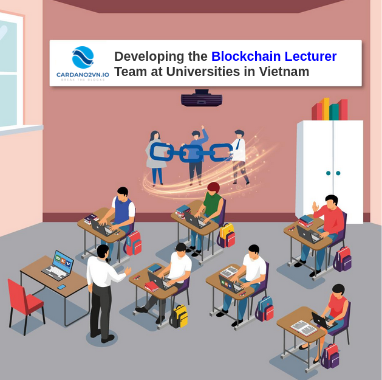
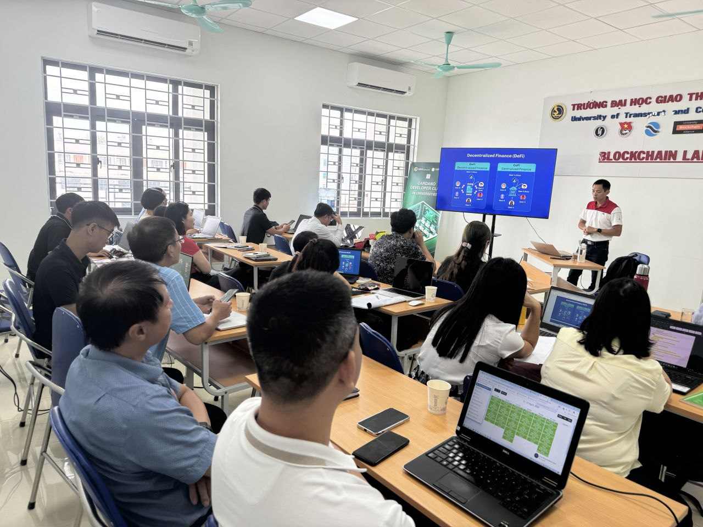

🚀 CHINH PHỤC BLOCKCHAIN CARDANO - KHÓA HỌC NÂNG CAO 🎯
========================================

## 🔥 **Bạn đã sẵn sàng trở thành chuyên gia/Giảng viên Blockchain?**

Bạn có kiến thức cơ bản về Blockchain và muốn **nâng cao kỹ năng lập trình** On-Chain & Off-Chain trên Cardano? Đây chính là cơ hội dành cho bạn!

🚀 Khóa học LẬP TRÌNH BLOCKCHAIN NÂNG CAO giúp bạn hiểu sâu về cách xây dựng ứng dụng phi tập trung (dApps) với công nghệ tiên tiến của Cardano, từ Opshin, Aiken (On-Chain) đến Lucid, Mesh (Off-Chain).

📌 Hình thức: Online qua Zoom

📌 Lịch học: 1 buổi/tuần Bắt đầu từ tháng 3/2025 đén tháng 6/2025

📌 Đội ngũ giảng viên: Các chuyên gia dày dặn kinh nghiệm trong hệ sinh thái Cardano

## 📢 Đừng bỏ lỡ cơ hội này!

📍 Đăng ký ngay hôm nay – Số lượng giới hạn!

⏳ Thời gian đăng ký: Trươc ngày 6/3/2025

🔗 Link đăng ký: [Link đăng ký](https://forms.gle/tJp5TDadKCJGX8yq9)

## 🎁 Ưu đãi đặc biệt - 100% MIỄN PHÍ 🎯

✅ Học miễn phí, nhận tài liệu độc quyền

✅ Cơ hội thực hành trực tiếp với các bài tập thực tế

✅ Kết nối với cộng đồng lập trình viên Blockchain Cardano

✅ Hỗ trợ sau khóa học – Cùng bạn phát triển dự án thực tế

## 🌟 Hãy tham gia ngay để trở thành một lập trình viên/Giảng viên Blockchain chuyên nghiệp trên Cardano! 🚀

💡 Cardano2vn - Đồng hành cùng bạn trên hành trình Blockchain!

📧 Liên hệ: [Email](cardan2vn.gmail.com)

🌎 Website: www.cardano2vn.io

📢 Cộng đồng: [Link Telegram](https://t.me/cardano2vn)

## Các hình ảnh/video giới thiệu đến các trường đại học.

*Chúng tôi rất vui mừng thông báo đến cộng đồng về sự kiện này và hy vọng rằng khóa học sẽ góp phần nâng cao kiến thức và kỹ năng về công nghệ Blockchain cho các giảng viên, từ đó đào tạo nên những thế hệ kỹ sư blockchain xuất sắc trong tương lai.*

