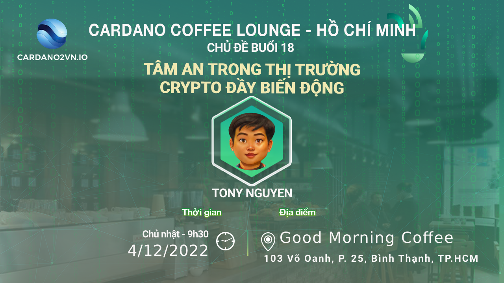

[Cardano Coffee Lounge - Hồ Chí Minh] - Buổi 18
==============================================

**Cardano Coffee Lounge là một hoạt động họp mặt định kỳ hàng tuần do Catalyst tài trợ, mục đích là đưa những kiến thức về Blockchain và Cardano tới rộng rãi cộng đồng Việt Nam.**

📣Chủ đề thảo luận buổi 18 ở HCM: “Tâm an giữa thị trường crypto đầy biến động như thế nào?" 

📣Diễn giả: -Tony Nguyen

📣Thời gian: 9h30, Chủ Nhật, 4/12/2022
       
📣 Địa điểm: **Good Morning Coffee**: 103 Võ Oanh, Phường 25, Bình Thạnh, Thành phố Hồ Chí Minh 72308 [map tại đây](https://www.google.com/maps/place/Good+Morning+Coffee/@10.7990618,106.6918531,13.5z/data=!4m5!3m4!1s0x0:0xfeefd404550f6b67!8m2!3d10.8041902!4d106.7161699).

📣Để phục vụ bạn được tốt nhất (Miễn phí nước uống), vui lòng đăng ký 👉  [theo biểu mẫu sau đây](https://forms.gle/GooGW2cGpVEdhXHX9) trước 17:00 ngày 3/12/2022.

📣Khi đến buổi họp mặt, vui lòng check in với BTC để order đồ uống miễn phí.

👉Cardano2vn - Mang Cardano về Việt Nam
Website: https://cardano2vn.io/ 

👉Trao đổi về ngôn ngữ lập trình Smartcontract - Plutus, Marlove trên Cardano
Telegram: https://t.me/cardano2vn 

👉Video bài giảng về lập trình trên Cardano
Youtube: https://www.youtube.com/channel/UCJTdAQPGJntJet5v-nk9ebA 
