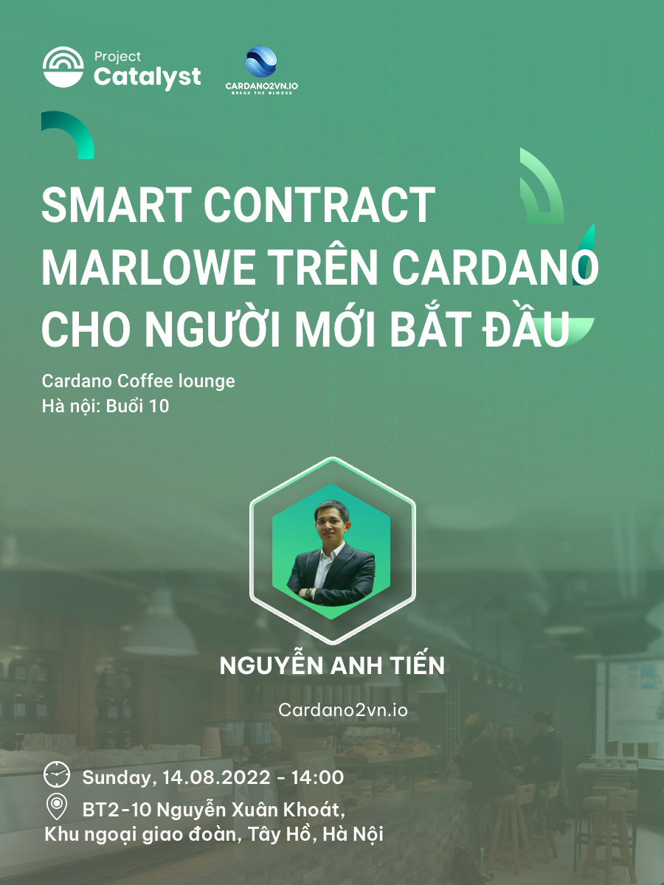

[Cardano Coffee Lounge - Hà Nội]-Buổi 10
=======================================

**Cardano Coffee Lounge là một hoạt động họp mặt định kỳ hàng tuần do Catalyst tài trợ, mục đích là đưa những kiến thức về Blockchain và Cardano tới rộng rãi cộng đồng Việt Nam.**

📣Chủ đề thảo luận buổi 10 ở HN: “mart Contract Marlowe trên Cardano cho người mới bắt đầu”

📣Diễn giả: Nguyễn Anh Tiến, chủ dự án cardano2vn.io

📣Thời gian: 14h, Chủ Nhật, 14/08/2022

📣 Địa điểm:  BT2-10 Nguyễn Xuân Khoát, Khu ngoại giao đoàn, Tây Hồ, Hà Nội [map tại đây](https://maps.app.goo.gl/6QRmmYxo4XzCQ3aZ7).

📣Để phục vụ bạn được tốt nhất *(Miễn phí nước uống)*, vui lòng đăng ký 👉  [theo biểu mẫu sau đây](https://forms.gle/efnSWqbFaH6R7m7f6) trước 8:00 ngày 14/08/2022.

📣Khi đến buổi họp mặt, vui lòng check in với BTC để order nước miễn phí.
—-------------------

👉Cardano2vn - Mang Cardano về Việt 
Nam Website: https://cardano2vn.io/ 

👉Trao đổi về ngôn ngữ lập trình Smartcontract - Plutus, Marlove trên Cardano
Telegram: https://t.me/cardano2vn 

👉Video bài giảng về lập trình trên Cardano
Youtube: https://www.youtube.com/channel/UCJTdAQPGJntJet5v-nk9ebA 
