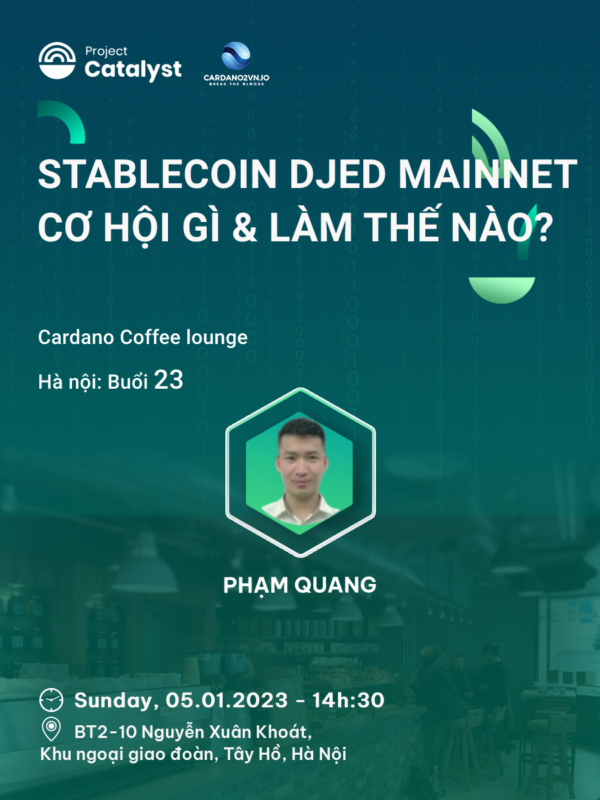

[Cardano Coffee Lounge - Hà Nội]-Buổi 23
=======================================

**Cardano Coffee Lounge là một hoạt động họp mặt định kỳ hàng tuần do Catalyst tài trợ, mục đích là đưa những kiến thức về Blockchain và Cardano tới rộng rãi cộng đồng Việt Nam.**

📣Chủ đề thảo luận: “Stablecoin Djed mainnet-Cơ hội & rủi ro”

📣Diễn giả: Phạm Quang

📣Thời gian: 14h30, Chủ Nhật, 05/01/2023

📣 Địa điểm:  BT2-10 Nguyễn Xuân Khoát, Khu ngoại giao đoàn, Tây Hồ, Hà Nội [map tại đây](https://maps.app.goo.gl/6QRmmYxo4XzCQ3aZ7).

📣Để phục vụ bạn được tốt nhất *(Miễn phí nước uống)*, vui lòng đăng ký 👉  [theo biểu mẫu sau đây](https://forms.gle/efnSWqbFaH6R7m7f6) trước 8:00 ngày 05/01/2023.

📣Vì chúng tôi đã kết thúc tài trợ của quỹ Catalyst F8 nên các bạn khi đến buổi họp mặt tự tiền đồ uống. Rất vui mùng chào đón các bạn và Xin cảm ơn!

-------------------

👉Cardano2vn - Mang Cardano về Việt 
Nam Website: https://cardano2vn.io/ 

👉Trao đổi về ngôn ngữ lập trình Smartcontract - Plutus, Marlove trên Cardano
Telegram: https://t.me/cardano2vn 

👉Video bài giảng về lập trình trên Cardano
Youtube: https://www.youtube.com/channel/UCJTdAQPGJntJet5v-nk9ebA 
