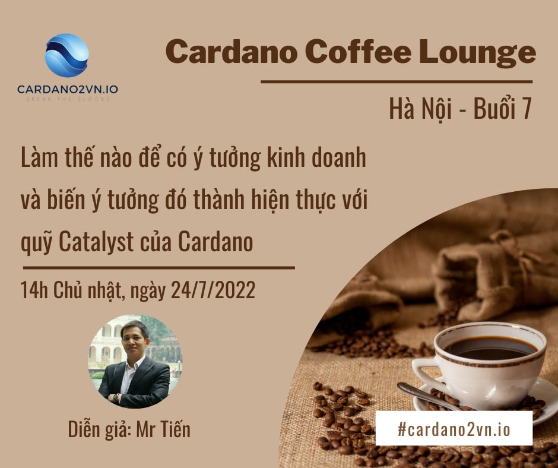

[Cardano Coffee Lounge - Hà Nội] B 7
=======================================

**Cardano Coffee Lounge là một hoạt động họp mặt định kỳ hàng tuần do Catalyst tài trợ, mục đích là đưa những kiến thức về Blockchain và Cardano tới rộng rãi cộng đồng Việt Nam.**

📣Chủ đề thảo luận buổi 7 ở HN: “Làm thế nào để có ý tưởng kinh doanh và biến ý tưởng đó thành hiện thực với quỹ Catalyst của Cardano”

📣Diễn giả: Mr Tiến, chủ dự án Cardano2vn, admin Cộng đồng Cardano Catalyst Việt Nam

📣Thời gian: 14h, Chủ Nhật, 23/7/2022

📣 Địa điểm:  BT2-10 Nguyễn Xuân Khoát, Khu ngoại giao đoàn, Tây Hồ, Hà Nội (https://maps.app.goo.gl/6QRmmYxo4XzCQ3aZ7).

📣Để phục vụ bạn được tốt nhất (Miễn phí nước uống), vui lòng đăng ký 👉  theo biểu mẫu sau đây (https://forms.gle/GooGW2cGpVEdhXHX9) trước 8:00 ngày 23/7/2022.

📣Khi đến buổi họp mặt, vui lòng check in với BTC để order nước miễn phí.

👉Cardano2vn - Mang Cardano về Việt Nam
Website: https://cardano2vn.io/ 
👉Trao đổi về ngôn ngữ lập trình Smartcontract - Plutus, Marlove trên Cardano
Telegram: https://t.me/cardano2vn 
👉Video bài giảng về lập trình trên Cardano
Youtube: https://www.youtube.com/channel/UCJTdAQPGJntJet5v-nk9ebA 
