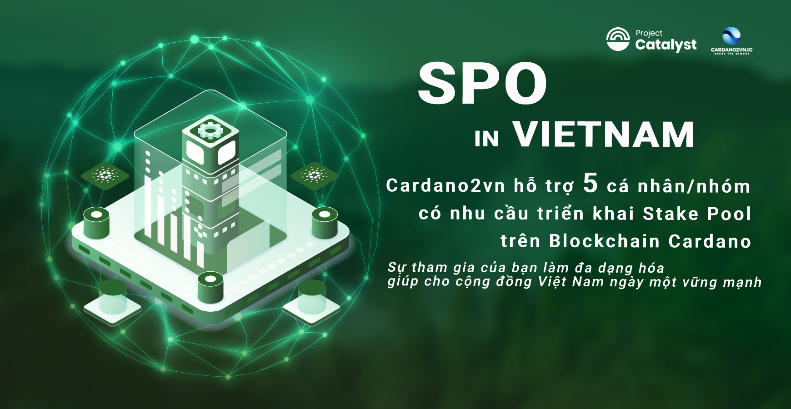

📣 [C2VN] thông báo SPO: 
===============================
**Đăng ký hỗ trợ triển khai Stake Pool (SPO)**
===============================

Đề án Simplify SPO rollups in Vietnam của Cardano2vn được cấp vốn trong Fund8 là một trong những đề án giúp Cộng đồng triển khai Stake Pool đơn giản hơn, phi tập trung hơn.
Ngoài các tiêu chí về xây dựng Stake pool mẫu trên Cloud, trên nền tảng thiết bị tiết kiệm điện như Raspberry PI. Chúng tôi còn hỗ trợ trực tiếp khi các cá nhân, tổ chức cần trợ giúp xây dựng Stake Pool hoàn toàn miễn phí.
Nếu Bạn cần người đồng hành, người hỗ trợ kỹ thuật, hãy để lại thông tin cho chúng tôi.

----
Cardano2vn's Simplify SPO rollups in Vietnam funded proposal in Fund8 is one of the projects to help the Community deploy Stake Pool simpler and more decentralized.

In addition to the criterias for building a sample Stake pool on the Cloud, on the basis of power-saving devices such as Raspberry PI. We also provide direct support when individuals and organizations need help building Stake Pool completely free of charge.

If you need a companion, technical support person, please leave information to us.

----

**👉 Dự án hỗ trợ 5 cá nhân/nhóm triển khai Stake Pool trên Cardano đăng ký sớm nhất**

**👉 Yêu cầu với thành viên:**

- Ưu tiên các nhóm triển khai.
- Có kỹ năng sử dụng tốt máy tính.
- Hiểu biết về ngành Blockchain và dự án Cardano

Đăng ký [tại đây](https://docs.google.com/forms/d/1RqNXogwT_kkphP1e96jKGZp26dKh4U9bzqm2wf0GPX0/prefill)

**👉 Thời gian**
-  Đăng ký trước 23:00 ngày 20/9/2022 hoặc khi có đủ 5 cá nhân/nhóm.
 
»»» Sự tham gia của bạn làm tăng tính phi tập trung cho mạng lưới cardao và  giúp cho cộng đồng Việt nam ngày một vững mạnh.

—---------------------------------------------------------

**P/S: Hãy vote cho các đề xuất sau của chúng tôi trong F9 nếu bạn thấy hữu ích:**

1️⃣ Cardano developer courseware in Uni

2️⃣ Cardano developer club in Uni  

3️⃣ Catalyst Events 4 Vietnam Students

Xin cảm ơn
