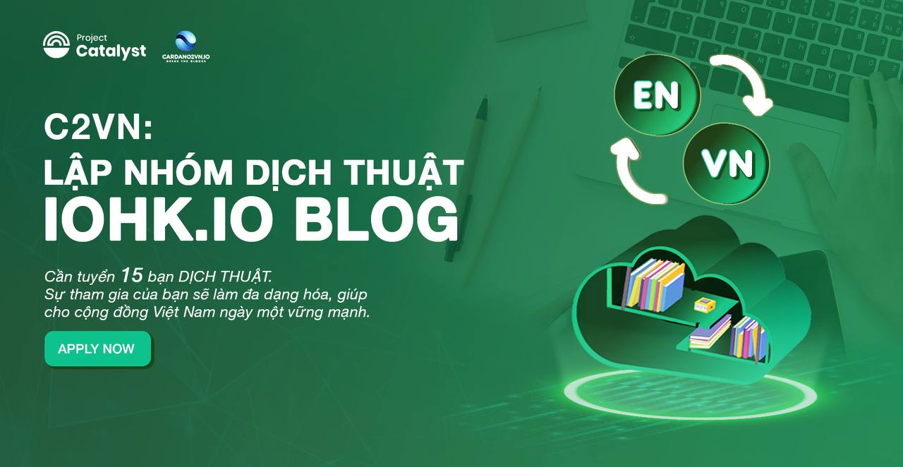

📣 [C2VN] thông báo: LẬP NHÓM DỊCH iohk.io BLOG
===============================

Chào mừng các bạn đến với nhóm dịch thuật blog iohk.io của Cardano2vn.io. 
Với định hướng dự án việt hóa các bài đăng trên trang iohk.io là dự án của cộng đồng NÊN CHÚNG TÔI CẦN SỰ HỖ TRỢ TỪ CÁC BẠN. Cụ thể:

👉 Dự án cần tuyển 15 người đảm nhận việc dịch thuật.

👉 Yêu cầu với thành viên:

- Ưu tiên các thành viên coretem.
- Biết đọc tiếng Anh thành thạo
- Có kỹ năng sử dụng tốt máy tính và các phần mềm dịch thuật, có tài khoản github ( sẽ có hướng dẫn chi tiết)
- Hiểu biết về ngành Blockchain và dự án Cardano
- Hoàn thành bài ktra đạt tối thiểu 150 điểm [tại đây](https://fimi.vn/kiem-tra-blockchain-pro/)

Sau khi hoàn thành bài kiểm tra vui lòng gửi kết quả tới https://web.telegram.org/k/#@Tiennguyenanh 
 
👉 Quyền lợi thành viên tham gia:
- Tham gia nhóm dịch thuật, cùng nhau trao đổi chuyên sâu hàng tuần.
- Chia sẻ các bài dịch mà bạn tâm huyết tại các buổi offline của dự án Cardano Coffee Lounge
- Dịch bài Blog từ  https://iohk.io/blog về Blockchain & Cardano.
- Cùng trải nghiệm các công cụ dịch thuật tiên tiến.
- Được hưởng thù lao từ nguồn quỹ của 02 dự án.

Sự tham gia của bạn sẽ làm đa dạng hóa, giúp cho cộng đồng Việt nam ngày một vững mạnh và Chúng tôi cần bạn.

—---------------------------------------------------------

👉Cardano2vn - Mang Cardano về Việt 
Nam Website: https://cardano2vn.io/ 

👉Trao đổi về ngôn ngữ lập trình Smartcontract - Plutus, Marlove trên Cardano
Telegram: https://t.me/cardano2vn 

👉Video bài giảng về lập trình trên Cardano
Youtube: https://www.youtube.com/channel/UCJTdAQPGJntJet5v-nk9ebA 
