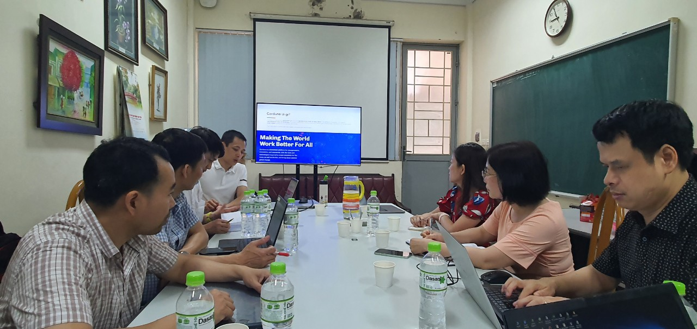
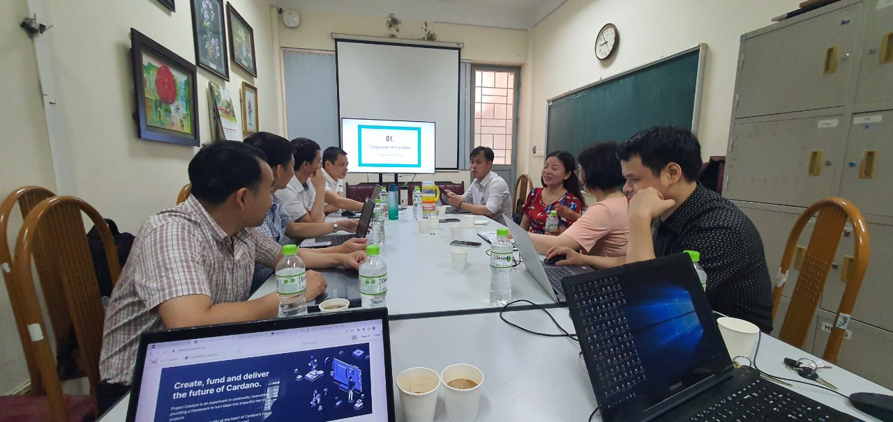
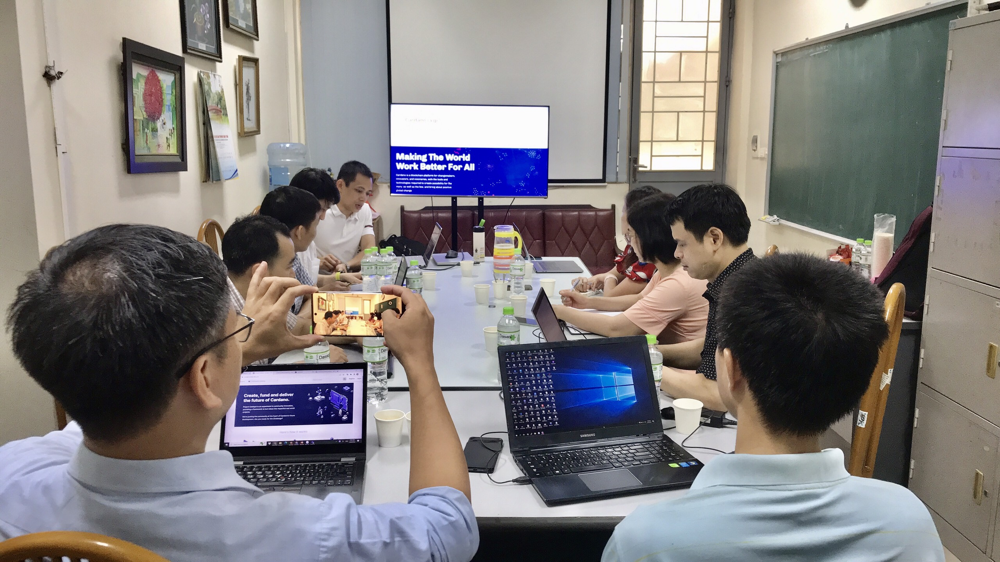
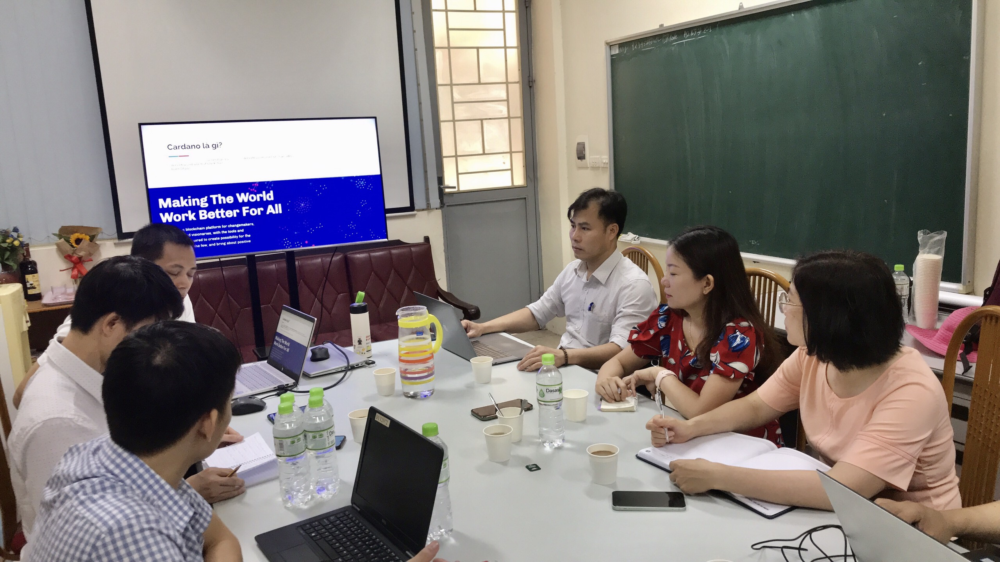
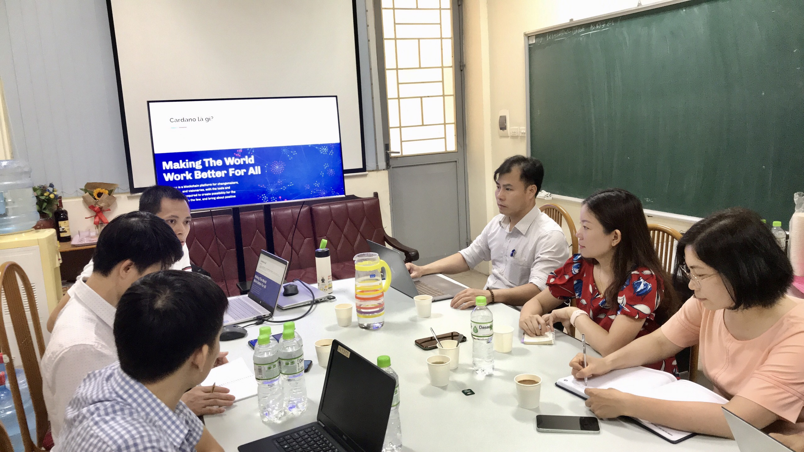

Chuỗi sự kiện Hội thảo chia sẻ về Blockchain Cardano và Catalyst
==========

**AMA buổi 1 về cách CA đánh giá một dự án cho sinh viên năm 3 khoa Công Nghệ thông tin - Đại học GTVT **

<iframe width="740" height="415" src="https://www.youtube.com/embed/jo-SMptqcWE" title="Bring smart contract to Vietnam - Func6 - Catalyst" frameborder="0" allow="accelerometer; autoplay; clipboard-write; encrypted-media; gyroscope; picture-in-picture" allowfullscreen></iframe>

**AMA buổi 2 về cách CA đánh giá một dự án cho sinh viên năm 3 khoa Công Nghệ thông tin - Đại học GTVT **

<iframe width="740" height="415" src="https://www.youtube.com/embed/Uue7joNZJpg" title="Bring smart contract to Vietnam - Func6 - Catalyst" frameborder="0" allow="accelerometer; autoplay; clipboard-write; encrypted-media; gyroscope; picture-in-picture" allowfullscreen></iframe>

## Hội thảo về Blockchain Cardano và Catalyst.

**Chia sẻ về cách viết một đề xuất tốt trên catalyst để được cấp vốn**

Mr Nguyễn Anh Tiến chia sẻ về Blockchain là gì và quỹ catalyst vận hành như thế nào.

Mr Nguyễn Anh Tiến chia sẻ về cách viết một đề xuất tốt.

Mr Nguyễn Anh Tiến chia sẻ về cách viết một đề xuất tốt.

Mr Nguyễn Anh Tiến chia sẻ về cách viết một đề xuất tốt.

## Hội thảo chia sẻ kỹ thuật về Dapp Connectors.