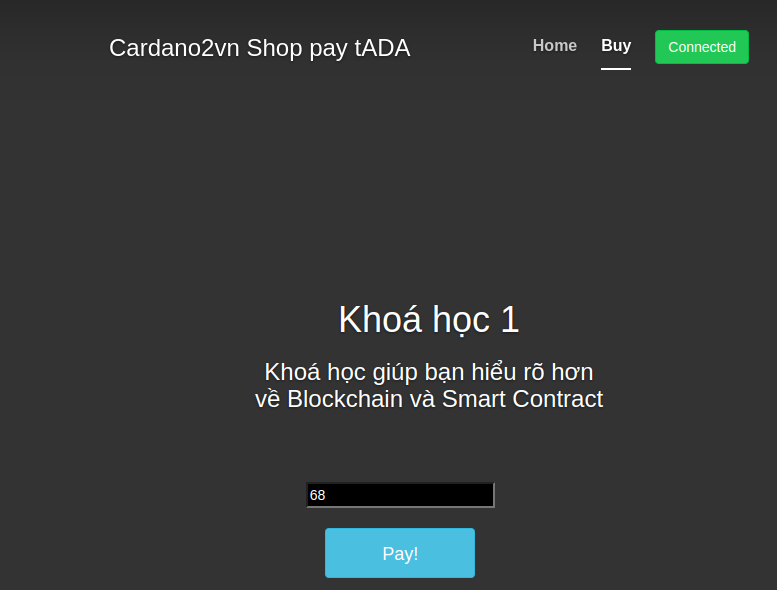
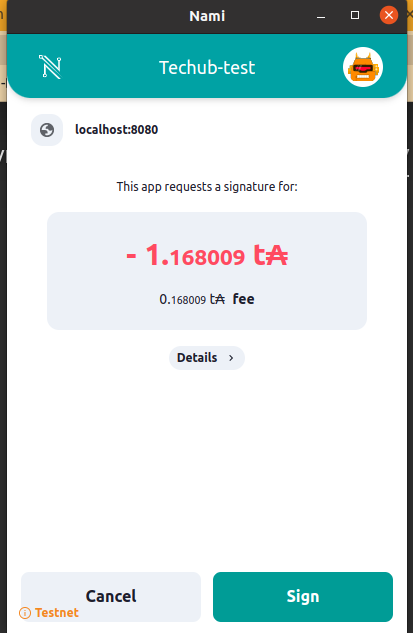
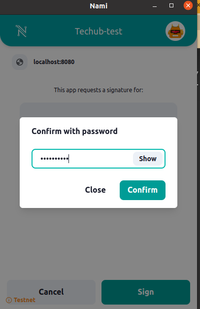
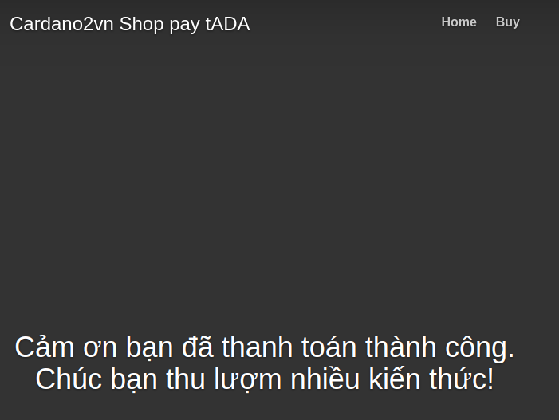

# Ví dụ về tạo một shop trả bằng tADA

Trong kho này, chúng tôi muốn chia sẻ cách triển khai các chức năng cơ bản của Ví Nami trên trang web của bạn. Bạn có thể thử nó [tại đây](http://hada-relay1.duckdns.org:1025/index.html)
Mã nguồn của nó [tại đây](https://github.com/cardano2vn/Shop-pay-ada)


## Cách sử dụng

Có nhiều lý do có thể khiến bạn muốn có chức năng lắng nghe các khoản thanh toán `ada`, nhưng một trường hợp sử dụng rất rõ ràng sẽ là đối với một thứ gì đó như **cửa hàng trực tuyến** hoặc **cổng thanh toán** có thể sử dụng token`ada` như một tiền tệ.


## Giới thiệu về Ví Nami

Ví Nami là một tiện ích mở rộng ví dựa trên trình duyệt để tương tác với chuỗi khối Cardano. Đó là một dự án mã nguồn mở và được xây dựng bởi Berry Pool.

Bạn có thể tải xuống ví cho các trình duyệt khác nhau tại đây ([https://namiwallet.io](https://namiwallet.io/))


## Cài đặt

Để chạy ứng dụng cục bộ, các bước cài đặt sau:


<b>Yêu cầu môi trường</b>

```
Ubuntu 20.04
NodeJS 14
```

Tải toàn bộ mã về máy tính của bạn

```
git clone https://github.com/cardano2vn/Shop-pay-ada.git
```

<b>Chạy project </b>

```
cd ../Shop-pay-ada

npm install
npm run dev
```
hoặc

```
npm run start

```
## Lưu ý

<b> Chỉnh sửa hình ảnh của item </b>

Tìm dòng sau trong buy.html và sửa đường dẫn ảnh src
```

```

<b>Chỉnh sửa giá tiền </b>

Tìm dòng sau trong ../src/pages/buy.html và sửa giá trị *value="68"*

```
<input type="number" id="cardano-offer" name="cardano-offer" value="68" style="background-color:black" readonly><br><br>
```
**Thay đổi địa chỉ ví nhận:**

với mạng Cardano testnet bạn lấy địa chỉ ví Nami Testnet có ký tự v=bắt đầu là *addr_test1*. Thay đổ trong hàm này *var address="...."*

```
async function triggerPay(x) {
    var user= await cardano.getUsedAddresses();
    var 	address="addr_test1qpu90ns7qdsxzzep9ly4d3jt2zc36npgx27gs7hdst7jq5lhdpyhy0xrvf6w8d7ugh2jkal3hrrytgs7rctcgrsfxvksjfsy3g"
    var offer = 1000 // parseInt($("#cardano-offer").value);

    if (x == 0)
        offer = document.getElementById("cardano-offer").value
    else
        offer = document.getElementById("cardano-offer1").value
	//offer = parseInt($("#cardano-offer").value);
    // WORKS
    return await pay(address, offer);
}

```

**Thay đổi khóa API Blockfrost**

Trước khi có thể sử dụng NamiWalletApi, bạn phải tạo một tài khoản để nhận khóa api blockfrost https://blockfrost.io/. * 'project_id': 'testnet1FmrwIDmsMhsHlJUGFIrL7RUqWZxnIno'*

```js
async function getProtocolParameters() {
    // use blockfrost api to get this data
    // blockfrostRequest will be undefined in this example
    // const latest_block = await blockfrostRequest('/blocks/latest')
    const latest_block = await fetch('https://cardano-testnet.blockfrost.io/api/v0/blocks/latest', {
        headers: {
          'Accept': 'application/json',
          'Content-Type': 'application/json',
          'project_id': 'testnet1FmrwIDmsMhsHlJUGFIrL7RUqWZxnIno'
        },
        method: 'GET'
    }).then((response) => response.json());
    var slotnumber = latest_block.slot;
    //console.log(slotnumber);
    
    const p = await fetch(`https://cardano-testnet.blockfrost.io/api/v0/epochs/latest/parameters`, {
        headers: {
          'Accept': 'application/json',
          'Content-Type': 'application/json',
          'project_id': 'testnet1FmrwIDmsMhsHlJUGFIrL7RUqWZxnIno'
        },
        method: 'GET'
    }).then((response) => response.json());
    if (p.status >= 400 && p.status < 600) {
        throw new Error("Bad response from server");
    }

    var value = {
        linearFee: S.LinearFee.new(
        S.BigNum.from_str(p.min_fee_a.toString()),
        S.BigNum.from_str(p.min_fee_b.toString())
        ),
        minUtxo: S.BigNum.from_str(p.min_utxo),
        poolDeposit: S.BigNum.from_str(p.pool_deposit),
        keyDeposit: S.BigNum.from_str(p.key_deposit),
        maxTxSize: p.max_tx_size,
        slot: slotnumber,
    };
    //console.log(value);
    return value;
};
```


<b>Chức năng một số hàm quan trọng (trong file ../src/js/wallet/buy.mjs)</b>

```
• activateCardano : Kết nối đến ví nami để có thể thực hiện giao dịch.
• getProtocolParameters : Kết nối đến blockfrost api và lấy các tham số cần thiết cho quá trình giao dịch
• triggerPay : kích hoạt thanh toán, lấy số lượng ada cần thanh toán ở giao diện sau đó gọi hàm pay để thanh toán một lượng amount đến địa chỉ address.

```
*Sau khi chạy web bạn sẽ thấy như sau*

Trang index.html là trang chủ ở đo bạn có thể thêm các sản phẩm như hình dưới đây


sau khi nhấn vào "Muangay" bạn sẽ thấy một trang thanh toán như hình sau



Bạn nhân vào Pay! trình duyệt hiện ra cửa sổ bạn Sign 



Bạn nhập Pass vào để ký



Khi đó bạn Sign thì cửa sổ thành công sẽ hiện ra như sau và kết thúc quá trình giao dịch.




-------------------------------------------

## Bắt đầu với code

Import Nami Wallet

```js
import NamiWalletApi, { Cardano } from './nami-js';

//React example
let nami; 
 useEffect(() => {
        async function t() {

            const S = await Cardano();
            nami = new NamiWalletApi(
                S,
                window.cardano,
               {
                0: "yourBlockfrostTestnetApiKey", // testnet
                1: "yourBlockfrostMainnetApiKey" // mainnet
                }   
            )
        }
        t()
    }, [])


```

Kiểm tra xem ví  Nami đã được cài đặt chưa 

```js
nami.isInstalled()
```

Kiểm tra xem Nami đã được bật chưa


```js
nami.isEnabled() 
```
Enable Nami

```js
nami.enable()
```
Nhận địa chỉ Bech32

```js
let address = nami.getAddress() 
console.log(address)
```
Định dạng Hex địa chỉ Nami

```js
nami.getHexAddress()
```
Nhận mạng lưới hiện tại của Nami

```js
let network = nami.getNetworkId()
console.log(network)
```

Nhận số dư và tài sản trong ví (lưu ý rằng số tiền có thể nhiều hơn số tiền được hiển thị trong ví nami vì nếu bạn giữ NFT, chúng sẽ giữ một số ADA của bạn)

```js
async nami.getBalance () : {lovelave: <amountLovelace>, assets: <assetList>}
```

Xây dựng giao dịch

```js
let transaction = await nami.transaction( PaymentAddress = "", 
recipients = [{address: "", amount: "0" ,assets:[],   mintedAssets: []}], 
metadata = null, 
metadataHash = null, 
addMetadata = true, 
utxosRaw = [],
networkId = 0, 
ttl = 3600, 
multiSig = false) 


// Example 

let transaction = await nami.transaction(
    PaymentAddress = "addr_test1qqe5eg44cq6805apc2wru7vk0tdn6weurckl9j0jwx958af8yp00jmh469gvx9vlyf6fwf9dfkjselmyvylm8yjyufuskfku3a", 
    utxos = (await nami.getUtxosHex()), 
    recipients = [{address:"addr_test1qqsjrwqv6uyu7gtwtzvhjceauj8axmrhssqf3cvxangadqzt5f4xjh3za5jug5rw9uykv2klc5c66uzahu65vajvfscs57k2ql","amount":"3",
    assets: [{unit:"5612bdcde30b1edf25823f62aa73c1b06831fb0f406c6c812da455db.TestNft", quantity: "1"}],  // Existing Assets
    mintedAssets:[{"assetName":"MyNFT","quantity":"1",
    "policyId":"Example PolicyID","policyScript":"ExamplePolicy"}] // NFTs to be minted
    ], // list of recipients
    metadata = {"721":
    {"8201828200581c334ca2b5c03477d3a1c29c3e79967adb3d3b3c1e2df2c9f2718b43f582051a030c5adf":
    {"MyNFT":{"name":"MyNFT","description":"This is a test NFT","image":"ipfs://QmUb8fW7qm1zCLhiKLcFH9yTCZ3hpsuKdkTgKmC8iFhxV8"}}}} //Metadata following NFT standard

```

Ký giao dịch


```js
const witness = await nami.signTx(transaction)
```

Xác nhận giao dịch với API blockfrost

```js
await nami.submitTx( transactionRaw,witnesses,scripts,networkId)

//Example 
let txHash = await nami.submitTx( {transactionRaw: transaction,
                witnesses: [witness],
                networkId : (await getNetworkId()).id))
console.log(txHash)
```

Tạo Policy Minitng 

```js
await nami.createLockingPolicyScript(address,  (await getNetworkId()).id , expirationTime)

// example policy that expires in 90 minutes from now
const expirationTime = new Date();
expirationTime.setTime(expirationTime.getTime() + (1 * 60 * 90 * 1000))

let policy = await nami.createLockingPolicyScript(await nami.getHexAddress(), networkId , expirationTime)
```

Băm Siêu dữ liệu (cần thiết để tạo đa chữ ký)

```js
nami.hashMetadata(metadata)
```
    


