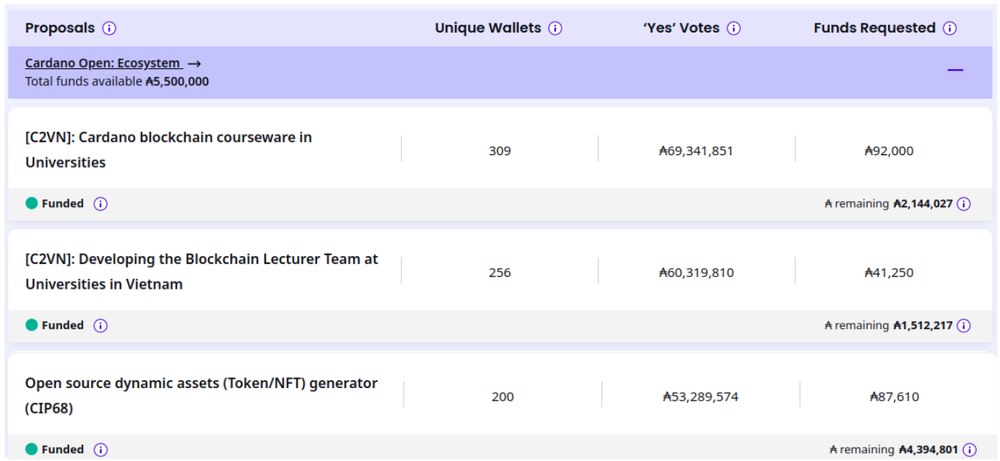

Kết quả của quỹ Catalyst Fund 12 đã có!
=====================================

ℹ️ [Kết quả chính thức](https://projectcatalyst.io/funds/12/voting-results) của Project Catalyst Fund 12 đã được công bố. Xin chúc mừng tất cả những người tham gia vòng này.

## Kết quả vòng bỏ phiếu F12

🤝 Vòng bỏ phiếu F12 kéo dài 14 ngày đã thu hút gần 2,5 tỷ ADA tham gia. Khoảng 7.000 ví đã bỏ phiếu với tổng cộng gần 300.000 phiếu bầu riêng lẻ, xác định 258 dự án được tài trợ trong vòng này. Điều này nâng tổng số dự án được tài trợ lên 1.891 trong suốt lịch sử của Catalyst, với gần 900 dự án hiện đã hoàn thành.

## C2VN trong Fund 12

🙇 Chúng tôi rất tự hào thông báo rằng C2VN đã được cộng đồng ủng hộ và may mắn được tài trợ ba dự án trong vòng này. Chúng tôi cam kết sẽ hoàn thành dự án một cách xuất sắc và đóng góp nhiều hơn nữa cho cộng đồng.

## Cảm ơn cộng đồng!

Chúng tôi xin gửi lời cảm ơn sâu sắc đến tất cả những người đã tham gia và bỏ phiếu trong vòng này. Sự ủng hộ của các bạn là nguồn động lực to lớn để chúng tôi tiếp tục cống hiến và phát triển. Hy vọng rằng các dự án được tài trợ trong Fund 12 sẽ góp phần mang lại nhiều giá trị và sự đổi mới cho cộng đồng Cardano.

Hãy cùng chúng tôi tiếp tục hành trình này và chào đón những thành tựu mới trong tương lai.
