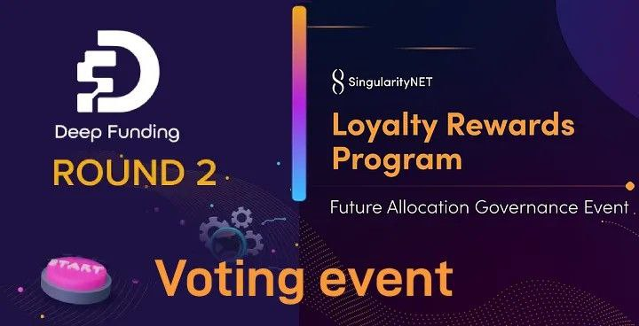

## Vòng tài trợ  số 2 và Phần thưởng trung thành — Kết quả sự kiện bỏ phiếu

Xin chào,
Chúng tôi rất vui mừng được chia sẻ điều mà nhiều bạn đang chờ đợi: **Kết quả của sự kiện bỏ phiếu cho vòng Tài trợ sâu thứ hai và nhóm Phần thưởng cho lòng trung thành.**

Chúng ta sẽ bắt đầu với Vòng gọi vốn thứ 2. Mặc dù đây mới chỉ là vòng gọi vốn thứ hai, nhưng chúng tôi đã thấy rất nhiều tiến bộ và rất nhiều đổi mới đang diễn ra:

**Xét từ góc độ lượng:**

- Số lượng đề xuất được gửi đã tăng gần gấp đôi về khối lượng
- Vòng này, chúng tôi đã có được 467 cá nhân (ID ví) đại diện cho tổng số 611 Ví, so với 158 ví riêng biệt trong vòng đầu tiên.

- Tổng số tiền khả dụng thấp hơn ở Vòng 1, nhưng chúng tôi vẫn tính có 17 dự án được trao giải, so với 12 dự án ở Vòng 1.

**Từ góc độ đổi mới:**

Đây là lần đầu tiên cổng bỏ phiếu của chúng tôi hỗ trợ cả token AGIX trên Cardano và AGIX trên Ethereum. Chúng tôi đã tạo một công cụ liên kết ví mà chúng tôi hy vọng sẽ sử dụng thường xuyên hơn cho các hoạt động như thế này. Hơn nữa, sau thử nghiệm thành công trong vòng Quản trị (đầu tiên) của chúng tôi, giờ đây chúng tôi đã giới thiệu biểu quyết bậc hai và trọng số biểu quyết dựa trên danh tiếng trong vòng Cấp vốn Deep Funding này . Chúng tôi cũng đã giới thiệu một số nhóm mới một phần là kết quả của vòng Quản trị trước đó.

Cuối cùng nhưng không kém phần quan trọng, về mặt tổ chức, chúng tôi đã triển khai thành công quy trình đánh giá tính đủ điều kiện dựa vào cộng đồng và quy trình đề xuất 'đánh giá ngang hàng' đầu tiên, được thực hiện bởi các nhóm được trao giải từ vòng 2. Và danh sách này thậm chí còn chưa đầy đủ!

Chúng tôi rất tự hào về những gì chúng tôi đã đạt được cho đến nay và vô cùng biết ơn tất cả các thành viên cộng đồng đã tham gia cùng chúng tôi và với các nhóm đề xuất trong những tuần và tháng qua. Gửi tới tất cả các thành viên cộng đồng đã dành thời gian và công sức để xem xét các đề xuất và đưa ra phản hồi có giá trị, tới nhóm đã đứng lên và giúp chúng tôi đánh giá các đề xuất dựa trên các điều kiện chính thức của chúng tôi, tới các nhóm được trao giải từ vòng một đã tình nguyện giúp đỡ thử nghiệm đề xuất của chúng tôi và cuối cùng nhưng không kém phần quan trọng, dành cho tất cả các thành viên cộng đồng đã gặp khó khăn khi kết nối ví của họ và đưa ra phiếu bầu của họ. Chúng tôi nợ tất cả các bạn một LỜI CẢM ƠN LỚN!

Tất nhiên, chúng tôi sẽ đền bù cho các thành viên cộng đồng tích cực nhất của mình dựa trên điểm danh tiếng mà họ đã thu thập được trong vòng này bằng một số AGIX. Thông tin chi tiết về vấn đề này sẽ được cung cấp sau khi chúng tôi đi sâu vào kết quả của vòng này và chia sẻ phân tích của chúng tôi về quy trình.

Dưới đây, tìm danh sách tất cả các đội đã được thưởng với số tiền họ yêu cầu. Thông tin chi tiết về kết quả và điểm số của tất cả các dự án tham gia có thể được tìm thấy [trong danh sách này](https://docs.google.com/spreadsheets/d/1DTi88ZhC4kBNGwkndge6Y76GLIwxdALNH8px7xa48r4/edit#gid=0) .

## Nhóm A — Dự án mới
**Tiêu đề: **Integration of Mainstream Open-Source AIs

Người đề xuất: Eric Duneau 

Số tiền được trao : $39.500 

[Đọc thêm](https://proposals.deepfunding.ai/graduated/under-review/9ad5eb8a-5b19-41fb-a5d9-52b6d18e0844)

**Tiêu đề: **SIBYL: The General-Purpose Forecaster

Người đề xuất: Kevin RC 

Số tiền được trao: $84.000 

[Đọc thêm](https://proposals.deepfunding.ai/collaborate/ed38f079-3cf9-4a58-9482-7641294c7325)

**Tiêu đề: **Automated HuggingFace to SNET Pipeline

Người đề xuất: Soubir Acharya 

Số tiền được trao: 75.000 đô la 

[Đọc thêm](https://proposals.deepfunding.ai/collaborate/af00ad1a-0df4-4d15-9ab7-6d0c50235e06)

**Tiêu đề: **Connecting SingularityNET to DataUnion.app

Người đề xuất: Robin Lehmann 

Số tiền được trao: $75.000 

[Đọc thêm](https://proposals.deepfunding.ai/collaborate/762f2bbf-d89e-4e88-a506-81842665fcfc)

## Nhóm B — Các dịch vụ AI hiện có

**Tiêu đề: **Onboard NeuralProphet: a hybrid time-series forecasting library

Người đề xuất: Kevin RC 

Số tiền được trao: $14.000 

[Đọc thêm](https://proposals.deepfunding.ai/collaborate/1b162d11-07d3-45d7-ba68-561d5623b20b)

**Tiêu đề: **GPT for sNET & Cardano

Người đề xuất: Singularity Swarm 

Số tiền được trao: $15.000 

[Đọc thêm](https://proposals.deepfunding.ai/collaborate/ce582fd2-957a-4c33-a025-06435cdd591d)

**Tiêu đề: **Computer vison based farm status and recommender system

Người đề xuất: Ubio Obu 

Số tiền được trao: 20.000 đô la 

[Đọc thêm](https://proposals.deepfunding.ai/collaborate/ce582fd2-957a-4c33-a025-06435cdd591d)

**Tiêu đề: **Upgrade of the Stable Diffusion service

Người đề xuất: Eric Duneau 

Số tiền được trao: $13.500 

[Đọc thêm](https://proposals.deepfunding.ai/collaborate/95bc667c-e3e6-4235-a595-5c455564c6c0)

**Tiêu đề: **Knowledge-Based Question Answering System

Người đề xuất: Mukhtar A.Algezoli 

Số tiền được trao: 20.000 đô la 

[Đọc thêm](https://proposals.deepfunding.ai/collaborate/2c3c088b-5b6a-487a-bc45-db4843cd6d25)

## Nhóm C — Dự án trong giai đoạn ý tưởng

**Tiêu đề: **Community based mentorship

Người đề xuất: Harry Hellyer 

Số tiền được trao: $2.400 

[Đọc thêm](https://proposals.deepfunding.ai/graduated/under-review/2469fe5b-9bf6-483f-b384-5825cb0a615c)

## Nhóm D — Các sáng kiến ​​tiếp thị

**Tiêu đề: **Developer Relations Campaign for SingularityNET

Người đề xuất: Anthony Olik 
Số tiền được trao: $5.000 
[Đọc thêm](https://proposals.deepfunding.ai/graduated/under-review/924d3dbb-d284-4a60-a0bd-fbc24a84e079)

**Tiêu đề: **Improve Deep Funding Social Media & Publicity

đề xuất: Mauro Andreoli 

Số tiền được trao: $4.300 

[Đọc thêm](https://proposals.deepfunding.ai/collaborate/830307a3-a551-426a-b3c6-57b70b6f89d0)

**Tiêu đề: **SNET 360 events at the universities

Người đề xuất: Cardano2VN 

Số tiền được trao: $9.890 

[Đọc thêm](https://proposals.deepfunding.ai/collaborate/adf04eec-66da-4de1-bcc6-1c2730ece80c)

**Tiêu đề: **Building Community Town Halls

Người đề xuất: Singularity Swarm 

Số tiền được trao: $4.000 

[Đọc thêm](https://proposals.deepfunding.ai/collaborate/5283ea7a-8b63-4a31-aaad-188bcf5bf979)

## Nhóm E — Dụng cụ
**Tiêu đề: **Community Contribution Scores

Người đề xuất: William Thistleton 

Số tiền được trao: $37,472 

[Đọc thêm](https://proposals.deepfunding.ai/collaborate/a2a7307c-9467-4539-b686-33c12ccfdef0)

**Tiêu đề: **Acquiring insight by using ML and a Jupyter notebook with direct access to Blockchain data.

Người đề xuất: Federico Weill 

Số tiền được trao: 25.000 đô la 

[Đọc thêm](https://proposals.deepfunding.ai/collaborate/83e6c5ad-af6d-46ae-a50e-d5f6bb924281)

**Tiêu đề: ** Agreement Building Platform

Người đề xuất: Aharon Porath 

Số tiền được trao: $5.000 

[Đọc thêm](https://proposals.deepfunding.ai/collaborate/f93fb244-88b6-4bb5-bbe4-d0ff469861ac)

**Chúng tôi rất vui mừng chào đón những dự án này và các đội của họ đến với gia đình các đội được trao giải của chúng tôi!**

## Phần thưởng trung thành — Quản trị cộng đồng

Sự kiện quản trị không chỉ đề cập đến Vòng tài trợ số 2 mà còn là câu hỏi về cách phân bổ nhóm Phần thưởng trung thành của mã thông báo Giai đoạn hai.

Xin nhắc lại, đây là nội dung của kế hoạch Giai đoạn Hai về điều này:

Việc sử dụng nhóm mã thông báo Phần thưởng trung thành sau năm đầu tiên có thể được thay đổi thông qua bỏ phiếu dân chủ của chủ sở hữu mã thông báo. -[trích từ Đề xuất Giai đoạn Hai của SingularityNET , trang 20.](https://rebrand.ly/SNPhase2)

Câu hỏi đầu tiên được hỏi trực tiếp: Chúng tôi có muốn thay đổi yêu cầu ảnh chụp nhanh hardfork hiện tại để đủ điều kiện nhận Phần thưởng trung thành không? Câu trả lời là, với 4.124.352 mã thông báo (13%) ủng hộ và 27.550.384 mã thông báo (87%) chống lại.
Các kết quả chỉ ra rõ ràng là KHÔNG thay đổi yêu cầu hardfork hiện tại hoặc phân bổ nhóm, vì vậy, nói một cách đơn giản, đó là những gì chúng tôi sẽ làm.

Do tính chất của các câu hỏi, tùy thuộc vào việc chúng tôi có muốn thay đổi bất kỳ điều gì đối với các yêu cầu hardfork hiện tại ngay từ đầu hay không, các câu hỏi tiếp theo và câu trả lời của chúng trở nên không liên quan. Chúng tôi sẽ đưa ra một cái nhìn tổng quan ngắn:
Về thời gian chụp nhanh, nếu nó không dựa trên hardfork, thì một hệ thống phân cấp cho nhiều giai đoạn sẽ được ưu tiên hơn (92%).

Về việc phân bổ nhóm, một ưu tiên mạnh mẽ đã được chỉ ra là giữ nguyên mọi thứ, với tất cả các phương án được đề xuất đều nhận được đa số phiếu bầu KHÔNG phân bổ nhóm cho nhóm đó. Theo thứ tự phổ biến, các phân bổ thay thế như sau: phần thưởng đặt cược Ethereum, phần thưởng đặt cược Cardano, kho bạc Chương trình Đại sứ và cuối cùng là ưu đãi LP.

Trước khi sự kiện quản trị diễn ra, nó đã được thảo luận và đồng ý xem xét lại các khoản phân bổ trong một năm kể từ bây giờ, để có khả năng xem xét lại nó. Điều này sẽ diễn ra sau khi phân bổ Năm 2 đã được phân phối.

Một cuộc gọi cộng đồng để thảo luận về kết quả quản trị cộng đồng được lên kế hoạch vào Thứ Hai ngày 3 tháng 4, 18 UTC, [trên máy chủ Discord](https://discord.gg/snet) của chúng tôi . Điều này sẽ được ghi lại và cung cấp trên kênh Youtube của chúng tôi. Các kết quả rất rõ ràng và các cuộc thảo luận về giải thích sẽ đơn giản. Chúng tôi cảm thấy thật tốt khi tạo cơ hội chia sẻ suy nghĩ trong cài đặt cuộc gọi mở, vì vậy chúng tôi hy vọng sẽ thấy bạn tham gia.

Chúng tôi muốn gửi lời cảm ơn đặc biệt đến tất cả những người đã tham gia các phiên thảo luận và những người đã bình chọn!

[Nguồn tại đây](https://blog.singularitynet.io/deep-funding-round-2-and-loyalty-rewards-voting-event-results-2b5b170eb554)

