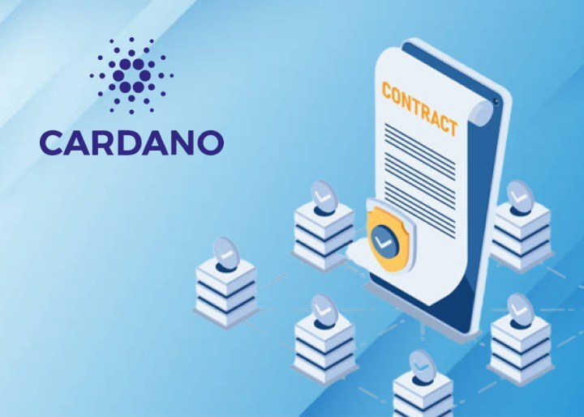

Nhìn chung, sự phát triển của hệ sinh thái tiền điện tử bị chi phối rất nhiều bởi các ngôn ngữ EVM như Solidity và Vyper, mặc dù một số ngôn ngữ dành riêng cho miền khác như Cairo đang bắt đầu chiếm thị phần. Các ngôn ngữ EVM phổ biến này có thể truy cập được đối với các nhà phát triển hệ sinh thái Cardano thông qua các chuỗi bên tương thích với EVM của nó. Milkomeda thậm chí còn có kế hoạch phát triển một
tính năng
cho phép người dùng Cardano tương tác với các hợp đồng thông minh EVM trực tiếp từ bất kỳ ví Cardano nào.

Các nhà phát triển Cardano đang xây dựng công cụ dành cho nhà phát triển để hỗ trợ nhiều ngôn ngữ, không chỉ Solidity.

- [opShin](https://twitter.com/OpShinDev) là ngôn ngữ và bộ công cụ hợp đồng thông minh dựa trên Python được phát hành vào Q1. Nó biên dịch mã Python 3 thành Hợp đồng hợp đồng thông minh Cardano.

- [Plu-ts](https://pluts.harmoniclabs.tech/) là một ngôn ngữ hợp đồng thông minh dựa trên Typescript. [V0.2.1](https://twitter.com/plu_ts/status/1634322526993096706) đã được phát hành trong Q1.

- [Aiken](https://github.com/txpipe/aiken) là một ngôn ngữ hợp đồng thông minh Cardano và chuỗi công cụ.

- [Helios](https://github.com/Hyperion-BT/Helios) là một ngôn ngữ dành riêng cho miền (DSL) biên dịch thành Plutus Core (tức là các tập lệnh xác thực trên chuỗi Cardano). Helios là một giải pháp thay thế không phải Haskell cho Plutus.

- [Marlowe](https://marlowe-finance.io/) là một DSL được phát triển bởi IOG để viết và thực hiện các hợp đồng thông minh tài chính.

Python và Typescript là hai trong số các ngôn ngữ lập trình phổ biến nhất nói chung và EVM's Solidity là ngôn ngữ phổ biến nhất dành cho các nhà phát triển Web3. Bất kỳ công cụ nào hỗ trợ các ngôn ngữ này sẽ mở ra cơ hội cho cả nhà phát triển mới và hiện có.
