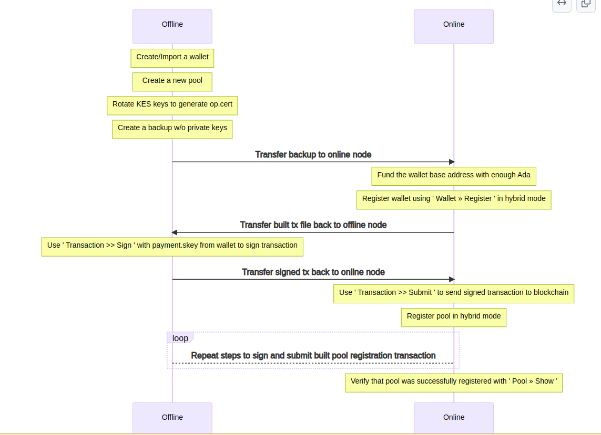

# Quy trình tạo ví và pool bằng cntools bảo mật tối đa

:::important

 	- Đảm bảo có sẵn [Điều kiện tiên quyết](https://www.cardano2vn.io/docs/stake-pool-course/cntools/air-gap) 
 	- Kiểm tra hoạt động cho tập lệnh này sử dụng hệ điều hành Fedora / CentOS / RHEL / Ubuntu
 	- Luôn sử dụng mạng Testnet trước để làm quen, đọc đầy đủ các cảnh báo/tin nhắn, duy trì khóa/sao lưu của bạn bằng mật khẩu (không ai khác ngoài bạn có thể lấy lại tiền nếu bạn gặp tai nạn), trước khi thực hiện các hành động trên mainnet.
:::
CNTools giống như một con dao đa năng cho các nhà khai thác pool để đơn giản hóa các hoạt động liên quan đến khóa ví và quản lý pool của họ. Xin lưu ý rằng công cụ này chỉ nhằm mục đích đơn giản hóa các tác vụ thông thường cho người dùng, nhưng nó **KHÔNG** được coi là cái cớ để bỏ qua việc hiểu cách làm việc thủ công thông qua các khái niệm cơ bản về hoạt động Linux. Các kỹ năng được đánh dấu trên trang chủ là điều tối quan trọng đối với người điều hành nhóm cổ phần, và sự hiểu biết về các tệp cấu hình và mạng cũng vậy. Hãy đảm bảo rằng bạn đã đọc và hiểu các tuyên bố từ chối trách nhiệm trước khi tiếp tục.

## Tổng quan

Công cụ này bao gồm ba tệp  

- `cntools.sh` - kịch bản chính để khởi chạy cntools.
- `cntools.library` - tập lệnh nội bộ với các chức năng trợ giúp.

Ngoài các tệp trên, còn có các biến phụ thuộc vào file `env`. CNTools kết nối với nút của bạn thông qua cấu hình trong `env` nằm trong cùng thư mục với `Scripts`. Tùy chỉnh `env` and `cntools.sh` theo cách của bạn.


CNTools can operate in following modes:

- Advanced - Khi CNTools được khởi chạy với đối số `-a`, điều này khởi chạy CNTools hiển thị menu `Advanced`, cho phép người dùng quản lý **(create/mint/burn)** tài sản mới.
- Online: không có tham số-Khi tất cả các khóa ví và nhóm có sẵn trên nút nóng, hãy sử dụng tùy chọn này. 
- Hybrid - Khi chạy ở chế độ online, tùy chọn này có thể được sử dụng trong menu để tạo tệp giao dịch offline có thể được chuyển đến CNTools offline để ký.
- Offline - Khi chạy CNTools với đối số `-o` , this launches CNTools with limited set of features. điều này sẽ khởi chạy CNTools với bộ tính năng hạn chế. Chế độ này **không yêu cầu quyền truy cập vào cardano-node** . INó chủ yếu được sử dụng để tạo `Wallet / Pool` và truy cập `Transaction >> Sign` để ký tệp giao dịch offline được tạo ở chế độ Hybrid mode.

#### Hardware Wallet
CNTools bao gồm hỗ trợ ví phần cứng kể từ phiên bản `7.0.0` thông qua ứng dụng Vacuumlabs `cardano-hw-cli`. Khởi tạo và cập nhật chương trình cơ sở / ứng dụng trên thiết bị lên phiên bản mới nhất trước khi sử dụng theo hướng dẫn của nhà sản xuất.

Để kích hoạt hỗ trợ phần cứng chạy `prereqs.sh -w`. TĐiều này tải xuống và cài đặt Vacuumlabs  `cardano-hw-cli` bao gồm `udev`. Khi phiên bản mới của Vacuumlabs `cardano-hw-cli` được phát hành, chạy `prereqs.sh -w` để cập nhật. Đối với các tùy chọn chạy bổ sung, hãy chạy `prereqs.sh -h`.

=== "Ledger"

	- Thiết bị được hỗ trợ: Nano S / Nano X  
	- Đảm bảo rằng ứng dụng cardano mới nhất được cài đặt trên thiết bị.

=== "Trezor"

    - Thiết bị hỗ trợ: Model T
    - Đảm bảo rằng chương trình cơ sở mới nhất đã được cài đặt trên thiết bị. Ngoài ra, hãy cài đặt `Trezor Bridge` cho hệ thống của bạn trước khi cố gắng sử dụng thiết bị Trezor của bạn trong CNTools. Bạn có thể tìm thấy phiên bản mới nhất của cây cầu tại https://wallet.trezor.io/#/bridge

## Offline Workflow

CNTools có thể chạy ở chế độ trực tuyến và ngoại tuyến. Ở cấp độ rất cao, để làm việc với các thiết bị ngoại tuyến, hãy nhớ rằng bạn cần sử dụng CNTools trong một nút trực tuyến để tạo giao dịch cho loại giao dịch mong muốn và sau đó di chuyển giao dịch giai đoạn sang một nút ngoại tuyến để ký (ủy quyền) bằng cách sử dụng các khóa ký trên nút ngoại tuyến (Air-gap) của bạn - và sau đó đưa giao dịch đã ký trở lại nút trực tuyến để gửi cho chuỗi.

Đối với quy trình làm việc ngoại tuyến, tất cả các khóa ví và nhóm phải được giữ trên nút ngoại tuyến (Air-gap). Chức năng sao lưu trong CNTools có một tùy chọn để tạo bản sao lưu mà không có khóa riêng (khóa ký nhạy cảm) để được chuyển đến nút trực tuyến. Tất cả các tệp khác được bao gồm trong bản sao lưu để được chuyển đến nút trực tuyến

Các khóa bị loại trừ khỏi bản sao lưu khi được tạo mà không có khóa cá nhân:

>**Wallet** - `payment.skey`, `stake.skey`
>
>**Pool**   - `cold.skey`

:::important
Lưu ý rằng việc thiết lập một máy chủ ofline ([Air-gap](https://www.cardano2vn.io/docs/stake-pool-course/cntools/air-gap)) yêu cầu nền hệ điều hành **sạch** (bạn cần biết cách thiết lập máy chủ của mình với kho lưu trữ nhân bản ngoại tuyến, cách chuyển tệp qua và khá quen thuộc với bố cục đĩa của các công cụ guild).  `prereqs.sh` trong trạng thái hiện tại dự kiến ​​sẽ không chạy trên máy ngoại tuyến. 
:::

Về cơ bản bạn chỉ cần các file nhị phân `cardano-cli`, `bech32`, `cardano-address`và `$PATH` cần thêm các tùy thuộc `jq`, `coreutils`, `pkgconfig`, `gcc-c++` and `bc`, và có lẽ là một bản sao từ thư mục trực tuyến của bạn (để đảm bảo bạn có quyền) trên máy chủ ngoại tuyến của bạn. Chúng tôi thực sự khuyên bạn nên tự làm quen với quy trình làm việc trên các mạng testnet trước khi thử trên mainnet.


## Quy trình làm việc mẫu để tạo ví và pool:





:::important
- Với quy trình này bạn phải tuân thủ để đảm bảo bảo mật tất các skey quan trọng. (Tạo ví và tạo pool toàn bộ trên máy Air-gap rồi copy các file trừ các **key quan trọng** nêu ở trên)
- Ngoài ra chúng ta sử dụng ví trên Blockchain Cardano băng cardano-cli thực hiện theo cách này là an toàn và bảo mật nhất.
:::

=== "Online mode"

    để chạy CNTools ở chế độ Online (advanced) Mode, bạn truy cập từ đây `$CNODE_HOME/scripts/`:
    ```
    cd $CNODE_HOME/scripts
    ./cntools.sh -a
    ```

    màn hình giống như thế nàys:

    ```
    ~~~~~~~~~~~~~~~~~~~~~~~~~~~~~~~~~~~~~~~~~~~~~~~~~~~~~~~~~~~~~~~~~~~~~~~~~~~~~~~~~~~~
     >> CNTools vX.X.X - Guild - CONNECTED <<            A Guild Operators collaboration
    ~~~~~~~~~~~~~~~~~~~~~~~~~~~~~~~~~~~~~~~~~~~~~~~~~~~~~~~~~~~~~~~~~~~~~~~~~~~~~~~~~~~~
     Main Menu    Telegram Announcement / Support channel: t.me/guild_operators_official
    
     ) Wallet      - create, show, remove and protect wallets
     ) Funds       - send, withdraw and delegate
     ) Pool        - pool creation and management
     ) Transaction - Sign and Submit a cold transaction (hybrid/offline mode)
     ) Blocks      - show core node leader schedule & block production statistics
     ) Backup      - backup & restore of wallet/pool/config
     ) Advanced    - Developer and advanced features: metadata, multi-assets, ...
     ) Refresh     - reload home screen content
    ~~~~~~~~~~~~~~~~~~~~~~~~~~~~~~~~~~~~~~~~~~~~~~~~~~~~~~~~~~~~~~~~~~~~~~~~~~~~~~~~~~~~
                                                      Epoch 370 - 3d 19:08:27 until next
     What would you like to do?                                         Node Sync: 12 :)
    
      [w] Wallet
      [f] Funds
      [p] Pool
      [t] Transaction
      [b] Blocks
      [u] Update
      [z] Backup & Restore
      [a] Advanced
      [r] Refresh
      [q] Quit
    ```

=== "Offline mode"

    TChạy CNTools ở chế độ Offline, bạn truy cập từ đây `$CNODE_HOME/scripts/` sử dụng đối số `-o`:
    ```
    cd $CNODE_HOME/scripts
    ./cntools.sh -o
    ```
    
    Chế độ offleine trong như thế này
    ```
    ~~~~~~~~~~~~~~~~~~~~~~~~~~~~~~~~~~~~~~~~~~~~~~~~~~~~~~~~~~~~~~~~~~~~~~~~~~~~~~~~~~~~
     >> CNTools vX.X.X - Guild - OFFLINE <<              A Guild Operators collaboration
    ~~~~~~~~~~~~~~~~~~~~~~~~~~~~~~~~~~~~~~~~~~~~~~~~~~~~~~~~~~~~~~~~~~~~~~~~~~~~~~~~~~~~
     Main Menu    Telegram Announcement / Support channel: t.me/guild_operators_official
    
     ) Wallet      - create, show, remove and protect wallets
     ) Funds       - send, withdraw and delegate
     ) Pool        - pool creation and management
     ) Transaction - Sign and Submit a cold transaction (hybrid/offline mode)
    
     ) Backup      - backup & restore of wallet/pool/config
    
     ) Refresh     - reload home screen content
    ~~~~~~~~~~~~~~~~~~~~~~~~~~~~~~~~~~~~~~~~~~~~~~~~~~~~~~~~~~~~~~~~~~~~~~~~~~~~~~~~~~~~
                                                      Epoch 370 - 3d 19:03:46 until next
     What would you like to do?
    
      [w] Wallet
      [f] Funds
      [p] Pool
      [t] Transaction
      [z] Backup & Restore
      [r] Refresh
      [q] Quit
    ```
