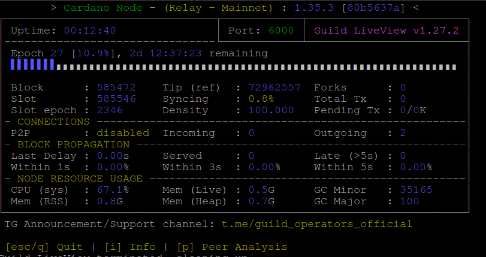

# Cài đặt node trên mạng mainnet Cardano

## A. Tạo user
```
sudo adduser c2vn
sudo usermod -aG sudo c2vn
sudo su - c2vn
sudo whoami
```
## B1. Cài đặt cập nhật các thành phần bổ trợ. 
```
sudo apt-get update -y
sudo apt-get upgrade -y
sudo apt-get  install libsodium-dev bsdmainutils  unzip git make tmux rsync htop curl build-essential pkg-config libffi-dev libgmp-dev libssl-dev libtinfo-dev libsystemd-dev zlib1g-dev make g++ git  wget  libtool autoconf nload  nano cron libncursesw5 jq -y
```

## B2. Cài đặt thư viện libsodium.

```
mkdir $HOME/git	
cd $HOME/git	
git clone https://github.com/input-output-hk/libsodium	
cd libsodium	
git checkout 66f017f1	
./autogen.sh	
./configure	
```	

```		
make	
sudo make install	
```	
```	
echo export LD_LIBRARY_PATH=/usr/local/lib:$LD_LIBRARY_PATH >> $HOME/.bashrc
echo [ -f "/home/hadavn1/.ghcup/env" ] && source "/home/hadavn1/.ghcup/env" >> $HOME/.bashrc 
source ~/.bashrc
```


## B3. tạo Cấu trúc thư mục cntool
```
sudo whoami
mkdir "$HOME/tmp";
cd "$HOME/tmp"
curl -sS -o prereqs.sh https://raw.githubusercontent.com/cardano-community/guild-operators/master/scripts/cnode-helper-scripts/prereqs.sh       
chmod 755 prereqs.sh
./prereqs.sh -f
```


## B4. Cập nhật PATH

```
echo export PATH=~/.cabal/bin:$PATH >> ~/.bashrc
export LD_LIBRARY_PATH="/usr/local/lib:$LD_LIBRARY_PATH" 
export PKG_CONFIG_PATH="/usr/local/lib/pkgconfig:$PKG_CONFIG_PATH"
echo export CNODE_HOME=/opt/cardano/cnode  >> $HOME/.bashrc

echo export CARDANO_NODE_SOCKET_PATH="$CNODE_HOME/sockets/node0.socket" >> $HOME/.bashrc
source ~/.bashrc
```


```
echo export PATH="$HOME/.cargo/bin:$PATH" >> ~/.bashrc
source ~/.bashrc
```


## B5. Downloan Cardano-node, cardano-cli

```
cd ~/.cabal/bin

sudo wget https://hydra.iohk.io/build/17428010/download/1/cardano-node-1.35.3-linux.tar.gz
sudo tar zxvf cardano-node-1.35.3-linux.tar.gz
```
** Kiểm tra version**

```
cardano-cli --version
cardano-node --version
```

## B6. Tạo systemctl cnode

```
cd $CNODE_HOME/scripts
./deploy-as-systemd.sh
```

```
sudo systemctl stop cnode
sudo systemctl restart cnode
```
## B7. Xem kết quả

```

cd $CNODE_HOME/scripts
./gLiveView.sh
```




