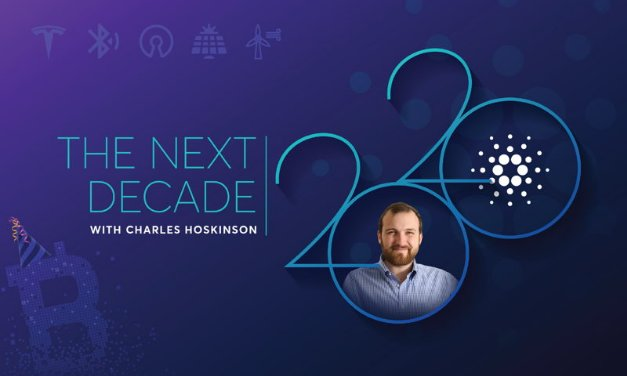

# Một thập kỷ của blockchain và dự đoán trong tương lai

### **Bitcoin đã đi cùng chúng ta trong hơn một thập kỷ. Bây giờ, chúng ta sẽ tiến vào thập kỷ Cardano**

9 tháng 1 năm 2020[Charles Hoskinson](tmp//en/blog/authors/charles-hoskinson/page-1/)9 phút đọc

### [**Charles Hoskinson**](tmp//en/blog/authors/charles-hoskinson/page-1/)

Chief Executive Officer

Founder

- 
- 
- 

Giờ là tháng 1 năm 2020 và đó không chỉ là sự bắt đầu của 1 thập kỷ mới, mà còn là sinh nhật thứ 11 của bitcoin. Tài sản ảo đầu tiên trên thế giới được cung cấp cho công chúng vào ngày 3 tháng 1 năm 2009. Kể từ đó đã là một thập kỷ, và tôi rất vui mừng về sự thay đổi trong 10 năm tới: một thập kỷ sẽ mang lại rất nhiều điều thú vị cho thế giới.

## **Sự phát triển nhanh chóng của công nghệ blockchain**

Bitcoin luôn  rất đặc biệt đối với tôi. Đó là lời giới thiệu của tôi về tất cả các vấn đề tuyệt vời để suy nghĩ trên thế giới, như chuyển tiền và tài chính vi mô. Thật khó tin khi nghĩ rằng một nhóm nhỏ -  ragtag đã đưa bitcoin đến với công chúng, điều đã thay đổi không chỉ cuộc sống của tôi mà còn cuộc sống của nhiều người  trên khắp thế giới, tạo nên một phong trào toàn cầu. Giờ đây, hàng triệu người thức dậy mỗi ngày và suy nghĩ về tiền mã hóa và công nghệ blockchain. Hàng trăm, nếu không muốn nói là hàng nghìn bài báo học thuật đã được viết về chủ đề này. Ảnh hưởng của nó đã rất sâu sắc và chỉ mới bắt đầu.

G20 và G7 đã bắt đầu nói về nó. Chúng tôi đang thấy các sự thay đổi trên toàn cầu . Mọi ngân hàng trung ương trên thế giới đều biết đến tài sản ảo và một số ngân hàng thậm chí đang nắm giữ chúng. Điều này thật đáng kinh ngạc vì chưa từng có lần nào trong lịch sử loài người mà một phần của công nghệ lại đạt được mức độ liên quan toàn cầu to lớn như vậy mà không có nỗ lực phối hợp tập trung thông qua tiếp thị, phát triển và kiểm soát. Không ai kiểm soát bitcoin. Điều đó đúng với 11 năm trước, nó vẫn đúng cho tới bây giờ, và cuộc cách mạng chỉ mới bắt đầu.

## **Chúng ta có thể mong đợi những gì trong thập kỷ tới**

Chúc mừng sinh nhật bitcoin. Và chào mừng đến với thập kỷ mới. Tôi rất mong chờ 10 năm tới để xem công nghệ này sẽ đưa chúng ta đến đâu. Năm 2010 đến 2019 thật điên rồ và tôi tin rằng năm 2020 đến 2029 sẽ rất thú vị. Trong thập kỷ tới, chúng ta sẽ thấy những giao diện não bộ/máy tính đầu tiên dành cho các thiết bị tiêu dùng được cấy ghép vào người; ví dụ, [ren thần kinh](https://www.techworld.com/data/what-is-neural-lace-3657074/) . Chúng ta cũng sẽ thấy sự gia tăng của du hành vũ trụ tư nhân. Trong vòng mười năm tới, thực tế ảo và tương tác thực tế ảo sẽ trở thành xu hướng chính thay vì chỉ là những thứ giải trí như hiện nay.

Viễn thông, năng lượng và giao thông vận tải cũng sẽ có sự thay đổi lớn. Công nghệ điện thoại di động có thể sẽ phát triển gấp đôi so với hiện nay.Tesla đã chứng minh được mô hình của mình, giờ đây chúng ta đã thấy sự phát triển của các loại xe điện. Điều này có nghĩa là công nghệ pin sẽ ngày càng tốt hơn. Có khả năng mật độ pin sẽ tăng gấp đôi hoặc gấp bốn lần trong mười năm tới. Điều này có nghĩa là chúng ta sẽ thấy những chiếc xe có thể đi được từ 600 đến 1.200 dặm trong một lần sạc. Trong khi đó, công suất năng lượng mặt trời và năng lượng gió sẽ tăng gấp đôi, nếu không muốn nói là tăng gấp bốn lần.

Nghiên cứu vật lý đang tiến bộ nhanh chóng và chúng tôi tin rằng thập kỷ tới sẽ được chứng kiến máy tính lượng tử chính thống. Gần đây tôi đã đọc được rằng dịch chuyển lượng tử đã xảy ra [giữa hai con chip](https://phys.org/news/2019-12-chip-to-chip-quantum-teleportation-harnessing-silicon.html) . Trong khi đó, 5G sẽ lan rộng khắp thế giới và các công nghệ như WiFi và Bluetooth chỉ có thể trở nên tốt hơn. Điều này sẽ mở đường cho ô tô tự lái và cơ sở hạ tầng thông minh. Những gì công nghệ này mang lại sẽ ảnh hưởng đến chính phủ, dịch vụ và nền dân chủ.

## **Một thập kỷ thay đổi và cơ hội**

Trong thập kỷ này, chúng ta có thể sẽ chứng kiến một sự sụp đổ kinh tế khác tương tự như năm 2008 và cùng với nó, là cơ hội để tiền mã hóa tiếp quản nền kinh tế toàn cầu. Chúng tôi cũng dự đoán rằng một hoặc nhiều quốc gia châu Phi sẽ đạt được sự nổi bật về kinh tế như các quốc gia như Brazil và Hàn Quốc. Đó có thể là Kenya, Ethiopia hoặc Nigeria. Điều này có nghĩa là chúng ta có thể sẽ thấy những đổi mới trong việc di chuyển của người dân và sự phát triển của các hệ thống hộ chiếu và nhận dạng mới. Đây có thể là thập kỷ mà chúng ta thấy danh tính tự chủ ngày càng nổi bật. Chúng tôi tin rằng, chẳng bao lâu nữa, dữ liệu sẽ được coi như hàng hóa. Các quy tắc và quy định mới về việc sử dụng dữ liệu sẽ bắt đầu có hiệu lực. Chúng tôi hy vọng rằng điều này sẽ hạn chế giám sát dữ liệu và nền kinh tế chủ nghĩa tư bản đã phát triển trong hai mươi năm qua. Điều này có thể xảy ra thông qua quy định toàn cầu. Bất kể điều gì xảy ra trong khoảng thời gian từ năm 2020 đến năm 2030, đó là đặc ân của cả đời để được sống ngay bây giờ để xem thế giới thay đổi như thế nào. Cho dù trong  công nghệ sinh học, công nghệ nano, thế giới CNTT-TT hay cách khác, thật là một đặc ân khi thấy những công nghệ này hoạt động theo cách của chúng trở thành xu hướng chính.

Theo quan điểm của tôi, đây là thập kỷ cuối cùng của các phương tiện truyền thông truyền thống. Trong tương lai, chúng ta sẽ ít thấy CNN, Fox News, Bloomberg và The Wall Street Journal. Thay vào đó, chúng ta sẽ thấy nhiều Joe Rogans hơn. Điều này sẽ đặc biệt đúng khi chúng ta bước vào năm 2025 và hơn thế nữa. Đặc biệt, không gian tiền điện tử sẽ thay đổi cơ bản các biện pháp khuyến khích chi phối hoạt động báo chí. Chúng ta sẽ chuyển sang một cách khác để thanh toán và quản lý nội dung. Thời đại của báo chí dạng dài phổ biến đã bắt đầu. Thật là tuyệt vời khi thấy điều đó xảy ra.

Thật thú vị khi thấy các ý tưởng mới, công nghệ mở và luồng ý tưởng được tiếp tục áp dụng. Tất cả các công ty hàng đầu thế giới đều có danh mục nguồn công nghệ mở dày đặc. Đây không phải là trường hợp của năm 2000. Nó chỉ xảy ra một chút vào năm 2010. Bây giờ chúng ta đang bước vào năm 2020 và hướng đến năm 2030, thật thú vị khi thấy mọi người cộng tác nhanh như thế nào và các sản phẩm được tạo ra từ DNA chung như thế nào. giữa các ngành công nghiệp. Nó tốt cho bạn, nó tốt cho người tiêu dùng và nó tốt cho tất cả chúng ta.

## **Vai trò của Cardano**

Cardano phù hợp với tất cả những điều này ở điểm nào? Đây là thập kỷ đầy hi vọng của chúng . Bitcoin sở hữu đồng cuối cùng và tôi hy vọng, vào cuối những năm 2020, Cardano sẽ chiếm ưu thế trong không gian tiền mã . Tôi tin rằng nó sẽ trở thành một hệ điều hành xã hội thực sự. Hy vọng của tôi là chúng tôi có thể thấy hàng nghìn thẻ meta trên nền tảng của chúng tôi, từ chứng khoán đến hàng hóa cho đến stablecoin và tất cả các loại biểu thị giá trị khác và chúng tôi sẽ thấy hàng tỷ giao dịch mỗi ngày từ hơn một tỷ người dùng. Tất cả thực sự phụ thuộc vào việc liệu công nghệ có thể đáp ứng đúng bộ khuyến khích phù hợp và có mục đích sử dụng thương mại phù hợp hay không. Đây là những thứ mà chúng tôi phải tổng hợp lại và chúng tôi bị ám ảnh về việc sử dụng công nghệ một cách phù hợp. Chúng tôi nghĩ rằng chúng tôi có mô hình phù hợp. Quá trình đánh giá ngang hàng đã mang lại cho chúng tôi sự rõ ràng và hiểu biết về sự đánh đổi, cùng với những gì chúng tôi có thể đi đến.

Nó cũng cho phép chúng tôi nói chuyện với tất cả mọi người trên thế giới về những gì chúng tôi có thể làm bằng một ngôn ngữ thông dụng. Chúng tôi đã nắm vững cơ sở hạ tầng mạng ảo, các giao thức đồng thuận và các nguyên tắc cơ bản về mật mã. Chúng tôi hiểu rất rõ những gì cần phải làm để xây dựng một hệ thống kỹ năng toàn cầu. Chúng tôi cũng biết cách thực hiện điều đó một cách có trách nhiệm, được đánh giá ngang hàng và bền vững. Vì vậy, từ góc độ công nghệ, chúng tôi cảm thấy cách tiếp cận của mình là đúng đắn.

## **Marketing và thương mại hóa**

Đặc biệt, trong năm nay, chúng tôi sẽ bắt đầu đánh mạnh vào việc thương mại hóa. Tôi đã thông báo với công ty rằng chúng tôi đang thực hiện chiến lược 'Cardano first'. Điều này có nghĩa là nếu chúng tôi xây dựng một sản phẩm, chúng tôi sẽ luôn tự hỏi mình liệu chúng tôi có thể triển khai nó trên Cardano hay không. Vì vậy, nếu ai đó đến gặp chúng tôi và nói, "Này, chúng tôi muốn bạn thực hiện một số giải pháp blockchain thú vị", cho dù đó là chuỗi cung ứng, xác thực, xác minh thông tin đăng nhập, chúng tôi sẽ xem xét Cardano trước tiên. Đó có thể là ở Ethiopia, Georgia, Mông Cổ hoặc gần hơn như quan hệ đối tác của chúng tôi với New Balance.

Tôi nghĩ điều quan trọng là sử dụng sản phẩm của chính chúng tôi để xây dựng những điều này một cách đúng đắn. Hy vọng rằng, dự án Ethiopia sẽ có thể ra mắt tiền tệ của mình trên Cardano. Điều này cũng tương tự đối với dự án xác minh thông tin đăng nhập cho Georgia. Chiến lược của chúng tôi là luôn bắt đầu với Cardano trước, trong năm nay và trong tương lai.

Chúng tôi cũng sẽ rất tích cực về việc thương mại hóa công nghệ, đặc biệt là khi Shelley và Goguen được triển khai. Chúng tôi cảm thấy rằng nền tảng này có quyền tồn tại và đóng góp nhiều  . Nó cho phép mọi người giải quyết vấn đề theo những cách mà trước đây họ không thể. Chúng tôi tin rằng đây là nền tảng sẽ đưa các giải pháp trong tương lai ra đời. Chúng tôi sẽ thúc đẩy suy nghĩ đó cho các đối tác của chúng tôi tại Emurgo và Cardano Foundation.

Chúng tôi rất vui khi khám phá ra các lợi ích. Hiện tại, chúng tôi đang xem xét các phương pháp mã hóa, kế hoạch khuyến khích và hệ thống quản trị với tư cách là những công dân hạng nhất trong quá trình phát triển sản phẩm. Lý do tại sao bitcoin rất thành công là sự đơn giản của mô hình khuyến khích của nó. Satoshi đã tạo ra mô hình để mọi người khai thác nó. Tương tự như vậy, nếu chúng ta thành công, chúng ta cần những động lực phù hợp trực tiếp với sự phát triển của hệ thống. Vì vậy, với sự ra mắt của Incentivized Testnet, chúng tôi đang học hỏi rất nhiều về hoạt động kinh doanh của các nhóm cổ phần và việc kinh doanh duy trì một loại tiền điện tử ổn định.

Chúng tôi đã đăng ký 500 nhóm cổ phần và chúng tôi đang tìm hiểu thông tin quan trọng. Điều này bao gồm tất cả mọi thứ, từ các chỉ số bão hòa sẽ như thế nào đến việc ai là nhà điều hành tốt, ai là nhà điều hành tồi và thị trường và trải nghiệm người dùng  như thế nào. Đây là một chủ đề mà chúng tôi cực kỳ quan tâm khi làm việc trong quý này. Các đối tác của chúng tôi tại Emurgo và Cardano Foundation cũng đang đầu tư nhiều thời gian để đảm bảo rằng chúng tôi hiểu đầy đủ về cách thức hoạt động của các ưu đãi trong hệ sinh thái Cardano.

Khi chúng ta bước ra khỏi năm 2020 và trong suốt thập kỷ tới, các ưu đãi sẽ là nguồn lực để nghiên cứu liên tục. Chúng ta càng nhận được tốt hơn, vòng lặp phản hồi trở nên nhanh hơn, chúng ta có thể phát triển nhanh hơn để đạt được một tỷ người dùng và trở thành một hệ điều hành xã hội toàn cầu thực sự có lợi cho tất cả mọi người. Với tất cả những gì đã nói, thương mại hóa, công nghệ và động lực là ba thứ sẽ cần phải phù hợp để chúng tôi đạt được vị trí số một đáng thèm muốn đó.

Chúng tôi xây dựng Cardano là có lý do. Nó không chỉ phải là một dự án học thuật: nó là một dự án thương mại và chúng tôi muốn thấy nó phát triển. Đây là một khoảng thời gian thú vị nhưng chúng ta phải nhớ rằng chúng ta đến từ đâu. Chúng tôi đến từ bitcoin và bitcoin sẽ luôn ở bên cạnh chúng tôi. Nó sẽ luôn là một dự án có giá trị, và sẽ luôn có một vị trí mềm mại trong trái tim tôi.

Vì vậy, thay mặt cho cộng đồng Cardano, Chúc mừng sinh nhật bitcoin! Cảm ơn bạn rất nhiều vì tất cả những gì bạn đã làm. Cũng xin cảm ơn cộng đồng bitcoin. Chúng tôi chúc bạn thành công lớn, ổn định và phát triển.

*Đây là bản ghi đã được chỉnh sửa của [Charles 'AMA ngày 3 tháng 1 năm 2019](https://www.youtube.com/watch?v=CBGYIHb600w) .*

Bài này được dịch bởi Nguyễn Đức, Review và đăng bài bởi Nguyễn Hiệu. Nguồn bài dịch [tại đây](https://iohk.io/en/blog/posts/2020/01/09/reflections-on-a-decade-of-blockchain/) 

*Dự án này được tài trợ bởi Catalyst*
