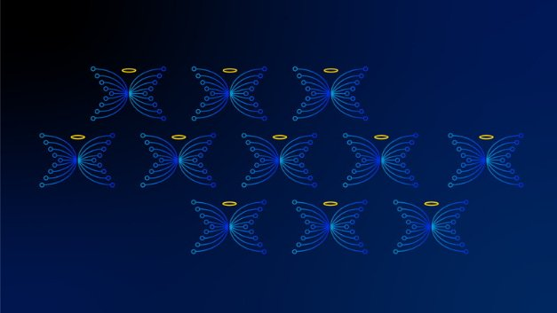
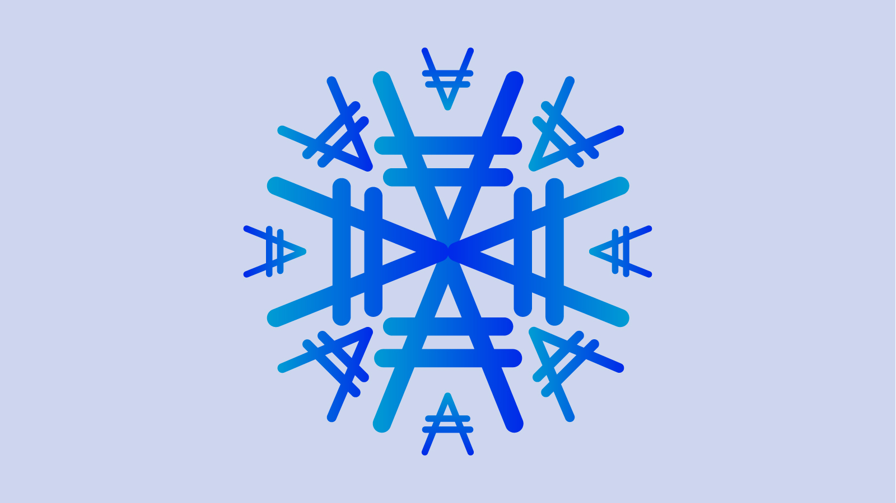

# Những ngày cuối cùng của Giáng sinh

### **Quá khứ, hiện tại và tương lai của Cardano theo tinh thần của một bài hát tiếng Anh cổ**

 Ngày 4 tháng 1 năm 2021[ Anthony Quinn](tmp//en/blog/authors/anthony-quinn/page-1/) bài đọc 3 phút

### [**Anthony Quinn**](tmp//en/blog/authors/anthony-quinn/page-1/)

Editor

Marketing &amp; Communications

- 
- 
- 
- 

Đây là hai suy nghĩ cuối cùng của chúng tôi về quá khứ, hiện tại và tương lai của Cardano theo tinh thần của một bài hát tiếng Anh cổ. Sẽ có một cuốn sách được xuất bản thành bốn đợt cho mỗi [Mười hai ngày Giáng sinh](https://www.classicfm.com/discover-music/occasions/christmas/twelve-12-days-of-christmas-lyrics-meaning/), từ ngày 25 tháng 12 đến ngày 5 tháng 1. Bạn có thể nhìn lại [lô sách đầu tiên](https://iohk.io/en/blog/posts/2020/12/24/some-thoughts-for-the-next-12-days/), đã được bán ra vào đêm Giáng sinh.

## **Ngày 11. Charles Morgan, trưởng bộ phận an ninh mạng**

Bản tóm tắt của tôi bao gồm một loạt các hoạt động, từ các khía cạnh rõ ràng của việc bảo mật trang web, đến tư vấn cho nhân viên về sự an toàn thể chất của họ trong kì nghỉ (chẳng hạn như đặt một cái nêm dưới cửa phòng ngủ khách sạn!) Và thực thi xác thực hai yếu tố cho gần 250 người trên khắp thế giới ([Yubikeys](https://www.yubico.com/) rất xuất sắc về điều này). Và chúng ta đang phải đối phó với nhiều điều khủng khiếp hơn là việc ông già Noel đi xuống từ ống khói, như bạn có thể thấy từ [các thống kê bảo mật này trong năm qua](https://www.websitehostingrating.com/cybersecurity-statistics-facts/). Bạn có thể tin rằng 1/5 trong số hàng tỷ tệp trực tuyến hoàn toàn mở để truy cập toàn cầu không? Điều đó sẽ đáng sợ nếu đó là hồ sơ sức khỏe hoặc thông tin tài chính của bạn.

Tôi có ba mục thú vị mà tôi đang làm vào lúc này. Đầu tiên là các chiến lược phát hiện trộm cắp, truy tìm và chống rửa tiền cho Cardano bằng cách sử dụng nhận dạng của máy tính. Sau đó, là tự động hóa kiểm tra bảo mật và phát hiện bất thường. Và, ở cấp độ cá nhân hơn, tôi đang làm việc để đạt được chứng nhận [Ethical Hacker v11](https://www.eccouncil.org/wp-content/uploads/2020/09/CEHv11-Brochure.pdf).

Đối với năm 2021, tôi mong muốn có thêm thành viên trong nhóm về an ninh mạng. Điều này sẽ cho phép chúng tôi chủ động hơn nhiều trong vấn đề bảo mật của mình, trong việc thực hiện đánh giá động và tĩnh đối với các sản phẩm của chúng tôi, đồng thời nó sẽ cho phép chúng tôi theo đuổi chứng nhận [ISO/IEC 27001](https://www.iso.org/isoiec-27001-information-security.html) và tuân thủ nó. Công việc này rất quan trọng để Input Output được công nhận trên toàn cầu như một công ty ổn định về công nghệ, do đó, sẽ củng cố niềm tin của cộng đồng vào Cardano và các sản phẩm của chúng tôi dựa trên nền tảng blockchain.

## **Ngày 12. Rob Moore, quản lý giao hàng kỹ thuật số**

Việc ra mắt Shelley và bắt đầu phi tập trung cho Cardano là một sự kiện hoành tráng cho dự án. Toàn bộ đội ngũ web đã được nhắc nhở trong trường hợp có bất kỳ điều gì không lường trước được xảy ra, nhưng tất nhiên, tất cả những gì chúng tôi làm là theo dõi quá trình chuyển đổi diễn ra. Tuy nhiên, ngay cả việc đóng vai trò nhỏ đó để giúp Shelley diễn ra là điều mà tôi sẽ không thể quên được.

Gần đây, việc định hình lại nhằm mang đến những công trình sáng tạo có chất lượng đã tốn rất nhiều thời gian của tôi. [Việc ra mắt Mantis](https://iohk.io/en/blog/posts/2020/12/09/the-new-mantis-bringing-security-and-stability-to-the-ethereum-classic-ecosystem-1/) vào tháng 12 của [một khách hàng mới dành cho các nhà lập trình làm việc với Ethereum Classic](https://mantisclient.io/) là một trong những điều sắp xảy ra.

Nghe nhạc, gặp gỡ bạn bè và gia đình, lên kế hoạch, gặp gỡ đồng nghiệp, đi ra nước ngoài. Tất cả những điều chúng ta đã từng coi là đương nhiên. Đây là những điều tôi đã bỏ lỡ và hy vọng sẽ có thể quay trở lại vào năm 2021.

*Điều hoàn thành "Mười hai ngày Giáng sinh" của chúng tôi. Chúng tôi hy vọng một số người trong số họ - dù là Daedalus, thơ ca Nhật Bản, phi tập trung danh tính  hay suy nghĩ của một con bạch tuộc đang mơ mộng – sẽ đạt được sự đồng điệu với bạn. * *Phần trình diễn của [Mười hai ngày Giáng sinh](https://www.classicfm.com/discover-music/occasions/christmas/twelve-12-days-of-christmas-lyrics-meaning/) do dàn hợp xướng của Clare College Cambridge thực hiện chắc chắn sẽ gây được nhiều tiếng cười. Chúc bạn một năm 2021 thú vị!

Bài này được dịch bởi Lê Nguyên, Review và đăng bài bởi Nguyễn Hiệu. Nguồn bài dịch [tại đây](https://iohk.io/en/blog/posts/2021/01/04/the-final-days-of-christmas) 

*Dự án này được tài trợ bởi Catalyst**
