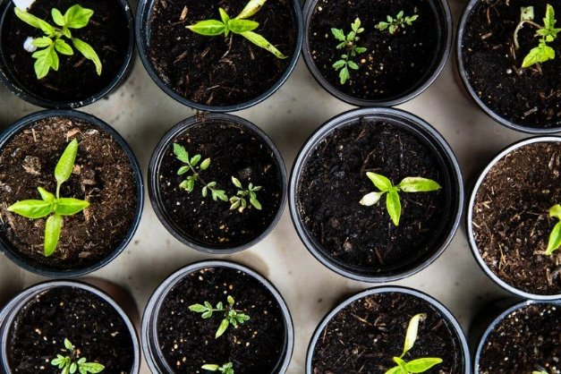

# Project Catalyst - Những đề xuất đầu tiên chiến thắng

### **Tiếng nói của cộng đồng và 11 dự án sẽ nhận được tài trợ để thúc đẩy hệ sinh thái Cardano**

 12 January 2021[ Dor Garbash](tmp//en/blog/authors/dor-garbash/page-1/) 4 mins read

### [**Dor Garbash**](tmp//en/blog/authors/dor-garbash/page-1/)

Head of Product

Commercial

- 
- 
- 

Project Catalyst được xem là một thử nghiệm trong việc tìm ra sự đổi mới và cộng tác ở cấp độ cao nhất với tính phi tập trung. Là giai đoạn đầu tiên trong lộ trình của kỷ nguyên Voltaire, nó đòi hỏi những người tham gia phải có nhiệt huyết, sáng tạo và đam mê để viết và triển khai các dự án có thể hỗ trợ tích cực cho sự phát triển của Cardano.

Fund2 là dịp đầu tiên để những người tham gia Project Catalyst bày tỏ, tranh luận, điều chỉnh và bỏ phiếu cho các đề xuất bằng cách sử dụng ada của mình. Điều này nhằm mục đích nâng cao và mang lại giá trị mới cho Cardano. Chúng tôi đã thách thức những người tham gia Fund2 đưa ra các cách để khuyến khích phát triển hệ sinh thái Cardano trong sáu tháng tới. Với quỹ ban đầu 250.000USD bằng ADA, chúng tôi tài trợ cho 11 đề xuất..

Hôm nay, chúng tôi rất vui mừng khi thông báo về các đề xuất được tài trợ trong Fund2.

**Nâng cấp nền tảng PoolTool:** Mở ra các con đường để xây dựng doanh nghiệp và ứng dụng trên Cardano, giúp phân biệt giữa các nhà ủy thác pool bằng cách cung cấp các sản phẩm bổ sung. Việc nâng cấp này nhằm tăng tính đa dạng về cơ sở hạ tầng trên Cardano.

**Ouroboros qua RINA:** Làm rõ về khái niệm ủy thác pool và giải pháp chuyển tiếp của Ouroboros qua RINA sử dụng Ethernet / WDM tại hai địa điểm ở Tokyo, Nhật Bản.

**Giáo dục Haskell / Plutus / Marlowe:** Tạo nội dung giáo dục bằng cách truyền tải những thông tin phức tạp theo cấu trúc rõ ràng, bổ sung các ví dụ về việc truyền cảm hứng cho các ý tưởng. Đề xuất này hỗ trợ rất tốt cho các nhà phát triển và các doanh nhân..

**Tạo tiêu chuẩn chữ ký trong thông báo:** Tạo tiêu chuẩn chữ ký trong các thông báo để chứng minh cho việc lưu trữ, xác minh danh tính và ủy quyền trong việc ủy thác pool.

**Liqwid: Thị trường cho vay (lending) của Cardano trong thế giới tài chính phi tập trung:** Tạo một giao thức thanh khoản mã nguồn mở, không cần sự giám sát để kiếm lãi tiền gửi và vay tài sản trên Cardano.

**Cardano dành cho nhà phát triển DApp di động:** Biến những người sử dụng nền tảng di động thành những công dân hạng nhất của thế giới DApp với SDK di động, trải nghiệm DApp ưu tiên trên thiết bị di động và khả năng tương thích với cửa hàng ứng dụng (app store).

**GimbaLabs - bộ công cụ dành cho người khởi nghiệp:** GimbaLabs là một nền tảng khởi nghiệp cung cấp các API, bài học và các tài liệu cho việc học dựa trên dự án miễn phí và mã nguồn mở để giúp mọi người biến ý tưởng của họ thành hiện thực, đồng thời thúc đẩy việc áp dụng blockchain.

**Học viện Lovelace chuyên dạy về Marlowe và Plutus:** Thành lập học viện trực tuyến để thu hút, truyền cảm hứng và giáo dục các cá nhân và công ty tạo ứng dụng trên nền tảng hợp đồng thông minh và tài sản gốc của Cardano.

**Ký Tx Arduino:** Khởi động thư viện được viết bằng ngôn ngữ lập trình C tương thích với môi trường phát triển Arduino. Ký các giao dịch tại máy cá nhân của hợp đồng thông minh cho các ứng dụng IoT.

**Pet Registry DApp với ₳ Pay:** Giúp các nhà phát triển chấp nhận thanh toán ada trên các trang web. Pet Registry DApp được xây dựng trên nền tảng thanh toán là ₳ Pay, sẽ phục vụ công dân trên toàn cầu theo cách rẻ hơn và tốt hơn. Các nhà phát triển được truyền cảm hứng từ các ứng dụng thành công và các công cụ cần thiết để tạo nên chúng. Bằng cách tạo ra cả hai, chúng tôi có thể truyền cảm hứng và thúc đẩy các nhà phát triển cùng các giải pháp của họ.

**Hiệp hội quản trị Cardano Nhật Bản: Họp &amp; Hoạt động cộng đồng &amp; Podcast:** hỗ trợ các buổi gặp mặt trực tuyến / ngoại tuyến, podcast quản trị, v.v. cho cộng đồng Nhật Bản.

Thay mặt cho nhóm Project Catalyst, chúng tôi muốn chúc mừng [tất cả những dự án tuyệt vời này](https://static.iohk.io/docs/catalyst/catalyst-voting-results-fund2.pdf). Mỗi nhóm được tài trợ sẽ nhận được ada vào cuối tháng 1 để có thể bắt đầu đưa ý tưởng của mình vào cuộc sống. Chúng tôi rất mong được thấy tác động của những dự án này đối với hệ sinh thái Cardano.

Chúng tôi cũng muốn gửi lời chúc mừng và tri ân đến những người tham gia Fund2. Những người đề xuất dự án, cố vấn cộng đồng, cộng tác viên và những người tham gia bầu chọn đã chung tay giúp Fund2 thành công. Project Catalyst đang làm tất cả để giúp cộng đồng có được sự hỗ trợ bởi Cardano và bạn đã chứng minh rằng tương lai hệ sinh thái của chúng tôi sẽ trở nên tốt đẹp khi nằm trong tay bạn.

Như vậy 11 ý tưởng đã được tài trợ lần này, có một số ứng cử viên nặng ký (một số đề xuất khác) đã được cộng đồng bầu chọn nhưng lại không nhận được tài trợ. Trong tệp PDF kèm theo, những dự án được đánh dấu màu xanh lá cây là đã được cộng đồng tán thành tài trợ. Những dự án có màu vàng là đã được phê duyệt tài trợ, nhưng quỹ không có đủ kinh phí để hỗ trợ các đề xuất của họ. Chúng tôi sẽ khuyến khích những người viết đề xuất gửi lại ý tưởng của họ ở Fund3 (mới được ra mắt) nếu đề xuất đó phù hợp với chủ đề của Challenge (tập trung vào hệ sinh thái DApp) và chúng tôi hy vọng sẽ thấy những dự án tốt nhất trong số này được tài trợ vào lần tới.

Chúng tôi có [kế hoạch táo bạo và đầy tham vọng](https://youtu.be/GjPhxXDFv58?t=128) cho Dự án Catalyst vào năm 2021, với khoản tiền trị giá hàng triệu USD để tài trợ cho sự đổi mới trên Cardano. Việc nộp đề xuất ở Fund3 sẽ mở vào ngày mai, đừng bỏ lỡ cơ hội để thể hiện tiếng nói của bạn.

*Nếu bạn muốn tham gia cộng đồng Project Catalyst với tư cách là người đề xuất, cố vấn cộng đồng, người triển khai hoặc người bầu chọn, vui lòng tham gia với chúng tôi trên [Ideascale](https://cardano.ideascale.com/a/index) và bắt đầu đổi mới cùng với mạng lưới những người tham gia trên toàn cầu. Đăng ký kênh thông báo [Telegram](https://t.me/cardanocatalyst) để cập nhật tin tức mới nhất.Bài này được dịch bởi Max Long, Review và biên tập bởi Nguyễn Hiệu. Bài viết nguồn [tại đây](https://iohk.io/en/blog/posts/2021/01/12/project-catalyst-the-first-winning-proposals/)* 
