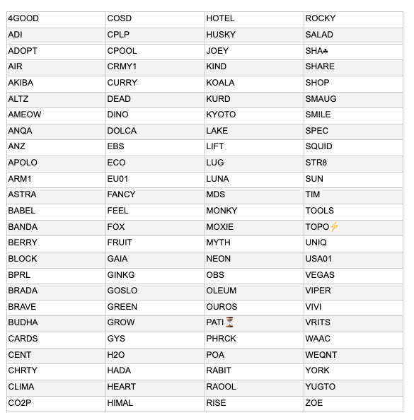

# Chiến lược ủy quyền mới - công bố các pool mà chúng tôi đang hỗ trợ

### **Chúng tôi cam kết tạo ra một hệ sinh thái các pool sôi động và hỗ trợ điều đó bằng cách ủy quyền cho 100 pool cộng đồng**

 22 tháng 1 năm 2021  [Tim Harrison](tmp//en/blog/authors/tim-harrison/page-1/)  7 phút đọc

### [**Tim Harrison**](tmp//en/blog/authors/tim-harrison/page-1/)

VP of Community &amp; Ecosystem

Communications

- 
- 
- 
- 

Cộng đồng các pool cổ phần cung cấp năng lượng để mạng  Cardano có thể hoạt động; sức khỏe và sức sống của hệ sinh thái nhà điều hành quan trọng này là điều cần thiết để vận hành giao thức hiệu quả. Khi chúng tôi tiếp tục phát triển tiện ích của Cardano thông qua kỷ nguyên Goguen, điều này trở nên quan trọng hơn bao giờ hết. Ủy thác vào các pool chất lượng là cách tốt nhất để đền đáp lại cộng đồng Cardano.

Giống như bất kỳ hệ sinh thái nào, thành công đến từ sự cân bằng giữa lợi ích, quyền lực và sự đa dạng phong phú của các tác nhân. Giống như một nền kinh tế, một cán cân ảnh hưởng tới hoạt động thương mại; người có vai trò lớn, người có vai trò nhỏ đều cung cấp sự đa dạng và lành mạnh hơn trong phần cốt lõi.

Nếu coi 'mã là luật' (vậy còn chức năng của cơ quan tư pháp?), thì tất cả chúng ta đều nhận thấy đầu vào, đầu ra, hành vi của con người và động lực xã hội hình thành nên cộng đồng xung quanh và hỗ trợ bất kỳ giao thức blockchain nào.

Vì vậy, là một phần trong cam kết liên tục của chúng tôi đối với sự phát triển lành mạnh của hệ sinh thái, gần đây chúng tôi đã vạch ra [chiến lược mới ](https://iohk.io/en/blog/posts/2020/11/24/delegating-with-fresh-purpose/) để ủy quyền các quỹ ada của IOG. Chúng tôi đưa ra chiến lược ủy quyền này để hỗ trợ tầm nhìn dài hạn cho sự phát triển của Cardano, đồng thời khẳng định lại các giá trị mà chúng tôi muốn hướng đến. Tất cả đều phù hợp với việc tuân theo một lộ trình hợp lý về mặt tài chính để có thể duy trì tính thương mại đối với tổ chức.

### **Phản hồi tích cực**

Chúng tôi đã đưa ra lời kêu gọi ủy quyền vào tháng 12. Cộng đồng của chúng tôi đã phản hồi rất tích cực và vào thời điểm ngay trước kỳ nghỉ lễ Giáng sinh, chúng tôi đã nhận được dưới 300 (thực tế là 299) đơn xin ủy quyền. Kể từ đó, chúng tôi đã loại bỏ tất cả trừ một pool chung của chúng tôi - việc tạo ra chúng luôn là hoạt động có tính chiến lược - và chúng tôi hiện đang chuyển hướng sang mục tiêu chiến lược lâu dài hơn.

### **Diễn biến**

Trong hai tuần qua, chúng tôi đã xem xét tất cả các mục trong việc kêu gọi ủy quyền. Quá trình này tương đối phức tạp. Chúng tôi đã cố gắng xác định thực trạng của các pool theo một số yếu tố, tất cả đều quan trọng dựa trên giá trị của chúng. Nhìn một cách tổng thể, những yếu tố này cung cấp một bản đồ vô giá về môi trường SPO. Trong số các yếu tố chính (trong đó chứa cả các biến số) mà chúng tôi đã tính đến là:

**Mục đích** - đây có thuần túy là một liên doanh thương mại, hay nó đang được thực hiện với mục đích đền đáp cho cộng đồng trong thế giới rộng lớn (nội dung, giáo dục, hỗ trợ cho những người thiệt thòi, hoạt động bền vững, quyên góp cho tổ chức từ thiện, v.v.)

**Về địa lý** - họ có phải là người tham gia tích cực và tận tâm trong một khu vực kém nổi bật hơn so với các khu vực khác?

**Về đóng góp kỹ thuật** - SPO có đang vận hành theo cách tốt nhất trên Cardano không? (so với các công cụ, ứng dụng, v.v.). Họ đã từng là cộng tác viên kể từ thời điểm ITN - hoặc lâu hơn?

**Tỷ lệ cổ phần và tỷ lệ đóng góp** - tỷ lệ ở đây là gì? Là số tiền cam kết ủy thác - có đúng với số tiền họ đóng góp không, hay việc 'cam kết với mạng lưới' của SPO được thông qua - cho thấy họ 'xứng đáng' có được sự ủy quyền của cộng đồng ở cấp cao hơn?

**Sự tham gia của cộng đồng** - họ có phải là thành viên có đóng góp tích cực trong cộng đồng SPO không? Họ có đang gia tăng giá trị thông qua việc xây dựng vai trò tích cực trên mạng xã hội hoặc hỗ trợ các thành viên khác trong cộng đồng bằng việc đóng góp vào các hội nhóm/liên minh, v.v. Họ có đang giúp ích trong việc phát triển tầm nhìn của tổ chức và sẵn sàng chấp nhận hoạt động theo cách bền vững lâu dài?

Quá trình lựa chọn đầy thử thách, được lặp đi lặp lại có sự sáng tạo và truyền cảm hứng.

*Thách thức* được đặt ra là chúng tôi không thể ủy quyền cho mọi pool mà chúng tôi muốn - cộng đồng SPO của chúng tôi có nhiều người tài năng và không phải ai cũng được ủy quyền trong nhóm đầu tiên này. Sau khi chúng tôi áp dụng một số bộ lọc để thu hẹp phạm vi (từ 299 đơn xin ủy quyền) thì vẫn còn một danh sách dài chiếm tới 75% con số đó. Vì vậy, chúng tôi đã phải xem xét các yếu tố một cách tổng thể hơn; đây không phải là một lựa chọn có / không. Giờ đây, Kudos đã được chuyển sang [pooltool.io](https://pooltool.io/) và [adapools](https://adapools.org/) để giúp cung cấp các nguồn dữ liệu bổ sung cho quá trình này.

Là chương trình đầu tiên, chúng tôi luôn coi đây là một 'thí điểm' để phát triển lặp đi lặp lại. Ban đầu, chúng tôi dự định phân loại các pool riêng biệt. Các pool tập trung vào các mục tiêu được định hướng bởi sứ mệnh hơn là những pool tập trung vào yếu tố kỹ thuật. Ngay từ đầu, chúng tôi đã rất ngạc nhiên về số lượng các pool được thúc đẩy bởi sứ mệnh trong hệ sinh thái. Sứ mệnh của chúng tôi thật lớn lao với tư cách là một cộng đồng, điều này không còn ngạc nhiên. Tuy nhiên, một khi chúng tôi đào sâu vào khai thác dữ liệu, thì sẽ thấy rõ là nhiều pool khó phân loại và làm tăng thêm giá trị theo một số cách; hoặc khó phân loại theo mục đích, đóng góp kỹ thuật, vị trí địa lý, đóng góp cho cộng đồng. Các pool tốt nhất sẽ thiết lập tiêu chuẩn cho tất cả.

### **Lựa chọn các pool**

Quá trình lựa chọn đã thành công do sự phong phú của dữ liệu, điều này phản ánh sự đa dạng và rộng lớn của cộng đồng chúng ta. Chúng tôi đã có được một số thông tin chi tiết. Trên thực tế, chúng tôi dự định ẩn danh tập dữ liệu và chia sẻ tập hợp con với cộng đồng nhiều hơn một chút, cả hai việc này đều để xác định các yếu tố chúng tôi cần lặp lại và vẽ nên một bức tranh chung về sự phát triển của các pool và sự phát triển của cộng đồng theo thời gian. Hãy coi nó như một cuộc 'điều tra dân số' hàng quý của cộng đồng SPO.

Chính sự phong phú đó đã thực sự truyền cảm hứng - SPO ở hàng chục quốc gia, trên mọi lục địa (ngoại trừ Nam Cực… hmm… giờ đây đó được xem là thách thức cho một ai đó!). Đây là bằng chứng hữu hình về một cộng đồng trẻ, nhưng trưởng thành nhanh, cam kết hướng tới sự xuất sắc, hợp tác và tạo ra sự khác biệt tích cực trên thế giới. Tất cả thông qua Cardano.

Đây là các pool mà chúng tôi đã chọn:

Xin chúc mừng 100 pool thành viên trong nhóm các pool đầu tiên của chúng tôi. Chúng tôi sẽ bắt đầu ủy quyền cho các pool đã chọn từ cuối tháng 1/đầu tháng 2 (dựa trên các cân nhắc về hoạt động), IOG uỷ thác 3,2 triệu ada cho mỗi pool để hỗ trợ sản xuất block. Cứ mỗi quý trong năm 2021, chúng tôi sẽ lựa chọn một pool mới và cập nhật danh sách này cho phù hợp.

Chúng tôi muốn làm cho cách tiếp cận trở nên rõ ràng nhất có thể. Chúng tôi đã tạo một danh sách Twitter dành riêng để bạn tiện theo dõi. Khi chưa có hướng dẫn chính thức, chúng tôi xem những sự  ủy quyền này chỉ là sự khởi đầu; các pool nên tiếp tục làm những gì họ đang làm trong cộng đồng và tìm cách tự phát triển theo cách của họ, trong khi đó, chúng tôi vẫn ủy quyền cho họ.

Để xem các pool này, hãy truy cập [pooltool.io](https://pooltool.io/) hoặc [adapools](https://adapools.org/delegations/input-output?test) và tìm kiếm theo mã. Bạn có thể lọc theo danh sách dành riêng. Ngoài ra, chúng tôi cũng sẽ giới thiệu một số pool trên blog và trên chương trình hàng tháng của chúng tôi trong thời gian tới.

### **Chặng đường phía trước**

Nếu bạn không được chọn lần này, thì hãy cứ vui. Chúng tôi có nhiều pool hơn số lượng có thể ủy quyền vào thời điểm này. Chúng tôi khuyến khích những pool nào đã bỏ lỡ đăng ký thì hãy đăng ký lại ở nhóm mới trong Quý 2; chúng tôi sẽ gọi điện thoại để liên lạc với các đăng ký vào cuối tháng 3 và luân chuyển ủy quyền vào cuối tháng 4.

*Mỗi* pool sẽ cần phải đăng ký lại. Chúng tôi sẽ hỗ trợ bằng cách đơn giản hóa quy trình đăng ký. Cũng cần lưu ý rằng khi hệ sinh thái phát triển, chúng tôi thấy sự xuất hiện của một số cộng tác viên tích cực nhưng ***không*** đăng ký ủy quyền. Chúng tôi cũng hoan nghênh phản hồi của cộng đồng về cách chúng tôi đang làm để phát triển quy trình.

Vui lòng kiểm tra chương trình và nếu bạn muốn một số hỗ trợ cho việc khởi động pool (hoặc cung cấp 'bảo mật cho block' trong khi bạn triển khai việc ủy quyền trong pool của bạn theo cách miễn phí) thì đừng bỏ lỡ lần tiếp theo.

Chúng tôi rất vui khi thấy nhiều pool ngày càng lớn mạnh. Mặt khác, chúng tôi cũng luôn lắng nghe khi một pool nhỏ hơn nói rằng họ đang ngừng hoạt động. Cùng với chương trình này, sự lựa chọn của bạn với tư cách là người ủy quyền là chìa khóa để hỗ trợ hệ sinh thái trở nên phong phú. Bởi vì ở đó có sự phát triển và có cộng đồng mà tất cả chúng ta mong muốn. Đây là những gì chúng ta làm. Là cộng đồng tiền mã hóa hàng đầu, đó là điều mà tất cả chúng ta nên tự hào.

IOG cam kết về hệ sinh thái Cardano phát triển và hưng thịnh. Chúng tôi sẽ tiếp tục làm phần việc của mình. Và hãy nhớ rằng, là thành viên trong một cộng đồng, tất cả chúng ta đều cần tham gia vào công việc chung.

Bài này được dịch bởi Max Long, Review bởi Quang Pham , biên tập bởi Nguyễn Hiệu. Bài viết nguồn [tại đây](https://iohk.io/en/blog/posts/2021/01/22/our-new-delegation-strategy-announcing-the-pools-we-are-supporting/)

*Dự án này được tài trợ bởi Catalyst*
