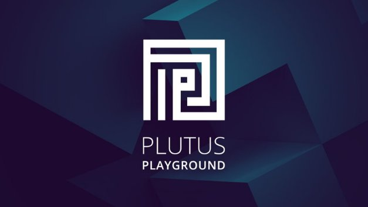

# Giới thiệu sân chơi Plutus mới

### **Các nhà phát triển được mời thử nghiệm các công cụ hợp đồng thông minh cải tiến trước khi chúng được phát hành**

25 tháng 1 năm 2021[Olga Hryniuk](tmp//en/blog/authors/olga-hryniuk/page-1/)4 phút đọc

### [**Olga Hryniuk**](tmp//en/blog/authors/olga-hryniuk/page-1/)

Technical Writer

Marketing &amp; Communications

- 
- 

Goguen đang được Cardano tập trung phát triển vào tiện ích, hỗ trợ hợp đồng thông minh và phát hành token gốc. Trong khi cung cấp nó như một hệ thống các thành phần tương tác, chúng tôi đang dần thêm tất cả các khối xây dựng để thêm hợp đồng thông minh vào nền tảng Cardano.

Goguen hỗ trợ token gốc cùng với Plutus và Marlowe để giúp phát triển các hợp đồng thông minh. Nó có thể thiết lập một hệ thống tài chính phi tập trung toàn cầu. Để đặt nền móng, chúng tôi đã giới thiệu [siêu dữ liệu giao dịch](https://iohk.io/en/blog/posts/2020/11/03/getting-to-grips-with-metadata-on-cardano/) (metadata), nâng cấp sổ cái để hỗ trợ [khóa token](https://iohk.io/en/blog/posts/2020/12/02/goguen-brings-token-locking-to-cardano/) (điều cần thiết cho các hợp đồng thông minh có tính phức tạp) và sẽ sớm triển khai hỗ trợ [token gốc](https://developers.cardano.org/en/development-environments/native-tokens/native-tokens/) cho nhiều tài sản. Chúng tôi cũng đang xây dựng các dev để thu hút [các cộng đồng nhà phát triển khác](https://developers.cardano.org/) .

Giờ đây, chúng tôi đã làm mới và nâng cấp sân chơi Plutus và đang khuyến khích các nhà phát triển đóng góp vào sự phát triển của nó bằng cách thử nghiệm phiên bản trước khi phát hành.

## **Plutus Playground là gì?**

*Sân chơi Plustus* cung cấp một môi trường để viết và thử nghiệm các hợp đồng thông minh trước khi chúng được phát hành trên blockchain Cardano. *Plutus Core*, là ngôn ngữ hợp đồng thông minh nhúng trên sổ cái, nó dựa vào ngôn ngữ Haskell và cho phép các nhà phát triển viết các ứng dụng trên blockchain Cardano. Haskell được chọn làm nền tảng cơ bản cho Plutus, bởi vì nó nổi bật so với các ngôn ngữ  khác ở tính bảo mật. Sử dụng Haskell để triển khai hợp đồng thông minh đảm bảo rằng các hợp đồng được lập trình để thực hiện chính xác những gì chúng được mong đợi và có thể được kiểm tra độ chính xác trước khi thực hiện.

Ngoài việc cung cấp trình mô phỏng dựa trên web để viết và thực hiện các hợp đồng thông minh, sân chơi Plutus mới cũng cho phép người dùng truy cập các hợp đồng thông minh phổ biến đã được viết sẵn. Phiên bản đầu tiên đã được trình bày trước tại PlutusFest vào tháng 12 năm 2018. Kể từ đó, dự án đã mở rộng đáng kể và bản phát hành mới này của sân chơi Plutus đã nói lên điều đó.

## **Sân chơi Plutus dành cho ai?**

Sân chơi Plutus dành cho những người tạo các ứng dụng phi tập trung (DApps) và các lập trình viên hợp đồng thông minh muốn làm việc với Cardano. Plutus sẽ là nền tảng để xây dựng DApp, theo dõi và phát hiện vấn đề trong chuỗi cung ứng, ví dụ như trong hồ sơ y tế, bỏ phiếu nhận dạng, đăng ký tài sản, thanh toán P2P và hệ thống tài chính. Vì vậy, nó sẽ phục vụ các nhu cầu của những người sử dụng, họ là:

- các công ty lớn và nhỏ
- các chính phủ
- cộng đồng Cardano và những người sở hữu ada
- các doanh nhân.

## **Các tính năng và cải tiến của sân chơi Plutus**

Vì vậy, giờ là lúc để các nhà phát triển bắt đầu xây dựng các hợp đồng Plutus và thử nghiệm chúng trước khi triển khai Plutus trên mạng chính của Cardano vào cuối năm nay. Sân chơi Plutus hoạt động thông qua trình duyệt web mà không cần cài đặt phần mềm. Có các hướng dẫn về biên dịch và mô phỏng các hợp đồng thông minh do nhóm Plutus viết.

Các cải tiến đã được thực hiện đối với phần mềm phụ trợ, các vấn đề được báo cáo đã được giải quyết và giao diện thậm chí còn tốt hơn.

Hình 1. Trình chỉnh sửa sân chơi Plutus cũ (trái) so với giao diện mới (phải)

Như với sân chơi Plutus hiện có, giao diện được chia thành ba phần:

- soạn thảo
- mô phỏng
- các giao dịch.

Phần mô phỏng cho thấy một hợp đồng sẽ hoạt động như thế nào trên blockchain Cardano. Một khía cạnh quan trọng của điều này là nó có thể hoạt động như một công cụ đào tạo cho những người không có kỹ năng phát triển nâng cao vì nó thể hiện các nguyên tắc thực hiện. Người dùng có thể xác định và sửa đổi các ví tương tác với hợp đồng, cũng như các hành động ảnh hưởng đến kết quả. Sau đó, kết quả có thể được đánh giá để xem điều gì xảy ra trên blockchain và cách các giao dịch xảy ra.

Sân chơi Plutus cung cấp nhiều lựa chọn thiết lập bàn phím. Các nhà phát triển có thể chọn giữa các tùy chọn Vim và Emacs hoặc gắn bó với bàn phím mặc định.

Chúng tôi cũng đã làm mới giao diện với các cải tiến về trải nghiệm người dùng. Cuối cùng, trình mô phỏng thực tế hơn trong cách nó chạy các ứng dụng Plutus và như trước đây, nó có thể được liên kết với tài khoản GitHub để lưu hợp đồng và mọi công việc đang thực hiện. Bạn có thể tìm thấy [hướng dẫn kỹ thuật đầy đủ tại đây](https://youtu.be/DhRS-JvoCw8) .

## **Cách thức tham gia**

Chúng tôi hiện đang khuyến khích các nhà phát triển có kinh nghiệm (và cả những nhà phát triển ít kinh nghiệm hơn!) thử nghiệm sân chơi Plutus trước khi phát hành nó. Nếu bạn quan tâm đến hợp đồng thông minh và muốn tham gia, hãy phản hồi tới chúng tôi.

Quá trình làm mới sân chơi sẽ được phát trực tiếp vào hôm nay tại [https://playground.plutus.iohkdev.io/](https://playground.plutus.iohkdev.io/). Bạn có thể tham gia các cuộc thảo luận về Plutus tại [Diễn đàn Cardano](https://forum.cardano.org/c/developers/cardano-plutus/148) và truy cập [kho lưu trữ Plutus GitHub](https://github.com/input-output-hk/plutus). Để có quyền truy cập vào hỗ trợ và tài nguyên bổ sung, hãy thể sự quan tâm của bạn bằng cách điền [vào Biểu mẫu này](https://input-output.typeform.com/to/gQ0t9ep5) để chúng tôi thêm bạn vào cộng đồng Slack.

Bài này được dịch bởi Max Long, Review và biên tập bởi Nguyễn Hiệu. Bài viết nguồn [tại đây](https://iohk.io/en/blog/posts/2021/01/25/introducing-the-new-plutus-playground/) 

*Dự án được tài trợ bởi Catalyst*
