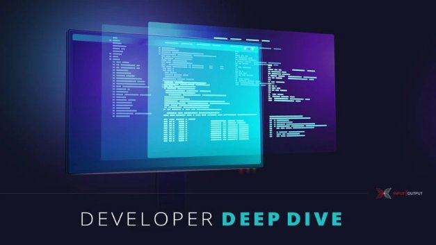

# Plutus Tx: biên dịch Haskell thành Plutus Core

### **Tập trung vào viết các hợp đồng thông minh trên Cardano**

 Ngày 2 tháng 2 năm 2021[ Michael Peyton Jones](tmp//en/blog/authors/michael-peyton-jones/page-1/) bài đọc 9 phút

[](tmp//en/blog/authors/michael-peyton-jones/page-1/)

### [**Michael Peyton Jones**](tmp//en/blog/authors/michael-peyton-jones/page-1/)

Software Engineering Lead

Engineering

- [](mailto:michael.peyton-jones@iohk.io "Email")
- [](https://www.linkedin.com/in/michael-pj/ "LinkedIn")
- [](https://twitter.com/mpeytonjones "Twitter")
- [](https://github.com/michaelpj "GitHub")



Tuần trước, chúng ta đã chứng kiến ​​sự ra mắt phiên bản mới của [Plutus Playground](https://iohk.io/en/blog/posts/2021/01/25/introducing-the-new-plutus-playground/). Bài này chúng tôi giới thiệu về [nền tảng Plutus](https://www.youtube.com/watch?v=usMPt8KpBeI). Trọng tâm là khả năng viết một ưng dụng hợp đồng thông minh (cả on-chain và offchain) trên một ngôn ngữ duy nhất (Haskell)

Công cụ chuỗi của chúng tôi cho phép một chương trình Haskell tạo ra một tệp thực thi chạy trên máy tính mà còn cả mã chạy trên blockchain Cardano (Off-chain và On-Chain). Điều này mang đến cho người dùng một ngôn ngữ lập trình chất lượng cao, đã được thử nghiệm và sử dụng công cụ tiêu chuẩn cùng với sự hỗ trợ thư viện. Vì vậy, ai cũng muốn học chúng. Ngược lại không ai muốn học một ngôn ngữ lập trình độc quyền và các công cụ nửa vời nếu họ không phải làm thế!

Công cụ tuyệt vời đầy sức mạnh này được gọi là Plutus Tx. Bản chất của nó là một trình biên dịch từ Haskell sang Putus Core- ngôn ngữ chạy trên chuỗi - được cung cấp dưới dạng một trình plug-in GHC. Trong bài đăng này, chúng ta sẽ đi sâu vào cách thức hoạt động và một số thách thức kỹ thuật.

## **Kích hoạt Haskell**

Haskell chẳng phải là một ngôn ngữ cũ và phức tạp sao? Nó nổi tiếng là có hàng tá tiện ích mở rộng phức tạp giúp thay đổi ngôn ngữ theo những cách sâu rộng. Làm thế nào chúng ta có thể hỗ trợ tất cả những điều này?

May mắn thay, thiết kế của GHC đã làm cho trình biên dịch Haskell trở nên khả thi. [GHC Core](https://www.youtube.com/watch?v=uR_VzYxvbxg) là trình biên dịch cho chương trình Haskell. Sau giai đoạn kiểm tra ban đầu, tất cả ngôn ngữ phức tạp sẽ được chuyển sang GHC Core và phần còn lại là của pipleline mà chúng ta không cần phải hiểu về nó. Điều này cũng phù hợp với chúng ta: chúng ta có thể làm việc trên GHC Core và được hỗ trợ miễn phí ngôn ngữ Haskell rộng lớn hơn.

Sự phức tạp khác của Haskell là hệ thống của nó. Điều này khó tránh hơn nhiều. Tuy nhiên, chúng tôi có quyền lựa chọn loại hệ thống mà chúng ta muốn sử dụng cho ngôn ngữ đích của mình, và vì vậy chúng tôi sử dụng một hệ thống là một tập con của Haskell - may mắn thay, hệ thống loại này của Haskell khá tốt!

Cuối cùng, chúng tôi không hỗ trợ tất cả về Haskell. Một số tính năng là nhược điểm, không thể áp dụng (không ai cần CFFI trên blockchain), hoặc thành thật mà nói, thật khó để triển khai. Vì vậy, bây giờ trình biên dịch Plutus Tx sẽ hiển thị lỗi nếu bạn sử dụng một tính năng mà nó không hỗ trợ. Hầu hết các tính năng 'đơn giản' Haskell đều hỗ trợ (mặc dù có một số thứ trông đơn giản nhưng lại phức tạp một cách khó chịu trong thực tế).

## **Tạo quy trình biên dịch**

Chúng ta biên dịch Haskell thành gì? Cuối cùng chúng ta phải tạo ra Plutus core, nhưng sự linh hoạt của trình biên dịch cũ là sự thay đổi các trình tự biên dịch lớn bằng cách sử dụng 'ngôn ngữ trung gian', hoặc một đại diện trung gian (IR). Điều này đảm bảo rằng không có bước nào là quá lớn và các bước có thể được kiểm tra độc lập.

Trình tự biên dịch của chúng ta như sau:

1. GHC: Haskell -&gt; GHC Core
2. Trình biên dịch Plutus Tx: GHC Core -&gt; Plutus IR
3. Trình biên dịch Plutus IR: Plutus IR -&gt; Typed Plutus Core
4. Type eraser: Typed Plutus Core -&gt; Untyped Plutus Core

Như bạn có thể thấy, có khá nhiều giai đoạn sau GHC Core, nhưng tôi chỉ muốn làm nổi bật Plutus IR. Đây là một phần mở rộng của Plutus Core được thiết kế để gần với GHC Core. Vì vậy, nói một cách chính xác, trình biên dịch Plutus Tx không nhắm vào Plutus Core, nó nhắm vào Plutus IR, và sau đó chúng ta để cho pipeline thực hiện nốt phần còn lại.

Điều này làm giảm số lượng logic phải tồn tại trong chính plug-in. Nó có thể tập trung vào việc giải quyết các đặc điểm riêng của GHC và để lại các vấn đề được xác định rõ ràng (nhưng [khó](https://hydra.iohk.io/job/Cardano/plutus/linux.papers.unraveling-recursion/latest/download-by-type/doc-pdf/unraveling-recursion)) như xử lý các kiểu dữ liệu và đệ quy tới trình biên dịch Plutus IR, nơi chúng có thể được kiểm tra mà không cần phải chạy trình plug-in GHC!

Plutus IR trong trình tự mang lại cho chúng ta nhiều lợi thế khác. Chúng ta không cần toàn quyền kiểm soát cách GHC tạo ra GHC Core, nhưng chúng ta kiểm soát cách Plutus IR tạo thành Plutus Core. Vì vậy, nếu người dùng muốn đảm bảo toàn bộ khả năng tái tạo của mã trên chuỗi của họ, họ có thể lưu Plutus IR và nhận được một kết xuất có thể đọc được tương đối và họ có thể tải lại sau đó.

## **Đưa trình biên dịch Plutus TX vào GHC**

Làm thế nào để chúng tôi thực sự có được GHC Core ngay từ đầu? GHC core là một phần của trình tự biên dịch GHC. Bằng cách nào đó, chúng tôi sẽ phải tự tham gia vào quy trình biên dịch của GHC, chặn phần chương trình mà chúng tôi muốn biên dịch sang Plutus Core (hãy nhớ: chúng tôi chỉ biên dịch mã on-chain), biên dịch nó, và sau đó làm điều gì đó hữu ích với kết quả.

May mắn thay, GHC cung cấp các công cụ cho việc này dưới dạng các trình plug-in GHC. Một trình plug-in GHC sẽ chạy trong quá trình biên dịch GHC và có thể sửa đổi chương trình mà GHC đang biên dịch theo cách mà nó muốn. Đây chính xác là những gì chúng tôi muốn!

Bởi vì chúng tôi có thể sửa đổi chương trình mà GHC đang biên dịch, chúng tôi có một nơi hiển nhiên để đặt đầu ra của trình biên dịch Plutus Tx - trở lại chương trình Haskell! Đó là nơi thích hợp cho nó, vì phần còn lại của chương trình Haskell chịu trách nhiệm gửi các giao dịch có chứa tập lệnh Plutus Core. Nhưng nhìn trực quan Plutus core là một chuỗi byte, nó là đầu vào cho một giao dịch.

Chúng tôi muốn triển khai một hàm như thế này:

```
compile :: forall a . a -> CompiledCode a
```

Từ quan điểm của người dùng, điều này sẽ lấy bất kỳ biểu thức Haskell nào và thay thế nó bằng một giá trị không rõ ràng đại diện cho biểu thức đó, nhưng được biên dịch thành một chương trình Plutus Core (hoặc chính xác là một chuỗi byte chữa thông tin của chương trình đó). Phiên bản thực tế phức tạp hơn một chút, nhưng về mặt khái niệm, nó giống nhau.

Tuy nhiên, chúng tôi không muốn thử và thực hiện điều này như một hàm Haskell bình thường. Một hàm Haskell bình thường với cú pháp compile sẽ nhận *giá trị* kiểu a và biến nó thành một chương trình Plutus Core tại thời điểm *chạy*. Chúng tôi muốn lấy *cú pháp tree cho biểu thức* kiểu a và biến nó thành một chương trình Plutus Core tại thời điểm *biên dịch*.

## **Sự chuyển đổi**

Đây là mẹo: chúng tôi không thực sự triển khai compile dưới dạng một hàm; thay vào đó, trình plug-in của chúng tôi rà soát chương trình để tìm cú pháp compile với các đối số và sau đó thay thế toàn bộ chúng bằng mã đã biên dịch.

```
So, for example, we turn

compile 1

into

<bytestring containing the serialized Plutus Core program     (con integer 1) ™>
```

Điều này có nghĩa là chương trình thông suốt. Trước khi trình plug-in chạy, biểu thức compile 1 có kiểu CompiledCode và sau đó điều tương tự cũng đúng - nhưng bây giờ chúng ta có một chương trình thực tế!

## **Tìm mã nguồn**

Trình biên dịch làm việc với mã nguồn và trình biên dịch Plutus Tx cũng không khác gì. Chúng tôi xử lý cú pháp cây GHC Core cho các chương trình. Nhưng điều gì sẽ xảy ra khi một chương trình gọi một hàm từ một module khác? Haskell được biên dịch riêng biệt: thông thường các mô-đun chỉ nhìn thấy kiểu function trong các mô-đun khác (mã chạy của nó). Vì vậy, chúng ta không có mã nguồn!

Trên thực tế, điều này cực kỳ khó chịu và về lâu dài, chúng tôi có kế hoạch triển khai hỗ trợ trong GHC để lưu trữ GHC Core một cách đáng tin cậy cho các module bên trong tệp giao diện mà nó tạo ra. Điều này sẽ cho phép chúng tôi làm một cái gì đó giống như 'biên dịch riêng biệt' cho Plutus Tx. Tuy nhiên, cho đến lúc đó, chúng tôi có một cách giải quyết bằng cách sử dụng 'unfolding'.

Unfolding là bản sao của các chức năng mà GHC sử dụng để kích hoạt nội tuyến cross-module. Chúng tôi dựa trên những điều này như một cách để lấy mã nguồn của các chức năng. Do đó, các hàm được sử dụng chuyển tiếp bởi mã Plutus Tx phải được đánh dấu là `INLINABLE`, điều này đảm bảo rằng các `Unfolding` hiện diện.

## **Thời gian chạy cũng quan trọng**

Tất cả điều này nghe có vẻ ổn, cho đến khi bạn nhận ra rằng bạn muốn tạo các phiên bản khác nhau của chương trình Plutus Core dựa trên các quyết định tại thời điểm chạy. Nếu tôi đang viết một hợp đồng thực hiện giao dịch nguyên tử, tôi không muốn phải *biên dịch lại chương trình của mình* để thay đổi người tham gia hoặc số lượng!

Nhưng như chúng tôi đã nói trước đây, thật khó để viết một hàm kiểu `a -&gt; CompiledCode a` thực sự hoạt động tại thời điểm chạy. Thay vì nhìn vào cú pháp cây GHC Core đại diện cho biểu thức trong chương trình Haskell, chúng ta cần xử lý các giá trị mà chương trình tính toán.

Chúng ta có thể làm điều này theo phong cách Haskell điển hình bằng cách xác định một cặp typeclasses:

1. Typeable cho chúng ta biết cách biến một loại Haskell thành một loại Plutus Core
2. Lift cho chúng ta biết cách biến giá trị Haskell thành giá trị Plutus Core

Đối với những người quen thuộc với Haskell, việc song song các lớp Typeable và Lift mà GHC cung cấp để biến các kiểu và giá trị Haskell thành các biểu diễn hữu ích cho việc lập trình Haskell điển hình hơn.

Chúng ta có thể viết các trường hợp của các lớp kiểu này cho tất cả các kiểu. Ví dụ, khi chúng ta xem GHC Core, chúng ta có thể kiểm tra GHC Core cho \x -&gt; 1 và thấy đó là hàm lambda và phần thân. Nhưng khi mã được chạy, một hàm có thể là một khối mã gốc được biên dịch và chúng ta có thể làm điều này nữa. Vì vậy, chúng ta có thể nâng các chức năng tại thời điểm chạy.

Cuối cùng, điều này có nghĩa là bạn thường có thể nâng cấp dữ liệu tại thời điểm chạy, như số nguyên hoặc kiểu dữ liệu phức tạp đại diện cho biểu phí. Sau đó, bạn có thể chuyển dữ liệu đã nâng cấp lên đến một hàm mà bạn đã biên dịch tại thời điểm biên dịch với một trình trợ giúp nhỏ:

```
applyCode :: CompiledCode (a -> b) -> CompiledCode a -> CompiledCode b. 
```

Đây là một ví dụ hay về kiến ​​trúc chức năng mang lại lợi ích cho chúng tôi: chúng tôi có thể xử lý những phụ thuộc phức tạp này giữa thời gian biên dịch và thời gian chạy bằng các hàm và đối số đơn giản!

## **Tóm lại**

Mục tiêu của Plutus Tx là cho phép bạn tự do viết Haskell và sử dụng liền mạch trong cả mã on-chain và off-chain. Chúng tôi đã đạt được rất nhiều tiến bộ để đạt được mục tiêu đó và chúng tôi mong muốn loại bỏ những thiếu sót còn lại khi chúng tôi tiếp tục.

## **Tái bút: hãy ủng hộ chúng tôi!**

Làm thế nào bạn thực sự có thể sử dụng Plutus Tx? Trình biên dịch sẽ được phát hành cùng với [Plutus Foundation](https://www.youtube.com/watch?v=NjFUYD5FOkE) trong một bản cập nhật của Cardano để hỗ trợ các khả năng của Goguen. Điều này sẽ bao gồm hỗ trợ cho Plutus Core trên chuỗi Cardano. Tại thời điểm đó, chúng tôi sẽ phát hành các thư viện. Cho đến lúc đó, bạn có thể ủng hộ chúng tôi [trên Github](https://github.com/input-output-hk/plutus) và cho chúng tôi biết cách bạn tiếp cận với [Plutus Playground](https://playground.plutus.iohkdev.io/) mới.

Bài này được dịch bởi Lê Nguyên. Review và đăng bài bởi Nguyễn Hiệu. Nguồn bài viết gốc [tại đây](https://iohk.io/en/blog/posts/2021/02/02/plutus-tx-compiling-haskell-into-plutus-core). 

*Dự án này được tài trợ bởi Catalyst*
