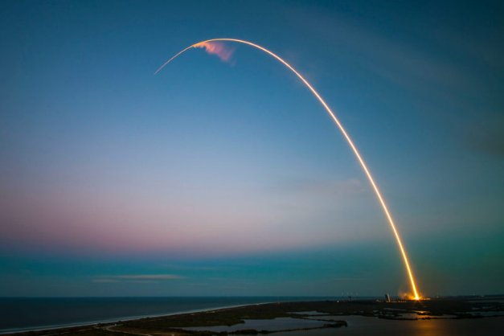

# Đứa con triệu đô của chúng tôi: Project Catalyst

### **Vòng tài trợ Catalyst tiếp theo sẽ là vòng tài trợ đầy tham vọng và dễ tiếp cận nhất của chúng tôi**

 Ngày 12 tháng 2 năm 2021[ Dor Garbash](tmp//en/blog/authors/dor-garbash/page-1/) bài đọc 3 phút

### [**Dor Garbash**](tmp//en/blog/authors/dor-garbash/page-1/)

Head of Product

Commercial

- 
- 
- 

Chúng tôi đã khởi chạy Project Catalyst sáu tháng trước như một loạt các thử nghiệm nhằm nâng cao khả năng quản trị trên chuỗi (on-chain) và tăng tốc sự đổi mới Cardano thông qua cộng đồng. Dự án mong muốn đạt được mức độ cộng tác cao nhất của cộng đồng và ươm mầm những ý tưởng tốt nhất với nguồn tài trợ phát triển thông qua một quy trình do cộng đồng kiểm duyệt. Cộng đồng, đổi mới, tài trợ, giá trị, tăng trưởng - Catalyst tạo ra sức mạnh tổng hợp và cuối cùng là duy trì động lực phát triển cho tương lai của Cardano. 

Mỗi vòng tài trợ đã phát triển về phạm vi, số tiền tài trợ và sự tham gia của cộng đồng. Chúng tôi đã có 7.000 thành viên trên nền tảng đổi mới IdeaScale với 1.800 cử tri tích cực. Tỷ lệ chấp nhận tăng 10% mỗi tuần và chúng tôi chỉ mới bắt đầu. 

Fund4 sẽ là vòng dễ tiếp cận và đầy tham vọng nhất của chúng tôi và là vòng cấp vốn triệu đô đầu tiên của chúng tôi - đó là quy mô của quỹ hỗ trợ tài chính cho các dự án phát triển trên Cardano. Các nhóm đề xuất sẽ sử dụng các quỹ này để phát triển công cụ, xây dựng các ứng dụng phi tập trung, khởi chạy các sáng kiến ​​giáo dục và đào tạo cho các nhà lập trình,... Mọi đóng góp đều tăng thêm giá trị cho hệ sinh thái. Và cộng đồng là cốt lõi của Catalyst vì thế 20% quỹ sẽ được dành để khen thưởng và khuyến khích các cố vấn cộng đồng (hiện tại được đổi thành PA), người giới thiệu và cử tri tham gia đóng góp.

Trong năm 2021, chúng tôi sẽ tiếp tục khuyến khích sự tương tác với dự án trên toàn bộ cộng đồng Cardano bằng cách làm cho quỹ dễ tiếp cận hơn. Trong Fund3, việc đăng ký của cử tri đã được cải thiện đáng kể. Việc đăng ký hiện được tích hợp hoàn toàn với ví Daedalus, trong một trung tâm đăng ký mới. Điều này thay thế một quy trình riêng biệt không thân thiện với người dùng và tốn thời gian mà chúng tôi đã phải sử dụng trong Fund2 vì lý do kỹ thuật và hiện tại đã được giải quyết. Đối với người dùng ví nhẹ Yoroi, một tiện ích mở rộng trình duyệt giúp đăng ký dễ dàng. Những người bỏ phiếu sau đó sẽ sử dụng một ứng dụng bỏ phiếu dành riêng cho thiết bị di động - có thể tải xuống trên iOS hoặc Android - để hoàn tất quá trình. Trong phiên bản Daedalus tương lai, người dùng cuối cùng sẽ có thể đăng ký *và* bỏ phiếu từ ví. Để tham gia bỏ phiếu, ví của bạn phải có ít nhất 3.000 ada -  số lượng ada tối thiểu này giúp bảo vệ hệ thống bỏ phiếu khỏi các cuộc tấn công độc hại. Để tải ví Cardano, hãy đảm bảo rằng bạn chỉ tải xuống [ví Daedalus](https://daedaluswallet.io/) từ trang web chính thức hoặc sử dụng tiện ích mở rộng trên trình duyệt chính thức của [ví Yoroi](https://yoroi-wallet.com/#/).

Trong vòng chưa đầy nửa năm, Project Catalyst đã phát triển thành tổ chức tự trị phi tập trung (DAO) lớn nhất thế giới. Nó là điểm tựa cho sự phát triển trong tương lai và đổi mới bền vững, được thúc đẩy bởi cộng đồng Cardano và vì cộng đồng Cardano. Quỹ đổi mới này là một bước tiến lớn cho những người đề xuất, cố vấn và cử tri đang cộng tác. Chúng tôi muốn khuyến khích tất cả mọi người trở thành một phần của việc đưa quản trị on-chain trên Cardano.

*Nếu bạn là người nắm giữ ada và bạn muốn tạo ảnh hưởng và đóng góp vào định hướng tương lai cho Cardano, hãy mang ý tưởng của bạn đến và tham gia với chúng tôi tại [Project Catalyst](https://cardano.ideascale.com/a/index).*

** Xin lưu ý, do lỗi chỉnh sửa, phiên bản trước của bài blog này đã tuyên bố sai rằng việc đăng ký ** và ** bỏ phiếu của cử tri sẽ được đưa vào bản phát hành sắp tới của Daedalus. Chúng tôi chân thành xin lỗi vì sự nhầm lẫn này.**

Bài này được dịch bởi Lê Nguyên, Review bởi Pham Quang, biên tập bởi Nguyễn Hiệu.
Bài viết nguồn [tại đây](https://iohk.io/en/blog/posts/2021/02/12/our-million-dollar-baby-project-catalyst/)

*Dự án này được tài trợ bởi Catalyst*
