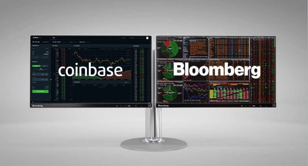

# Động lực tiếp tục cho Cardano khi Coinbase niêm yết ADA và Bloomberg thêm Cardano

### **Cardano đạt được một cột mốc quan trọng khác khi cường quốc dữ liệu tài chính Bloomberg thêm Cardano vào nền tảng thông tin thị trường thời gian thực 'Terminal' của mình và sàn giao dịch Coinbase niêm yết ADA**

 Ngày 17 tháng 3 năm 2021[ Tim Harrison](tmp//en/blog/authors/tim-harrison/page-1/) bài đọc 4 phút

### [**Tim Harrison**](tmp//en/blog/authors/tim-harrison/page-1/)

VP of Community &amp; Ecosystem

Communications

- 
- 
- 
- 

Mặc dù các tác động của thị trường bên ngoài không thuận lợi, nhưng [Ides of March](https://en.wikipedia.org/wiki/Ides_of_March) đã tỏ ra rất thuận lợi cho Cardano, vì ada đã được [niêm yết trên Coinbase Pro](https://blog.coinbase.com/cardano-ada-is-launching-on-coinbase-pro-694b1cb8c778) trong tuần này và cũng [được thêm vào nền tảng uy tín Bloomberg Terminal](https://decrypt.co/61413/cardano-added-to-bloomberg-terminal). Đây đều là những bước phát triển lớn, củng cố vị trí của Cardano trong bối cảnh tiền mã hóa. Một nền tảng mang ada đến một tệp khách hàng hoàn toàn mới, trong khi nền tảng kia cung cấp một mức độ hiển thị hoàn toàn mới cho Cardano đối với ngành tài chính toàn cầu.

## **Coinbase – những gì sắp xảy ra?**

Việc niêm yết trên Coinbase đánh dấu một cột mốc quan trọng với Cardano, sẽ giúp đưa hàng triệu người sở hữu ada mới tham gia hệ sinh thái vào thời điểm thú vị này. [Coinbase Pro](https://pro.coinbase.com/) là một nâng cấp cho khách hàng Coinbase tiêu chuẩn, được thiết kế cho các nhà giao dịch cá nhân, cung cấp quyền truy cập trực tiếp vào Coinbase Markets, là 'nguồn thanh khoản duy nhất' của công ty.

Từ thành công ban đầu của mạng testnet vào năm 2019, đến việc giới thiệu đặt cược (staking) vào mùa hè năm ngoái, động lực đã được xây dựng đều đặn cho Cardano. Bây giờ, khi chúng tôi tiếp tục triển khai Goguen, phi tập trung tiếp tục diễn ra nhanh chóng, với toàn bộ trách nhiệm sản xuất block sẽ được giao cho các stake pool vào cuối tháng này, ngày đó thông số [D = 0](https://iohk.io/en/blog/posts/2021/03/04/not-long-till-d-0-day/). Có thể cho rằng Cardano phi tập trung hơn 100 lần so với blockchain Bitcoin và với hơn 2.000 stake pool đã đăng ký, chúng tôi có thể khẳng định rằng Cardano là mạng lưới Proof of Stake thành công nhất, được phân bố rộng nhất trên thế giới.

Thời điểm là tốt. Sau nhiều năm nỗ lực nghiên cứu và phát triển, ngành công nghiệp rộng lớn này hiện đang bắt đầu nhận ra đúng tiềm năng mà cộng đồng Cardano đã tin tưởng từ lâu trước nhu cầu của một thế hệ dịch vụ mới.

Việc triển khai Goguen đang mang lại tiện ích mới cho nền tảng - từ siêu dữ liệu và token gốc, NFT, DeFi và các hợp đồng thông minh. Nền tảng tài trợ đổi mới của chúng tôi, Project Catalyst, dành để phát triển Cardano đã tài trợ cho một số đề xuất nhằm làm phong phú thêm hệ sinh thái. Sẽ có thêm hàng triệu đô la tài trợ cho sự đổi mới của cộng đồng trong năm nay, được tài trợ từ quỹ Cardano hiện có giá trị hơn 400 triệu đô la.

## **Thành tựu kỹ thuật**

Cũng như động lực quan trọng cho sự tăng trưởng trong tương lai, việc niêm yết trên Coinbase là sự hợp tác kỹ thuật quan trọng, được thực hiện bằng cách sử dụng [tiêu chuẩn mã nguồn mở Rosetta](https://github.com/coinbase/rosetta-specifications), mà chúng tôi đang thực hiện cùng với Coinbase. Rosetta hiện là một phần không thể thiếu trong kho tích hợp của chúng tôi, cho các dự án có khả năng tương thích trong tương lai. Rosetta có khả năng liên kết liền mạch với nhiều blockchain khác, cho phép các tổ chức quản lý nhiều tài sản mà không cần dành hàng tháng để nghiên cứu các triển khai kỹ thuật khác nhau.

## **Bloomberg phát trực tuyến**

Ngoài ra, trong tuần này, chúng tôi đã nhận được tin tức rằng cường quốc dữ liệu tài chính Bloomberg đã thêm Cardano vào danh sách cung cấp thông tin của mình. Kể từ khi ra mắt vào năm 1982, Bloomberg Terminal đã tạo dựng được uy tín trong ngành tài chính như một nguồn cung cấp thông tin thời gian thực cần thiết cho thị trường. Như công ty tuyên bố, nó giúp “các nhà đầu tư tài chính và kinh doanh trên thế giới, hiển thị thông tin có liên quan trong một khối lượng dữ liệu lớn ngày càng mở rộng – và giúp họ nhanh chóng ra quyết định”.

## **Vì vậy, điều này có ý nghĩa gì đối với Cardano và tiền mã hóa?**

Bitcoin đã [được thêm vào Bloomberg Terminal](https://www.bloomberg.com/company/press/bitcoin-now-bloomberg/) vào năm 2014 và Cardano cùng một số đồng tiền mã hóa khác đã được thêm vào danh sách kể từ đó. Gần đây, tiền mã hóa và tài sản kỹ thuật số nói chung, đã chứng kiến ​​sự quan tâm trở lại từ các khách hàng của Bloomberg. Bitcoin gần đây đã đạt mức cao nhất mọi thời đại là 60.000 đô la. Trong khi đó, các token không thể thay thế (NFT) đã trở thành xu hướng chính, sau khi toàn bộ tác phẩm kỹ thuật số của nghệ sĩ Beeple, [Everydays: the first 5000 days](https://www.smithsonianmag.com/smart-news/entirely-digital-artwork-just-sold-major-auction-first-time-180977039/) được bán với giá 69 triệu đô la, cũng như việc Cardano đã tung ra các token gốc trên mạng lưới.

Việc thêm ada vào Bloomberg Terminal là cột mốc mới nhất trong một năm tiếp tục phát triển và tăng uy tín của Cardano trong ngành tài chính. Điều quan trọng là tin tức này có ý nghĩa với viễn cảnh phát triển của Cardano. Sứ mệnh của Cardano vẫn rõ ràng và tập trung vào việc mang lại tiện ích và giá trị thực sự cho hàng tỷ người trên thế giới - đặc biệt là những người hiện không được tiếp cận với các dịch vụ tài chính và cơ sở hạ tầng. Trọng tâm của chúng tôi tiếp tục là cung cấp công nghệ hỗ trợ trong khi trao quyền hoàn toàn cho cộng đồng, điều cuối cùng sẽ mang lại sự phát triển của nền tảng. Tuy nhiên, nó vẫn là công việc mà cả cộng đồng đã cùng thực hiện để đến được đây và là một dấu ấn mạnh mẽ cho động lực tiếp tục của chúng tôi. Bài này được dịch bởi Thanhtintran, Review bởi Quang Pham, Biên tập bởi .... Bài viết nguồn [tại đây (https://iohk.io/en/blog/posts/2021/03/17/momentum-continues-as-coinbase-lists-ada-and-bloomberg-adds-cardano/) *Dự án này được tài trợ bởi Catalyst*
