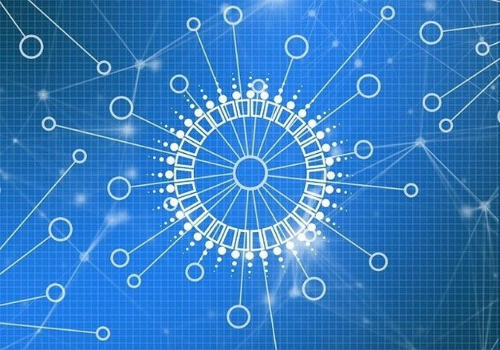

# Phân quyền: Ngày tham số D = 0 và hơn thế nữa

### **Các nhà điều hành pool cổ phần(SPO) ngày nay tiếp quản việc tạo block và thực hiện vai trò phát triển mạng lưới**

 31 tháng 3 năm 2021  [Tim Harrison](tmp//en/blog/authors/tim-harrison/page-1/)  7 phút đọc

### [**Tim Harrison**](tmp//en/blog/authors/tim-harrison/page-1/)

VP of Community &amp; Ecosystem

Communications

- 
- 
- 
- 

Hôm nay lúc 21:44:51 GMT, việc tạo block trên Cardano sẽ được phi tập trung hoàn toàn. Đó là một khởi đầu mới. Từ một mạng lưới liên kết gồm bảy node cốt lõi do IOHK, Emurgo và Cardano Foundation điều hành, chúng ta đã phát triển thành một mạng lưới phi tập trung, nơi cộng đồng (SPO) sẽ chịu trách nhiệm sản xuất 100% block.

Cardano là một nền tảng blockchain bằng chứng cổ phần (POS), được thành lập dựa trên nghiên cứu được đánh giá ngang hàng và được triển khai thông qua các quy trình phát triển phần mềm dựa trên các nghiên cứu đã được xác minh bởi một nhóm các nhà nghiên cứu và kỹ sư hàng đầu thế giới. Từ giá trị cốt lõi này, Cardano phát triển nhằm trao lại quyền lực một cách kiên định cho mọi người trong cộng đồng. Và làm động lực để họ thay đổi và tiến bộ.

Cộng đồng SPO của chúng tôi đã góp phần đưa Cardano đến thời điểm này. Khi *d*, tham số phân quyền [bằng 0](https://iohk.io/en/blog/posts/2021/03/04/not-long-till-d-0-day/), các SPO sẽ chịu trách nhiệm sản xuất tất cả các block trên Cardano.

### **Tại sao phải phân quyền?**

Nói một cách thông thường, phân quyền là sự phân cấp quyền lực từ một cơ quan trung ương cho một nhóm các cơ quan trên quy mô lớn. Nhưng định nghĩa đó chỉ thay đổi bề mặt trong bối cảnh của tiền mã hoá và blockchain.

Hành trình kỹ thuật của Cardano để phi tập trung hoàn toàn tiếp tục thông qua các phát triển theo từng giai đoạn bao gồm tỷ lệ sản xuất block từ SPO, hiện thực hoá mạng ngang hàng (P2P) và giao thức "gossip" để phổ tiến thông tin cho tất cả các thành viên. Nó liên quan đến việc triển khai các khuôn khổ ra quyết định và quản trị tiên tiến do cộng đồng thực hiện, đỉnh cao là các bản cập nhật giao thức và phần mềm phi tập trung hoàn toàn. Cuối cùng, nó sẽ dẫn đến việc tạo ra một nền tảng được vận hành và kiểm soát dân chủ thông qua một cộng đồng toàn cầu gồm các SPO, nhà phát triển và chủ sở hữu ada.

Phi tập trung là giá trị cốt lõi và là động lực cho Cardano, và chúng tôi không hề đơn độc trong việc này. Thế giới tài chính chính thống đã công nhận rằng blockchain và công nghệ tài chính phi tập trung (DeFi) có tiềm năng tạo ra một hệ thống tài chính mới mang tính cách mạng như chính internet. Và đó chỉ là một phần của xu hướng phân quyền. Các giao thức mở giữa người cho thuê và nhà cung cấp dịch vụ lưu trữ dữ liệu mà bất kỳ ai cũng có thể sử dụng có khả năng làm suy yếu các nhà cung cấp máy chủ đám mây tập trung thống trị như Amazon và Microsoft, đồng thời có những xu hướng tương tự ảnh hưởng đến mạng video và truyền thông cũng như trò chơi. Tiền mã hoá lần đầu tiên đưa mọi người vào thế giới blockchain và giờ đây mọi người trao đổi nhiều đến [các token không thể thay thế (NFT)](https://iohk.io/en/blog/posts/2021/02/18/building-native-tokens-on-cardano-for-pleasure-and-profit/) đang khuyến khích họ tương tác với blockchain theo một cách mới, thú vị. Những xu hướng này đang giới thiệu blockchain đến thị trường đại chúng.

### **Quyền lực phi tập trung**

Tập trung hóa đã làm thay đổi cán cân quyền lực, từ người dân sang các tập đoàn như Facebook và Google, tạo ra thế độc quyền thông tin ảo. Do vị trí thị trường không bị thách thức của họ, các cơ quan quản lý tập trung được hưởng quyền bá chủ dữ liệu đối với người tiêu dùng của họ.

Phi tập trung là liều thuốc giải độc cho sự tập trung quyền lực này và những rủi ro mà nó mang lại. Phi tập trung trao quyền cho cá nhân đưa ra các lựa chọn và quyết định, nó trả lại quyền sở hữu thông tin cá nhân về nơi nó thuộc về, nó loại bỏ quyền lực tập trung và cho phép mọi người tham gia trong mạng (hoặc người giữ ada) có cổ phần.

Có ba trụ cột đối với sự phân quyền của Cardano: sản xuất block, quản trị (governance) và mạng (network). Về bản chất, chúng được liên kết với nhau và phối hợp hoạt động để tạo ra một kết quả thống nhất: phân quyền hoàn toàn, nằm ở điểm giao thoa của chúng.

### **Trụ cột thứ nhất: sản xuất block**

Mọi blockchain đều dựa vào việc bổ sung các block mới để phát triển và lớn mạnh. Với việc triển khai kỷ nguyên Byron, các node cốt lõi - được quản lý bởi IOHK, Emurgo và Cardano Foundation - chịu trách nhiệm hoàn toàn trong việc tạo các block và duy trì mạng lưới. Sự [ra đời của Shelley](https://iohk.io/en/blog/posts/2020/04/29/from-byron-to-shelley-part-one-the-testnets/) và Incentivized Testnet vào năm 2019 đóng vai trò là nơi thử nghiệm cho việc sản xuất block phi tập trung. Các kết quả đã chứng minh khả năng tồn tại của một sáng kiến như vậy. Nói cách khác, [thử nghiệm Incentivized Testnet đã chứng minh](https://iohk.io/en/blog/posts/2020/02/07/shelley-incentivized-testnet-story-in-numbers/) rằng Cardano có thể được duy trì một cách đáng tin cậy bởi một mạng lưới các stake pool do cộng đồng điều hành. Tính đến epoch 170 vào ngày 3 tháng 6 năm 2020, đã có 1.299 stake pool đã đăng ký, 413 trong số đó đã đóng block.

Ngày nay, chúng tôi hiện có khoảng 2.300 pool, với một tỷ lệ hợp lý tạo ra các block và phần thưởng cho việc ủy quyền. Một số được kiểm soát bởi các sàn giao dịch, còn một số khác do các SPO đơn lẻ. Tất cả đều mang lại giá trị cho mạng lưới. Cái trước thông qua khả năng đưa những người nắm giữ ada mới vào hệ sinh thái, cái sau thông qua đóng góp của họ trong việc tiếp tục phân quyền và khuyến khích sự tham gia cấp cơ sở. Chúng tôi cam kết khuyến khích phân quyền và điều chỉnh trong năm nay đối với các thông số như [k (kích thước pool tối đa) và cam kết](https://iohk.io/en/blog/posts/2021/03/04/not-long-till-d-0-day/) cùng với chiến lược ủy quyền cho cộng đồng của chúng tôi - và hơn thế nữa vào cuối tuần này - sẽ tiếp tục thúc đẩy chương trình nghị sự này.

### **Trụ cột thứ hai: mạng lưới (network)**

Trụ cột thứ hai trong phân quyền của Cardano là việc triển khai mạng ngang hàng (P2P), cũng đã được thử nghiệm với Shelley. Mục đích ở đây là liên kết các pool phân tán theo địa lý với nhau để cung cấp một nền tảng blockchain an toàn và mạnh mẽ.

Trên mainnet, tính năng này sẽ sử dụng một [tập hợp các giao thức nhỏ](https://iohk.io/en/blog/posts/2020/07/09/cardanos-path-to-decentralization-by-marcin-szamotulski/) và phân loại các tương đồng lạnh, ấm và nóng để một node nhất định có thể đưa ra quyết định tốt nhất khi chọn kết nối. Từ góc độ mạng lưới, chúng ta đang ở trong một giai đoạn kết hợp, nơi các quy trình thủ công được yêu cầu từ các SPO để duy trì kết nối mạng. Khi *d* = 0, tất cả các node cốt lõi sẽ bị gỡ bỏ khi các SPO tiếp quản quá trình sản xuất block. IOHK sẽ tiếp tục duy trì các relays nhưng ngày càng có nhiều mạng SPO sẽ đảm nhận vai trò này. Để tìm hiểu sâu hơn về vấn đề này, hãy xem phân đoạn này của [chương trình Cardano360 tháng 3](https://youtu.be/mXYIQDUitYI) , nơi kiến trúc sư trưởng của Cardano Duncan Coutts đưa ra lộ trình P2P.

### **Trụ cột thứ ba: quản trị (governance)**

Việc triển khai Goguen đã giới thiệu siêu dữ liệu giao dịch *và* [native tokens ](https://iohk.io/en/blog/posts/2021/02/04/native-tokens-to-bring-new-utility-to-life-on-cardano/) cho Cardano. Có thể cho rằng đây là minh chứng rõ ràng nhất cho sự phát triển và tiến bộ của Cardano kể từ khi ra mắt Shelley.

Đồng thời, chúng ta cũng đã chứng kiến sự trỗi dậy của một thứ thậm chí còn mạnh mẽ hơn: một cộng đồng gắn bó gồm các nhà xây dựng, người sáng tạo và doanh nhân trong Project Catalyst. Tại thời điểm viết bài, cộng đồng Catalyst bao gồm hơn 17.000 thành viên trên toàn thế giới. Nhóm tài năng phi tập trung này bao gồm các doanh nhân, chuyên gia trên nhiều lĩnh vực và cung cấp một kho tài nguyên khổng lồ để đảm bảo những ý tưởng tốt nhất và sáng suốt nhất nhận được khoản tài trợ xứng đáng.

Một layer quản trị vững chắc sẽ hỗ trợ cho giá trị cốt lõi mà Cardano đang cố gắng đạt được: một blockchain nơi cộng đồng các bên liên quan đưa ra các quyết định thiết thực về giao thức và sự phát triển của chuỗi. Catalyst là tiền thân của [Voltaire](https://iohk.io/blog/posts/2020/09/10/project-catalyst-voltaire-bring-power-to-the-people/), Kỷ nguyên sẽ giới thiệu cấp độ phân quyền thứ ba và cấp cuối cùng thông qua tích hợp quản trị và ra quyết định/ bỏ phiếu on-chain (trên chuỗi).

Voltaire sẽ giới thiệu:

- Tiếp cận nguồn vốn thông qua kho bạc phi tập trung (trị giá khoảng 400 triệu đô la theo giá ada hiện tại) trong khuôn mẫu quản trị, nơi cộng đồng sẽ có quyền thông qua cổ phần của họ, để ảnh hưởng đến định hướng tương lai của Cardano
- Ra quyết định phi tập trung về các nâng cấp, cải tiến mạng và cập nhật thông số
- Cập nhật phần mềm hoàn toàn phi tập trung: quy trình cho phép tham gia phi tập trung, cởi mở để bỏ phiếu công bằng cho các quyết định về các tiến bộ của hệ thống và giao thức

### **Kết luận: sự thoái trào của tập trung hóa**

Sản xuất block phi tập trung - đã hoàn thành. Mạng P2P - ra mắt từ tháng 4. Còn quản trị? Dự án Catalyst đang trên đà phát triển và còn nhiều hơn thế nữa.

Từ một chuỗi liên kết với việc sản xuất block tập trung, đến một chuỗi với các block được cộng đồng sản xuất hoàn toàn. Chúng tôi đang đi trên đúng con đường của chúng tôi. Khi chúng tôi hoàn thành việc xây dựng cả ba trụ cột, chúng tôi sẽ tạo ra một cái gì đó thực sự độc đáo. Một mạng lưới mạnh mẽ và có khả năng phục hồi, nhưng linh hoạt và thích ứng với sự phát triển trong tương lai. Một nền tảng phục vụ người dùng ngày hôm nay, đồng thời trao quyền cho họ xây dựng giá trị và chức năng mới cho ngày mai. Tất cả đều nằm trong khuôn mẫu dân chủ, nơi cộng đồng đưa ra lời kêu gọi. Sự phân quyền thực sự, đứng trên đỉnh ba trụ cột đó.

Bài này được dịch bởi LinhPool, Review bởi Quang Pham, biên tập bởi Nguyễn Hiệu.
 Bài viết nguồn [tại đây](https://iohk.io/en/blog/posts/2021/03/31/decentralization-to-d-0-day-and-beyond)
 
  *Dự án này được tài trợ bởi Catalyst*.
