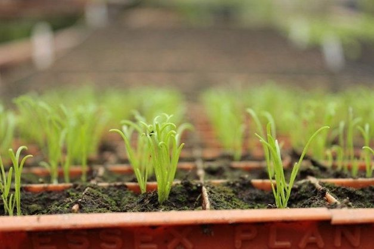

# Thông báo vòng ủy quyền mới tới cộng đồng stake pool

### **Chúng tôi đang sử dụng ada của mình để hỗ trợ các nhà vận hành pool đơn lẻ nhằm giúp đỡ mạng lưới và cộng đồng Cardano**

 Ngày 1 tháng 4 năm 2021[ Ben O'Hanlon](tmp//en/blog/authors/ben-ohanlon/page-1/) bài đọc 4 phút

### [**Ben O'Hanlon**](tmp//en/blog/authors/ben-ohanlon/page-1/)

Head of Community Engagement &amp; Insights

Marketing and Communications

- 
- 
- 
- 

Như chúng ta đã kỷ niệm trong [ bài blog hôm qua về ngày D = 0](https://iohk.io/en/blog/posts/2021/03/31/decentralization-to-d-0-day-and-beyond/), việc sản xuất block hiện 100% nằm trong tay của cộng đồng nhà vận hành stake pool Cardano (SPO). Các pool cộng đồng là mạch máu của mạng lưới. Và vào đầu năm nay, chúng tôi đã [xác nhận cam kết của mình đối với một hệ sinh thái proof of stake (PoS)](https://iohk.io/blog/posts/2021/01/22/our-new-delegation-strategy-announcing-the-pools-we-are-supporting/) khi ủy quyền hơn 300 triệu ada cho các pool cộng đồng đầu tiên của chúng tôi.

Số lượng pool hiện là hơn 2.000 - chiếm gần 3/4 số lượng pool đang lưu hành. Những nỗ lực của họ đã duy trì mạng lưới và góp phần to lớn vào sự thành công và công nhận của giao thức Ouroboros, thiết lập một tiêu chuẩn rõ ràng cho bất kỳ [giao thức PoS cạnh tranh nào.](https://pageviews.toolforge.org/?project=en.wikipedia.org&platform=all-access&agent=user&redirects=0&start=2020-10-29&end=2021-03-29&pages=Cardano_(cryptocurrency_platform)%7CPolkadot_(cryptocurrency)%7CPeercoin%7CGridcoin%7CNxt%7CEOS.IO%7CTezos%7CTRON_(cryptocurrency))

Vào đầu năm, chúng tôi đã cam kết tạo các ủy quyền mới hàng quý để giúp khởi động các pool cộng đồng. Điều hành một pool nhỏ thành công là một việc khó và cần có sự tham gia như bất kỳ nỗ lực kinh doanh nào khác, với các chi phí cố định và biến đổi được lên kế hoạch, số giờ cần thiết để hoạt động, hòa vốn, lập kế hoạch tiếp thị… Với mỗi vòng ủy thác, mục tiêu của chúng tôi là ủy quyền đủ ada cho mọi SPO mà họ có thể tạo block, mang lại cho họ một mức độ an toàn tài chính nhất định trong khi họ tìm cách phát triển cơ sở ủy quyền của mình.

Chúng tôi một lần nữa yêu cầu mọi nhà vận hành ngoài kia nên tìm kiếm sự ủy quyền từ quỹ ada của IOHK. Chúng tôi đã thực hiện một cuộc khảo sát về các pool để có hướng dẫn về tiến trình tham gia và bây giờ chúng tôi muốn mọi pool điền vào bản khảo sát của chúng tôi. Bên cạnh việc hỗ trợ việc ứng tuyển cho riêng bạn, câu trả lời của bạn sẽ giúp chúng tôi định hình cách tiếp cận ủy quyền cộng đồng dựa trên các yếu tố như tác động tiềm năng và mục tiêu của từng stake pool.

Chúng tôi ưu tiên các nhà vận hành chạy các pool đơn lẻ và chúng tôi yêu cầu cung cấp chi tiết hỗ trợ cho từng đơn ứng tuyển. Chúng tôi cũng đang tìm kiếm các pool có ý thức rõ ràng về [sứ mệnh hoặc mục đích](https://iohk.io/en/blog/posts/2020/11/24/delegating-with-fresh-purpose/) - các nhà vận hành pool cần phải tham gia vào đó không chỉ cho việc quảng cáo. Chúng tôi cũng tìm kiếm khả năng 'tiếp thị' - cho dù đó là thông qua sáng tạo nội dung, trình bày rõ ràng về sứ mệnh,… Bằng chứng về cam kết hỗ trợ kỹ thuật hệ thống Cardano cũng có khả năng ảnh hưởng đến quyết định của chúng tôi, vì vậy, hãy tuyên bố rõ ràng về mục tiêu và động lực về pool của bạn. Bạn có thể đã tạo nội dung giáo dục; có chứng chỉ môi trường; hoặc điều hành pool để gây quỹ cho các hoạt động từ thiện - hãy cho chúng tôi biết về điều đó và cung cấp bằng chứng về những thành công của bạn. Để dễ tham khảo, đây là phác thảo những gì chúng tôi sẽ hỏi bạn trong đơn đăng ký.

- Tên của bạn
- **Khu vực** và  **quốc gia** đặt pool của bạn
- Tên pool của bạn
- Bạn đã thành lập pool của mình khi nào
- Thông tin chi tiết về bất kỳ liên kết của nhóm SPO hoặc guild nào (ví dụ: SPOCRA, Guild, SPA,…)
- Thông tin chi tiết về bạn trên web, Twitter, Telegram, YouTube,… để chúng tôi có thể hiểu rõ hơn về cách bạn tiếp thị pool của mình
- Số lượng pool (chúng tôi ưu tiên các nhà vận hành chạy một pool)
- Tuyên bố sứ mệnh của bạn và mục tiêu pool của bạn
- Bạn hay stake Pool của bạn có tạo ra **nội dung giáo dục** có sẵn, công khai và với ngôn ngữ của nó hay không
- Liên kết đến bằng chứng về nội dung đó và bất kỳ thành công nào
- Nếu bạn tổ chức một buổi gặp mặt, kết quả sẽ như thế nào
- Thông tin xác thực về môi trường của pool (giảm carbon / năng lượng tái tạo,...)
- Liệu stake pool của bạn có phải là một tổ chức từ thiện hay hoạt động thay mặt cho một tổ chức từ thiện, phi lợi nhuận hay phi chính phủ, với thông tin chi tiết
- Liệu stake pool của bạn đã từng được khởi động hoặc được bồi thường bởi một tổ chức khác, bao gồm Quỹ Cardano hoặc EMURGO không
- Chi tiết về bất kỳ đóng góp nào mà bạn đã thực hiện cho cộng đồng hoặc hệ sinh thái mà không được đề cập trên đơn đăng ký (ví dụ: điều hành một pool trên ITN, đóng góp kỹ thuật, GitHub PR, CIP, đóng góp nội dung/tiếp thị,...)

Để sử dụng, bạn có thể truy cập [biểu mẫu tại đây](https://input-output.typeform.com/to/Ho4O5enm).

Mặc dù chúng tôi yêu cầu tất cả các SPO đăng ký bảo đảm rằng thông tin họ đã cung cấp là trung thực và chính xác, chúng tôi không điều tra hoạt động pool hoặc kiểm tra trước các yêu cầu về tính chính xác. Tuy nhiên, chúng tôi mong đợi sự minh bạch từ mọi thành viên của cộng đồng.

Các stake pool có thể đăng ký ủy quyền từ hôm nay; việc ứng tuyển sẽ đóng lại vào lúc **nửa đêm giờ UTC vào thứ năm ngày 15 tháng 4**. Sau đó, chúng tôi sẽ xem xét tất cả các đơn đăng ký và thông báo SPO nào sẽ nhận ủy quyền, điều này sẽ được thực hiện vào đầu tháng 5. Chúng tôi mong chờ việc ứng tuyển của bạn.

Bài này được dịch bởi Thanhtintran, Reivew bởi tienna, Đăng bài bởi Nguyễn Hiệu.
Nguồn bài viết [tại đây](https://iohk.io/en/blog/posts/2021/04/01/announcing-a-new-round-of-community-stake-pool-delegation/)
*Dự án này được tài trợ bởi Catalyst*
