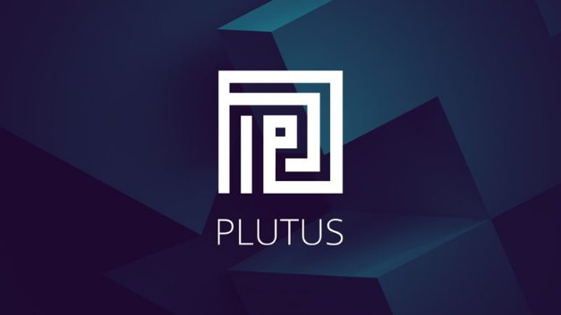

# Những điều bạn cần biết về Chương trình Plutus tiên phong mới của chúng tôi

### **Bắt đầu từ tuần tới, cùng tìm hiểu Plutus và trở thành Người tiên phong của chương trình lập trình Plutus được chứng nhận từ chuỗi các khóa đào tạo tương tác mới của chúng tôi.**

 1 tháng 4 năm 2021  [Niamh Ahern](tmp//en/blog/authors/niamh-ahern/page-1/)  5 phút đọc

### [**Niamh Ahern**](tmp//en/blog/authors/niamh-ahern/page-1/)

Education Manager

Giáo dục

- 
- 
- 
- 

Tuần tới sẽ chứng kiến sự bắt đầu của chương trình đầu tiên trong một loạt các chương trình đào tạo tiên phong về ngôn ngữ lập trình Plutus (Plutus) của chúng tôi, nơi những người tham gia có thể tìm hiểu các nguyên tắc cơ bản của Plutus và giúp kiểm tra mã lập trình trước khi chúng tôi phát hành chính thức ngôn ngữ hợp đồng thông minh mới. Chương trình sáng tạo mới này nhằm mục đích tuyển dụng và đào tạo các nhà phát triển trong hệ sinh thái để họ được chuẩn bị đầy đủ và sẵn sàng khi chương trình Plutus được triển khai vào mạng chính mainet Cardano vào cuối năm nay.

Kể từ khi chúng tôi công bố khóa học mới này [ trong bản tin cập nhật Cardano360 tháng 3,](https://youtu.be/ULBLgPgxtN8?t=3731) chúng tôi đã nhận được sự quan tâm rất lớn từ cộng đồng nhà phát triển của chúng ta, cả từ các nhà phát triển muốn tạo các ứng dụng phi tập trung (DApps) và các nhà lập trình hợp đồng thông minh muốn làm việc với ngôn ngữ phát triển chính của Cardano. Tuần này, chúng tôi đã liên hệ với tất cả những người quan tâm (hơn 2.000) để hiểu rõ hơn về kinh nghiệm và chuyên môn của họ. Những bạn đã được chọn vào vòng đầu tiên của chương trình này sẽ sớm nhận được phản hồi của chúng tôi. Nếu bạn không nhận được lời mời ở giai đoạn này, đừng lo lắng vì chúng tôi sẽ tiếp tục thực hiện một số vòng của chương trình này, vì vậy hãy tiếp tục theo dõi và giữ liên lạc!

## **Cấu trúc khóa học**

Khóa học sẽ bắt đầu vào tuần tới. Nhóm tham gia chương trình này sẽ là những người tiên phong thực sự. Cũng như là một phần của nhóm sẽ có *quyền truy cập sớm vào* một tập hợp các học phần, phản hồi của bạn sẽ giúp chúng tôi phát triển và lặp lại trải nghiệm học tập tổng thể.

Khóa học sẽ dạy cho bạn các nguyên tắc cốt lõi về cách viết mã trong cả ngôn ngữ lập trình Haskell và Plutus. Các học phần của  khóa học sẽ bao gồm các khối xây dựng của chương trình Haskell và Plutus, bao gồm các chức năng và kiểu dữ liệu, phân loại các lớp, đơn nguyên, mẫu Haskell, sử dụng [Plutus Playground](https://iohk.io/en/blog/posts/2021/01/25/introducing-the-new-plutus-playground/) , [mô hình UTXO mở rộng](https://iohk.io/en/blog/posts/2021/03/11/cardanos-extended-utxo-accounting-model/) , làm việc với chương trình Plutus trên và ngoài chuỗi, chính sách đúc, tình trạng máy móc, khung ứng dụng Plutus, cũng như một số nghiên cứu điển hình và bài tập thực hành.

Khóa học sẽ theo cách tiếp cận học phần và sẽ có tính tương tác cao - mỗi tuần, chúng tôi sẽ phát hành các video giảng dạy mới từ Lars Brünjes - giám đốc giáo dục của chúng tôi, cùng với một loạt các bài tập thực hành để hoàn thành trong tuần như một phần của mỗi học phần. Chúng tôi cũng sẽ tổ chức các buổi Hỏi và Đáp thường xuyên và bạn sẽ có quyền truy cập vào kênh Discord dành riêng cho cộng đồng, được tạo đặc biệt để giúp bạn kết nối với những người tham gia khóa học khác khi bạn tham gia học.

Ngoài các bài tập và video, học viên sẽ được khuyến khích học với tốc độ phù hợp với mình, kết nối và hợp tác với các học viên khác. Giống như các trải nghiệm học tập, bạn càng giành nhiều thời gian cho việc học thì bạn sẽ càng nắm bắt được nhiều hơn! Chúng tôi khuyến khích tất cả những người tham *gia tương tác với nhau* và hợp tác làm việc để trả lời các câu hỏi và giải quyết vấn đề.

Chúng tôi sẽ có một nhóm nhỏ điều hành viên sẽ kiểm tra theo thời gian để giúp tạo điều kiện và hỗ trợ người tham gia. Họ cũng có thể giúp phân loại các vấn đề hoặc câu hỏi có thể nảy sinh trong quá trình học của bạn trong tuần. Những người điều hành này đều là sinh viên tốt nghiệp khóa học tại [Mông Cổ năm 2020](https://iohk.io/en/blog/posts/2020/12/21/online-learning-with-haskell-the-mongolia-class-of-2020/) , đã hoàn thành chương trình Haskell MOOC và luôn sẵn sàng hỗ trợ giải đáp các thắc mắc và thách thức. Vào cuối mỗi tuần, Lars sẽ tham gia trực tiếp với nhóm để giải quyết các câu hỏi kỹ thuật phức tạp hơn và cung cấp phản hồi về chủ đề được đề cập trong tuần đó.

## **Kinh nghiệm trước đây**

Vì phần lớn chương trình Plutus dựa trên ngôn ngữ lập trình Haskell, việc có một số kinh nghiệm trước đó với chương trình Haskell (hoặc một ngôn ngữ lập trình chức năng khác), sẽ rất hữu ích. Tối thiểu, bạn phải có một số kinh nghiệm lập trình và tư duy toán học và kỹ thuật. Bạn nên quan tâm đến việc tìm hiểu và học hỏi để giúp đỡ chúng tôi; mặc dù chúng tôi đã tổ chức một số khóa học thành công, nhưng đây là lần đầu tiên chúng tôi thử thách bản thân khi giảng dạy ở quy mô này. Vì vậy, hãy chuẩn bị cho những va chạm trong chương trình khi chúng ta tham gia học hỏi và cải thiện!

Hãy nhớ rằng khóa học này không dành cho người mới bắt đầu lập trình. Mặc dù bạn không cần phải là một chuyên gia về các phương pháp chính thức, nhưng kinh nghiệm lập trình và năng khiếu chung về tư duy logic và toán học là điều rất đáng mong đợi. Khóa học sẽ bao gồm các tính năng nâng cao như Template Haskell, lập trình type - level và hệ thống hiệu ứng. Nếu bạn cần bồi dưỡng hoặc được giới thiệu về Haskell, chúng tôi khuyên bạn nên đọc [hướng dẫn bạn đọc thêm tài liệu hướng dẫn Tìm hiểu về chương trình Haskell](http://learnyouahaskell.com/) trước khi tham gia khóa học. Chúng tôi sẽ mở một số nhóm thực hành mới trong năm nay, vì vậy bạn sẽ không bị bỏ lỡ chương trình.

## **Khi nào thì khóa học bắt đầu?**

Khóa học bắt đầu vào tuần tới và sẽ diễn ra đồng thời trong mười tuần đến giữa tháng Sáu. Khóa học có thời lượng khoảng mười giờ một tuần dựa theo thời gian và nỗ lực của bạn mỗi tuần.

## **Sẽ có các chương trình tiên phong khác?**

Có, chúng tôi muốn trở nên toàn diện nhất có thể trên con đường triển khai các hợp đồng thông minh. Chúng tôi cũng đang phát triển các chương trình giáo dục cho cả chương trình [Marlowe](https://docs.cardano.org/marlowe/learn-about-marlowe) và [Glow](https://developers.cardano.org/en/programming-languages/glow/overview/) , vì vậy đừng tiếc nếu như bạn đã bỏ lỡ nếu khóa học Plutus này và nghĩ khóa học không dành cho bạn. Chúng tôi vẫn mong muốn có bạn tham gia, vì vậy hãy theo dõi kênh thông tin này để biết chi tiết về các khóa học khác!

## **Chứng nhận khóa học**

Chúng tôi sẽ khen thưởng những người tham gia vì những nỗ lực khi họ tham gia khóa học này và chứng nhận những người tiên phong hoàn thành toàn bộ chương trình và thành công trong khóa học. Các chứng chỉ tiên phong này của Plutus sẽ được biểu thị dưới dạng các NFT (trên testnet) và bị khóa bởi hợp đồng Plutus. Những người tiên phong có thể chứng minh kiến thức và trình độ của họ bằng cách xây dựng một giao dịch thích hợp để mở khóa mã thông báo cá nhân của họ.

## **Sẵn sàng để bắt đầu**

Chúng tôi rất vui mừng khi có rất nhiều nhà phát triển từ hệ sinh thái của chúng ta tham gia, họ sẵn sàng bắt đầu và tìm hiểu  về chương trình Plutus. Bạn sẽ không chỉ tự học mà còn đóng vai trò là người tiên phong giúp chúng tôi xác định cách tốt nhất để giảng dạy và cung cấp khóa học này - thực sự giúp mở đường cho những người đăng ký học trong tương lai! Chúng tôi mong được đưa bạn vào hành trình học tập này trước khi chúng tôi giới thiệu Plutus ra thế giới!

Bài này được dịch bởi minh-hieu-102, Review bới tienna đăng bài bởi Nguyễn Hiệu

 Bài viết nguồn [tại đây](https://iohk.io/en/blog/posts/2021/04/01/everything-you-need-to-know-about-our-new-plutus-pioneer-program/)
 
 *Dự án này được tài trợ bởi Catalyst*
