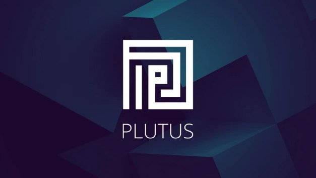

# Đối tác chiến lược mở đường cho hợp đồng thông minh Plutus

### **Metalamp, Runtime Verfication và các nhà phát triển đang thúc đẩy Cardano trong thời đại DeFi**

 12 tháng 5 năm 2021  [Anthony Quinn](tmp//en/blog/authors/anthony-quinn/page-1/)  6 phút đọc

### [**Anthony Quinn**](tmp//en/blog/authors/anthony-quinn/page-1/)

Editor

Marketing &amp; Communications

- 
- 
- 
- 

Cơ sở hạ tầng kỹ thuật đang được thiết lập cho hợp đồng thông minh Plutus trên Cardano. Nhưng cơ sở hạ tầng như vậy cho tài chính phi tập trung (DeFi) giống như một con đường không có ô tô nếu không có các nhà phát triển viết các hợp đồng để thúc đẩy việc áp dụng và sử dụng nền tảng.

[Chương trình Plutus Pioneer](https://iohk.io/en/blog/posts/2021/04/01/everything-you-need-to-know-about-our-new-plutus-pioneer-program/) đã được bắt đầu vào tháng 4, như một phần của kế hoạch phát triển giáo dục dành cho nhà phát triển đã bắt đầu hơn hai năm trước. Mục đích là để cung cấp sự đào tạo có tổ chức cho bất kỳ ai muốn tìm hiểu về lập trình chức năng, để họ có thể bắt đầu sử dụng Haskell và Plutus, đồng thời bắt đầu xây dựng các ứng dụng đầu tiên. Cùng với một nhóm khoảng 1500 nhà phát triển Plutus quan tâm và cam kết, chúng tôi cũng đã thiết lập quan hệ đối tác với các nhà phát triển phần mềm có kinh nghiệm để xây dựng một số [ứng dụng phi tập trung](https://github.com/input-output-hk/plutus-use-cases) (DApp) để thử nghiệm mạng lưới, cung cấp sớm một số ứng dụng bằng chứng khái niệm, đánh giá các quy trình của chúng tôi và hỗ trợ cho nhóm các nhà phát triển theo sau.

Giám đốc chiến lược sản phẩm Silviu Petricescu cho biết: Kế hoạch của Plutus là có "các nhà phát triển chuyên nghiệp bổ sung cho công việc của chương trình Pioneer, giúp theo dõi nhanh quá trình thử nghiệm và đảm bảo chất lượng của chúng tôi đối với Alonzo Hardfork".

Ông nói thêm: “Cộng đồng Cardano đã là một phần không thể thiếu đối với chúng tôi trong việc thử nghiệm, cải thiện và triển khai mạng lưới kể từ những ngày Testnet được khuyến khích". Các nhà phát triển chuyên nghiệp bổ sung một yếu tố khác vào quy trình. Về mặt chuyên môn, nó nằm ở đâu đó giữa nhóm nội bộ cốt lõi và những người tiên phong. Ông cho biết: "Để xem xét kỹ lưỡng mọi thứ, hãy bắt đầu với tài liệu, công cụ và tất cả các yếu tố hỗ trợ mà chúng tôi sẽ cung cấp, chúng sẽ là yếu tố đầu tiên kiểm tra tất cả và đưa ra phản hồi. Chúng tôi sẽ đưa điều đó vào các quy trình kiểm tra nội bộ và đảm bảo chất lượng".

Đó là một cách tiếp cận gồm hai hướng: chương trình Pioneer sẽ đào tạo một đội ngũ các nhà phát triển, trong khi các đối tác sẽ mang lại những kiến thức chuyên môn sâu để đảm bảo mọi thứ hoạt động. Theo cách đó, mọi người sẽ sẵn sàng khi Plutus được triển khai trên Mainnet như là thành phần cuối cùng của [Goguen](https://roadmap.cardano.org/en/goguen/) trên lộ trình phát triển của Cardano. Petricescu nói: "Việc có những nhà phát triển này là một phần trong cách chúng tôi đảm bảo chất lượng xây dựng hướng tới đợt Hardfork tiếp theo sẽ thuận lợi như mong muốn".

Giám đốc hoạt động Gerard Moroney đã đưa các nhà phần mềm này vào chương trình. "Chúng tôi đã nói chuyện với các công ty có kinh nghiệm với Blockchain, tư vấn blockchain và những công ty khác không nhất thiết phải trong lĩnh vực tiền mã hoá nhưng biết đến tính toán phân tán. Chúng tôi cũng đã xem xét các đơn vị tư vấn có nhiều kinh nghiệm về Haskell". Nhiệt tình và đam mê cũng là một phần của phương trình: "Chúng tôi đang làm việc với các công ty thực sự muốn thử một cái gì đó mới, sáng tạo và thú vị. Về cơ bản, chúng tôi đang ủng hộ những người dũng cảm và đi đầu trong lĩnh vực mới".

Tất nhiên, Blockchain không bao giờ ngừng phát triển. Những nghiên cứu đã đưa nó tiến xa và rộng hơn, tổ chức các cuộc đàm phán với các công ty tư vấn trên khắp Châu Âu, Châu Á Thái Bình Dương và Châu Mỹ. Anh ấy nói: “Một số người trong số họ hoàn toàn mới đối với chúng tôi nhưng họ đã biết về Cardano và Plutus. Điều đó thực sự thú vị".

Đây là những công ty có kinh nghiệm trong lĩnh vực tài chính và kinh doanh nên "họ đều có những ý tưởng tuyệt vời", anh ấy nói thêm. "Chúng tôi hướng dẫn họ về những gì chúng tôi muốn họ làm khi bắt đầu, nhưng họ cũng nghĩ ra những ý tưởng mới. Điều đó thật thú vị".

[Chương trình Cardano360](https://www.youtube.com/watch?v=ULBLgPgxtN8&t=4406s) tháng 3 đã thực hiện các cuộc phỏng vấn với một số công ty đối tác. Khi nói đến kỹ thuật phần mềm, họ đã thể hiện chuyên môn rất rõ ràng. Ví dụ, [Obsidian Systems](https://obsidian.systems/) đã cung cấp nhiều công cụ và hỗ trợ kỹ thuật cho các trình xác thực Block, những người duy trì Blockchain bằng chứng cổ phần Tezos.

Trong một chuyến thăm văn phòng của [Metalamp](https://en.metalamp.io/), bạn sẽ thấy mình đang ở thành phố Omsk của Siberia với một nhóm phát triển mạnh về "các dự án phức tạp và tốn thời gian", thường được xây dựng trên ngôn ngữ lập trình Haskell. "Công ty đã nghe nói về Cardano và biết rằng đây là một trong những dự án hấp dẫn nhất được viết bằng Haskell". Một số đội nhóm của họ đã sử dụng Plutus trước khi các công ty liên hệ. Metalamp có kinh nghiệm về công nghệ tài chính và đã xây dựng các ứng dụng liên quan đến người cho vay, khoản vay và sổ cái.

Các công ty khác hỗ trợ triển khai bao gồm:

- [Eleks](https://eleks.com/): Dịch vụ tư vấn và kỹ thuật phần mềm tùy chỉnh từ năm 1991. Có trụ sở tại Ukraine.
- [Node Factory](https://nodefactory.io/): Chuyên nghiên cứu và phát triển Blockchain ở Zagreb.
- [MLabs](https://www.mlabs.city/): Phát triển trình biên dịch, trí thông minh nhân tạo và các ứng dụng DevOps, chủ yếu bằng Haskell, Python và Typescript.
- [BinarApps](https://binarapps.com/): có trụ sở tại Ba Lan, nhà phát triển chuyên về các dự án cho lĩnh vực bán lẻ và khách hàng thân thiết.

Các nhà phát triển đang mong muốn khám phá các ứng dụng liên quan đến sàn giao dịch kỹ thuật số và các dữ liệu trực tuyến được gọi là "Oracles" để cung cấp thông tin cho các Blockchain, cho dù đó là giá hàng hóa, tỷ giá hối đoái, lịch trình hàng không hay lịch trình hậu cần. Trang [Essential Cardano](https://github.com/input-output-hk/essential-cardano/blob/main/essential-cardano-list.md) trên GitHub lập bản đồ hệ sinh thái Cardano và liên kết đến một thư viện tài nguyên.

## **Một thời gian dài cho việc phát triển**

Tất nhiên, Plutus sẽ được sử dụng cho hợp đồng thông minh tài chính phức tạp. Có rất nhiều tiền đang bị đe dọa với các hợp đồng này. Người ta tính rằng 43 tỷ USD đã bị khóa vào các hợp đồng sử dụng hệ thống Ethereum. Tuy nhiên, DeFi vẫn đang ở giai đoạn rất sớm. Như chúng tôi đã trình bày trong sự kiện [#CardanoAfrica](https://africa.cardano.org/) gần đây, có một thị trường hoàn toàn mới dành cho [các trường hợp sử dụng trong thế giới thực](https://www.youtube.com/watch?v=MhIYXIMJNno&t=1012s) (cái mà chúng ta gọi là RealFi).

Việc triển khai các hợp đồng thông minh an toàn trong dài hạn là một việc khó và kế hoạch phát triển phần mềm là rất khó! Nhưng những tiến bộ được thực hiện bởi các kỹ sư Blockchain và sự tăng tốc trong cách các mảnh ghép của Goguen đang được đặt vào đúng vị trí có thể thấy rõ trong dòng thời gian Plutus bên dưới. [Plutus Playgrond](https://playground.plutus.iohkdev.io/) đang hoạt động. Chúng tôi có khoảng 1500 nhà phát triển đang hoàn thiện kỹ năng của họ trong chương trình Pioneer, viết tập lệnh và xây dựng ứng dụng nguyên mẫu. Một loạt các Testnet phát triển của Alonzo sẽ sớm được tung ra với chức năng cốt lõi ban đầu. Sau đó là quá trình thử nghiệm nhanh chóng với khả năng mới và các nhóm người dùng mới được thêm vào trong vài tuần tới. Trong suốt thời gian đó, chúng tôi đang dần tiến tới việc triển khai Alonzo trên Mainnet và bắt đầu triển khai các hợp đồng thông minh trên Cardano.

Sẽ là một mùa hè thú vị đối với tất cả mọi người trong cộng đồng Cardano. Các đối tác, người tiên phong và nhà phát triển trong mọi lĩnh vực làm việc không mệt mỏi để đảm bảo nền tảng hợp đồng thông minh Plutus hoạt động hiệu quả. Hệ thống an toàn, tiết kiệm năng lượng mà tài chính phi tập trung đang rất được chờ đợi.

*Chúng tôi đang trong giai đoạn cuối cùng của việc chuẩn bị Testnet Alonzo đầu tiên vào cuối tháng. Theo dõi các kênh xã hội của chúng tôi trong tuần này để cập nhật. Bạn có thể thử [Plutus Playground](https://playground.plutus.iohkdev.io/) cho chính mình và tham gia [các cuộc thảo luận của Plutus](https://forum.cardano.org/c/developers/cardano-plutus/148) tại Diễn đàn Cardano. Ngoài ra còn có một kho lưu trữ [Plutus GitHub](https://github.com/input-output-hk/plutus). Bạn có thể [đăng ký theo sở thích của mình](https://input-output.typeform.com/to/gQ0t9ep5) và tham gia [cộng đồng Slack](https://iohkdevcommunity.slack.com/join/shared_invite/zt-mdvb06fr-8Tv8pjl~iR0~lGrimqK_yg#/shared-invite/email) của chúng tôi. Bài này được dịch bởi Nguyễn Văn Tú, Review bởi Quang Pham, Biên tập bởi .... Bài viết nguồn [tại đây](https://iohk.io/en/blog/posts/2021/05/12/developers-add-muscle-to-plutus-smart-contracts-on-cardano-for-defi). *Dự án này được tài trợ bởi Catalyst**

