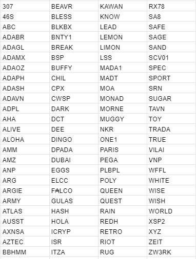

# Công bố các Pool mới được chọn cho chiến lược ủy thác

### **Cam kết về sự lành mạnh và đa dạng của mạng lưới Cardano, chúng tôi công bố các Pool được chọn cho vòng ủy thác mới**

 14 tháng 5 năm 2021  [Christian Lindgren](tmp//en/blog/authors/christian-lindgren/page-1/)  9 phút đọc

### [**Christian Lindgren**](tmp//en/blog/authors/christian-lindgren/page-1/)

Software Engineer

Engineering

- 
- 
- 

Cardano tiếp tục phát triển, được hỗ trợ bởi cộng đồng nhà điều hành Pool cổ phần (SPO) làm việc hướng tới tầm nhìn về một hệ sinh thái độc lập và phi tập trung trên toàn cầu. Các Pool luôn là động lực của mạng lưới Cardano và chúng tôi đã đưa ra chiến lược ủy thác để tìm ra và thúc đẩy các Pool tiềm năng.

Để hỗ trợ tầm nhìn dài hạn về sự tăng trưởng và phi tập trung của mạng lưới Cardano, chúng tôi đã ủy thác cổ phần từ các Pool của IOG cho một số Pool tiềm năng trong hệ sinh thái để thúc đẩy công việc kinh doanh của họ, hỗ trợ các mục tiêu phát triển cộng đồng, đóng góp kỹ thuật và phân bố địa lý. Phân tích của chúng tôi chỉ ra rằng đóng góp của chúng tôi đã giúp họ trở nên ổn định hơn trong mạng lưới. Họ đã thu hút được những người được ủy quyền và các thành viên cộng đồng chia sẻ ý tưởng cũng như mục tiêu phát triển của họ.

## **Đa dạng &amp; phân phối**

Bất kỳ hệ sinh thái cộng đồng nào cũng cần các kỹ sư, doanh nhân, nhà công nghệ và các nhà ngoại giao trên toàn cầu. Tương tự, hệ sinh thái các Pool cũng cần có sự cân bằng của những người chơi có uy tín lớn hơn, cốt lõi mạnh mẽ và một lượng lớn những người mới tham gia với mục tiêu xây dựng thành công hơn nữa dựa trên các nguyên tắc cơ bản vững chắc.

Vấn đề mà nhiều Pool hiện đang phải đối mặt là sự công nhận của họ trong hệ sinh thái hay đúng hơn là khả năng thu hút sự hỗ trợ của cộng đồng để đảm bảo hoạt động của Pool ổn định và nhất quán. Điều hành một Pool không phải là một quá trình dễ dàng; không giống như khai thác, tiền kiếm được không đơn giản chỉ từ việc thiết lập một Pool trên máy. Bạn không thể mua con đường thành công của mình thông qua một bộ công cụ ngày càng tốt hơn. Cardano được thiết kế để tương đối nhẹ về tài nguyên máy tính. Hoạt động của Pool là một hoạt động kinh doanh phức tạp có các đặc điểm nổi bật của cả hàng hóa và thị trường phân tán, đồng thời đòi hỏi sự kết hợp của các kỹ năng, sự bền bỉ và may mắn.

Có nhiều yếu tố ảnh hưởng đến sự thành công của Pool và khác biệt so với những nhân tố khác. Trước hết, đó là các yếu tố kỹ thuật như:

- **Các tham số**: điều này bao gồm yếu tố ảnh hưởng cam kết, kích thước bão hòa của Pool, cổ phần được ủy quyền cho Pool và cổ phần được cam kết bởi chủ sở hữu.
- **Tài chính**: phí biến đổi, phí cố định và cam kết phải được tính đến để đảm bảo rằng Pool hoạt động hiệu quả, tạo ra các Block và kiếm được phần thưởng cho những người ủy quyền.
- **Hiệu suất**: được tính theo hoạt động dự kiến của Pool, vốn là tỷ lệ giữa số Block mà một Pool tạo ra trong một Epoch nhất định so với số lượng nó có khả năng tạo ra.
- **Nhiệm vụ tổng thể**: ngay cả khi Pool đáp ứng tất cả các yêu cầu trên, điều này không có nghĩa là nó được công nhận hoàn toàn hoặc trực tiếp thu hút được sự chú ý. Với hơn 2000 Pool hoạt động trong hệ sinh thái, điều cần thiết là phải thể hiện cho cộng đồng biết sứ mệnh mà một Pool nào đó đang cố gắng đạt được và giải thích tại sao lựa chọn chính xác này lại có lợi cho những người khác.

Khả năng khác biệt hóa là chìa khóa và đó là nơi cần có yếu tố **Marketing**. Cũng giống như bất kỳ doanh nghiệp nào đang tìm kiếm “khách hàng” trong một thị trường cạnh tranh, sẽ không có Pool nào được công nhận trừ khi họ tự công bố, kể một câu chuyện, xây dựng lòng tin. Vì vậy, cam kết nâng cao nhận thức đi cùng với sự cẩn thận trong việc bảo trì node. Giống như bất kỳ doanh nghiệp nhỏ nào, đây là điều đòi hỏi các mục tiêu rõ ràng và các mục tiêu gia tăng giá trị cho cộng đồng trong khi đáp ứng lợi nhuận.

## **Cơ hội**

Chúng tôi đã thông báo về giai đoạn nộp đơn đăng ký mới vào đầu tháng 4 và hiện đang cam kết chuyển nguồn vốn của chúng tôi vào một nhóm mới gồm một số Pool. Chúng tôi hy vọng sẽ giúp họ phát triển theo đúng tiềm năng vốn có.

Mặc dù chúng tôi *muốn* mọi Pool đều thành công, nhưng không phải mọi Pool đều sẽ được như vậy. Với sự ủy quyền của mình, chúng tôi cam kết giúp đỡ những Pool mà họ vẫn chưa đạt được mức độ uỷ thác mong muốn. Một trong những vấn đề quan trọng mà nhà điều hành Pool gặp phải là sự không chắc chắn và không có khả năng tạo ra phần thưởng ổn định. Điều này cũng giống như với các khoản đầu tư mạo hiểm - các bên liên quan đầu tư vào những dự án mà họ thấy có lợi tức đầu tư. Nếu đây là sứ mệnh rất quan trọng và đầy hứa hẹn, nhưng không có vốn để thực hiện thì sao? Trong những trường hợp như vậy, nhiều công ty sẽ nhận được hỗ trợ (đầu tư) ban đầu để thúc đẩy sự phát triển và đạt được các mục tiêu mong muốn.

Theo cách tương tự, chúng tôi sẵn sàng hỗ trợ các Pool tiềm năng và giúp họ xây dựng trong hệ sinh thái vào buổi tối để nhận được nhiều phần thưởng dễ dự đoán hơn. Từ đó thu hút được số lượng người ủy quyền cao hơn để hỗ trợ sứ mệnh của họ.

Sự khác biệt hóa là chìa khóa thành công. Hy vọng chúng tôi có thể cung cấp cho các Pool đã được chọn một cơ hội để tự xây dựng, duy trì hoạt động bền vững và ổn định mà không cần dựa vào yếu tố may mắn. Giờ đây, chúng tôi có thể chia sẻ thông tin chi tiết về các Pool mới được chọn để tham gia vào vòng ủy quyền mới. Nhưng trước tiên, hãy xem xét kỹ hơn các mục tiêu và quá trình.

## **Quá trình**

Việc chọn các Pool để ủy quyền luôn là một quá trình phức tạp. Mỗi Pool hoạt động đang đóng góp vào mạng lưới phi tập trung hoàn toàn. Lần trước, khi đánh giá các Pool và đóng góp của họ, chúng tôi đã định hướng theo các yếu tố như mục tiêu, mục đích, vị trí địa lý, đóng góp kỹ thuật, tỷ lệ cổ phần &amp; cam kết và mức độ tham gia của cộng đồng / mạng xã hội.

Với 700 Pool để đánh giá, chúng tôi sẽ luôn khiến nhiều Pool thất vọng và một số có thể cảm thấy họ đã bị bỏ qua một cách bất công. Ngay cả sau một số lần lọc ban đầu, chúng tôi đã có một trường dữ liệu gồm khoảng 300 Pool đáp ứng nhiều tiêu chí mà chúng tôi đã xác định. Một lần nữa, xin cảm ơn [pooltool.io](https://pooltool.io/) và [adapools.org](https://adapools.org/) đã cung cấp các nguồn dữ liệu bổ sung trong quá trình này.

Mục đích và sứ mệnh vẫn là một phần quan trọng của Cardano vì vậy đây lại là một phần của sự kết hợp. Trọng số lớn hơn lần này cũng được đưa ra đối với các khía cạnh chính khác như *phân bố địa lý*, *hoạt động xã hội / cộng đồng* và *hỗ trợ cho phần có quy mô trung bình thấp hơn của mạng lưới*. Về mặt thực tế, hỗ trợ bền vững cần tập trung vào các Pool không mạnh nhất cũng không yếu nhất. Phân phối ủy quyền sau đây đã được xác định:

- 50% cổ phần dành riêng cho các Pool phân bố theo địa lý.
- 25% cho các Pool hoạt động xã hội có tiềm lực kỹ thuật vững chắc.
- 25% cho các Pool có quy mô trung bình thấp hơn để vượt quá cân bằng mạng lưới.

Hãy xem xét kỹ hơn các yếu tố ảnh hưởng đến sự lựa chọn của chúng tôi để hiểu lý do đằng sau nó.

**Phân bố địa lý**

Cardano là một mạng lưới phân tán, phi tập trung gồm các node hoạt động cùng nhau để xác minh tính hợp lệ của giao dịch và đóng block trong mạng lưới. Phi tập trung là chìa khóa của quá trình này vì chỉ có sự độc lập với các đơn vị quản lý mới thiết lập được niềm tin và sự tự tin trong việc xử lý các hoạt động tài chính. Để đảm bảo rằng mạng lưới có khả năng chống lại sự cố kết nối, điều cần thiết là các node hoạt động của Pool được phân phối trên toàn cầu mà không tập trung nhiều ở một khu vực. Điều này có lợi cho việc thiết lập kết nối giữa các vùng khác nhau và loại bỏ một điểm lỗi duy nhất. Tối thiểu hai Relay là một yếu tố khác trong quá trình này.

**Hoạt động xã hội / cộng đồng**

Cuộc khảo sát đầu năm đã giúp chúng tôi hiểu rằng vấn đề quan trọng mà SPO phải đối mặt là không có khả năng phân biệt. Vì lý do này, chúng tôi đã sử dụng điểm tác động xã hội từ [Pulsar](https://www.pulsarplatform.com/) để hiểu Pool nào đang thu hút được sự quan tâm của người uỷ quyền tiềm năng.

Cũng như "Đại sứ" cho mạng lưới, chúng tôi đã đánh giá các Pool tích cực về mặt hoạt động xã hội để hỗ trợ các mục tiêu kinh doanh ở quốc gia của họ hoặc cải thiện các hoạt động cộng đồng khác nhau. Chúng tôi đã chọn những Pool có sự hiện diện xã hội lớn và sự tham gia của cộng đồng nhưng gặp khó khăn trong việc giành được vị trí vững chắc hơn về khả năng dự đoán phần thưởng. Để chắc chắn, hiệu suất kỹ thuật vẫn là yếu tố quan trọng nhất - không có lượng Tweet hoặc bài đăng trên Reddit nào có thể bù đắp cho các Block bị bỏ lỡ.

**Cân bằng mạng lưới**

Với nhiều Pool như vậy, tất cả đều hoạt động cho các mục đích khác nhau, chúng tôi cũng phân biệt các Pool có tiềm năng mạnh đang nỗ lực để duy trì các hoạt động của mạng lưới, hỗ trợ sản xuất Block và xác thực giao dịch. Ủy quyền cho các Pool này, chúng tôi hỗ trợ các doanh nghiệp có quy mô trung bình nhỏ hơn và giúp người ủy quyền kiếm được phần thưởng ổn định.

Do các thuộc tính bảo mật của giao thức Ouroboros, quá trình lựa chọn để đóng Block được ngẫu nhiên hóa và xác suất tạo block tỷ lệ thuận với số lượng cổ phần được ủy quyền.

Điều kiện như vậy có thể áp dụng tốt cho việc nhận thưởng dài hạn. Tuy nhiên, trong điều kiện thời gian ngắn hơn (một hoặc vài Epoch), sự ngẫu nhiên này có thể mang lại một lượng phần thưởng không thể đoán trước. Hiệu ứng này khiến các Pool nhỏ ít được uỷ quyền hơn có thể có tác dụng phụ không mong muốn, làm phiền lòng những người ủy quyền, những người mong đợi số tiền lợi nhuận có thể dự đoán được trên cổ phần của họ.

## **Những pool chiến thắng**

Đây là danh sách 100 Pool được chọn cho vòng ủy quyền mới của chúng tôi. Nếu bạn muốn tìm hiểu thêm về các Pool này và sứ mệnh của họ, bạn có thể dễ dàng thực hiện việc này tại [adafolio.com](https://adafolio.com/portfolio/c5df0868-b4cf-11eb-8c63-0242c0a86003) hoặc [adapools.org](https://adapools.org/delegations/input-output) .

Chúng tôi dự kiến thực hiện ủy quyền cho các Pool này vào cuối tháng 5 / đầu tháng 6, vì vậy các SPO có thể mong đợi nhận được ADA  đó trong khoảng thời gian ba tháng.

## **Công việc tiếp theo**

Chúng tôi rất vui khi tìm ra 100 Pool. Chúng tôi tin rằng họ có tiềm năng vững chắc trong việc đạt được các mục tiêu kinh doanh và hỗ trợ tính bền vững của hệ sinh thái. Chúng tôi vẫn hiểu rằng có nhiều cộng tác viên khác mà chúng tôi chưa thể ủy quyền vào thời điểm này. Chúng tôi muốn cảm ơn bạn vì tất cả những gì bạn đã làm. Nếu bạn không được chọn lần này, hãy lưu ý rằng chúng tôi sẽ có một vòng ủy quyền mới sau ba tháng kể từ bây giờ.

Vì vậy, chúng tôi khuyến khích tất cả các Pool đã bỏ lỡ, hãy đăng ký lại cho nhóm mới trong Quý 3. Chúng tôi sẽ thực hiện một đợt kêu gọi mới cho các đơn đăng ký vào tháng Sáu để luân phiên việc uỷ quyền vào tháng Bảy. Mặc dù phân tích kỹ thuật là cách chính mà các Pool được xác định để ủy quyền, chúng tôi luôn hoan nghênh phản hồi của cộng đồng về cách chúng tôi có thể tiếp tục cải thiện quy trình. Chúng tôi cam kết hỗ trợ hệ sinh thái Cardano ngày càng phát triển mạnh mẽ. Chúng ta đã cùng nhau tạo ra hệ sinh thái bằng chứng cổ phần hàng đầu thế giới. Chúng tôi muốn làm tất cả những gì có thể để duy trì và cải thiện hệ sinh thái khi nó trưởng thành.

*Cảm ơn Ben O'Hanlon, Colin Edwards, Francisco Landino, Sam Leathers, Olga Hryniuk &amp; Tim Harrison đã hỗ trợ và đóng góp thêm. Bài này được dịch bởi Nguyễn Văn Tú, Review bởi Quang Pham, Biên tập bởi..... Bài viết nguồn [tại đây](https://iohk.io/en/blog/posts/2021/05/14/announcing-new-stake-pools-chosen-for-our-delegation-strategy). *Dự án này được tài trợ bởi Catalyst*.*
