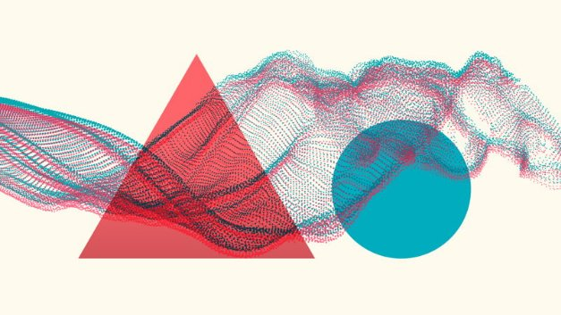
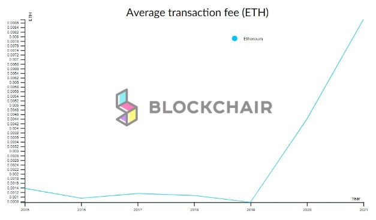

# Mang ERC20 đến Cardano

### **Bộ chuyển đổi ERC20 mới sẽ cho phép các Token Ethereum như AGI chạy trên Blockchain bằng chứng cổ phần - sắp xuất hiện trên mạng thử nghiệm (testnet)**

17 tháng 5 năm 2021 [Francisco Landino](tmp//en/blog/authors/francisco-landino/page-1/) 7 phút đọc

### [**Francisco Landino**](tmp//en/blog/authors/francisco-landino/page-1/)

Project Manager

Commercial

- 
- 

Kết nối các giao thức Blockchain và cộng tác trên ứng dụng là điều cần thiết để đạt được lời hứa về tài chính phi tập trung (DeFi) và cung cấp một giải pháp thay thế cho hệ thống ngân hàng truyền thống.

Theo trang Web DeFi Pulse, tiền mã hoá với tổng giá trị hơn '[75 tỷ USD hiện đã được khóa](https://defipulse.com/)' trong DeFi. Một năm trước, tổng số tiền trên chỉ là 700 triệu USD. Hầu hết giá trị này ở dạng tài sản tiền mã hoá dựa trên tiêu chuẩn Token ERC20.

Nhưng cơ sở hạ tầng bằng chứng công việc của Ethereum đang gặp thách thức với chi phí ngày càng tăng. Chúng tôi đã thấy trước vấn đề này và cung cấp giải pháp thay thế là một trong những nguyên tắc sáng lập đặt ra cho Cardano. Điều này sắp thành hiện thực.

Để mở rộng nhiều trường hợp sử dụng cho các nhà phát triển ứng dụng và doanh nghiệp, Cardano sẽ hỗ trợ việc di chuyển Token ERC20 sang nền tảng Cardano. Các hợp đồng thông minh Alonzo và Plutus đang được triển khai. Sau khi được triển khai, người dùng Token Ethereum được hỗ trợ sẽ có thể mang chúng từ mạng lưới bị tắc nghẽn của Ethereum và tận dụng khả năng giao dịch của Cardano và phí thấp hơn, đồng thời được hưởng bảo mật nâng cao, giảm chi phí và khả năng tương tác.

## **Tại sao lại là ERC20?**

Chúng ta hãy xem xét kỹ hơn bản chất của ERC20 để hiểu tại sao tiêu chuẩn này phù hợp với xu hướng thị trường về nhu cầu kinh doanh. Đầu tiên, tất nhiên là Ethereum đã đưa khái niệm hợp đồng thông minh và 'tiền có thể lập trình' vào Blockchain trong năm 2015. Kể từ đó, việc mã hóa và Token ERC20 đã trở nên phổ biến vì tiện ích trong các giao dịch kinh doanh hàng ngày. Các ứng dụng được xây dựng trên Blockchain có thể cung cấp các Token có thể đóng vai trò như:

- Một đơn vị thanh toán.
- Một đơn vị giao dịch.
- Tiếp cận các dịch vụ kỹ thuật số.
- Một phần thưởng hoặc sự khuyến khích.
- Quyền bỏ phiếu.
- Một cơ chế đầu tư.

Token ERC20 được thiết kế tốt đáp ứng nhiều nhu cầu. Chúng càng trở nên hữu ích thì nhu cầu ngày càng tăng và giá trị của chúng cũng tăng theo. Đó là lý do tại sao những Token này được sử dụng rộng rãi. Chúng được các ví và sàn giao dịch hỗ trợ rất tốt.

## **Ethereum so với Cardano**

Tiêu chuẩn ERC20 được phát minh cho Ethereum. Tính đến hôm nay, có [hơn 400.000 hợp đồng dựa trên tiêu chuẩn Token này](https://etherscan.io/tokens) với các ví dụ bao gồm Binance Coin (BNB), Tether (USDT), Uniswap (UNI) và Dai (DAI).

Ethereum là một nền tảng Blockchain phổ biến và có nhiều chức năng. Nhưng nó vẫn còn chậm và phí giao dịch cao. Khi nhiều người tham gia mạng lưới tương tác với các ứng dụng phi tập trung hơn, phí 'Gas' trả cho việc xác thực các giao dịch đang tăng mạnh (Hình 1).

Hình 1. Phí Gas trên Ethereum đang tăng

Các vấn đề mà người dùng Ethereum gặp phải cũng đã được xác định bởi một cuộc khảo sát của Cointelegraph được trích dẫn trong '[DeFi Adoption 2020](https://s3.cointelegraph.com/storage/uploads/view/48c6c4e03f85bc722d76f88c2676478b.pdf?_ga=2.42938214.270418488.1602500005-1231871226.1593587737)':

45% nền tảng được xây dựng dựa trên khả năng mở rộng của Ethereum và phí Gas cao nằm trong Top 3 vấn đề hàng đầu hạn chế việc áp dụng DeFi hàng loạt.

Ethereum vẫn chưa giải quyết được những thách thức này và không có khả năng làm như vậy trong ngắn hạn. Vì vậy, nhiều doanh nghiệp sẽ muốn xem xét các lựa chọn khác.

*Bằng cách cho phép di chuyển Token ERC20 sang Cardano, chúng tôi tập trung vào việc cung cấp đề xuất giá trị tận dụng lợi thế của Cardano so với Ethereum. Đặc biệt, khả năng xử lý giao dịch cao hơn của Cardano và phí thấp hơn khi so sánh với chi phí cao và lưu lượng truy cập thường xuyên tắc nghẽn của Ethereum.*

## **Được kích hoạt bởi Ouroboros**

Chìa khóa để giải quyết vấn đề tắc nghẽn mạng lưới và phí giao dịch cao là cơ chế đồng thuận bằng chứng cổ phần Ouroboros của Cardano. So với giao thức bằng chứng công việc của Ethereum, Ouroboros cần ít năng lượng hơn để xử lý các giao dịch  trong mạng lưới. Nó chạy bằng lượng điện trên quy mô của một ngôi nhà lớn, thay vì một quốc gia nhỏ. Do đó, Ouroboros không những thân thiện với môi trường mà còn xử lý các giao dịch với mức phí thấp hơn nhiều.

Ngoài ra, Cardano không yêu cầu chi phí thực hiện hợp đồng thông minh vì sổ cái hỗ trợ chức năng Token gốc với mô hình kế toán tích hợp. Điều này nghĩa là việc theo dõi, di chuyển và sở hữu các loại tài sản khác nhau được xử lý bởi sổ cái thay vì hợp đồng thông minh. Trong khi việc tạo và di chuyển Token ERC20 trên Ethereum yêu cầu sửa đổi thủ công đối với loại hợp đồng tiêu chuẩn, Logic cho điều này được tích hợp trong Cardano. Điều này cũng giúp loại bỏ nguy cơ xảy ra lỗi và lỗ hổng bảo mật.

## **Cách hoạt động của bộ chuyển đổi ERC20**

Hiện tại Cardano hỗ trợ ADA và [Token gốc](https://iohk.io/en/blog/posts/2021/02/18/building-native-tokens-on-cardano-for-pleasure-and-profit/), đã được chứng minh là thành công với hơn 160.000 Token được đúc. Hiện chúng tôi đang tung ra bộ chuyển đổi ERC20 để đảm bảo khả năng tương tác tốt hơn trong tương lai cũng như tạo nền tảng vững chắc cho các cơ hội kinh doanh mở rộng.

Bộ chuyển đổi ERC20 là một công cụ sẽ cho phép các tổ chức phát hành và người dùng của họ xử lý việc di chuyển Token ERC20 sang Cardano. Nó được thiết kế để các nhà phát hành Token (các tổ chức muốn di chuyển Token sang Cardano) và người dùng của họ (chủ sở hữu Token) sử dụng công cụ để di chuyển Token ERC20 sang mạng Cardano.

Người dùng có thể chuyển đổi Token Ethereum chỉ trong một vài cú nhấp chuột và khi được chuyển sang, các Token này sẽ được 'chuyển' thành một Token gốc đặc biệt trên Cardano, có cùng giá trị và hoạt động giống như ERC20. Ngoài ra, nếu người dùng muốn làm như vậy ở giai đoạn sau, họ có thể di chuyển Token trở lại mạng lưới nguồn bằng cách đốt chúng trên Cardano. Khả năng chuyển đổi hai chiều được đưa vào.

Chúng tôi sẽ sớm đưa ra phiên bản của công cụ chuyển đổi ERC20 trên một Testnet chuyên dụng. IOG hiện đang làm việc với các đối tác để giúp họ chuyển đến Cardano và [SingularityNET](https://singularitynet.io/) sẽ là đối tác đầu tiên trong số này. Bộ chuyển đổi ERC20 sẽ giới thiệu [Token AGIX mới của SingularityNET](https://blog.singularitynet.io/singularitynet-phase-ii-launch-sequence-activated-agi-token-to-be-hard-forked-to-10ede4b6c89), việc triển khai này đánh dấu cột mốc đầu tiên trong kế hoạch di chuyển SingularityNET sang Cardano. Testnet ban đầu sẽ cho phép người dùng đánh giá quá trình di chuyển trong khi làm việc với Token AGIX cả trong Cardano và Ethereum Kovan Testnet.

Có thể xác thực tài khoản bằng Metamask (một tiện ích mở rộng cho trình duyệt Chrome) với nhiều tùy chọn hơn sau này. Người dùng cũng sẽ cần thêm địa chỉ Daedalus Testnet để họ có thể di chuyển Token sang Cardano và dễ dàng theo dõi số dư và giao dịch.

Khi người dùng đăng nhập vào tài khoản chuyển đổi ERC20, họ sẽ thấy các Token SingularityNET được liệt kê và có sẵn để di chuyển. Bằng cách nhấp vào Token - họ sẽ thấy các chi tiết như số dư Token. Họ sẽ chỉ cần chọn Token, cho biết số tiền họ muốn chuyển đổi, sau đó di chuyển chúng bằng cách xác định địa chỉ Cardano. Khi Token di chuyển đến địa chỉ, có thể sử dụng chúng để thanh toán và giao dịch từ ví Daedalus. Tất cả các hoạt động sẽ được hiển thị trong cả Etherscan và Cardano Explorer.

Hình 2. Giao diện bộ chuyển đổi ERC20

Ở các giai đoạn sau, người dùng sẽ thấy các loại Token khác nhau trong giao diện. Các Token có sẵn để di chuyển sẽ được liệt kê đầu tiên và nếu chưa đủ điều kiện - bạn có thể đăng ký nhận các bản cập nhật về bất kỳ thay đổi nào.

## **Nhìn về phía trước**

Khi số lượng đối tác muốn chuyển đổi ERC20 tăng lên, phạm vi các loại Token được hỗ trợ sẽ tăng lên. Hiện tại, các đối tác cần phải là người giám sát Token của họ. Tuy nhiên, chúng tôi sẽ đạt được khả năng tương tác cao hơn trong khi giới thiệu các tổ chức khi các hợp đồng thông minh Plutus hoạt động trên Mainnet.

Mục tiêu của chúng tôi là hỗ trợ nhiều Token để tạo khả năng cho các giao dịch kinh doanh. Vì vậy, xa hơn nữa với nhiều loại Token, bộ chuyển đổi ERC20 sẽ hoạt động như một cầu nối giữa các Blockchain. Điều này sẽ thúc đẩy giao tiếp chuỗi chéo (Cross-chain) hiệu quả.

*Testnet cho bộ chuyển đổi ERC20 hiện đang trong giai đoạn cuối cùng của quá trình kiểm tra đảm bảo chất lượng trước khi khởi chạy công khai. Giai đoạn này sẽ cho phép chúng tôi kiểm tra hành trình của người dùng và cải thiện trải nghiệm của họ cùng với việc khắc phục mọi sự cố đang xảy ra. Chúng tôi cũng sẽ sớm cung cấp môi trường Testnet chuyên dụng với tài liệu và hướng dẫn liên quan về cách người dùng có thể kiểm tra khả năng của bộ chuyển đổi.*

*Chúng tôi sẽ chia sẻ bản cập nhật trong chương trình Cardano 360 vào tháng 5. Trong khi đó, hãy theo dõi các [thông báo trên Twitter](https://twitter.com/InputOutputHK?ref_src=twsrc%5Egoogle%7Ctwcamp%5Eserp%7Ctwgr%5Eauthor) của chúng tôi để tìm hiểu thêm trong quá trình thử nghiệm! Bài này được dịch bởi Nguyễn Văn Tú, soát xét bởi Brit Nguyễn. Bài viết nguồn [tại đây](https://iohk.io/en/blog/posts/2021/05/17/bringing-erc20-to-cardano). *Dự án này được tài trợ bởi Catalyst**
